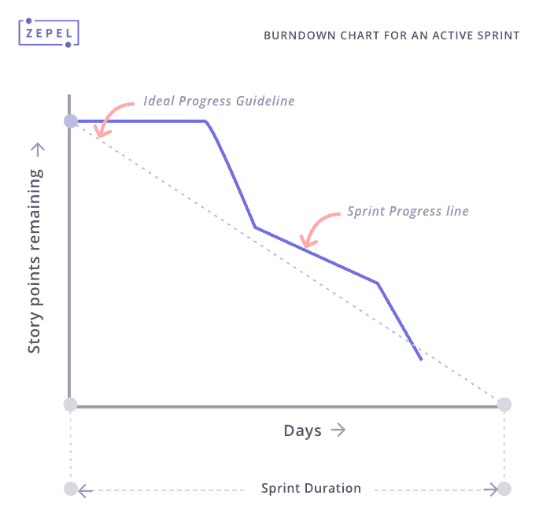
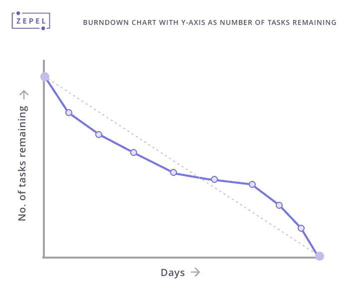
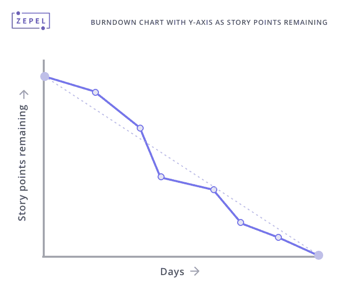
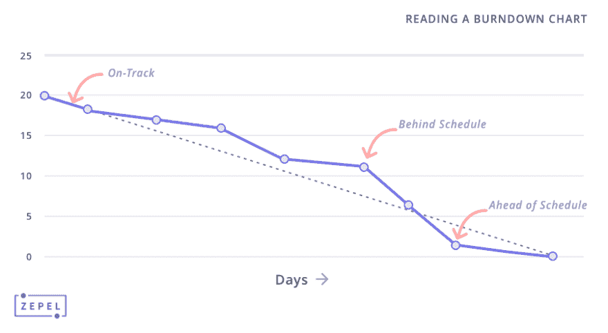
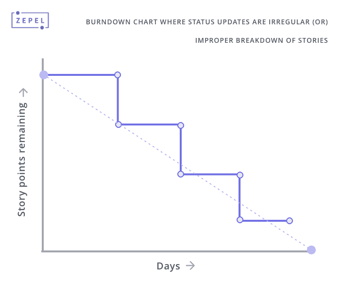
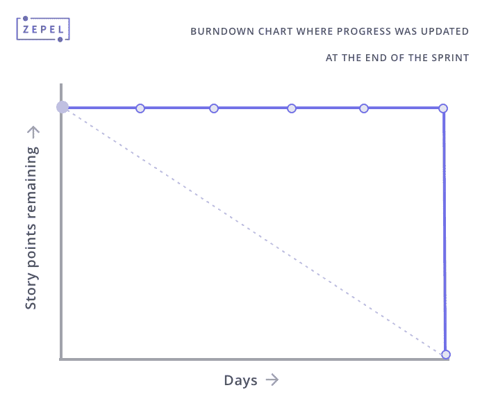
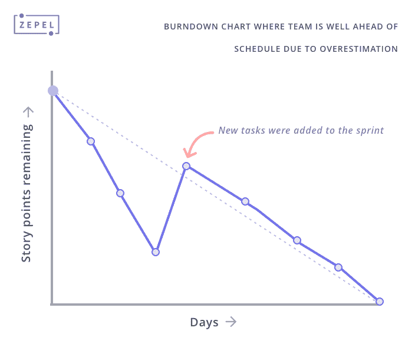
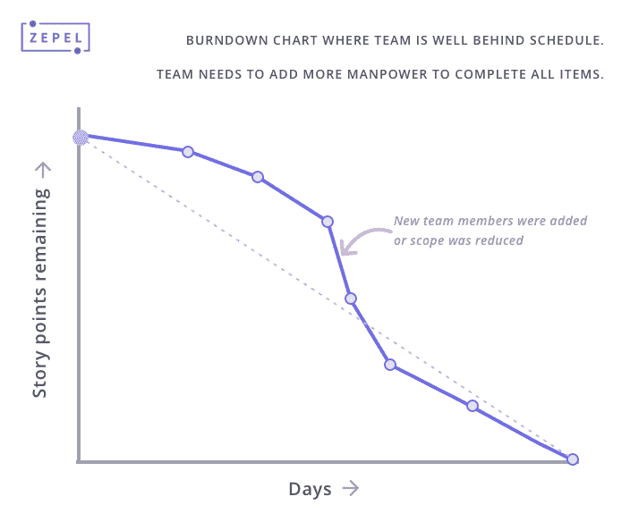
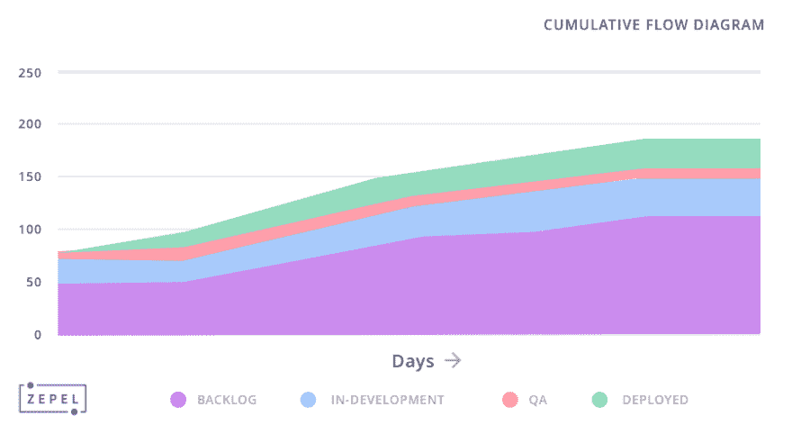

# 了解燃尽图

> 原文：<https://dev.to/svikashk/understanding-burndown-charts-44i5>

## 什么是燃尽图？

燃尽图是在“剩余工作”和“时间”之间绘制的线形图。scrum 团队使用这些图表来跟踪他们在 sprint 中“烧完”任务的进度。

燃尽图很容易理解，但是团队经常很难理解图表背后的全部含义。

## 燃尽图的组成部分

**X 轴:**

图表的 X 轴总是表示时间(通常以天为单位)。

**Y 轴:**

Y 轴代表冲刺阶段需要完成的剩余工作。这可以用剩余任务(任务数量)或剩余工作(故事点/小时)来表示。

进度线:

进度线表示你的团队在冲刺阶段的进度。它每天都会根据新的剩余估计值进行更新。随着 sprint 的进展，这条线将指示您的团队是否在正轨上，以及是否需要任何纠正措施。

**指引:**

这是一条向下画的对角线，在图上从左到右。你的冲刺进度线应该尽可能接近指导方针。如果你的团队能够在整个冲刺过程中以稳定的速度完成所有的故事，你的进度线最终看起来会和指导方针一模一样。

## 选择合适的指标进行跟踪

**Y 轴为剩余任务数:**

这是在任何给定日期 sprint 中剩余任务数量的图表。随着任务的完成，进度线开始向下移动。这种方法的最大优点是图形容易理解。

使用这种燃尽图的缺点是无法估计任务。不是所有的任务都要花同样的努力来完成。通常，将困难的任务留到冲刺阶段结束的团队会发现他们无法完成所有的任务，尽管在大部分持续时间里都是“在正轨上”。

**Y 轴为剩余故事点:**

这是一个随着时间的推移还剩下多少故事/评估点的图。故事点是根据任务的复杂性来评估任务的一个很好的方法。这使完成任务所需的努力正常化。

该图最终与前面的方法相似，但是估计点消除了跟踪任务完成情况带来的模糊性。

## 燃尽图什么时候有用？

燃尽图在积极冲刺和冲刺回顾中都很有用。

**在冲刺阶段:**

在冲刺阶段查看燃尽图可以帮助 scrum 主管或产品负责人回答以下问题:

*   冲刺进度是否达到目标？
*   所有的故事(或任务)都会按时完成吗？
*   需要采取什么纠正措施来达到目标？

**冲刺后:**

燃尽图是一个冲刺团队表现的指标。在 sprint 回顾中，burndown 图表是围绕评估准确性、 [sprint performance](https://blog.edx.org/using-burndown-charts-better-retros) 、路障和后续 sprint 中要做的更改进行讨论的参考。

## 读取燃尽图

燃尽图是通过比较 sprint 进度线和指南来读取的。两条线越接近，你在截止日期前完成所有任务的机会就越大。

**落后于时间表:**如果进度线高于指导方针，这意味着你的团队落后于时间表，此时应该已经完成了更多的工作。

**上轨道:**进度线和指引线靠得很近。如果团队保持目前的速度，他们将达到目标。

**提前:**进度线低于指导线。即使在冲刺的结束日期之前，团队也有望达到目标。这可能是因为在计划冲刺时，任务被高估了。团队可以向 sprint 添加更多的任务，以确保每个人在整个 sprint 中都很忙。

## 燃尽图表模式

这里有一些你在使用燃尽图追踪短跑时可能观察到的常见模式。

**不规则的状态更新(或)不正确的故事分解**

成批更新状态的团队(例如，在每个周末)最终会得到一个阶梯式的图表。定期的状态更新提供了更准确的图表。理想情况下，Sprint 团队应该每天更新他们的任务。

阶梯图有时也是任务分解不当的结果。如果任务没有被充分分解，个别问题可能需要很长时间才能完成:导致几天没有进展的错觉。避免这种情况的最好方法是将大任务分解成小的可执行的工作块。

**冲刺结束时更新的进度**

这是一个团队的燃尽图，该团队在 sprint 回顾会议的前一天更新了他们所有的状态。这个图表在回顾中增加的价值很小，团队应该确保他们的状态每天更新。

比计划提前很多。

这个图表代表了一个高估了完成任务所需时间的团队。

如果这个团队保持他们当前的速度，他们将在 sprint 结束日期之前完成所有的任务。产品负责人需要向 sprint 添加更多的任务(由估计值的急剧上升来表示)，以便让团队在整个 sprint 期间都保持忙碌。

远远落后于计划。

这是一个努力跟上理想指导方针的团队的燃尽图。

 这很可能是因为他们低估了完成任务所需的努力。纠正航向的两种方法是

1.  向团队中添加更多人(或)
2.  通过删除故事或任务来缩小 sprint 的范围。

## 燃尽图和替代图的局限性:

**燃尽图实际上并没有告诉你团队完成了多少工作:**虽然燃尽图说的是还有多少工作要做，但实际上并没有说已经完成了多少工作。这些数据可以用燃耗图的形式显示出来，这只是一个倒置的燃耗图。

**燃尽图只能用于冲刺:**燃尽图如果没有时间限制，就没有多大意义。在很长一段时间内，积压工作经历了太多的变化，剩余的评估没有多大意义。这就是为什么 burndown 图表不推荐给实践看板方法的敏捷团队。

**捕捉范围变化和可视化变化的待办事项可能很困难:**如上所述，待办事项大小的变化在燃尽图上不能有效地捕捉。一种解决方法是向图表中添加更多数据，但这会影响图表的可读性。燃尽图的这些局限性可以通过使用累积流程图来克服。

**燃尽图不考虑“进行中”状态变化:**燃尽图关注问题的完成情况。“进行中”状态期间的状态变化不会被记录在燃耗图上。这通常会导致团队没有取得进展的错觉。为了说明在制品状态的变化，可以使用累积流程图或控制图。

## 有效使用燃尽图:

燃尽图是可视化短跑进度的好方法。像所有工具一样，scrum 大师和产品负责人应该遵循一些规则，以确保他们能够从燃尽图中获得全部价值。

1.  花足够的时间分解用户故事并评估它们。
2.  确保您跟踪的是衡量 sprint 进度的正确指标。
3.  鼓励您的团队在完成任务时更新任务状态。
4.  使用燃尽图进行日常站立训练。
5.  在采取任何纠正措施之前，等待几天来发现模式。