# 理解设计模式:正面使用口袋妖怪和龙珠的例子！

> 原文：<https://dev.to/carlillo/understanding-design-patterns-facade-using-pokemon-and-dragonball-examples-5868>

有 23 个经典的设计模式，在原著中有描述，
`Design Patterns: Elements of Reusable Object-Oriented Software`。这些模式为软件开发中经常重复出现的特定问题提供解决方案。

在这篇文章中，我将描述如何使用 **Facade 模式；以及如何以及何时应用 T2。**

### 立面图案:基本理念

> ***门面模式*** (也拼写为*门面*)是[面向对象编程](https://en.wikipedia.org/wiki/Object-oriented_programming)中常用的[软件设计模式](https://en.wikipedia.org/wiki/Software_design_pattern)。类似于架构中的 *facade* ，facade 是一个对象，它作为一个面向前端的接口来屏蔽更复杂的底层或结构代码。—维基百科
> 
> 为子系统中的一组接口提供统一的接口。Facade 定义了一个更高级的接口，使得子系统更容易使用。-设计模式:可重用面向对象软件的元素

这种模式的主要特点是使用一个类来简化复杂系统的接口
。因此，这是该模式解决的两个问题:

1.  复杂子系统更容易使用。
2.  对子系统的依赖性被最小化。

总而言之，facade 模式包含不同类的几个实例，这些实例必须对客户端隐藏。这是简化界面的方式。这个模式的 UML 图如下所示:

[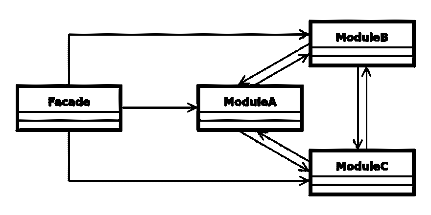](https://res.cloudinary.com/practicaldev/image/fetch/s--bic7P-dd--/c_limit%2Cf_auto%2Cfl_progressive%2Cq_auto%2Cw_880/https://cdn-images-1.medium.com/max/1000/0%2ASriiv6rKfaIAi_1X.png)

`Facade`类是模块和外部客户端之间的中间件。在 UML 中有一个单独的`Facade`类，但是当接口非常复杂时，该模式可以在不同的层之间使用。

### 立面图案:何时使用

1.  有一个复杂的系统，你需要一个简单的界面来与它交流。
2.  由于客户需要关于系统的广泛知识，代码是紧密耦合的。Facade 模式允许减少组件之间的耦合。
3.  系统需要一个进入分层软件每一层的入口点。

Facade 模式有几个优点，概括起来有以下几点:

*   代码更容易使用、理解和测试，因为外观简化了界面。
*   **干净的代码**因为客户端/上下文不使用复杂的接口，系统更加**灵活和可重用**。

### Facade 模式—示例 1:一个客户想要使用来自不同系统的几个类

我现在将向您展示如何使用 TypeScript 实现这种模式。在我们的例子中，我虚构了一个问题，其中有一个名为`Client`的类，它定义了两个方法，这两个方法使用了不同包中的几个类(`System1`和`System2`)。这些包由几个具有几个公共方法的类组成。下面的 UML 图显示了我刚刚描述的场景。

[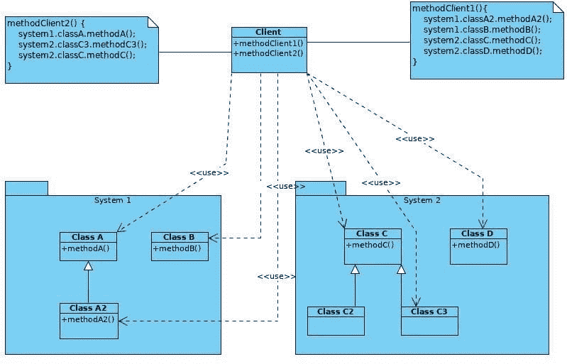](https://res.cloudinary.com/practicaldev/image/fetch/s--YPWQSyEW--/c_limit%2Cf_auto%2Cfl_progressive%2Cq_auto%2Cw_880/https://cdn-images-1.medium.com/max/1000/0%2ACNl34U529_pnrVYd.jpg)

`client`代码关联如下:

[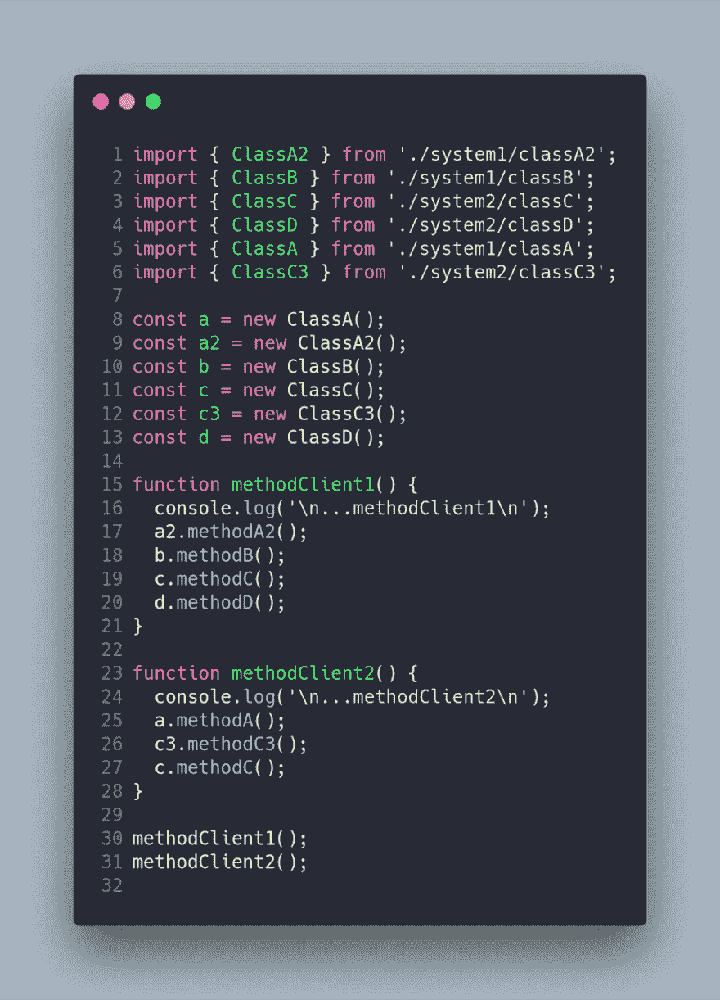](https://res.cloudinary.com/practicaldev/image/fetch/s--g1_mIp_C--/c_limit%2Cf_auto%2Cfl_progressive%2Cq_auto%2Cw_880/https://cdn-images-1.medium.com/max/1000/1%2AijAVEv3xLT0Ka41p8d0DKQ.png)

这种解决方案的主要问题是代码是耦合的。也就是说，客户需要知道每个类在哪里以及如何工作。进口的大清单是门面是我们问题的解决方案的第一个征兆。另一个警告症状是客户需要对每个类的操作有广泛的了解。

解决方案是使用包含在类(`Facade`)中的门面模式，该类使用`System1`和`System2`。也就是说，使用适配器模式的新 UML 图如下所示:

[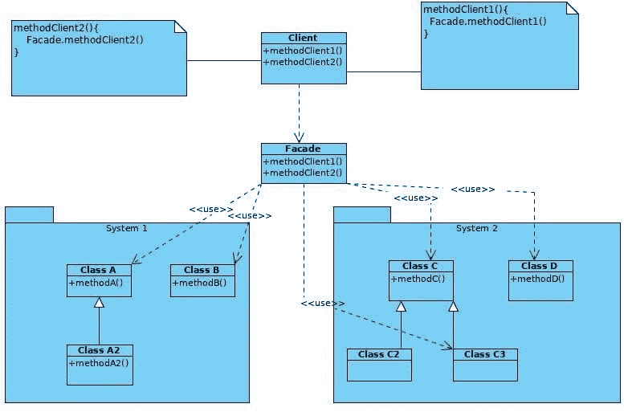](https://res.cloudinary.com/practicaldev/image/fetch/s--4fZSdgU---/c_limit%2Cf_auto%2Cfl_progressive%2Cq_auto%2Cw_880/https://cdn-images-1.medium.com/max/1000/0%2ADWkMpSiAjxwF7AhE.jpg)

与客户端和外观相关的代码如下:

[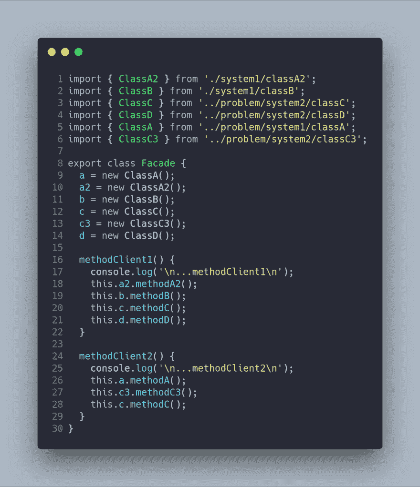](https://res.cloudinary.com/practicaldev/image/fetch/s--O4Yj45Xy--/c_limit%2Cf_auto%2Cfl_progressive%2Cq_auto%2Cw_880/https://cdn-images-1.medium.com/max/1000/1%2Ak49IW53_iqQC5hZYqOnQrQ.png)

在新代码中，客户端将责任委托给外观，但是外观做的是与客户端相同的功能。事实上，如果代码在增加，那么 facade 可以是一个名为**BLOB**(【https://sourcemaking.com/antipatterns/the-blob】T2)的反模式。因此，一个好主意是在每个包中使用一个 facade，就像你在下面的 UML 中看到的那样:

[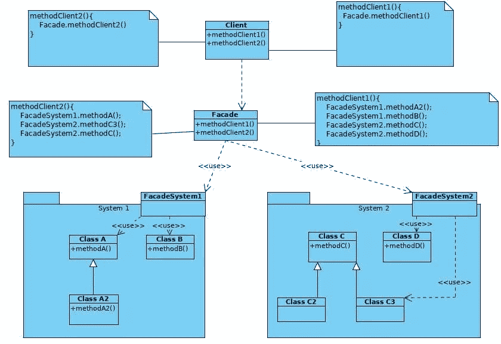](https://res.cloudinary.com/practicaldev/image/fetch/s--bqvIGrCM--/c_limit%2Cf_auto%2Cfl_progressive%2Cq_auto%2Cw_880/https://cdn-images-1.medium.com/max/1000/0%2Ai4N4Uz1YYmhCym3l.jpg)

本解决方案中与`client`、`facade`、`facadeSystem1`和`facadeSystem2`相关的代码如下:

客户端与先前版本中的客户端完全相同。

[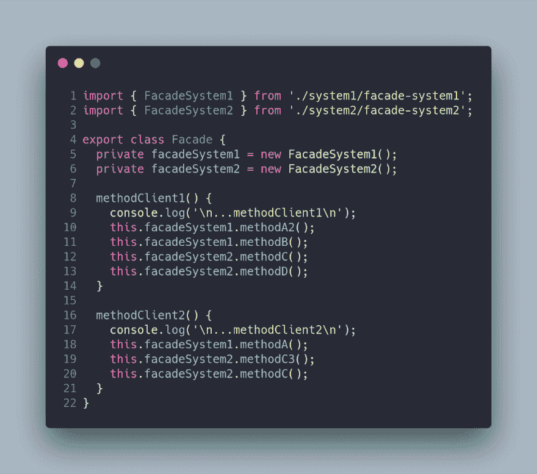](https://res.cloudinary.com/practicaldev/image/fetch/s--q0mz5Q1F--/c_limit%2Cf_auto%2Cfl_progressive%2Cq_auto%2Cw_880/https://cdn-images-1.medium.com/max/1000/1%2AhUB1R7kXDe5tpCE6MCEBmg.png)

外观使用为每个子系统创建的每个外观。现在更重要的是 Facade 类只知道由`FacadeSystem1`和`FacadeSystem2`提供的接口。

[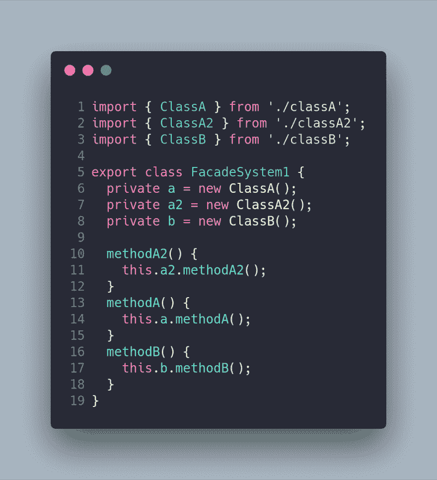](https://res.cloudinary.com/practicaldev/image/fetch/s--EHnyf-r8--/c_limit%2Cf_auto%2Cfl_progressive%2Cq_auto%2Cw_880/https://cdn-images-1.medium.com/max/1000/1%2AgtkT9XPrZgGdSTapOwukDQ.png)

[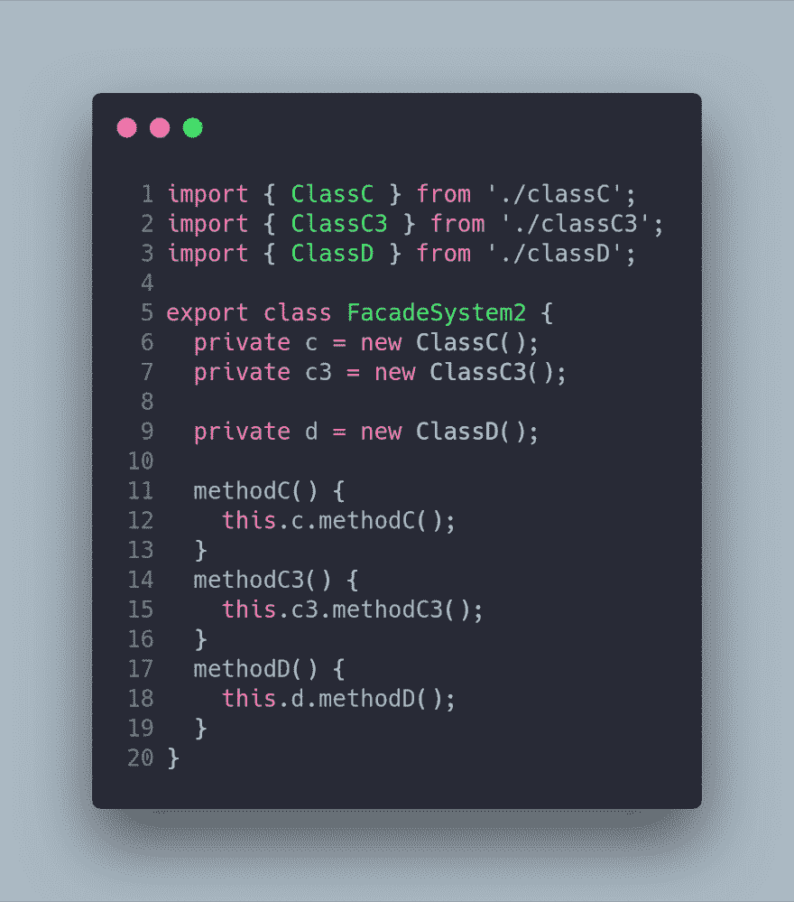](https://res.cloudinary.com/practicaldev/image/fetch/s--TffhHIKG--/c_limit%2Cf_auto%2Cfl_progressive%2Cq_auto%2Cw_880/https://cdn-images-1.medium.com/max/1000/1%2AEHbH8qh2xNEPiwT4jxAnfw.png)

`FacadeSystem1`和`FacadeSystem2`只知道它们包的类。需要提醒的是，每个 facade 只导出应该是公共的类，这些方法可以是内部类之间的几个方法的组合。

我已经创建了几个 npm 脚本，在应用了 Facade 模式之后，这些脚本运行这里显示的代码示例。

`npm run example1-problem`
`npm run example1-facade-solution-1`
T2】

### 立面图案—例 2:口袋妖怪和龙珠一起包装！

使用 Facade 模式解决的另一个有趣的问题是，有几个具有不同接口的包，但它们可以一起工作。在下面的 UML 图中，您可以看到这种情况:

[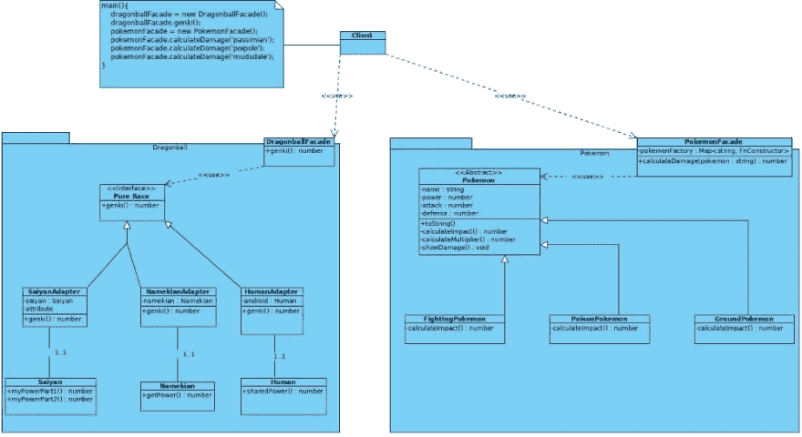](https://res.cloudinary.com/practicaldev/image/fetch/s--EDw6Eu7c--/c_limit%2Cf_auto%2Cfl_progressive%2Cq_auto%2Cw_880/https://cdn-images-1.medium.com/max/1000/1%2AtLfvtQU1yqTKGIR6qyPyGw.jpeg)

在这种情况下，客户端使用包`DragonballFacade`和`PokemonFacade`。因此，客户端只需要知道这些外观提供的接口。例如，`DragonballFacade`提供了一个叫做`genki`的方法来计算几个一起工作的对象的值。另一方面，`PokemonFacade`提供了一个名为`calculateDamage`的方法，它与其包中的其他类进行交互。

与客户端关联的代码如下:

[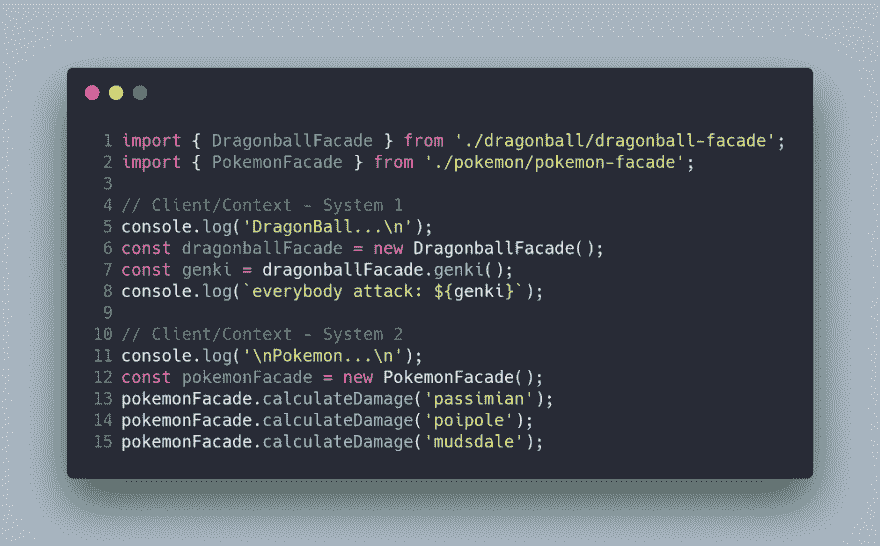](https://res.cloudinary.com/practicaldev/image/fetch/s--miFam6hq--/c_limit%2Cf_auto%2Cfl_progressive%2Cq_auto%2Cw_880/https://cdn-images-1.medium.com/max/1000/1%2AfoXq8DMMUow1f538Vhbx9w.png)

与正面相关的代码如下:

[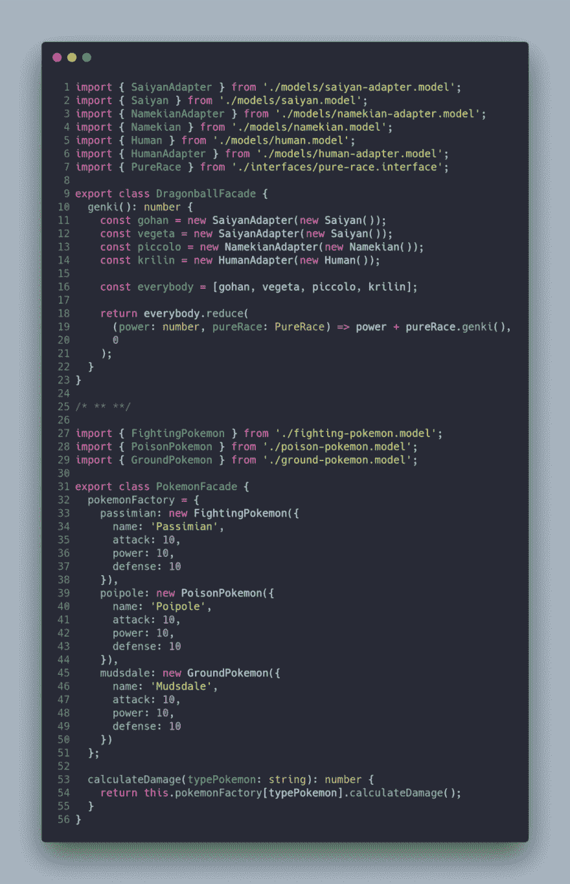](https://res.cloudinary.com/practicaldev/image/fetch/s--LAa9fwiT--/c_limit%2Cf_auto%2Cfl_progressive%2Cq_auto%2Cw_880/https://cdn-images-1.medium.com/max/1000/1%2AVpiBStjKSns9JeUZx3iaYQ.png)

我已经创建了两个 npm 脚本，它们在应用了 Facade 模式后运行这里显示的两个示例。

`npm run example2-problem`
T1】

支持外观的一个巨大优势是从一个不那么简单的系统开发出最简单的系统。例如，在龙珠包中有一个[适配器模式](https://carloscaballero.io/design-patterns-adapter/)，它不影响客户端的正确行为。但是口袋妖怪包的复杂性更大，因为有一个称为[模板方法](https://carloscaballero.io/design-patterns-template-method/)的设计模式用于`calculateDamage`的方法，还有一个工厂模式用于创建不同的口袋妖怪。所有这些复杂性都隐藏在外观中，这些类中的任何变化都不会影响客户的行为，这使得我们可以创建更多的非耦合系统。

### 结论

Facade 模式可以避免项目中的复杂性，当有几个包相互通信，或者一个客户需要使用几个类时，facade 模式非常适合。

最重要的事情不是实现我向你展示的模式，而是能够识别这个特定模式可以解决的问题，以及何时可以或不可以实现所述模式。这一点至关重要，因为实现会因您使用的编程语言而异。

### 越多越多...

*   设计模式:可重用的面向对象软件的元素，伽马，赫尔姆，约翰逊，& Vlissides，艾迪森韦斯利，1995 。
*   [门面模式—维基百科](https://en.wikipedia.org/wiki/Facade_pattern)。
*   [https://www.dofactory.com/javascript/facade-design-pattern](https://www.dofactory.com/javascript/facade-design-pattern)
*   [https://github . com/sohamkamani/JavaScript-design-patterns-for-humans #-facade](https://github.com/sohamkamani/javascript-design-patterns-for-humans#-facade)

* * *

*   这个帖子的 **GitHub** 分支是[https://GitHub . com/Caballerog/blog/tree/master/facade-pattern](https://github.com/Caballerog/blog/tree/master/adapter-pattern)

* * *

*最初发表于
*[www . carloscaballero . io](https://carloscaballero.io/design-patterns-facade)*。*