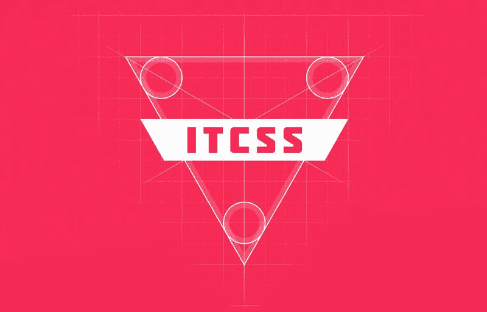
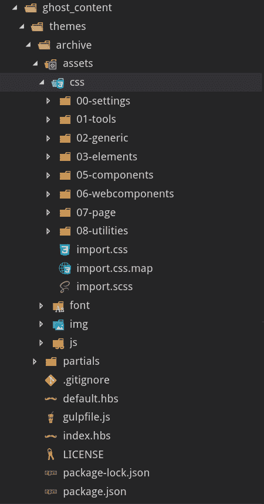
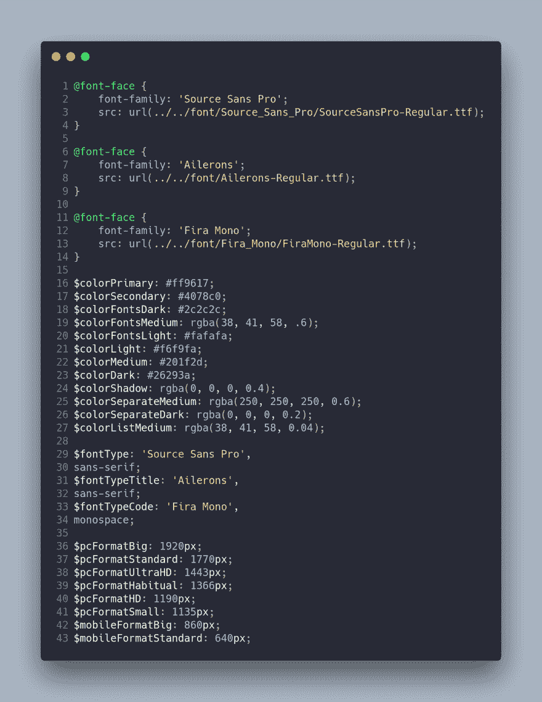
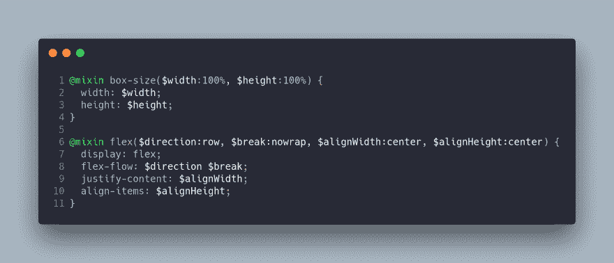
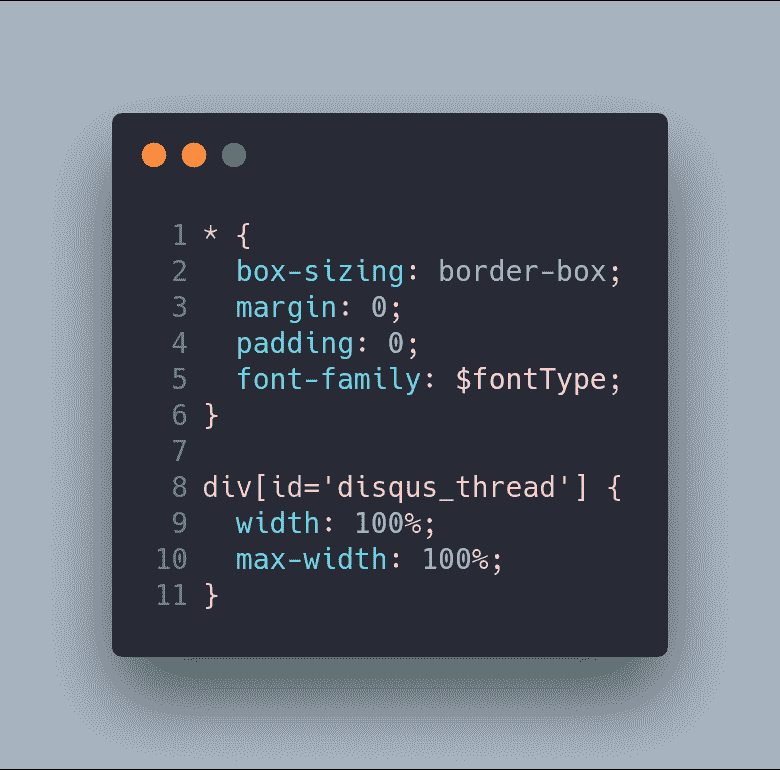
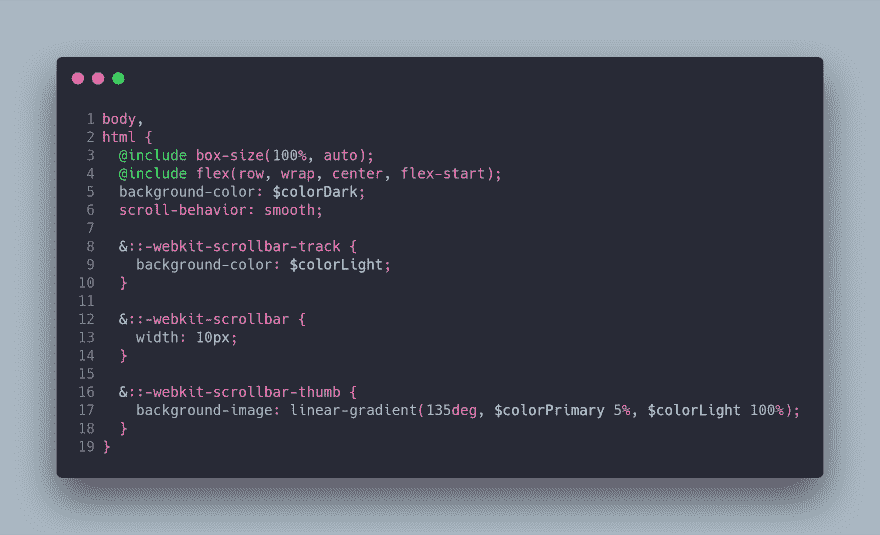
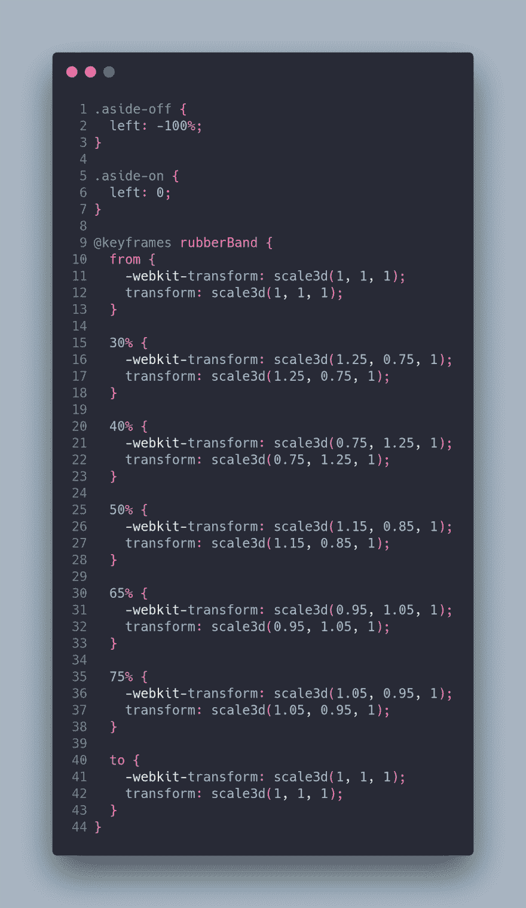
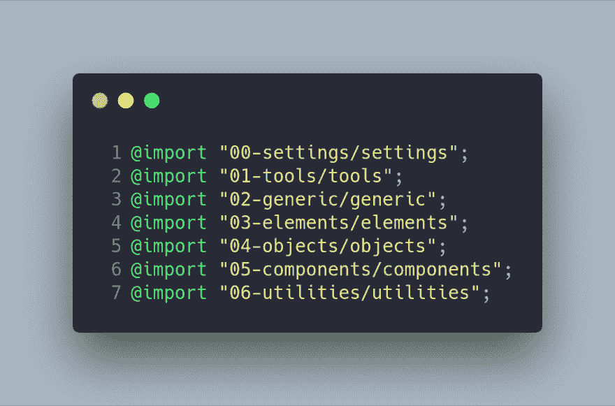

# 理解 ITCSS:在 GhostCMS 博客中使用 ITCSS 的真实案例

> 原文：<https://dev.to/carlillo/understanding-itcss-real-case-using-itcss-in-a-ghostcms-blog-1p9b>

* * *

## 我已经在为自己的博客[设计的主题中应用了 ITCSS 架构，该主题在](https://carloscaballero.io) [GitHub](https://github.com/Caballerog/ares-designer) 中提供，你可以自由使用。

CSS 写得不好是一件痛苦的事情，可悲的是大多数时候 CSS 组织得不正确。使用 CSS 时的主要问题如下:

1.  **全球范围。**CSS 中的所有规则都在同一个作用域内，这样当你使用不同的样式表时可以覆盖规则。

2.  **层叠规则。当你有一个全局范围时，源顺序真的很重要。**

3.  **传承**。这些规则可以在它们之间继承，并且由于这种特性，你可以预期不同的行为。

4.  **选择器特异性**。创建样式表时最大的问题之一来自于对选择器的操作没有深入了解。

这些问题在大型项目中反复出现，因为有大量的人在没有框架或工作规则的情况下工作。可悲的是，这种情况的结果是样式表变得混乱。

因此，解决方案是**按照特异性顺序**编写 CSS，该顺序由 ITCSS 提供。

## ITCSS(倒三角 CSS)

ITCSS 是由[哈利·罗伯特](https://csswizardry.com/)创建的一个特别适合大型项目的架构。它既不是一个库，也不是一个设计框架(Bootstrap，Angular Material)，而是一种结构化样式表元素的方式。这种架构不依赖于预处理器(SASS、Stylus 或更少)，但强烈建议使用它们，以便从这种架构的使用中获得更大的好处。

简而言之，ITCSS 是一种在层内组织 CSS 文件的方法——从一般到明确，从低到高具体。

在下图中，您可以看到倒三角形:

[](https://res.cloudinary.com/practicaldev/image/fetch/s--XaU4GLZW--/c_limit%2Cf_auto%2Cfl_progressive%2Cq_auto%2Cw_880/https://cdn-images-1.medium.com/max/2000/1%2Av1wN1xfQN0I5UCzCt9CUBA.jpeg)

三角形的各层如下:

1.  **设置** —用于预处理程序，包含字体、颜色定义等。在这一层通常定义可以定制模板的变量。

2.  **工具** —全局使用的混合和函数。只有当我们使用预处理器作为 SASS 时，才使用这一层。

3.  **通用** —重置和/或标准化样式、框尺寸定义等。需要注意的是，这是生成 CSS 的三角形的第一层。

4.  **元素** —为裸露的 HTML 元素(如 H1、A、页眉、页脚等)设计样式。这些来自浏览器的默认样式，所以我们必须在这里重新定义它们。

5.  **Objects** —基于类的选择器，定义无修饰的设计模式，例如从 OOCSS 中已知的媒体对象，如列表、单选按钮。丹尼尔·福内尔的代码笔【https://codepen.io/collection/DmzVOM/ T2】向你展示了使用这种架构设计的物品清单。

6.  **组件** —特定的 UI 组件。我们页面的组件，例如按钮、卡片、具体列表等..

7.  **工具** —工具和助手类，能够覆盖三角形中之前的任何东西。

## 真实例子——本博客！

理解一项新技术或架构的最好方法是用一个例子。所以，我将向你展示我是如何用这个架构设计这个博客的主题的。

这个博客是使用强大的 [GhostCMS](https://ghost.org/) 工具开发的，它允许我们结合 CSS 使用[手柄](https://handlebarsjs.com/)制作自己的模板。然而，为了生成这个主题的 CSS，我决定使用 ITCSS 架构，使用 [SASS](https://sass-lang.com/) 将代码转换成 CSS 中的最终样式表，这将给出这个主题的视觉方面。

因此，我们首先要看到的是这个项目的目录结构，如下图所示。

[](https://res.cloudinary.com/practicaldev/image/fetch/s--TC7rRNj4--/c_limit%2Cf_auto%2Cfl_progressive%2Cq_auto%2Cw_880/https://cdn-images-1.medium.com/max/2000/0%2AbQMNrqZ0wgx4vdlf.png)

在此结构中，您可以观察到以下部分:

*   partials:blog 页面的不同部分，比如页脚、页眉、分页、postlists、侧边栏，都是在哪里构建的？

*   **资产**:在这里我们可以找到以下子文件夹:

*   css :这是我们使用 ITCSS 构建样式表的地方。

*   **字体**:字体不同。

*   **img** :图像。

*   **js** :必需的 JavaScript 库，比如 highlight.js。

*   **/** :在根目录下我们找到了 index、post、tag、default 对应的 handle 文件，以及 package.json 或 gulpfile 等一些配置文件。

接下来，我们将描述。每个 ITCSS 层的 scss 文件，以便能够看到每个层中都包含了什么。

## 设置

settings.scss 文件的内容如下:

[](https://res.cloudinary.com/practicaldev/image/fetch/s--TR2TcBjn--/c_limit%2Cf_auto%2Cfl_progressive%2Cq_auto%2Cw_880/https://cdn-images-1.medium.com/max/2976/1%2AIzOE9OVZ6DLYGkChY1daoQ.png)

您可以看到，这个文件的作用是定义要使用的字体和将在整个主题中使用的调色板。在这个文件中，我们主要有所有变量的定义，我们希望以后能够自定义。

tools.scss 文件的内容如下:

[](https://res.cloudinary.com/practicaldev/image/fetch/s--mp84RmmV--/c_limit%2Cf_auto%2Cfl_progressive%2Cq_auto%2Cw_880/https://cdn-images-1.medium.com/max/3584/1%2AYxJ2p_OMdbZdy-J56FEvEQ.png)

在这一层，我们仍然没有产生 CSS，但我们正在定义工具(功能)，这将有助于在更高的层重复任务。在这个层次上，我们定义了三个功能:

*   **箱子尺寸**。这允许我们使用两个参数来定义盒子的大小。

*   **伸缩**。这个 mixin 为不同的容器配置 Flex-Layout 规则。

*   **后记**。这个 mixin 生成了几个 CSS 规则，这些规则在上层重复出现，但是改变了它们的容器，一些规则被覆盖。由于这个原因，我们没有在每一个规则中重复这些规则，而是提取了一个函数的公共规则，以便为公共代码提供一个单一的入口点。

## 通用

generic.scss 文件的内容如下:

[](https://res.cloudinary.com/practicaldev/image/fetch/s--tO4S2rsW--/c_limit%2Cf_auto%2Cfl_progressive%2Cq_auto%2Cw_880/https://cdn-images-1.medium.com/max/2000/1%2AyrN6qxIVznCqdx1bJVx7WA.png)

通用文件非常简单，因为它只包含一个规则，允许我们更改页面所有元素的边距和填充，以及配置默认的版式。

此外，与 disqus 评论服务的评论风格相关的规则也包含在本节中。您可以看到，为了插件正常工作，有必要为容器分配一个标识符(id = 'disqus_thread ')，但是这将完全破坏 ITCSS 架构。为此，使用了一种技术来将该元素的特异性降低到属性级别(使用属性选择器)。

## 元素

elements.scss 文件的内容如下:

[](https://res.cloudinary.com/practicaldev/image/fetch/s--FNHUPHwY--/c_limit%2Cf_auto%2Cfl_progressive%2Cq_auto%2Cw_880/https://cdn-images-1.medium.com/max/3480/1%2Afxmp60FFxPq2aeM-lZ6ZqA.png)

在这一层，我们配置与 html 和 body 元素相关的样式。

## 仿制药

generic.scss 文件的内容如下:

[](https://res.cloudinary.com/practicaldev/image/fetch/s--EuF1p2HW--/c_limit%2Cf_auto%2Cfl_progressive%2Cq_auto%2Cw_880/https://cdn-images-1.medium.com/max/2728/1%2AfSBcd5P4pDiBJ6TkO5owwA.png)

在这一层，影响 HTML 元素的一般规则必须结构化。注意，没有定义类，只使用了 html 元素、伪类和伪元素。在这一层中，我们使用了 SASS 的能力来嵌套 CSS 规则，并且没有如此冗长的代码。事实上，如果我们看到特异性图，会出现与我们正在生成的嵌套级别相关的峰，这是正常的。

## 物体

objects.scss 文件的内容如下:

```
/** EMPTY **/ 
```

在设计我们的模板时，我们没有任何与对象相关联的规则，因为规则在非常低的级别时被划分为元素，在获得足够的语义值时被划分为组件。因此，现在我们在这一部分没有任何规则，但定义它并不坏，因为在我们架构的不断重构和改进中，我们可以利用这一层。

## 组件

components.scss 文件的内容如下:

[](https://res.cloudinary.com/practicaldev/image/fetch/s--pIh887sg--/c_limit%2Cf_auto%2Cfl_progressive%2Cq_auto%2Cw_880/https://cdn-images-1.medium.com/max/2000/1%2AD2z1OSOiJCky8HhrLIA0nA.png)

这一层是更高的层次，因此在这里我们发现了更具体的规则，也是在这里最后的接触被适应。如果你看看这个层，有许多规则为我们的主题定义了具有语义价值的元素。这是最后的润色，考虑到网页是由许多组件组成的

## 实用程序

utilities.scss 文件的内容如下:

[](https://res.cloudinary.com/practicaldev/image/fetch/s--ZZ_9fteE--/c_limit%2Cf_auto%2Cfl_progressive%2Cq_auto%2Cw_880/https://cdn-images-1.medium.com/max/2268/1%2AFhhVw05p-j-4JRVmGTbNFw.png)

最后，实用程序层被保留为一个“总括层”,在我们的例子中，我们在这里留下了动画，这些动画可以完美地应用到更低的层，因为它们是通用的，但我们更喜欢将其转移到实用程序。

## 运行代码并导入

最后，前面的文件是从作为加载器的单个文件导入的。该文件的内容如下:

[](https://res.cloudinary.com/practicaldev/image/fetch/s--Oe0GCgZ1--/c_limit%2Cf_auto%2Cfl_progressive%2Cq_auto%2Cw_880/https://cdn-images-1.medium.com/max/2000/1%2AiNcnjCigU_T8jY3yd0qCyg.png)

为了将 SASS 的内容转换成 CSS 并使其小型化，我创建了下面的 npm 脚本。

[](https://res.cloudinary.com/practicaldev/image/fetch/s--lq-UTt4E--/c_limit%2Cf_auto%2Cfl_progressive%2Cq_auto%2Cw_880/https://cdn-images-1.medium.com/max/3820/1%2A5folx0rBYd44k1Tn5t1Duw.png)

## 结论

在这篇文章中，我想向你展示一个样式表的架构，叫做 ITCSS。这种架构完全兼容其他方法，如 BEM 或 OOCSS。这种架构是基于组织 CSS 规则的方式，这样我们可以控制可能出现的混乱，因为样式表的范围是全局的。

最后，我已经向你展示了我是如何使用这个架构创建这个博客的主题的，[这个主题是免费的，在 GitHub 上是开源的](https://github.com/Caballerog/ares-designer)，所以任何想在他们的博客上使用它的人都可以使用它。

## 越来越多越来越多…

*   [Carloscaballero.io 主题:Ghost 的免费开源主题](https://carloscaballero.io/ares-theme/)

*   [ITCSS:可扩展、可维护的 CSS 架构](https://www.xfive.co/blog/itcss-scalable-maintainable-css-architecture/)。

*   [如何用 ITCSS](https://blog.codeminer42.com/how-to-organize-your-styles-with-itcss-3787cbc6dcbf) 整理自己的风格？

*   使用 ITCs 管理大型 CSS 项目。

*   trivago 的 CSS 第 1 部分:结构和 ITCs。

*   [面向 Web 开发人员的 ITCSS 简介](https://www.hongkiat.com/blog/inverted-triangle-css-web-development/)。

* * *

*最初发布于[www . carloscaballero . io .](https://carloscaballero.io/understanding-itcss-real-case-using-itcss-https-carloscaballero-io)T3】*