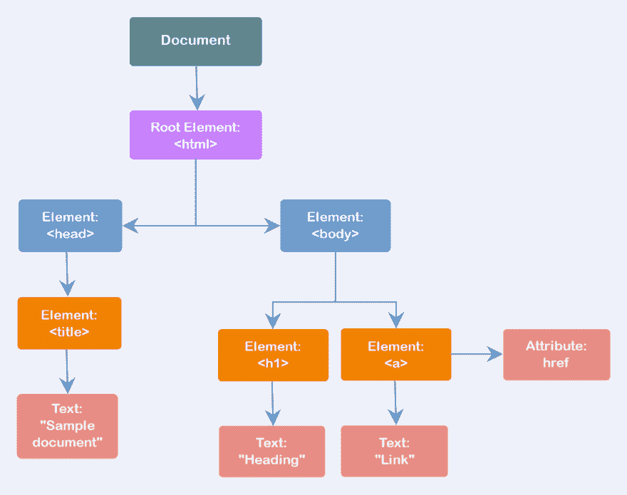
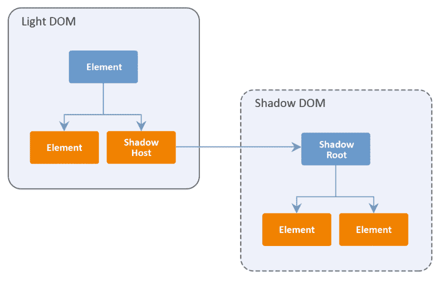
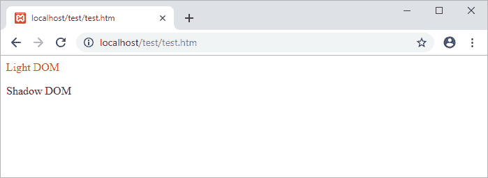
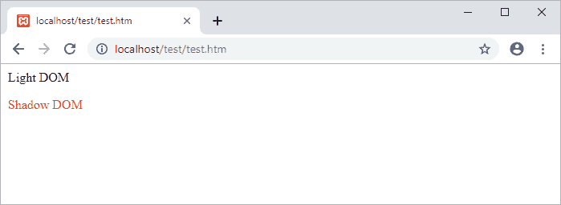
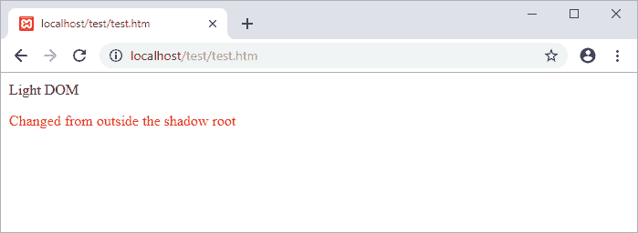
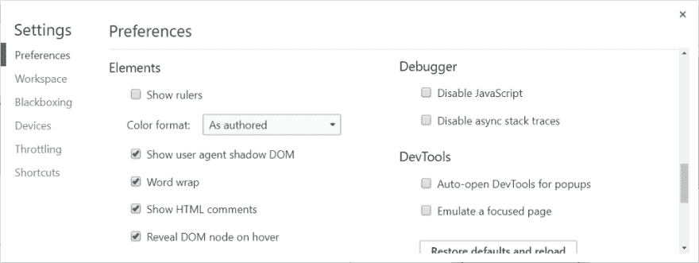
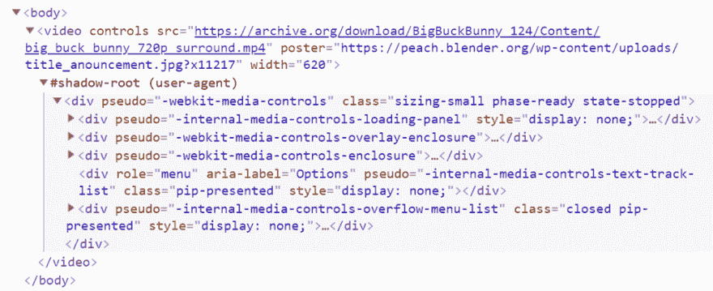

# 了解阴影 DOM v1

> 原文：<https://dev.to/bnevilleoneill/understanding-shadow-dom-v1-3oa>

[](https://res.cloudinary.com/practicaldev/image/fetch/s--XPsj9Vr2--/c_limit%2Cf_auto%2Cfl_progressive%2Cq_auto%2Cw_880/https://cdn-images-1.medium.com/max/1024/1%2AJUUom2Cj9xt74qSETgCAvw.png)

影子 DOM 不是超级英雄电影里的反派。这也不是大教堂的黑暗面。影子 DOM 只是解决文档对象模型(简称 DOM)中缺乏树封装的一种方法。

网页使用外部来源的数据和 widgets 是很常见的。如果没有封装，样式可能会影响 HTML 中不需要的部分，迫使开发人员使用过于特殊的选择器和！避免风格冲突的重要规则。

尽管如此，在编写大型程序时，这些努力似乎并不十分有效，相当一部分开发时间被浪费在防止 CSS 和 JavaScript 冲突上。Shadow DOM API 旨在通过提供一种封装 DOM 树的机制来解决这些和其他问题。

影子 DOM 是用来创建 Web 组件的主要技术之一；另外两个是定制元素和 HTML 模板。web 组件的规范最初是由 Google 提出的，目的是简化 Web 小部件的开发。

尽管这三种技术被设计为协同工作，但是您可以自由地单独使用每一种技术。本教程的范围仅限于影子 DOM。

[](https://logrocket.com/signup/)

### 什么是 DOM？

在我们深入研究如何创建影子 DOM 之前，理解 DOM 是什么很重要。W3C 文档对象模型(DOM)提供了一个平台和语言中立的应用程序编程接口(API ),用于表示和操作存储在 HTML 和 XML 文档中的信息。

使用 DOM，程序员可以访问、添加、删除或更改元素和内容。DOM 将网页视为树结构，每个分支以一个节点结束，每个节点保存一个对象，可以使用 JavaScript 等脚本语言修改该对象。考虑下面的 HTML 文档:

```
<html>
  <head>
    Sample document
  </head>
  <body>
    <h1>Heading</h1>
    <a href="https://example.com">Link</a>
  </body>
</html> 
```

这个 HTML 的 DOM 表示如下:

[](https://res.cloudinary.com/practicaldev/image/fetch/s--WYYNWWza--/c_limit%2Cf_auto%2Cfl_progressive%2Cq_auto%2Cw_880/https://cdn-images-1.medium.com/max/1024/1%2AbM6Ql5lImhMD3NCTuiF68g.png) 

<figcaption>本图中所有方框均为节点。</figcaption>

用于描述 DOM 各部分的术语类似于现实世界中的家谱:

*   给定节点上一级的节点是该节点的父节点
*   给定节点下一级的节点是该节点的子节点
*   具有相同父节点的节点是兄弟节点
*   给定节点之上的所有节点，包括父节点和祖父节点，都被称为该节点的祖先
*   最后，给定节点下的所有节点都称为该节点的后代

节点的类型取决于它所代表的 HTML 元素的种类。HTML 标签被称为元素节点。嵌套标签形成了一个元素树。元素中的文本称为文本节点。文本节点可能没有子节点；你可以把它想象成一片树叶。

为了访问树，DOM 提供了一组方法，程序员可以用这些方法修改文档的内容和结构。当您编写 document.createElement('p ')时；例如，您正在使用 DOM 提供的方法。没有 DOM，JavaScript 就无法理解 HTML 和 XML 文档的结构。

下面的 JavaScript 代码展示了如何使用 DOM 方法创建两个 HTML 元素，将一个元素嵌套在另一个元素中，设置文本内容，并将它们附加到文档主体:

```
const section = document.createElement('section');
const p = document.createElement('p');

p.textContent = 'Hello!';

section.appendChild(p);

document.body.appendChild(section); 
```

下面是运行这段 JavaScript 代码后得到的 DOM 结构:

```
<body>
  <section>
    <p>Hello!</p>
  </section>
</body> 
```

### 什么是影 DOM？

封装是面向对象编程的一个基本特性，它使程序员能够限制对对象组件的未授权访问。

根据这个定义，对象以可公开访问的方法的形式提供一个接口，作为与其数据交互的一种方式。这样，就不能从对象定义的外部直接访问对象的内部表示。

影子 DOM 将这个概念带到了 HTML 中。它使您能够将一个隐藏的、分离的 DOM 链接到一个元素，这意味着您可以对 HTML 和 CSS 进行本地作用域。您现在可以使用更通用的 CSS 选择器，而不用担心命名冲突，并且样式不再泄漏或应用于它们不应该应用的元素。

实际上，Shadow DOM API 正是库和小部件开发人员将 HTML 结构、样式和行为与代码的其他部分分开所需要的。

影像根是影像树中最顶端的节点。这是创建影子 DOM 时附加到常规 DOM 节点的内容。与影子根相关联的节点称为影子主机。

您可以像对待普通 DOM 一样将元素附加到影子根。链接到影子根的节点形成影子树。一张图应该能让这一点更清楚:

[](https://res.cloudinary.com/practicaldev/image/fetch/s--PUsZyNAp--/c_limit%2Cf_auto%2Cfl_progressive%2Cq_auto%2Cw_880/https://cdn-images-1.medium.com/max/1024/1%2AG35_koIDio_s94u57QzmZA.png)

术语光 DOM 通常用于区分正常 DOM 和阴影 DOM。阴影 DOM 和光 DOM 合起来称为逻辑 DOM。灯光 DOM 与阴影 DOM 分离的点称为阴影边界。DOM 查询和 CSS 规则不能到达阴影边界的另一边，从而创建封装。

### 创建阴影 DOM

要创建影子 DOM，需要使用 Element.attachShadow()方法将影子根附加到元素上。语法如下:

```
var shadowroot = element.attachShadow(shadowRootInit); 
```

我们来看一个简单的例子:

```
<div id="host"><p>Default text</p></div>

<script>
  const elem = document.querySelector('#host');

  // attach a shadow root to #host
  const shadowRoot = elem.attachShadow({mode: 'open'});

  // create a <p> element
  const p = document.createElement('p');

  // add <p> to the shadow DOM
  shadowRoot.appendChild(p);

  // add text to <p> 
  p.textContent = 'Hello!';
</script> 
```

这段代码将一个阴影 DOM 树附加到一个 id 为 host 的 div 元素上。该树与 div 的实际子树是分开的，添加到其中的任何东西都是宿主元素的本地内容。

[](https://res.cloudinary.com/practicaldev/image/fetch/s--RjGERvxX--/c_limit%2Cf_auto%2Cfl_progressive%2Cq_auto%2Cw_880/https://cdn-images-1.medium.com/max/840/1%2Ay2gTKKe8oJ9NOoi6t3lZ4Q.png)

<figcaption>*Chrome DevTools 中的阴影根。*</figcaption>

请注意#host 中的现有元素是如何被影子根替换的。不支持影子 DOM 的浏览器将使用默认内容。

现在，当向主文档添加 CSS 时，样式规则不会影响阴影 DOM:

```
<div><p>Light DOM</p></div>
<div id="host"></div>

<script>
  const elem = document.querySelector('#host');

  // attach a shadow root to #host
  const shadowRoot = elem.attachShadow({mode: 'open'});

  // set the HTML contained within the shadow root
  shadowRoot.innerHTML = '<p>Shadow DOM</p>';
</script>

<style>
  p {color: red}
</style> 
```

light DOM 中定义的样式不能跨越阴影边界。因此，只有浅色 DOM 中的段落会变成红色。

[](https://res.cloudinary.com/practicaldev/image/fetch/s--2FVVQMQF--/c_limit%2Cf_auto%2Cfl_progressive%2Cq_auto%2Cw_880/https://cdn-images-1.medium.com/max/699/1%2AsuNI_ZRw7DTKw4qVglba2A.png)

相反，添加到影子 DOM 中的 CSS 是宿主元素的本地元素，不会影响 DOM 中的其他元素:

```
<div><p>Light DOM</p></div>
<div id="host"></div>

<script>
  const elem = document.querySelector('#host');
  const shadowRoot = elem.attachShadow({mode: 'open'}); 
```

```
 shadowRoot.innerHTML = `
    <p>Shadow DOM</p>
    <style>p {color: red}</style>`;

</script> 
```

[](https://res.cloudinary.com/practicaldev/image/fetch/s--6Dl2MlgB--/c_limit%2Cf_auto%2Cfl_progressive%2Cq_auto%2Cw_880/https://cdn-images-1.medium.com/max/699/1%2AurR49nrpiy0bmGlY2Fdwmg.png)

您也可以将样式规则放在外部样式表中，就像这样:

```
shadowRoot.innerHTML = `
  <p>Shadow DOM</p>
  <link rel="stylesheet" href="style.css">`; 
```

要获取 shadowRoot 附加到的元素的引用，可以使用 host 属性:

```
<div id="host"></div>

<script>
  const elem = document.querySelector('#host');
  const shadowRoot = elem.attachShadow({mode: 'open'});

  console.log(shadowRoot.host);    // => <div id="host"></div>
</script> 
```

反过来，使用元素的 shadowRoot 属性获得对元素的 shadow root 的引用:

```
<div id="host"></div>

<script>
  const elem = document.querySelector('#host');
  const shadowRoot = elem.attachShadow({mode: 'open'});

  console.log(elem.shadowRoot);    // => #shadow-root (open)
</script> 
```

### shadowRoot mod

当调用 Element.attachShadow()方法来附加影子根时，必须通过将对象作为参数传递来指定影子 DOM 树的封装模式，否则将引发 TypeError。该对象必须有一个值为 open 或 closed 的模式属性。

开放的影像根允许您使用主机元素的 shadow root 属性从根的外部访问影像根的元素，如下例所示:

```
<div><p>Light DOM</p></div>
<div id="host"></div>

<script>
  const elem = document.querySelector('#host');

  // attach an open shadow root to #host
  const shadowRoot = elem.attachShadow({mode: 'open'});

  shadowRoot.innerHTML = `<p>Shadow DOM</p>`;

  // Nodes of an open shadow DOM are accessible
  // from outside the shadow root
  elem.shadowRoot.querySelector('p').innerText = 'Changed from outside the shadow root';
  elem.shadowRoot.querySelector('p').style.color = 'red';
</script> 
```

[](https://res.cloudinary.com/practicaldev/image/fetch/s--UYFJbHF---/c_limit%2Cf_auto%2Cfl_progressive%2Cq_auto%2Cw_880/https://cdn-images-1.medium.com/max/699/1%2AOOc1pkscCQoL9oCwJhS0Cg.png)

但是如果 mode 属性的值为 closed，那么试图从根之外使用 JavaScript 来访问影子根的元素会抛出一个 TypeError:

```
<div><p>Light DOM</p></div>
<div id="host"></div>

<script>
  const elem = document.querySelector('#host');

  // attach a closed shadow root to #host
  const shadowRoot = elem.attachShadow({mode: 'closed'});

  shadowRoot.innerHTML = `<p>Shadow DOM</p>`;

  elem.shadowRoot.querySelector('p').innerText = 'Now nodes cannot be accessed from outside';
  // => TypeError: Cannot read property 'querySelector' of null 
</script> 
```

当 mode 设置为 closed 时，shadowRoot 属性返回 null。因为空值没有任何属性或方法，所以对其调用 querySelector()会导致 TypeError。浏览器通常使用封闭的影子根来使一些元素的实现内部从 JavaScript 中不可访问和不可更改。

要确定阴影 DOM 是处于打开模式还是关闭模式，可以参考阴影根的 mode 属性:

```
<div id="host"></div>

<script>
  const elem = document.querySelector('#host');
  const shadowRoot = elem.attachShadow({mode: 'closed'});

  console.log(shadowRoot.mode);    // => closed
</script> 
```

从表面上看，对于不想暴露组件影子根的 Web 组件作者来说，封闭的影子 DOM 显得非常方便；然而，在实践中，绕过封闭的阴影穹顶并不难。一般来说，完全隐藏一个影子 DOM 所需的努力是不值得的。

### 不是所有的 HTML 元素都可以承载一个影子 DOM

只有有限的元素集可以承载影子 DOM。下表列出了支持的元素:

```
+----------------+----------------+----------------+
|    article     |      aside     |   blockquote   |
+----------------+----------------+----------------+
|     body       |       div      |     footer     |
+----------------+----------------+----------------+
|      h1        |       h2       |       h3       |
+----------------+----------------+----------------+
|      h4        |       h5       |       h6       |
+----------------+----------------+----------------+
|    header      |      main      |      nav       |
+----------------+----------------+----------------+
|      p         |     section    |      span      |
+----------------+----------------+----------------+ 
```

试图将影子 DOM 树附加到任何其他元素都会导致 DOMException 错误。例如:

```
document.createElement('img').attachShadow({mode: 'open'});    
// => DOMException 
```

使用一个  元素作为影子主机是不合理的，所以这段代码抛出错误也就不足为奇了。您可能得到 DOMException 错误的另一个原因是浏览器已经使用该元素来托管影子 DOM。

### 浏览器自动给一些元素附加一个阴影 DOM

影子 DOM 已经存在了相当一段时间，浏览器一直用它来隐藏`<input>`、`<textarea>`、`<video>`等元素的内部结构。

当您在 HTML 中使用`<video>`元素时，浏览器会自动为该元素附加一个阴影 DOM，其中包含默认的浏览器控件。但是在 DOM 中唯一可见的是`<video>`元素本身:

[](https://res.cloudinary.com/practicaldev/image/fetch/s--hgeLyQQA--/c_limit%2Cf_auto%2Cfl_progressive%2Cq_auto%2Cw_880/https://cdn-images-1.medium.com/max/938/1%2AfkpGG-1YIDngidtJS97xPA.png)

要使这些元素的影子根在 Chrome 中可见，请打开 Chrome DevTools 设置(按 F1)，并在“元素”部分选中“显示用户代理影子 DOM”:

[](https://res.cloudinary.com/practicaldev/image/fetch/s--zFxsl5gS--/c_limit%2Cf_auto%2Cfl_progressive%2Cq_auto%2Cw_880/https://cdn-images-1.medium.com/max/1024/1%2AZRlGZWuWGu36sHx3d1KCHg.png)

选中“显示用户代理影子 DOM”选项后，影子根节点及其子节点变得可见。以下是启用该选项后相同代码的样子:

[](https://res.cloudinary.com/practicaldev/image/fetch/s--kHQNctlW--/c_limit%2Cf_auto%2Cfl_progressive%2Cq_auto%2Cw_880/https://cdn-images-1.medium.com/max/1024/1%2AdNuxhiSTOp12KxYpuSLNkw.png)

### 在自定义元素上托管阴影 DOM

由自定义元素 API 创建的自定义元素可以像任何其他元素一样承载影子 DOM。考虑下面的例子:

```
<my-element></my-element>

<script>
  class MyElement extends HTMLElement {
    constructor() {

      // must be called before the this keyword
      super();

      // attach a shadow root to <my-element>
      const shadowRoot = this.attachShadow({mode: 'open'});

      shadowRoot.innerHTML = `
        <style>p {color: red}</style>
        <p>Hello</p>`;
    }
  }

  // register a custom element on the page
  customElements.define('my-element', MyElement);
</script> 
```

这段代码创建了一个托管影子 DOM 的自治自定义元素。为此，它调用 customElements.define()方法，将元素名作为第一个参数，将一个类对象作为第二个参数。该类扩展 HTMLElement 并定义元素的行为。

在构造函数内部，super()用于建立原型链，一个影子根附加到自定义元素上。现在，当您在页面上使用时，它会创建自己的阴影 DOM:

[](https://res.cloudinary.com/practicaldev/image/fetch/s--UAFddOBv--/c_limit%2Cf_auto%2Cfl_progressive%2Cq_auto%2Cw_880/https://cdn-images-1.medium.com/max/806/1%2A4iydLrl9S1UXTDZ94CmXxQ.png)

请记住，有效的自定义元素不能是一个单词，其名称中必须有一个连字符(-)。例如， *myelement* 不能用作自定义元素的名称，并且会引发 DOMException 错误。

### 样式化主体元素

通常，要设计主机元素的样式，需要将 CSS 添加到 light DOM 中，因为主机元素就位于那里。但是，如果需要在影子 DOM 中设计主机元素的样式，该怎么办呢？

这就是 host()伪类函数出现的原因。该选择器允许您从影子根目录中的任何位置访问影子主机。这里有一个例子:

```
<div id="host"></div>

<script>
  const elem = document.querySelector('#host');
  const shadowRoot = elem.attachShadow({mode: 'open'});

  shadowRoot.innerHTML = `
    <p>Shadow DOM</p>
    <style>
      :host {
        display: inline-block;
        border: solid 3px #ccc;
        padding: 0 15px;
      }
    </style>`;

</script> 
```

值得注意的是:host 只在影子根中有效。还要记住，在影像根之外定义的样式规则比在:host 中定义的规则具有更高的特异性。

例如，# host { font-size:16px；}击败阴影 DOM 的:host { font-size:20px；}.这实际上很有用，因为它允许您为组件定义默认样式，并让组件的用户覆盖您的样式。唯一的例外是！重要的规则，在影子 DOM 中具有更高的特异性。

您还可以将一个选择器作为参数传递给:host()，这允许您仅当主机与指定的选择器匹配时才将其作为目标。换句话说，它允许您针对同一主机的不同状态:

```
<style>
  :host(:focus) {
    /* style host only if it has received focus */
  }

  :host(.blue) {
    /* style host only if has a blue class */
  }

  :host([disabled]) {
    /* style host only if it's disabled */
  }
</style> 
```

### 基于上下文的样式

要选择特定祖先内部的影子根主机，可以使用:host-context()伪类函数。例如:

```
:host-context(.main) {
  font-weight: bold;
} 
```

此 CSS 代码仅在影子主机是。主:

```
<body class="main">
  <div id="host">
  </div>
</body> 
```

:host-context()对于主题化特别有用，因为它允许作者根据组件使用的上下文来设计组件的样式。

### 风格挂钩

shadow DOM 的一个有趣的方面是它能够创建“样式占位符”并允许用户填充它们。这可以通过使用 [CSS 自定义属性](https://developer.mozilla.org/en-US/docs/Web/CSS/Using_CSS_variables)来完成。让我们看一个简单的例子:

```
<div id="host"></div>

<style>
  #host {--size: 20px;}
</style>

<script>
  const elem = document.querySelector('#host');
  const shadowRoot = elem.attachShadow({mode: 'open'});

  shadowRoot.innerHTML = `
    <p>Shadow DOM</p>
    <style>p {font-size: var(--size, 16px);}</style>`;

</script> 
```

这个阴影 DOM 允许用户覆盖其段落的字体大小。使用自定义属性符号(— size: 20px)设置该值，shadow DOM 使用 var()函数(font-size: var( — size，16px)检索该值。就概念而言，这类似于元素的工作方式。

### 可继承的风格

Shadow DOM 允许您创建从外部看不到选择器的独立 DOM 元素，但这并不意味着继承的属性不会通过 Shadow 边界。

某些属性，如颜色、背景和字体系列，会越过阴影边界并应用于阴影树。因此，与 iframe 相比，影子 DOM 不是一个很强的障碍。

```
<style>
  div {
    font-size: 25px;
    text-transform: uppercase;
    color: red;
  }
</style>

<div><p>Light DOM</p></div>
<div id="host"></div>

<script>
  const elem = document.querySelector('#host');
  const shadowRoot = elem.attachShadow({mode: 'open'});

  shadowRoot.innerHTML = `<p>Shadow DOM</p>`;
</script> 
```

解决方法很简单:通过声明 all: initial 将可继承的样式重置为它们的初始值，就像这样:

```
<style>
  div {
    font-size: 25px;
    text-transform: uppercase;
    color: red;
  }
</style>

<div><p>Light DOM</p></div>
<div id="host"></div>

<script>
  const elem = document.querySelector('#host');
  const shadowRoot = elem.attachShadow({mode: 'open'});

  shadowRoot.innerHTML = `
    <p>Shadow DOM</p>
    <style>
      :host p {
        all: initial;
      }
    </style>`;
</script> 
```

在本例中，元素被强制返回到初始状态，因此跨越阴影边界的样式没有效果。

### 事件重定向

在阴影 DOM 中触发的事件可能会越过阴影边界，并冒泡到光 DOM 中；但是，Event.target 的值会自动更改，因此看起来好像事件源自包含影像树的主机元素，而不是实际的元素。

这种变化被称为事件重定向，其背后的原因是为了保留影子 DOM 封装。考虑下面的例子:

```
<div id="host"></div>

<script>
  const elem = document.querySelector('#host');
  const shadowRoot = elem.attachShadow({mode: 'open'});

  shadowRoot.innerHTML = `
    <ul>
      <li>One</li>
      <li>Two</li>
      <li>Three</li>
    <ul>
    `;

  document.addEventListener('click', (event) => {
    console.log(event.target);
  }, false);
</script> 
```

当您单击 shadow DOM 中的任意位置时，这段代码会将`<div id="host">…</div>`记录到控制台，因此侦听器看不到调度事件的实际元素。

然而，重定目标不会发生在 shadow DOM 中，您可以很容易地找到与事件相关联的实际元素:

```
<div id="host"></div>

<script>
  const elem = document.querySelector('#host');
  const shadowRoot = elem.attachShadow({mode: 'open'});

  shadowRoot.innerHTML = `
    <ul>
      <li>One</li>
      <li>Two</li>
      <li>Three</li>
    </ul>`;

  shadowRoot.querySelector('ul').addEventListener('click', (event) => {
    console.log(event.target);
  }, false);  
</script> 
```

请注意，并非所有事件都从影子 DOM 传播出去。那些做的被重定目标，但是其他的被简单地忽略。如果您正在使用[自定义事件](https://developer.mozilla.org/en-US/docs/Web/Guide/Events/Creating_and_triggering_events#Creating_custom_events)，您将需要使用 composed: true 标志，否则事件将不会出现在阴影边界之外。

### 阴影 DOM v0 vs. v1

Shadow DOM 规范的最初版本是在 Chrome 25 中实现的，当时被称为 Shadow DOM v0。该规范的更新版本改进了 Shadow DOM API 的许多方面。

例如，一个元素不能再承载多个影子 DOM，有些元素根本不能承载一个影子 DOM。违反这些规则会导致错误。

此外，Shadow DOM v1 提供了一组新特性，比如开放阴影模式、回退内容等等。你可以在这里找到 v0 和 v1 [的全面并列比较，作者之一是该规范的作者。Shadow DOM v1 的完整描述可以在](https://hayato.io/2016/shadowdomv1/#multiple-shadow-roots) [W3C](https://www.w3.org/TR/shadow-dom/) 找到。

### 浏览器支持影子 DOM v1

在撰写本文时，Firefox 和 Chrome 完全支持 Shadow DOM v1。可惜 Edge 还没有实现 v1，Safari 部分支持。我可以使用最新的支持浏览器列表吗...。

要在不支持 shadow DOM v1 的浏览器上实现 Shadow DOM，可以使用 [shadydom](https://github.com/webcomponents/shadydom) 和[shady CSS](https://github.com/webcomponents/shadycss)poly fill。

### 包装完毕

DOM 缺乏封装一直是 web 开发人员面临的问题。Shadow DOM API 为我们提供了创建作用域 DOM 的能力，从而为这个问题提供了一个优雅的解决方案。

现在，风格冲突不再是一个令人担忧的问题，选择器也不会失去控制。shadow DOM 是小部件开发者的游戏改变者。能够创建从页面的其余部分封装出来的小部件，并且不受其他样式表和脚本的影响，这是一个巨大的优势。

如前所述，Web 组件由三种主要技术组成，影子 DOM 是其中的关键部分。希望在读完这篇文章后，你会更容易理解这三种技术是如何一起构建 Web 组件的。

有什么小技巧可以分享吗？请在评论中告诉我们！

* * *

### Plug: [LogRocket](https://logrocket.com/signup/) ，一款适用于网络应用的 DVR

[](https://logrocket.com/signup/)

<figcaption>[https://logrocket.com/signup/](https://logrocket.com/signup/)</figcaption>

LogRocket 是一个前端日志工具，可以让你回放问题，就像它们发生在你自己的浏览器中一样。LogRocket 不需要猜测错误发生的原因，也不需要向用户询问截图和日志转储，而是让您重放会话以快速了解哪里出错了。它可以与任何应用程序完美配合，不管是什么框架，并且有插件可以记录来自 Redux、Vuex 和@ngrx/store 的额外上下文。

除了记录 Redux 操作和状态，LogRocket 还记录控制台日志、JavaScript 错误、堆栈跟踪、带有头+正文的网络请求/响应、浏览器元数据和自定义日志。它还使用 DOM 来记录页面上的 HTML 和 CSS，甚至为最复杂的单页面应用程序重新创建像素级完美视频。

[免费试用](https://logrocket.com/signup/)。

* * *

帖子[了解暗影 DOM v1](https://blog.logrocket.com/understanding-shadow-dom-v1-fa9b81ebe3ac/) 最先出现在[博客](https://blog.logrocket.com)上。