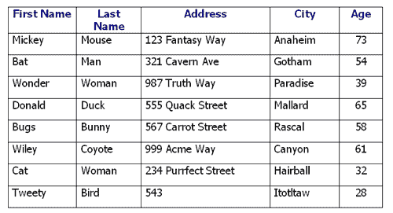

# 理解 Ruby on Rails 的基础知识:SQL 数据库及其工作原理

> 原文：<https://dev.to/teekay/understanding-the-basics-of-ruby-on-rails-sql-databases-and-how-theywork-1k15>

在[了解了 Ruby](https://medium.freecodecamp.org/learning-ruby-from-zero-to-hero-90ad4eecc82d) 之后，我们采取的第一步是理解[网络和 Ruby on Rails 请求-响应周期](https://medium.com/the-renaissance-developer/ruby-on-rails-http-mvc-and-routes-f02215a46a84)是如何工作的。

现在是时候了解数据库以及它们如何与 Ruby on Rails 连接了。基本上，答案是模型:来自`MVC`的`M`，正如我们在这里了解到的。

在学习用 Rails 进行 web 开发之前，我真心推荐先学习一下[Ruby](https://medium.freecodecamp.org/learning-ruby-from-zero-to-hero-90ad4eecc82d)。

我们开始吧！

### 什么是数据库？

嗯……首先想到的是存储数据的东西。

但是这个定义是相当不严谨的！数组、散列、链表或任何数据结构都可以是能够存储数据的东西。

当您关闭计算机时，您会丢失存储在该数组中的所有数据值(与所有数据结构相同)。所以把我所有的`precious data`都存起来不是个好主意。

[](https://res.cloudinary.com/practicaldev/image/fetch/s--LF11qXRW--/c_limit%2Cf_auto%2Cfl_progressive%2Cq_66%2Cw_880/https://cdn-images-1.medium.com/max/1600/1%2Ap1Yw2imC4HhUPaEfssliXw.gif)

这里我们需要解决两个问题:

1.  存储数据并随时获取。

2.  以一种有组织有结构的方式存储数据，这样我们就可以很容易地获取数据。

我应该将所有数据存储在记事本中吗？只要把里面的所有信息用逗号隔开，保存`txt file`，就大功告成了。现在我可以打开它，得到我想要的所有数据。我们可以存储数据并随时获取…问题解决了！

我们解决了这个问题，但我们忽略了另一个问题。现在所有的数据都存储起来了，我们不会丢失。但是在文件里结构不太好。我们需要以一种有组织的、结构良好的形式存储和获取数据的规则。

让我们思考一下如何以一种结构良好的方式组织数据。

如何组织表格中的所有数据？

[](https://res.cloudinary.com/practicaldev/image/fetch/s--DQE_QMRd--/c_limit%2Cf_auto%2Cfl_progressive%2Cq_auto%2Cw_880/https://cdn-images-1.medium.com/max/1600/1%2AQzMTJf39jdsi_alIWlGxig.jpeg)

因此，这里有:表格的标题(列名:名、姓、地址等)包含我们要存储的值。例如，如果我们想要存储**字符串“Mickey”**(值)，它将被存储在**“名字”**列中。

*   **表**:先说**人**

*   **栏目** : **名**，**姓**，**名**等

*   **行**:在这种情况下，我们可以说一行可以是一个**人**，例如，名为“米奇”，姓为“老鼠”，地址为“幻想路 123 号”，等等。

*   **字段**:数据库中存储的所有数据。

现在我们有了一个结构良好的方法来存储数据* *:在一个表中！* *

### 获取、删除、插入、更新数据怎么样？

我们将使用 SQL 语言(我不会提到 NoSQL 世界！)来操纵数据。让我们从最基本的开始。

1.  **GET:** 如果我们想从 **People** 表中获取所有数据(**People**，我们需要从那个表中选择它。

```
SELECT * FROM People; 
```

Enter fullscreen mode Exit fullscreen mode

( ***)* *符号表示它将从 **People** 表中选择所有列。如果我们可以获得所有的列，我们就可以指定这个 select 需要哪些列。

```
SELECT firstname, lastname, age FROM People; 
```

Enter fullscreen mode Exit fullscreen mode

1.  **删除:**我们想删除**人员**表中的所有数据。

```
DELETE FROM People; 
```

Enter fullscreen mode Exit fullscreen mode

但是删除表中的所有数据并不常见。我们通常会用一个条件来删除，比如“我要删除所有 21 岁以下的人。”我们将在这篇文章的后面了解如何做到这一点！

1.  **INSERT:** 我们将数据插入/存储到表中。

```
INSERT INTO People VALUES ('Leandro', 'Tk', 'My Address 123', 'São Paulo', 23); 
```

Enter fullscreen mode Exit fullscreen mode

或者我们可以指定要插入数据的列。

```
INSERT INTO People (firstname, lastname, age) VALUES ('Leandro', 'Tk', 23); 
```

Enter fullscreen mode Exit fullscreen mode

1.  **更新:**我们已经存储了数据，但是我们想更新它。

```
UPDATE People SET firstname='Gennady', lastname='korotkevich'; 
```

Enter fullscreen mode Exit fullscreen mode

### 在查询中使用条件

现在我们可以使用 SQL 语言来查询(选择、删除、插入、更新)数据。

*   但是如果我们只想删除姓 **Kinoshita** 的记录呢？

*   或者，如果我们想更新一个名为**莱安德罗**姓为**木下**的特定的人呢？

*   还是只选择 people 表中的所有数据，并按年龄从年轻到年长排序？

是的，我们使用像**这样的条件，其中**和**排序，**以及像**或**和**和**这样的运算符。让我们看一些例子:

*   从姓为 **Kinoshita** 的人员表中删除所有记录。

```
DELETE From People WHERE lastname="Kinoshita"; 
```

Enter fullscreen mode Exit fullscreen mode

*   用名字 **Leandro** 和姓氏 **Kinoshita** 更新 people 表中的所有记录。

```
UPDATE People SET firstname="Gennady" WHERE firstname="Leandro" AND lastname="Kinoshita"; 
```

Enter fullscreen mode Exit fullscreen mode

*   从人员表中选择所有记录，但按年龄排序(升序→ ASC)。

```
SELECT * FROM People ORDER BY age; 
```

Enter fullscreen mode Exit fullscreen mode

#### 表格间的关系

我们知道如何执行查询(有或没有条件)。让我们了解一下表的关系是如何工作的。

*   **一对一(1–1)**:关于两个表之间的关系，其中一个只能属于另一个。一个人有一本护照，这本护照属于那个特定的人。因此，在本例中，我们有同桌人、同桌护照和一对一关系。

*   **一对多(1-n)** :关于两个表之间的关系，其中一个表中的记录可以引用另一个表中的许多记录。**例如**想象一个电子商务平台:用户、订单、产品、支付等。一个用户可以有许多订单，每个订单都属于该特定用户。所以在这个例子中，我们有表用户、表订单和 1-n 关系。

*   **多对多(n-n)** :这是关于两个表之间的关系，其中一个表中的记录可以引用另一个表中的许多记录。另一个中的记录也可以引用一个中的许多记录。**例如**我们又有了电子商务平台:我们将产品分类。一个类别有许多产品(技术类别有许多产品，如手机、笔记本等)，一个产品可以属于许多类别(产品手机属于技术和电子类别)。在这个例子中，我们有表产品、表类别和一个 n-n 关系。

### Rails 模式开启

我们现在理解了数据库的含义，我们已经尝试了一些基本的查询，并讨论了表之间的关系。但是我们如何在 Ruby on Rails 和 web 开发世界中使用这些知识呢？

首先:**铁轨**就是**铁轨**。**数据库**就是**数据库**。很明显吗？但是人们通常对此感到困惑。

用户模型**可以**代表一个用户表。但是模型不是桌子。

*   在**数据库**中，我们有表格和行。

*   在**轨道**上，我们有模型(类)和对象。

想象一个博客网站。博客需要每篇文章的作者。因此，我们创建了一个 **Authors** 表，其中包含一些列(名字、姓氏等):

```
rails g migration CreateAuthors 
```

Enter fullscreen mode Exit fullscreen mode

在迁移中，我们添加了列`first_name`、`last_name`、`email`、`birthday`、`created_at`和`updated_at`。(`created_at`和`updated_at`由`t.timestamps`代码创建)。

```
class CreateAuthors < ActiveRecord::Migration[5.0]
  def change
    create_table :authors do |t|
      t.string :first_name
      t.string :last_name
      t.string :email
      t.date :birthday
      t.timestamps
    end
  end
end 
```

Enter fullscreen mode Exit fullscreen mode

因此，我们创建一个迁移(Ruby 代码)，在终端中运行`rake db:migrate`命令，它生成一个表`Authors`，包含`first_name`、`last_name`、`email`、`birthday`、`created_at`和`updated_at`列。

回到 Rails——我们可以创建一个`Author`模型:

```
class Author < ActiveRecord::Base

end 
```

Enter fullscreen mode Exit fullscreen mode

所以现在我们有了一个包含一些列的`Authors`表和一个`Author`模型。

#### 使用 Rails 控制台

打开终端，输入`bundle exec rails c`。记住，我们是在 **RAILS** 控制台中，所以我们有类、对象、属性等等。

```
author = Author.new
=> #<Author id: nil, first_name: nil, last_name: nil>
author.first_name = "Leandro"
=> "Leandro"
author.last_name = "Tk"
=> "Tk"
author.save
=> #<Author id: 1, first_name: "Leandro", last_name: "Tk"> 
```

Enter fullscreen mode Exit fullscreen mode

### 铁轨上的关系

我们创建了一个`Authors`表格/模型。我们现在需要的是一个`Posts`表/模型。一个作者有很多帖子，一个帖子属于一个特定的作者。这里的关系是**一对多** ( **1-n** )。记得吗？

所以当我们创建一个`Posts`表时，我们需要存储一个对文章作者的引用(在**文章**表中的**作者 id** 列)。它被称为`Foreign Key`。

我们如何联系这些模型？

#### 作者有 _ 多篇帖子

```
class Author < ActiveRecord::Base

  has_many :posts

end 
```

Enter fullscreen mode Exit fullscreen mode

#### 帖子属于某作者

```
class Post < ActiveRecord::Base

  belongs_to :author

end 
```

Enter fullscreen mode Exit fullscreen mode

#### 使用 Rails 控制台

```
author = Author.new
=> #<Author id: nil, first_name: nil, last_name: nil>
author.first_name = "Leandro"
=> "Leandro"
author.last_name = "Tk"
=> "Tk"
author.save
=> #<Author id: 1, first_name: "Leandro", last_name: "Tk">

post = Post.new(title: "Database & Rails", text: "Lorem Ipsum...")
=> #<Post id: 1, title: "Database & Rails", text: "Lorem Ipsum...", author_id: nil>
post.author
=> nil
post.author = author
=> #<Author id: 1, first_name: "Leandro", last_name: "Tk">
post
=> #<Post id: 1, title: "Database & Rails", text: "Lorem Ipsum...", author_id: 1>
post.save
=> #<Post id: 1, title: "Database & Rails", text: "Lorem Ipsum...", author_id: 1> 
```

Enter fullscreen mode Exit fullscreen mode

*   关于`has_many`和`belongs_to`的快速解释。两个`codes`都是在`ActiveRecord`类上定义的方法。你可以看到我们创造的模型继承了`ActiveRecord::Base`。

还记得在我的 [Ruby Foundation](https://medium.freecodecamp.org/learning-ruby-from-zero-to-hero-90ad4eecc82d) 文章中，我们学习了面向对象编程，继承部分吗？这就是为什么我们可以使用`has_many`和`belongs_to`方法，而不需要在应用程序的任何地方定义它。Rails 为我们处理它。

如果你想深入理解这个概念，克隆一下 [Rails repo](https://github.com/rails/rails) 或者查看一下“有很多”活动记录关联幕后的[。](http://callahan.io/blog/2014/10/08/behind-the-scenes-of-the-has-many-active-record-association/)

### 铁轨上的查询

我们可以使用 ActiveRecord 方法进行查询:

*   **all** :从特定模型中获取所有对象。

```
Post.all
=> [#<Post id: 1, title: "Database & Rails", text: "Lorem Ipsum...", author_id: 1>] 
```

Enter fullscreen mode Exit fullscreen mode

在幕后，它正在执行`SELECT * FROM posts`查询。

*   **find** :使用 find 我们可以通过 id(主键)得到对象。

```
Post.find(1)
=> #<Post id: 1, title: "Database & Rails", text: "Lorem Ipsum...", author_id: 1> 
```

Enter fullscreen mode Exit fullscreen mode

在幕后，它正在执行`SELECT * FROM posts WHERE id = 1`查询。

*   **其中**:获取通过条件的对象。

```
Post.where(title: "Database & Rails")
=> [#<Post id: 1, title: "Database & Rails", text: "Lorem Ipsum...", author_id: 1>]
Post.where(title: "Database & Rails").first
=> #<Post id: 1, title: "Database & Rails", text: "Lorem Ipsum...", author_id: 1> 
```

Enter fullscreen mode Exit fullscreen mode

在幕后，它正在执行`SELECT * FROM posts WHERE title = 'Database & Rails'`查询。

*   **order** :根据一列对所有对象进行排序。

```
Post.all
=> [#<Post id: 1, title: "Database & Rails", text: "Lorem Ipsum...", created_at: "2015-10-13 20:00:00", author_id: 1>, #<Post id: 2, title: "Ruby on Rails: HTTP, MVC and Routes", text: "Lorem Ipsum2...", created_at: "2015-10-13 21:00:00", author_id: 1>]
Post.order("created_at DESC")
=> [#<Post id: 2, title: "Ruby on Rails: HTTP, MVC and Routes", text: "Lorem Ipsum2...", created_at: "2015-10-13 20:00:00", author_id: 1>, #<Post id: 1, title: "Database & Rails", text: "Lorem Ipsum...", created_at: "2015-10-13 21:00:00", author_id: 1>] 
```

Enter fullscreen mode Exit fullscreen mode

在幕后，它正在执行`SELECT * FROM posts ORDER BY created_at DESC`查询。

### 就这样！

我们在这里学到了很多。我希望你们喜欢这些内容，并学习更多关于数据库和 Rails 模型如何工作的知识。

在我学习和掌握 Rails 和 web 开发的旅程中，这又向前迈进了一步。你可以在我的[文艺复兴开发者出版物](https://medium.com/the-renaissance-developer)上看到我的完整旅程的文档。

如果你想要一个完整的 [Ruby](https://onemonth.com/courses/ruby?mbsy=lG6tt&mbsy_source=97541b09-e3ab-45d7-a9b1-dbc77028e008&campaignid=33446&discount_code=TKRuby1) 和 [Rails](https://onemonth.com/courses/rails?mbsy=lG6tz&mbsy_source=d2442db6-e764-401a-a394-a9c081468830&discount_code=TKRuby1&campaignid=33448) 课程，学习真实世界的编码技能和构建项目，试试[一个月 Ruby Bootcamp](https://onemonth.com/courses/ruby?mbsy=lG6tt&mbsy_source=97541b09-e3ab-45d7-a9b1-dbc77028e008&campaignid=33446&discount_code=TKRuby1) 和 [Rails Bootcamp](https://onemonth.com/courses/rails?mbsy=lG6tz&mbsy_source=d2442db6-e764-401a-a394-a9c081468830&discount_code=TKRuby1&campaignid=33448) 。那里见，☺

玩得开心，继续学习，继续编码。

我的[媒介](https://medium.com/@leandrotk_/)、[推特](https://twitter.com/LeandroTk_)、[Github](https://github.com/LeandroTk)&[LinkedIn](http://br.linkedin.com/in/leandrotk/)。☺