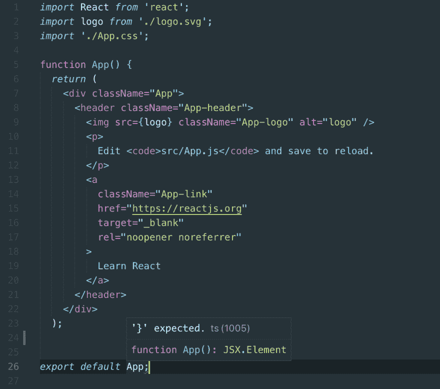
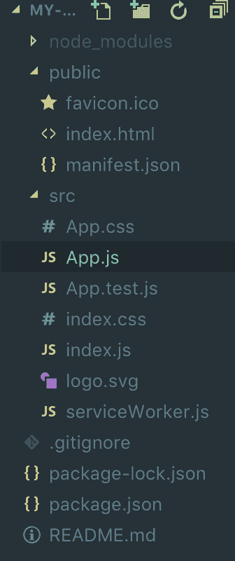
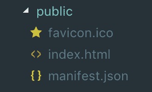
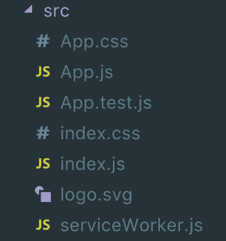

# 了解 React 构建工作流和文件夹结构

> 原文：<https://dev.to/amirmoh10/understanding-the-react-build-workflow-and-the-folder-structure-3hlc>

[](https://res.cloudinary.com/practicaldev/image/fetch/s--Oyzh4DcL--/c_limit%2Cf_auto%2Cfl_progressive%2Cq_auto%2Cw_880/https://thepracticaldev.s3.amazonaws.com/i/ooyeue7qxx1kyi0zpsnh.jpeg) 
React 是一个开源的 JavaScript 库，用于形成用户界面。在本文中，我们倾向于讨论在本地机器上构建 React 应用程序需要什么，并理解 create react app 工具附带的所有文件夹和文件。
在我们的机器上构建一个 React 项目需要一个复杂的工作流程，无论是单页面还是多页面应用程序。所以应该问的一个重要问题是:

# 为什么要有这个工作流程，如何构成？

让我们首先解决问题的*为什么*部分:

*   我们必须优化我们的代码。对于 React 应用程序，我们必须能够生成优化的小代码，以提高应用程序的性能。
*   另一个重要原因是能够从使用下一代 JavaScript 特性中获益。JavaScript 在不断发展，这种语言不时会有新的特性，但并不是所有浏览器都能立即支持。有了 babel 这样的工具，我们可以立即使用这些功能，因为它负责将我们的代码翻译成我们的目标浏览器所支持的代码。
*   第三个原因与生产率有关。下一代 JavaScript 特性中的 CSS 自动前缀允许我们达到浏览器对 CSS 特性的最大支持。如果我们试图手动添加它们，这将是一个真正的麻烦。
*   生产力的另一个方面是提供工具**棉绒**。在我们的代码 IDE 中获取一个 linter 将会节省我们在代码执行前发现错误的时间。下面的代码说明了 linter 是如何工作的。

以上是我们需要工作流的主要原因。
现在让我们看看*如何实现它:*

 **   首先是要有一个**依赖管理工具**。依赖项是第三方库。React，React DOM 和我们最终会用到的每一个内置工具都是依赖关系。NPM(节点的软件包管理器)是一个推荐使用的内置工具，因为它管理软件包和依赖项。
*   除了依赖管理工具之外，一个**捆绑器**被用来产生模块化代码。所谓模块化，我们的意思是代码将被分成多个文件，每个文件都有自己的功能和特点。

Webpack 是一个捆绑器的例子，它在最终将分割的文件发送到浏览器时具有很大的优势，因为这些 web 浏览器中的一些可能不支持分割的文件，如果它们支持，我们不能将所有请求发送到这些特定的文件。

*   最后，我们需要一个**服务器**在我们的本地机器上测试我们的项目。这看起来真的很复杂。幸运的是，React 团队想出了一个工具，可以创建一个支持我们上面提到的所有内容的应用程序，而无需我们进行配置。它由脸书及其社区维护。工具是**创建 React app** 。你可以在这里找到安装说明。>只是一个重要的通知，安装后离开 NPM 开始流程运行。因此，无论何时我们在代码中做了什么改变，它都会自动反映这些改变。建立项目后，我们将拥有相同数量的文件夹和文件。#现在让我们讨论最重要的文件夹和文件。从 **package.json** 文件开始，该文件包含我们项目的一般依赖项。

```
{
  "name": "my-app",
  "version": "0.1.0",
  "private": true,
  "dependencies": {
    "react": "^16.8.6",
    "react-dom": "^16.8.6",
    "react-scripts": "3.0.1"
  },
  "scripts": {
    "start": "react-scripts start",
    "build": "react-scripts build",
    "test": "react-scripts test",
    "eject": "react-scripts eject"
  },
  "eslintConfig": {
    "extends": "react-app"
  },
  "browserslist": {
    "production": [
      ">0.2%",
      "not dead",
      "not op_mini all"
    ],
    "development": [
      "last 1 chrome version",
      "last 1 firefox version",
      "last 1 safari version"
    ]
  }
} 
```

Enter fullscreen mode Exit fullscreen mode

正如你注意到的，我们在这个项目中有三个依赖项，由 create React app 创建。
你也可以看到我们明显地导入了 React。这里我们使用的是:
我写这篇文章时 React 的最新版本。
ReactDOM:提供特定于 DOM 的方法。我们将只使用 index.js 中模块的“render”方法在 DOM 中呈现我们的应用程序。

*   我写这篇文章时 React 的最新版本。
*   ReactDOM:提供特定于 DOM 的方法。我们将只使用 index.js 中模块的“render”方法在 DOM 中呈现我们的应用程序。React Scripts:一个包含脚本和配置的包，用于提供我们提到的关于构建工作流的所有内容，包括开发服务器和我们在项目中使用的下一代 javaScript 特性支持。

**node_modules** 文件夹:
[](https://res.cloudinary.com/practicaldev/image/fetch/s--OERGCYi4--/c_limit%2Cf_auto%2Cfl_progressive%2Cq_auto%2Cw_880/https://thepracticaldev.s3.amazonaws.com/i/y2xolzwzghrhz8y59kxh.png) 
里面有我们项目所有的依赖项和子依赖项。在 **package.json** 文件中，我们只讨论了三个依赖项，包括 React、React DOM 和 React 脚本。更具体地说，React 脚本有许多其他依赖项，由编译代码的所有构建工具组成，等等。您不应该修改 node_modules 文件夹中的任何内容。
**公共文件夹** :
[](https://res.cloudinary.com/practicaldev/image/fetch/s--EgfmLugL--/c_limit%2Cf_auto%2Cfl_progressive%2Cq_auto%2Cw_880/https://thepracticaldev.s3.amazonaws.com/i/wxft3z1h9wkm4ejpxcd6.png) 
一个有趣的是，最终由 web 服务器处理的是根文件夹。在这个文件夹中，我们有一个重要的文件，那就是 index.html 的文件。这个文件有一个普通的 html 页面，它是我们项目中的一个 html 页面。

```
<!DOCTYPE html>
<html lang="en">
  <head>
    <meta charset="utf-8" />
    <link rel="shortcut icon" href="%PUBLIC_URL%/favicon.ico" />
    <meta name="viewport" content="width=device-width, initial-scale=1" />
    <meta name="theme-color" content="#000000" />
    <!--
      manifest.json provides metadata used when your web app is installed on a
      user's mobile device or desktop. See https://developers.google.com/web/fundamentals/web-app-manifest/
    -->
    <link rel="manifest" href="%PUBLIC_URL%/manifest.json" />
    <!--
      Notice the use of %PUBLIC_URL% in the tags above.
      It will be replaced with the URL of the `public` folder during the build.
      Only files inside the `public` folder can be referenced from the HTML.
Unlike "/favicon.ico" or "favicon.ico", "%PUBLIC_URL%/favicon.ico" will
      work correctly both with client-side routing and a non-root public URL.
      Learn how to configure a non-root public URL by running `npm run build`.
    -->
    React App
  </head>
  <body>
    <noscript>You need to enable JavaScript to run this app.</noscript>
    <div id="root"></div>
    <!--
      This HTML file is a template.
      If you open it directly in the browser, you will see an empty page.
You can add webfonts, meta tags, or analytics to this file.
      The build step will place the bundled scripts into the <body> tag.
To begin the development, run `npm start` or `yarn start`.
      To create a production bundle, use `npm run build` or `yarn build`.
    -->
  </body>
</html> 
```

Enter fullscreen mode Exit fullscreen mode

所以这是一个单独的页面，最终我们的脚本文件将被构建工作流注入其中。我们可以修改这个文件，但是我们不会在这里添加任何 HTML 代码。
我想在这里用 ID root 突出显示这个 div:
`<div id="root"></div>`
它很重要，因为我们稍后将在这里放置 React 应用程序。
在 HTML 文件中，你可以导入库，如 CSS 库，并添加元标签。
获取 **manifest.json** 文件:

```
{
  "short_name": "React App",
  "name": "Create React App Sample",
  "icons": [
    {
      "src": "favicon.ico",
      "sizes": "64x64 32x32 24x24 16x16",
      "type": "image/x-icon"
    }
  ],
  "start_url": ".",
  "display": "standalone",
  "theme_color": "#000000",
  "background_color": "#ffffff"
} 
```

Enter fullscreen mode Exit fullscreen mode

该信息为浏览器提供了有关您的应用程序的信息。例如，这对于移动浏览器是必需的，以便您可以向 web 应用程序添加快捷方式。
另一个有趣的文件夹是 **src 文件夹** :
[](https://res.cloudinary.com/practicaldev/image/fetch/s--Pc1t22zo--/c_limit%2Cf_auto%2Cfl_progressive%2Cq_auto%2Cw_880/https://thepracticaldev.s3.amazonaws.com/i/gaxa4ihjfv5kwelqg0x3.png) 
它拥有我们将要在其中工作的实际 react 应用程序的文件。
它有 **index.js** 文件:

```
import React from 'react';
import ReactDOM from 'react-dom';
import './index.css';
import App from './App';
import * as serviceWorker from './serviceWorker';
ReactDOM.render(<App />, document.getElementById('root'));
// If you want your app to work offline and load faster, you can change
// unregister() to register() below. Note this comes with some pitfalls.
// Learn more about service workers: https://bit.ly/CRA-PWA
serviceWorker.unregister(); 
```

Enter fullscreen mode Exit fullscreen mode

这个文件访问我们的 DOM 中的根元素，HTML 文件中 id 为 root 的元素。

`ReactDOM.render(<App />, document.getElementById('root'));`
正如你注意到的，它用 render 方法呈现了我们的 React 应用程序。还有一个我们从应用程序文件导入的应用程序对象的引用。
`import App from './App';`
的延伸。js (App.js)被省略，因为它是由我们的构建工作流自动处理的。
让我们看看我们的 App.js 文件:

```
import React from "react";
import logo from "./logo.svg";
import "./App.css";
function App() {
  return (
    <div className="App">
      <header className="App-header">
        
        <p>
          Edit <code>src/App.js</code> and save to reload.
        </p>
        <a
          className="App-link"
          href="https://reactjs.org"
          target="_blank"
          rel="noopener noreferrer"
        >
          Learn React
        </a>
      </header>
    </div>
  );
}
export default App; 
```

Enter fullscreen mode Exit fullscreen mode

在这里，我们可以看到我们的第一个也是唯一的 React 组件，我们在开始的项目。
另一个要提到的文件是 **App.css** :

```
.App {
  text-align: center;
}
.App-logo {
  animation: App-logo-spin infinite 20s linear;
  height: 40vmin;
  pointer-events: none;
}
.App-header {
  background-color: #282c34;
  min-height: 100vh;
  display: flex;
  flex-direction: column;
  align-items: center;
  justify-content: center;
  font-size: calc(10px + 2vmin);
  color: white;
}
.App-link {
  color: #61dafb;
}
@keyframes App-logo-spin {
  from {
    transform: rotate(0deg);
  }
  to {
    transform: rotate(360deg);
  }
} 
```

Enter fullscreen mode Exit fullscreen mode

这个文件决定了我们在 App.js 中使用的一些样式。然而，CSS 样式不仅仅与 App.js 文件相关，它是全局样式。
我们还有一个 **index.css 文件** :

```
body {
  margin: 0;
  font-family: -apple-system, BlinkMacSystemFont, "Segoe UI", "Roboto", "Oxygen",
    "Ubuntu", "Cantarell", "Fira Sans", "Droid Sans", "Helvetica Neue",
    sans-serif;
  -webkit-font-smoothing: antialiased;
  -moz-osx-font-smoothing: grayscale;
}
code {
  font-family: source-code-pro, Menlo, Monaco, Consolas, "Courier New",
    monospace;
} 
```

Enter fullscreen mode Exit fullscreen mode

这个文件实现了全局样式和应该用于一些常规设置的所有东西，正如我们在这里看到的应用程序的主体。
**registerserviceworker . js**文件是注册服务人员的必备文件。它预先兑现我们的脚本文件，没有义务在那里配置任何东西。如果你不知道或者不关心服务人员，你也可以安全地删除这个文件。
最后是 **App.test.js** 文件:

```
import React from 'react';
import logo from './logo.svg';
import './App.css';
function App() {
  return (
    <div className="App">
      <header className="App-header">
        
        <p>
          Edit <code>src/App.js</code> and save to reload.
        </p>
        <a
          className="App-link"
          href="https://reactjs.org"
          target="_blank"
          rel="noopener noreferrer"
        >
          Learn React
        </a>
      </header>
    </div>
  );
}
export default App; 
```

Enter fullscreen mode Exit fullscreen mode

本质上，它允许我们为应用程序中的不同组件创建单元测试。

总之，任何程序员都希望以一种高效的方式编码，在这种方式下，他可以避免人工干预，为编码创造一个便利的环境。在构建大型 React 项目时，拥有一个构建工作流非常重要。你能想象在能够在 React 中做任何事情之前必须学习这些工具中的每一个吗？幸运的是，create react app 工具让这变得更加容易。

这篇文章有没有帮助你揭开 create-react-app 附带的文件和文件夹的神秘面纱？请在评论区告诉我。

React 编码快乐！*