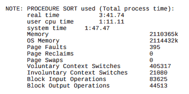

# 了解 SAS 日志:时间和开关

> 原文：<https://dev.to/benjcorc/understanding-the-sas-log-time-and-switches-26lc>

如果您以前使用过 SAS，您会看到 SAS 日志。这是一只野兽，一只笨拙且有时毫无用处的野兽。但是我们可以驯服它。嗯，也许不是，但我们可以用棍子打足够长的时间，它会在游客面前变得温顺。让我们以驯象人和虎鲸“训练者”的伟大作品为灵感。我们正在进入 SAS 日志的世界。

#### 实时 vs CPU 时间

您以前运行过 SAS 代码，也有过这样的日志行。[我们在](https://benjamincorcoran.com/sas-eg-program-timer/)之前已经看过这个日志了。

呃，花了三分钟？还是花了 1 分钟？什么为什么有两次，我不..什么？如果你和我一样，那么这伴随着一种夸张的预先形成的精神崩溃。接着你的老板把你带到一边，确保家里一切都好。但是我们已经进行了 5 分钟的业余表演，让我们深入了解这两个时间的实际意义。

#### 实时时间

先从简单的开始，先从实时开始。这是对自作业开始以来实际所用时间的测量。启动秒表并点击 run，你在执行结束时得到的时间就是实际时间。

实时性严重依赖于系统的资源和负载。如果有一个巨大的作业队列，您可以预期实时时间会大大延长。如果系统的负载很低，我们的实时性完全依赖于我们糟糕的优化。

#### 用户 CPU 时间

用户 CPU 时间是一个稍微不同的度量。它是对作业利用 CPU 所花费的“时间”的度量。更明确地说，有多少作业发生在 CPU 中。在上面的例子中，几乎实时的⅓是在 CPU 内部度过的。其余时间用于读/写操作和系统进程。

在只有一个 CPU 的系统上，用户 CPU 时间总是比实际时间短。然而，如果一台机器有多个处理器，那么用户 CPU 时间很可能比实际时间长。哇哦哇哦哇哦，在全速前进的冲动超过彼得·芬奇之前，让我们看看这个。

CPU 时间是作业在每个 CPU 中利用的时间总量。假设您有一台带有四个处理器的机器。你已经彻底粉碎了你的钻机/SAS 设置，这东西咕噜咕噜像一只猫，当谈到有效的处理。您运行一个需要两秒钟实际时间的作业。您的设置将计算负载分布在四个处理器上。如果每个处理器在这个任务上花费一秒钟，那么您的总用户 CPU 时间是四秒钟。比你的真实时间多两秒。

现在我们明白了这两个时间统计的区别。我们现在是 SAS 日志的专家，所以让我们更进一步。

#### FULLSTIMER，或者为书呆子统计为书呆子。

在前面的例子中，我们得到了两个概括 proc 排序性能的统计数据，实时和用户 CPU 时间。然而，有一个选项可以被调用来给我们提供更多关于我们的编程效率有多低的信息，FULLSTIMER。

嗬嗬，看看我们已经投入的所有这些新数据…耶稣基督，这是第三次测量吗？！/)_-).好吧，我们最好弄清楚这些是用来测量什么的。

#### 系统时间

我们知道用户 CPU 时间是处理器执行我们的任务所花费的时间。系统时间代表处理器执行支持我们工作的操作系统任务所花费的时间。更简单地说，系统时间就是管理您的请求所花费的时间。例如，如果您的作业正在等待来自慢速磁盘的输入/输出，那么您的作业可能会不由自主地被换出 CPU，直到 I/O 资源变得可用。在多处理器系统中，这还会记录拆分和合并各种并行线程所花费的时间。这些系统作业会占用系统时间

#### 内存和 OS 内存

内存相当简单，即处理作业所使用的内存量。这不包括用于作业开销的内存，例如运行 SAS manager。

操作系统内存是为完成作业而释放的内存量。换句话说，就是操作系统分配给作业的最大内存量。

#### 分页

好了，让我们来看看分页。我们以前都见过，这里的页面错误，那里的页面错误。在你意识到什么都没发生之前，你会感到恐惧。我还能打开 excel，一切肯定没问题，我显然不需要担心分页。

页面本质上是磁盘上的内存。为了节省主存储器的空间，操作系统可以将信息存储在磁盘上，直到操作系统需要它。当我们需要这些数据时，它们会从磁盘复制到内存中，供操作系统使用。有整本书专门介绍分页，它是如何工作的以及如何实现的，所以我们不在这里深入讨论。简单地说，我们在作弊，把一些应该放在内存中的东西存储到磁盘上。这意味着系统可以更有效地进行多任务处理。我们之所以能做到这一点，是因为并非所有东西都需要同时存在于内存中。

#### 页面错误

页面错误是我们被抓住的地方。我们假装它在内存中，但实际上在磁盘上，他们现在就想要它。这意味着操作系统必须对磁盘进行 I/O 读取，以便加载这些数据。如果有大量的页面错误，很可能你的系统没有得到很好的优化。页面错误需要昂贵的 I/O 读取，而不是快速进出系统内存。

#### 页面回收

我们需要的一些数据在我们需要的时候可能已经在内存的不同区域了。页面回收是完全在内存中处理的页面错误(无 I/O 操作)。数据已经被加载到内存中，被使用，然后被标记为可重写。但重要的是还没有被覆盖。这样我们就可以在任何人注意到之前获取数据。

#### 页面互换

页面交换统计数据表示我们的作业被交换出主内存的次数。也就是说，我们作业的指令已经写入磁盘，因此另一个进程可以使用我们的内存槽。

#### 上下文切换

你知道书呆子是真正的书呆子。好了，你已经有了一个惊人的多任务处理系统。我们可以将当前正在处理的任何作业踢出，并在稍后的时间继续处理。这就叫抢占。在这个系统中，我们为每项工作分配离散的时间块。现在你有了这个，你打算怎么命名你分配的 CPU 时间块呢？哦…时间片？实际上时间片…好吧(书呆子。)

上下文切换是指我们的多任务系统从一个任务切换到另一个任务。语境转换有两种，一种是自愿的，另一种是非自愿的。

#### 自愿上下文切换

当作业在处理过程中因为忙于等待其他信息而交还 CPU 时，就会出现这种情况。这通常采用 I/O 读取的形式。主动上下文切换很好，这意味着当作业必须等待缓慢的 I/O 读取时，它会与其他作业共享 CPU 资源。太多的错误可能表明您的 I/O 正在阻碍系统的处理速度。

#### 不自觉的上下文切换

这些发生在我们的工作不受欢迎的时候。如果作业在它的*叹息*时间片结束时还没有完成，那么该作业被踢出，以便在以后的某个时间点继续。如果有更高优先级的作业请求 CPU 时间，也会发生这种情况。

#### 块操作

块操作是指读取或写入的次数，即缓冲区的大小。缓冲区大小或 *bufsize* 是一个[数据集选项](http://support.sas.com/documentation/cdl/en/lrdict/64316/HTML/default/viewer.htm#a000131102.htm)，它定义了在单个 I/O 操作中可以传输的数据量。默认情况下，该值被设置为在您的系统上针对顺序读取进行优化。通过增加该值，您可能会看到随机直接读取的性能有所提高，但这会导致额外的内存开销。

#### 输入/输出块操作

现在我们已经定义了什么是块操作，很容易看出输入块操作是一个 *bufsize* I/O 读操作，输出块操作是一个 *bufsize* I/O 写操作。并非所有这些都是磁盘操作，因为一些读取操作是对已经存储在内存中的数据的读取，就像我们在讨论页面回收时看到的那样。

#### 那又怎样？

好吧，嘿，至少我们现在知道所有这些东西都是什么了。我们已经更好地理解了我们的 SAS 日志。我们知道书呆子不擅长给事物命名。我们也对我们的系统在各种工作中的表现有了更好的理解。

上述任何统计数据的高值都可能表明优化效果不佳。无论是代码、软件还是子系统。现在您对日志记录有了更好的理解。你也许能够精确地缩小你的工作瓶颈的范围。或者，如果你的朋友对这类知识印象深刻，你可以炫耀一下。如果是的话，你需要更好的朋友。

*最初发表于* [*本杰明·科克兰*](https://benjamincorcoran.com/understanding-the-sas-log/) *。*