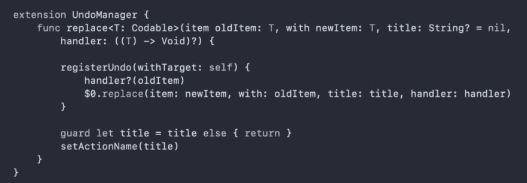
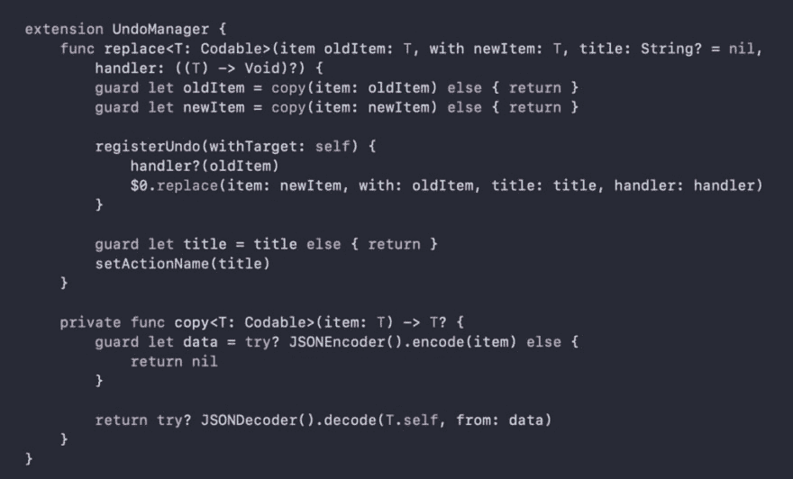

# 对 iOS 应用程序的撤销和重做支持

> 原文：<https://dev.to/raulriera/undo-and-redo-support-to-ios-apps-keg>

### 给 iOS 增加撤销和重做支持

#### 人都会犯错。让我们使用允许撤销。

你不小心摇了摇你的手机，注意到一个小小的提示屏幕，上面写着“撤销某事”。在这个故事中，我们将在 iOS 应用程序中实现撤销和重做操作。

到现在为止，你已经在使用声明式和函数式的方法制作所有的屏幕了，对吗？😉如果没有，[你可以阅读关于它的全部内容](https://medium.com/@raulriera/building-apps-with-functionaltabledata-c99bfaa7e2e5)。扩展这种方法，如果我们所有的视图控制器状态都像那篇文章中演示的那样被封装，我们可以很容易地在我们的应用程序中实现撤销操作。

#### 看文档

当我看着[撤销管理器](https://developer.apple.com/documentation/foundation/undomanager)时，似乎我要处理选择器、旧的 Objective-C API 以及隐藏在下面的任何东西。我试图通过创建一个带有语法糖的包装器结构来解决这个问题。

```
struct Undoer {
  let undoManager: UndoManager
  ...
} 
```

谢天谢地，杰弗里·福斯特说服了我，我最终选择了一个更好的方法。通过简单地扩展 UndoManager 来包含多一个函数。现在，拿走之前包装纸里的所有东西，我只剩下这个了。

<figure>[](https://res.cloudinary.com/practicaldev/image/fetch/s---VvIyb9Y--/c_limit%2Cf_auto%2Cfl_progressive%2Cq_auto%2Cw_880/https://cdn-images-1.medium.com/max/1024/1%2AT5LLjgfZ4nroHj1qT07lTw.png) 

<figcaption>挺简单的吧？</figcaption>

</figure>

很简单，对吧？老实说，编写这个短函数的最大问题在于，您希望在 registerUndo 闭包内捕获变量，同时让它调用自身。

#### 探索代码

UndoManager 就是这样工作的。它在闭包中保留了数据的副本，因此您可以通过调用 undoManager.undo()或 redo()来恢复任何更改。这样做，执行我们的处理程序回调，并再次递归调用自身，但这一次的值是相反的。创建我们想要的撤销和重做动作的循环。

#### 修复 bug🙃

现在你可能已经发现了一个问题。如果我们使用引用类型，我们将不会维护以前的数据。谢天谢地，这就是为什么我们在泛型类型 t 中有可编码的约束。

通过利用 Codable，我们可以实现一个快速和脏版本的 copy 来序列化和反序列化数据的内容，这样我们就可以维护状态。

<figure>[](https://res.cloudinary.com/practicaldev/image/fetch/s--1_jaO8Sj--/c_limit%2Cf_auto%2Cfl_progressive%2Cq_auto%2Cw_880/https://cdn-images-1.medium.com/max/1024/1%2A_HfcaJ7OXOrsrWDbRa2iEA.png) 

<figcaption>别@我🙈</figcaption>

</figure>

这还差不多，现在我们的 UndoManager 可以存储和恢复任何类或结构的状态，我们甚至都不用费一点力气来写这个。

您可以在下面的链接中找到这个函数的源代码，以及一个视图控制器的快速实现。

[Raul riera/技术文章](https://github.com/raulriera/technical-articles/tree/master/Adding-Undo-and-Redo%20support-to-iOS)

我错过什么了吗？在推特上取得联系: [@raulriera](https://twitter.com/raulriera)