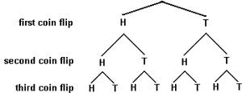
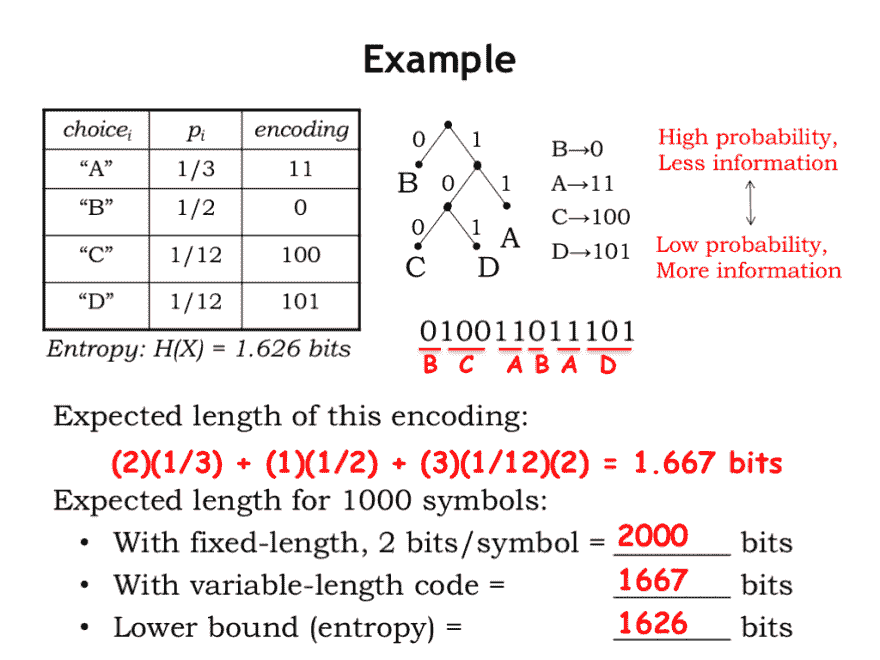
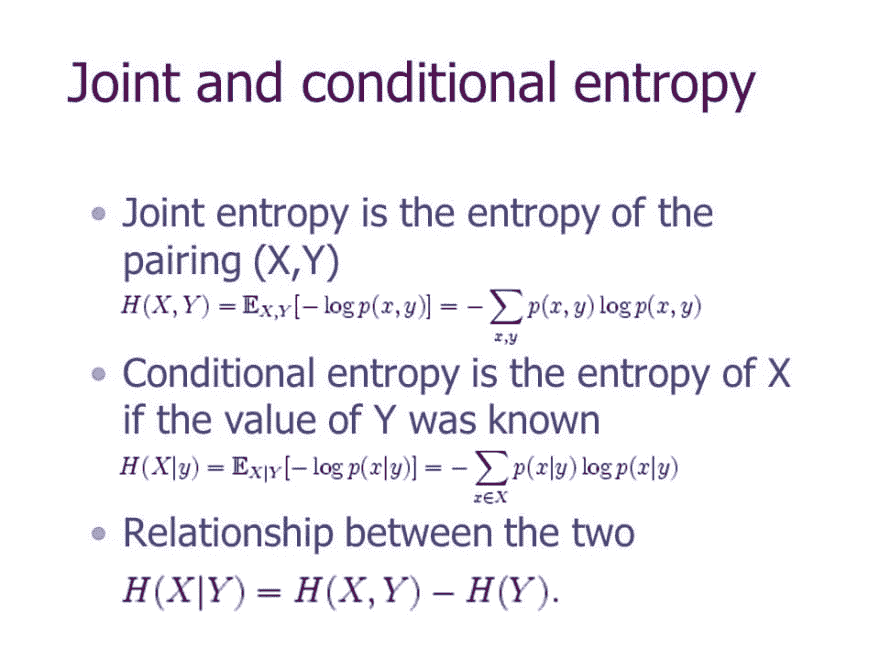

# 无监督学习:信息论概述

> 原文：<https://dev.to/swyx/unsupervised-learning-information-theory-recap-4iem>

*这是我学习[佐治亚理工学院/优达城机器学习课程](https://www.udacity.com/course/machine-learning--ud262)的一系列课堂笔记中的第十三篇。课堂教材是汤姆·米切尔的[机器学习。](https://www.cs.ubbcluj.ro/~gabis/ml/ml-books/McGrawHill%20-%20Machine%20Learning%20-Tom%20Mitchell.pdf)*

> ⚠️This 是一个更理论化的章节，如果没有直接的兴趣可以随意跳过。

## 中心问题

在机器学习问题中，我们希望能够提出类似“X1 或 X2 如何与 Y 相关”或“X1 和 X2 相关吗”(互信息)的问题。一般来说，这些机器学习问题可以建模为概率密度函数。所以信息论是一个数学框架，它允许我们比较这些密度函数。

## 信息论历史

克劳德·香农。情况就是这样😅

## 熵与信息的测量

我们用编码信息所需的最少位数来衡量信息。抛 10 次硬币= 10 点。

[](https://res.cloudinary.com/practicaldev/image/fetch/s--dt3HWue7--/c_limit%2Cf_auto%2Cfl_progressive%2Cq_auto%2Cw_880/http://lisathorne.files.wordpress.com/2009/10/tree-diagram.png%3Fw%3D300%26h%3D115)

查看信息量的另一种方式是，为了确定信息是什么，你必须问的粒度问题的数量。每个符号的位数也称为“熵”。

## 可变长度编码

*[百科阅读](https://en.wikipedia.org/wiki/Variable-length_code)*

然而，编码不必严格基于均匀分布甚至是树——我们可以基于更频繁的信息比特的概率来改变我们的编码，以节省每条消息的平均比特数。

[](https://res.cloudinary.com/practicaldev/image/fetch/s--sCdVjfwu--/c_limit%2Cf_auto%2Cfl_progressive%2Cq_auto%2Cw_880/http://computationstructures.org/lectures/info/slides/Slide18.png)

## 联合和条件熵

一些变量与其他变量有协方差。比如下雨的概率(X)和打雷的概率(Y)。这也可以表示为联合熵对条件熵:

[](https://res.cloudinary.com/practicaldev/image/fetch/s--s00uOQW2--/c_limit%2Cf_auto%2Cfl_progressive%2Cq_auto%2Cw_880/https://slideplayer.com/slide/6013317/img/18/Joint%2Band%2Bconditional%2Bentropy.jpg)

如果 X 和 Y 是独立的，那么条件熵就和个体熵一样，联合熵就是个体熵之和。

## 互信息

尽管联合熵和条件熵给了我们一些关于独立性的见解，但它们不是独立性的直接度量。例如，如果`H(Y|X)`很小，我们不知道这是因为`X`给出了很多关于`Y`的信息，还是因为`H(Y)`一开始就很小。

一个更好的衡量标准对此进行了规范化:

```
I(X,Y) = H(Y) - H(X|Y) 
```

我们称之为**相互信息。**

参见[关于互信息公式](http://www.robotvisions.org/4641/downloads/InfoTheory.fm.pdf)推导的进一步注释。

## 举例

给定这个方程组，你可以验证，对于两个独立的硬币:

*   个体熵是 1
*   条件熵是 1
*   联合熵是 2(可加的)
*   互信息为 0(无共享信息)

[https://www.youtube.com/embed/LQJ4PQBhDd4](https://www.youtube.com/embed/LQJ4PQBhDd4)

很直观。[对于完全依赖的情况](https://www.youtube.com/watch?v=P5GpR-9XVWQ)反之亦然。

## 库尔巴克-莱布勒(KL)散度

互信息只是 KL 散度的一个特例——它是任意两个分布之间的距离或散度的度量。

[](https://res.cloudinary.com/practicaldev/image/fetch/s--hUg_R0AR--/c_limit%2Cf_auto%2Cfl_progressive%2Cq_auto%2Cw_880/https://wikimedia.org/api/rest_v1/media/math/render/svg/726edcd02293461b82768ea2fd299c3a3ef16112)

注意，它总是非负的，并且只有当所有 x 的`p = q`都等于零时才等于零。

在机器学习中，我们可以使用 KL 散度作为数据集最小二乘拟合的替代方法。(将在后面的章节中解释)

## 我们系列的下一个

关于此主题的更多说明:

*   麦克斯韦妖(Maxwell ' s demon)——一个早期的思想实验，试图与热力学第二定律相矛盾，从而逆转熵。
*   [关于 KL 散度的维基百科](https://en.wikipedia.org/wiki/Kullback%E2%80%93Leibler_divergence)
*   [信息论和熵的介绍](https://github.com/pushkar/4641/raw/master/downloads/gentle_intro_to_information_theory.pdf) - [这里有更清晰的 8 页摘要](https://github.com/pushkar/4641/raw/master/downloads/InfoTheory.fm.pdf)

希望这是对信息论的一个很好的介绍。我正在计划更多的初级读本，希望您能就以下方面提供反馈和问题:

*   [概述](https://dev.to/swyx/machine-learning-an-overview-216n)
*   监督学习
    *   [决策树](https://dev.to/swyx/machine-learning-classification-learning--decision-trees-1mbh)
    *   [回归](https://dev.to/swyx/supervised-learning-regression-4d17)
    *   [神经网络](https://dev.to/swyx/supervised-learning-neural-networks-mpo)
    *   [基于实例的学习(K 最近邻)](https://dev.to/swyx/supervised-learning-instance-based-learning-and-k-nearest-neighbors-kge)
    *   [集成学习(AdaBoost)](https://dev.to/swyx/supervised-learning-ensemble-learning-lim)
    *   [内核方法&支持向量机](https://dev.to/swyx/supervised-learning-support-vector-machines-3mgk)
    *   [计算学习理论](https://dev.to/swyx/supervised-learning-computational-learning-theory-160h)
    *   [VC 尺寸](https://dev.to/swyx/supervised-learning-vc-dimensions-10b)
    *   [贝叶斯学习](https://dev.to/swyx/supervised-learning-bayesian-learning-403l)
    *   [贝叶斯推理](https://dev.to/swyx/supervised-learning-bayesian-inference-4l72)
*   无监督学习
    *   [随机优化](https://dev.to/swyx/unsupervised-learning-randomized-optimization-4c1i)
    *   [信息论](https://dev.to/swyx/unsupervised-learning-information-theory-recap-4iem)
    *   [聚类](https://dev.to/swyx/unsupervised-learning-clustering-42mi)
    *   功能选择-3 月 4 日开始的一周
    *   功能转变-3 月 11 日开始的一周
*   强化学习
    *   马尔可夫决策过程-3 月 25 日的一周
    *   “真实”RL-4 月 1 日开始的一周
    *   博弈论-4 月 15 日的一周