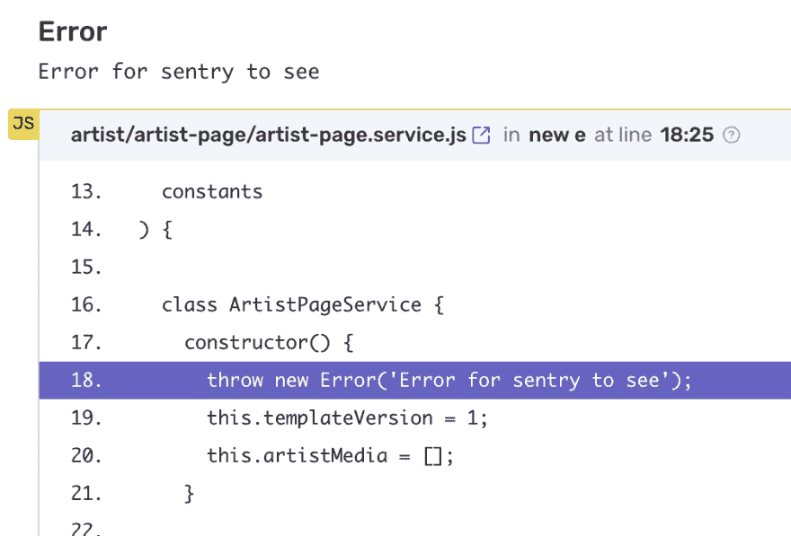

# 用 Gulp 上传源图给哨兵:解决了！

> 原文：<https://dev.to/amberwilkie/uploading-source-maps-to-sentry-with-gulp-solved-3jha>

我了解到任何新开发人员想要做的第一件事就是颠覆所有的工具。当我们在我以前的公司里找到一个想要做这件事的人时，我非常沮丧。现在开始了新工作，抱怨工装的是我(也觉得自己很卑微)。

所以我在这里，试图进入这个小公司的代码库。我已经登录了错误跟踪服务 [Sentry](https://www.sentry.io) ，准备挑选一些错误并开始修复。不幸的是，这是我所看到的:

<figure>[](https://res.cloudinary.com/practicaldev/image/fetch/s--Fydy7yuv--/c_limit%2Cf_auto%2Cfl_progressive%2Cq_auto%2Cw_880/https://cdn-images-1.medium.com/max/1024/1%2AWLSMMS6qKvlkSKA1wX5l4w.png) 

<figcaption>代码中无用的缩小引用错误</figcaption>

</figure>

对精简代码的引用。这让我陷入了 sourcemappery 的一个看似不必要的复杂的兔子洞。亲爱的读者，遵循下面的建议，希望你能避免这种痛苦。

### 什么是源图？

sourcemap 是一个指南，用于将缩小版的 Javascript 代码翻译成我们使用的人类可读代码。因为我们编写了大量的 Javascript，并随意地将其发送到各地的浏览器，所以我们缩小了它，以弥补那些容易被丢弃的字节。我们最终得到了上面截图中的代码。

通常，我们会将 Javascript 打包到我们的文件中，将其全部转储到一个文件中，然后将其缩小以发送到浏览器。这样一个函数:

```
const myFunction = (paramOne, paramTwo, paramThree) => {
  console.log(paramOne);
  return paramTwo + paramThree
} 
```

缩小为:

```
const myFunction=(o,n,c)=>(console.log(o),n+c); 
```

对浏览器来说很棒，但对那些需要弄清楚我的函数到底在做什么的人来说就不那么棒了。

### 不上传源图到生产(我猜)

弄清楚你的代码是如何做它正在做的事情越容易，坏人就越容易找到一种方法来锻炼他们的坏习惯。源码图本质上是你代码的指南，所以[把它们上传到产品中会有安全风险](https://security.stackexchange.com/questions/113480/should-javascript-and-css-map-source-maps-be-included-on-production-servers)。也就是说，互联网似乎对此有两种看法。如果你愿意把它们发送到这个世界，我向你保证这是在 Sentry 上获得正确堆栈跟踪的更简单的方法。

Sentry 允许你直接上传源地图，绕过在线上传的任何安全问题。但是他们对你如何上传这些文件非常挑剔，除非完全正确，否则不会产生你真正想在他们的错误日志中看到的代码。

### 起点

当我走进这个项目时，我们已经在使用 [gulp-sourcemaps](https://www.npmjs.com/package/gulp-sourcemaps) 生成源地图，并使用 [gulp-sentry-release](https://www.npmjs.com/package/gulp-sentry-release) 将它们发送给 sentry，这是一个三年没有更新的 npm 包(！).下面是我们的 gulp 脚本任务的超级精简版本:

```
gulp.src('./scripts/\*\*/\*.js')
  .pipe(plugins.sourcemaps.init())
  .pipe(plugins.concat('./scripts.js'))
  .pipe(plugins.uglify)
  .pipe(plugins.sourcemaps.write('.'))
  .pipe(gulp.dest('./dist')) 
```

和哨兵部署:

```
const sentryRelease = plugins.sentryRelease({
  API\_URL: 'https://app.getsentry.com/api/0/projects/our-team',
  API\_KEY: process.env.SENTRY\_API\_KEY,
});

const version = // some git thing that wasn't working

gulp.src('\*\*/\*.js.map')
  .pipe(sentryRelease.release(`${process.env.APP_ENV}-${version}`)); 
```

### 问题一:版本控制

我必须解决的第一件事是版本控制。Sentry 希望您提供有关发布的信息。如果一个用户正在你的网站上查看某个版本，那么你需要告诉 Sentry 你正在处理哪个源地图。我们使用的是 git 版本，当公司在近一年前改用 Docker 时，它就停止工作了。Sentry 一直把我们推向生产的所有东西都看作是筹备或生产。

我通过在我的 package.json 中创建一个版本来解决这个问题，并在我们使用 [gulp-bump](https://www.npmjs.com/package/gulp-bump) 进行生产时递增它。我的大口任务看起来是这样的:

```
if (process.env.APP\_ENV === 'production') {
  gulp.src('./package.json')
    .pipe(plugins.bump({type: 'minor'}))
    .pipe(gulp.dest('./'));
} 
```

我从 package.json 读到了我的哨兵版本:

```
import { version } from '../../../package.json'; 
```

然后我可以使用之前的代码发送给 Sentry:

```
gulp.src('\*\*/\*.js.map')
  .pipe(sentryRelease.release(`${process.env.APP_ENV}-${version}`)); 
```

#### 添加发布到浏览器中的代码

这对于告诉 Sentry 这些源地图属于这个版本来说是很棒的。但是如果用户浏览我的应用程序时出现错误怎么办？浏览器需要能够告诉 Sentry 那个人正在查看哪个版本。在我们的代码中，我们使用哨兵[乌鸦客户端](https://docs.sentry.io/clients/javascript/) :

```
Raven.config('our-api-url-for-sentry', {
**release: 'SENTRY\_VERSION',**
  dataCallback: function(data){
  ... 
```

我们后来使用 [gulp-replace](https://www.npmjs.com/package/gulp-replace) :
从代码中正则表达式删除了 SENTRY_VERSION

```
import { version } from '../../../package.json';

gulp.src('./html/\*\*/\*.html').pipe(plugins
  .replace('SENTRY\_VERSION',(`${process.env.APP_ENV}-${version}`))) 
```

现在，我们的 HTML 中的版本将与我们发送给 Sentry 的版本相匹配。

注意:文件似乎没有在吞咽过程中得到足够早的保存。我希望改用大口 4 就能解决这个问题。如果没有，还有很多工作要做，以找出如何以任何逻辑方式来版本化它。

### 问题二:上传正确的源图

很久以来，我以为我已经有了，但哨兵仍然试图从互联网上抓取源地图。我知道这一点，因为它会抛出一个错误，说找不到它们。事实上，我没有将它们上传到产品中。

虽然 gulp-sentry-release 已经有三年没人碰过了，但是它仍然可以很好地处理 Sentry API，只要你能够传递正确的选项:

```
const sentryRelease = plugins.sentryRelease({
  API\_URL: 'https://app.getsentry.com/api/0/projects/our-team',
  API\_KEY: process.env.SENTRY\_API\_KEY,
  DOMAIN: '~'
}); 
```

你错过零钱了吗？在此过时的包中，域默认为“”。Sentry 已经决定他们想在 sourcemaps 的前面看到一个波浪号。当我添加这一块，突然它都走到了一起。

<figure>[](https://res.cloudinary.com/practicaldev/image/fetch/s--nmYVHIjB--/c_limit%2Cf_auto%2Cfl_progressive%2Cq_auto%2Cw_880/https://cdn-images-1.medium.com/max/1006/1%2AcR6nQovjhMXdjDBcl2_D1w.png) 

<figcaption>终于在哨兵</figcaption>

</figure>

看到可读代码

这很有可能没有解决你的问题，因为 Sentry 有一大堆关于如何解决这个问题的文档。波浪号只是人们在尝试使用它时遇到的许多问题中的一个。如果你还在寻找，祝你好运！如果这对你有帮助，我很想听听。