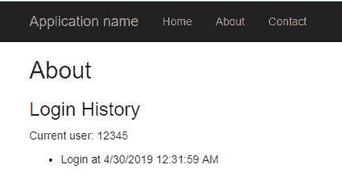
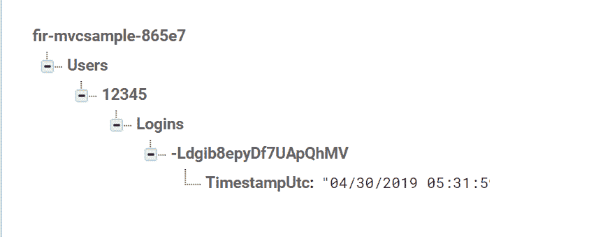
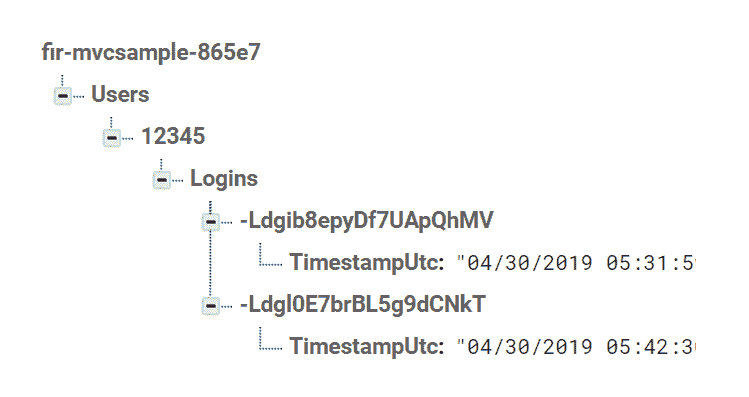
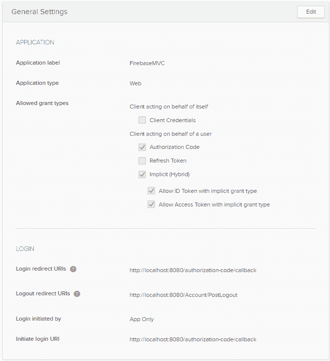
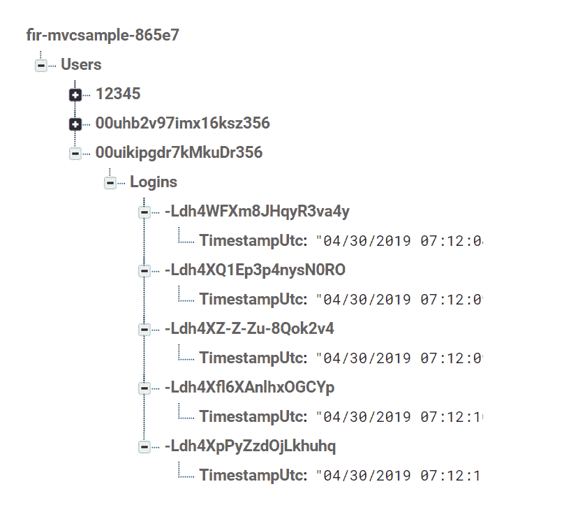

# 在你的 ASP.NET MVC 应用中使用 Firebase

> 原文：<https://dev.to/oktadev/use-firebase-with-your-asp-net-mvc-app-3pgo>

近年来，使用在线托管的数据库变得越来越容易。数据库即服务(DaaS)的出现使得快速集成变得更加容易。将应用程序用户数据与个人身份信息分开是非常重要的，尤其是在当今这个时代。当使用像 [Okta](https://developer.okta.com/) 这样的第三方认证提供商时，像姓名或电子邮件地址这样的用户信息可以由该提供商直接存储在他们的系统中，受益于他们的监督和保护。

对于需要记录登录时间戳、实时消息甚至货币购买的事务密集型应用程序，使用像 Firebase 这样的辅助数据库可以帮助实现这一点，并且设置速度非常快。虽然 Firebase 可以支持很多很多配置，但本教程将介绍一个松散的规则集，并将其基本集成到您的 ASP.NET MVC 应用程序中。

我们开始吧！

## 在 Firebase 中为你的 ASP.NET MVC 应用程序设置一个实时数据库

首先，您将在 Firebase 中创建一个新项目。访问[https://firebase.google.com](https://firebase.google.com)，点击**开始**，用你的谷歌账户登录。选择**添加项目**，将其命名为“FirebaseMVCSample”并同意条款和条件，然后点击**创建项目**。当新项目准备好时，点击**继续**。您将直接进入 Firebase 控制台仪表板。

展开左侧的**开发**菜单，选择**数据库**。向下滚动到实时数据库，点击**创建数据库**。

现在，您将看到这个新数据库的安全规则。在测试模式下选择**开始**，点击**使能**。您将到达实时数据库，初始节点设置为空——因为您还没有添加任何数据！将链接复制到您的 Firebase 数据库。这将使您能够快速开始学习本教程:

[](https://res.cloudinary.com/practicaldev/image/fetch/s--vlic3NR_--/c_limit%2Cf_auto%2Cfl_progressive%2Cq_auto%2Cw_880/https://developer.okta.com/assets-jekyll/blog/firebase-aspnet-mvc/firebase-starting-database-6131db768ddd5966f934a686dfdb1669ad2985d40871b515913d6c7ff647799c.png)

> 谷歌给你一个关于安全规则的警告(这是好事！).出于本教程的目的，对于这种概念验证集成，您可以不限制规则。

## 使用 Firebase 创建您的 ASP.NET MVC 应用程序

打开 Visual Studio 2019，选择**新建项目**。选择【ASP.NET T2】MVC Web 应用。将项目命名为“FirebaseMVCApp”并确保**。选择. NET Framework 4.7.2** 然后点击**创建**。选择 **MVC** ，保留所有默认设置并点击**创建**。

您需要为每个用户创建一个对象来表示在 Firebase 数据库中保存的内容。右键单击 **Models** 文件夹，添加一个名为“LoginData.cs”的新类。在该类中添加以下属性:

```
public string TimestampUtc { get; set; } 
```

现在您需要添加一个库来处理数据库访问。右键单击项目并选择 Manage Nuget Packages。安装以下库:

```
FirebaseDatabase.net 
```

打开 **HomeController** 并在 Usings 部分添加以下引用:

```
using Firebase.Database;
using Firebase.Database.Query;
using System.Linq;
using System.Threading.Tasks; 
```

现在用下面的代码替换 About 函数，并将 FirebaseClient 更改为您唯一的 Firebase 项目 URL。

```
public async Task<ActionResult> About()
{
  //Simulate test user data and login timestamp
  var userId = "12345";
  var currentLoginTime = DateTime.UtcNow.ToString("MM/dd/yyyy HH:mm:ss");

  //Save non identifying data to Firebase
  var currentUserLogin = new LoginData() { TimestampUtc = currentLoginTime };
  var firebaseClient = new FirebaseClient("yourFirebaseProjectUrl");
  var result = await firebaseClient
    .Child("Users/" + userId + "/Logins")
    .PostAsync(currentUserLogin);

  //Retrieve data from Firebase
  var dbLogins = await firebaseClient
    .Child("Users")
    .Child(userId)
    .Child("Logins")
    .OnceAsync<LoginData>();

  var timestampList = new List<DateTime>();

  //Convert JSON data to original datatype
  foreach (var login in dbLogins)
  {
      timestampList.Add(Convert.ToDateTime(login.Object.TimestampUtc).ToLocalTime());
  }

  //Pass data to the view
  ViewBag.CurrentUser = userId;
  ViewBag.Logins = timestampList.OrderByDescending(x => x);
  return View();
} 
```

> 您需要添加一个对项目的 Models 文件夹的 Using 引用来解析上面的代码。

让我们通过更新 MVC 应用程序的 About 视图来测试数据库的读写。展开**视图**文件夹，打开 About.cshtml，用下面的代码替换:

```
@{
    ViewBag.Title = "About";
}
<h2>@ViewBag.Title</h2>

<h3>Login History</h3>
<p>Current user: @ViewBag.CurrentUser</p>
<ul>
    @foreach(var timestamp in ViewBag.Logins)
    {
        <li>Login at @timestamp</li>
    }
</ul> 
```

在浏览器中构建并启动应用程序。确保同时在实时数据库页面上打开 Firebase 控制台的一个选项卡。点击您的**关于**导航链接。启动视图的动作会给页面添加一个时间戳。

[](https://res.cloudinary.com/practicaldev/image/fetch/s--BjLUKrF6--/c_limit%2Cf_auto%2Cfl_progressive%2Cq_auto%2Cw_880/https://developer.okta.com/assets-jekyll/blog/firebase-aspnet-mvc/mvc-launch-about-9bdf13057eebd7630e2466d3281b461114620fe3e6b0e5169c4124c3629836f7.png)

现在，看看您的 Firebase 控制台选项卡。展开节点，查看数据是如何以 JSON 格式保存的。请注意，有一个随机生成的会话节点，时间戳位于其中。它被内置到 FirebaseDatabase 库中用于最终子对象的 **PostAsync** 方法中。

[](https://res.cloudinary.com/practicaldev/image/fetch/s--gsYl3Usp--/c_limit%2Cf_auto%2Cfl_progressive%2Cq_auto%2Cw_880/https://developer.okta.com/assets-jekyll/blog/firebase-aspnet-mvc/firebase-first-node-d43076779fed0dd2ab0546f6a7f88520c70476b01db538a5f2c266f8e9bc3e8a.png)

如果您导航到**主页**页面，然后返回到**关于**页面，您将不仅在视图上，而且在数据库中看到一个附加条目。

[](https://res.cloudinary.com/practicaldev/image/fetch/s--UnPSpSDk--/c_limit%2Cf_auto%2Cfl_progressive%2Cq_auto%2Cw_880/https://developer.okta.com/assets-jekyll/blog/firebase-aspnet-mvc/firebase-additional-logins-549e2cf4540145dee3a11dbaeb4ae8d2fb557f765431925569c3c42a4605ce5b.png)

恭喜您，您已经轻松地将非识别数据放入了数据库！

## 设置安全用户认证

您可以生成自己的用户 id 插入到数据库中，但是使用第三方身份验证提供者是一种更安全的方式，可以让用户在专注于业务逻辑的同时管理他们自己的数据。

Okta 为用户标识数据提供托管，并为您处理认证登录过程——交出用户 ID，使这一集成变得轻松。如果您还没有，请前往[https://developer.okta.com](https://developer.okta.com)创建一个帐户，然后继续以下步骤。

访问**用户**选项卡，点击**添加人员**。为示例用户填写表单，确保将密码下拉列表设置为“由管理员设置”，并填写一个临时密码。点击**保存**。添加用户后，您会注意到新创建的用户的状态设置为“密码过期”。这是管理员创建的用户应该做的，在他们第一次登录你的网站时，会引导他们重新设置密码，而不需要你做任何额外的工作。

既然已经在数据库中设置了用户，那么就在 Okta 中设置这个特定的应用程序。在仪表盘上点击主菜单中的**应用**，在应用屏幕上点击**添加应用**。选择**网页**，然后点击**下一步**。

将应用程序命名为“FirebaseMVC”。除预选授权码外，选择**隐式(混合)**，点击**完成**。您的应用程序已经创建，但是您仍然需要添加注销重定向，因为该字段已经可用。选择**编辑**，添加 URI[http://localhost:8080/Account/post logout](http://localhost:8080/Account/PostLogout)，点击**保存**。

[](https://res.cloudinary.com/practicaldev/image/fetch/s--nosALoRo--/c_limit%2Cf_auto%2Cfl_progressive%2Cq_auto%2Cw_880/https://developer.okta.com/assets-jekyll/blog/firebase-aspnet-mvc/okta-app-general-7907d8904079e798d8c5edf0cbf55edc80fca1f9a5a483d958fa2eb9b75eb9ad.png)

向下滚动，您将可以访问 ClientID 和客户端密码。准备好这些文件，以便稍后添加到应用程序的 Web.config 文件中。现在您的应用程序可以进行 Okta 验证了！

## 为你的 ASP.NET MVC 应用添加认证

是时候修改您的应用程序了，交出用户登录，并允许 Okta 生成对象，该对象将为您提供传递给 Firebase 的 ID，以保存额外的数据。

右键单击项目并选择**属性**。进入 Web 选项卡，设置项目 URL，以反映 Okta 的门户中的应用程序设置( [https://localhost:8080](https://localhost:8080) )。接下来，右键点击项目并选择**管理 NuGet 包**。安装以下库:

```
Microsoft.Owin.Host.SystemWeb
Microsoft.Owin.Security.Cookies
Okta.AspNet 
```

将 Okta 帐户访问添加到您的 **Web.config** 文件的 **appSettings** 部分下。使用以下代码，将 Okta 客户端 ID 和密码替换为您之前在门户中生成的特定应用的 Okta 凭据。

```
<!-- 1. Replace these values with your Okta configuration -->
<add key="okta:ClientId" value="{clientId}" />
<add key="okta:ClientSecret" value="{clientSecret}" />
<add key="okta:OktaDomain" value="{yourOktaDomain}" />

<add key="okta:RedirectUri" value="http://localhost:8080/authorization-code/callback" />
<add key="okta:PostLogoutRedirectUri" value="http://localhost:8080/Account/PostLogout" /> 
```

为了处理 OWIN，我们需要从一个启动类开始。右键单击项目并选择**添加 OWIN 启动类**。称之为“启动”，点击 **OK** 。将以下内容添加到您的 usings 部分:

```
using Microsoft.Owin.Security;
using Microsoft.Owin.Security.Cookies;
using Okta.AspNet;
using System.Collections.Generic;
using System.Configuration; 
```

用下面的代码替换 Configuration()方法。

```
public void Configuration(IAppBuilder app)
{
  app.SetDefaultSignInAsAuthenticationType(CookieAuthenticationDefaults.AuthenticationType);

  app.UseCookieAuthentication(new CookieAuthenticationOptions());

  app.UseOktaMvc(new OktaMvcOptions()
  {
      OktaDomain = ConfigurationManager.AppSettings["okta:OktaDomain"],
      ClientId = ConfigurationManager.AppSettings["okta:ClientId"],
      ClientSecret = ConfigurationManager.AppSettings["okta:ClientSecret"],
      RedirectUri = ConfigurationManager.AppSettings["okta:RedirectUri"],
      PostLogoutRedirectUri = ConfigurationManager.AppSettings["okta:PostLogoutRedirectUri"],
      GetClaimsFromUserInfoEndpoint = true,
      Scope = new List<string> { "openid", "profile", "email" },
  });
} 
```

因为这是一个支持声明的应用程序，所以我们需要指明从哪里获取用户身份信息。打开你的 **Global.asax.cs** 文件。将以下内容添加到 Usings 部分。

```
using System.Web.Helpers; 
```

用下面的代码替换 Application_Start()方法，以匹配声明类型的名称(在本例中为“name ”),它来自您从 Okta 接收的 JsonWebToken (JWT ),用于设置您的用户标识符。

```
protected void Application_Start()
{
  AreaRegistration.RegisterAllAreas();
  FilterConfig.RegisterGlobalFilters(GlobalFilters.Filters);
  RouteConfig.RegisterRoutes(RouteTable.Routes);
  BundleConfig.RegisterBundles(BundleTable.Bundles);

  AntiForgeryConfig.UniqueClaimTypeIdentifier = "name";
} 
```

进入**视图/共享**，打开 **_Layout.cshtml** 。在 ActionLinks 的< ul >列表下，添加下面的代码来显示用户名和切换登录/注销链接按钮。

```
@if (Context.User.Identity.IsAuthenticated)
{
  <ul class="nav navbar-nav navbar-right">
      <li>
          <p class="navbar-text">Hello, <b>@Context.User.Identity.Name</b></p>
      </li>
      <li>
          <a onclick="document.getElementById('logout_form').submit();" 
              style="cursor: pointer;">Log out</a>
      </li>
  </ul>
  <form action="/Account/Logout" method="post" id="logout_form"></form>
}
else
{
  <ul class="nav navbar-nav navbar-right">
      <li>@Html.ActionLink("Log in", "Login", "Account")</li>
  </ul>
} 
```

现在您需要处理登录和注销功能。右键点击**控制器**文件夹，添加一个新的 MVC 5 空控制器，名为“AccountController”。在 Usings 一节中增加以下参考内容:

```
using Microsoft.Owin.Security.Cookies;
using Okta.AspNet; 
```

将下面的代码添加到 **AccountController** 类中，以处理该控制器的操作结果。

```
public ActionResult Login()
{
  if (!HttpContext.User.Identity.IsAuthenticated)
  {
      HttpContext.GetOwinContext().Authentication.Challenge(
          OktaDefaults.MvcAuthenticationType);
      return new HttpUnauthorizedResult();
  }

  return RedirectToAction("Index", "Home");
}

[HttpPost]
public ActionResult Logout()
{
  if (HttpContext.User.Identity.IsAuthenticated)
  {
      HttpContext.GetOwinContext().Authentication.SignOut(
          CookieAuthenticationDefaults.AuthenticationType,
          OktaDefaults.MvcAuthenticationType);
  }

  return RedirectToAction("Index", "Home");
}

public ActionResult PostLogout()
{
  return RedirectToAction("Index", "Home");
} 
```

打开 **HomeController** ，在关于 ActionResult 的**顶部添加**授权**属性。这将确保只有通过身份验证的用户才能访问该功能，如果他们没有通过身份验证，则重定向到 Okta 登录过程。** 

```
[Authorize]
public async Task<ActionResult> About() 
```

这就是你需要设置用户登录重定向到 Okta，然后回到你的应用程序。现在，您终于可以更新您的 **About** 函数，并使用 Okta 提供的用户声明来检索 Firebase 的唯一标识符，并将当前用户更新到他们的电子邮件。

将以下引用添加到您的 Usings 部分:

```
using System.Security.Claims; 
```

用下面的代码替换您的 **About** 函数完成此操作，记住在实例化期间将 FirebaseClient 更改为您唯一的 Firebase 项目 URL。

```
[Authorize]
public async Task<ActionResult> About()
{
  //Get Okta user data
  var identity = (ClaimsIdentity)User.Identity;
  IEnumerable<Claim> claims = identity.Claims;
  var userEmail = claims.Where(x => x.Type == "email").FirstOrDefault().Value;
  var userOktaId = claims.Where(x => x.Type == "sub").FirstOrDefault().Value;
  var currentLoginTime = DateTime.UtcNow.ToString("MM/dd/yyyy HH:mm:ss");

  //Save non identifying data to Firebase
  var currentUserLogin = new LoginData() { TimestampUtc = currentLoginTime };
  var firebaseClient = new FirebaseClient("yourFirebaseProjectUrl/");
  var result = await firebaseClient
    .Child("Users/" + userOktaId + "/Logins")
    .PostAsync(currentUserLogin);

  //Retrieve data from Firebase
  var dbLogins = await firebaseClient
    .Child("Users")
    .Child(userOktaId)
    .Child("Logins")
    .OnceAsync<LoginData>();

  var timestampList = new List<DateTime>();

  //Convert JSON data to original datatype
  foreach (var login in dbLogins)
  {
      timestampList.Add(Convert.ToDateTime(login.Object.TimestampUtc).ToLocalTime());
  }

  //Pass data to the view
  ViewBag.CurrentUser = userEmail;
  ViewBag.Logins = timestampList.OrderByDescending(x => x);
  return View();
} 
```

在浏览器中构建并运行您的应用程序。请注意，在最右边有一个“登录”选项。如果用户在应用程序中没有经过身份验证，他们会看到这一点，但现在，他们仍然可以在未经身份验证的情况下查看联系人和主页。

点击**关于**。用户应该被重定向到您的 Okta 托管登录页面。以您创建的用户身份登录，如果这是他们第一次登录，您可能需要更新密码。

通过身份验证后，您应该被重定向回 ASP.NET MVC 应用程序的 About 页面，从 Firebase 中检索您的已通过身份验证的用户的最后一次登录记录并显示在页面上。如果愿意，再点击几次**关于**导航链接，生成更多的导航链接。请注意，用户的名称现在会反映在导航栏中，就像分配给主体身份一样，并且会显示注销选项。

[](https://res.cloudinary.com/practicaldev/image/fetch/s--km25x-Pc--/c_limit%2Cf_auto%2Cfl_progressive%2Cq_auto%2Cw_880/https://developer.okta.com/assets-jekyll/blog/firebase-aspnet-mvc/mvc-okta-user-login-697c12cae883d887c91d2dd3be93b1813812a2211f66f66ff0fe03287a93a661.png)

登录到您的 Firebase 控制台，进入您的数据库。注意，现在不是手动设置用户 ID，而是由 Okta 传递给它的主体身份声明中的 Okta 用户 ID 填充。如果您注销并以完全不同的用户身份登录，它会自动在 Firebase 中为他们创建数据节点，而无需您进行不同的调用来创建它。

[](https://res.cloudinary.com/practicaldev/image/fetch/s--U9dQ7YRl--/c_limit%2Cf_auto%2Cfl_progressive%2Cq_auto%2Cw_880/https://developer.okta.com/assets-jekyll/blog/firebase-aspnet-mvc/firebase-okta-user-logins-a3a238f949e4fda036722b855ab110fc22365290a5666aaa6bf609364eed01e3.png)

就是这样！您已经成功地在 ASP.NET MVC 4.7 应用程序中实现了 Okta 和 Firebase！我真正喜欢 Firebase 的是，它很容易上手，只需点击几下鼠标，就可以将额外的数据上传到云中。因为它是一个非 SQL 数据库，所以它可能需要一些时间来适应数据的存储方式，而数据类型的安全性则取决于开发人员。对于快速的非结构化数据存储，这是我最喜欢的启动项目的方式之一——它具有原生 Javascript 和移动 SDK，可以利用当今最快速的消息传递应用程序中的 web socket 技术和侦听器。

剩下的唯一问题是——你能用你的火(基)力做出什么？

## 了解有关 ASP.NET、Firebase 和安全认证的更多信息

如果您想了解更多关于在 ASP.NET 使用安全 OAuth 和用户管理的信息，我们还发布了一些您可能会感兴趣的帖子:

*   [使用 ASP.NET MVC 和实体框架认证构建 CRUD 应用](https://developer.okta.com/blog/2019/03/11/build-a-crud-app-with-aspnet-mvc-and-entity-framework)
*   [用 ASP.NET 框架 4.x Web API 和 Angular 构建 CRUD App](https://developer.okta.com/blog/2018/07/27/build-crud-app-in-aspnet-framework-webapi-and-angular)
*   [使用 OpenID Connect 和 Okta 保护您的 ASP.NET 网络表单应用](https://developer.okta.com/blog/2018/08/29/secure-webforms-with-openidconnect-okta)
*   [在您的 ASP.NET MVC 框架 4.x 应用中使用 OpenID Connect 进行授权](https://developer.okta.com/blog/2018/04/18/authorization-in-your-aspnet-mvc-4-application)
*   [用 Angular 和 Firebase 构建 CRUD 应用](https://developer.okta.com/blog/2019/02/28/build-crud-app-with-angular-and-firebase)

一如既往，如果你对这篇文章有任何问题或评论，请在下面留下你的评论。有关 Okta 开发团队的其他精彩内容，请关注我们的 [Twitter](https://twitter.com/oktadev) 和[脸书](https://www.facebook.com/oktadevelopers)！