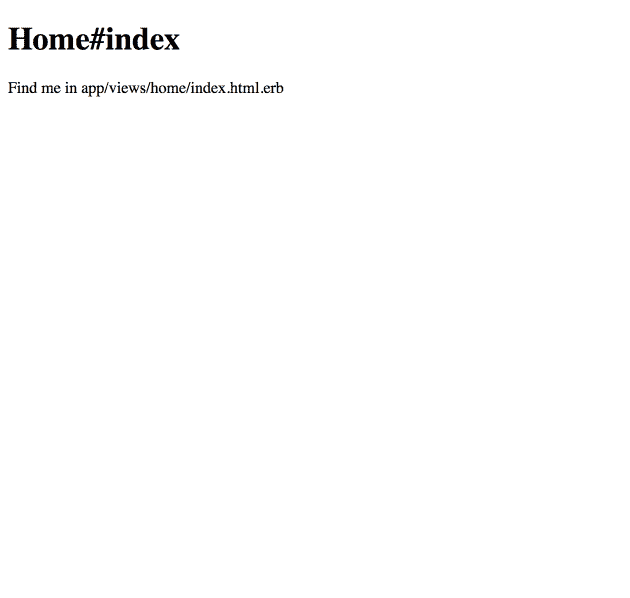
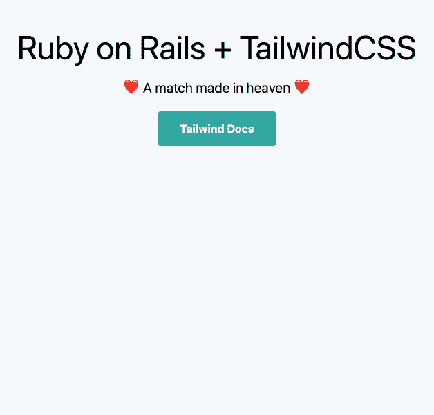

# 在你的 Rails 应用中使用 Tailwind CSS 1.1

> 原文：<https://dev.to/andrewmcodes/use-tailwind-css-1-0-in-your-rails-app-4pm4>

# 通知

这个教程已经过时了，可能不适合你。我根据过去几个月使用 Rails 和 TailwindCSS 的经验写了一篇新文章，你可以在这里找到。感谢阅读！😄

# 教程

出于本教程的目的，我们假设您已经安装了 Ruby 和 Rails gem。如果您没有，请访问【Rails 入门指南。

## 创建新的 Rails 项目

```
rails new rails_tailwind --skip-coffee --webpack -d postgresql
cd rails_tailwind
rails db:create 
```

Enter fullscreen mode Exit fullscreen mode

这将为您创建一个新的 Rails 项目，为您配置 webpack 和 Postgres，并创建我们的数据库。我们不会使用 coffeescript，这就是我们添加`--skip-coffee`标志的原因。如果您愿意，也可以省略`-d postgresql`标志，但是如果您想部署到类似 Heroku 的东西，我建议您添加它。如果您保留 Postgres 标志，请确保您已经安装了 Postgres 并且它正在运行。你可以通过运行`brew install postgresql && brew services start postgresql`在 macOS 上安装 Postgres

## 运行 Rails 和 Webpack

您需要在两个终端标签/窗口中运行 Rails 服务器和 webpack-dev-server，除非您使用 Docker 或类似 Foreman 的 gem。

现在，我们将只创建两个终端窗口。在一个窗口中，运行:

```
rails s 
```

Enter fullscreen mode Exit fullscreen mode

而在另一个:

```
./bin/webpack-dev-server 
```

Enter fullscreen mode Exit fullscreen mode

如果您在浏览器中导航到`localhost:3000`，您应该会看到 rails 欢迎页面。

[](https://res.cloudinary.com/practicaldev/image/fetch/s--WPqrOoZm--/c_limit%2Cf_auto%2Cfl_progressive%2Cq_auto%2Cw_880/https://guides.rubyonrails.oimg/getting_started/rails_welcome.png)

## 生成家居控制器

为了看到我们稍后将集成的顺风风格，我们至少需要一个控制器和视图。

```
rails generate controller Home index 
```

Enter fullscreen mode Exit fullscreen mode

您可以删除生成的 JS、SCSS 和 helper 文件，我们不再需要它们。

```
rm app/helpers/home_helper.rb app/assets/javascripts/home.js app/assets/stylesheets/home.scss 
```

Enter fullscreen mode Exit fullscreen mode

## 配置您的路线

将您的`config/routes.rb`文件更改为:

```
# frozen_string_literal: true

Rails.application.routes.draw do
  root 'home#index'
  resources :home, only: :index
end 
```

Enter fullscreen mode Exit fullscreen mode

重启您的 Rails 服务器，现在您应该在`localhost:3000`上看到以下内容

[](https://res.cloudinary.com/practicaldev/image/fetch/s--rfopw9O2--/c_limit%2Cf_auto%2Cfl_progressive%2Cq_auto%2Cw_880/https://i.imgur.com/A47j9dx.png)

## 安装顺风 CSS

在您的终端中运行以下命令:

```
yarn add tailwindcss --dev 
```

Enter fullscreen mode Exit fullscreen mode

这应该会将顺风包添加到您的`package.json`中。

要创建自定义配置文件，可以运行:

```
./node_modules/.bin/tailwind init 
```

Enter fullscreen mode Exit fullscreen mode

这应该会在项目的根目录下创建一个`tailwind.config.js`文件。这个文件可以用来定制顺风默认值。阅读更多[此处](https://tailwindcss.com/docs/configuration)

接下来，将下面两行添加到`postcss.config.js`

```
require('tailwindcss'),
require('autoprefixer'), 
```

Enter fullscreen mode Exit fullscreen mode

您的`postcss.config.js`文件现在应该看起来像这样:

```
module.exports = {
  plugins: [
    require('autoprefixer'),
    require('postcss-import'),
    require('tailwindcss'),
    require('postcss-flexbugs-fixes'),
    require('postcss-preset-env')({
      autoprefixer: {
        flexbox: 'no-2009'
      },
      stage: 3
    })
  ]
} 
```

Enter fullscreen mode Exit fullscreen mode

## 配置顺风

有几种方法可以做到这一点，但这是我个人的偏好。

移除资产文件夹:

```
rm -rf app/assets 
```

Enter fullscreen mode Exit fullscreen mode

将`app/javascript`目录重命名为`app/frontend` :

```
mv app/javascript app/frontend 
```

Enter fullscreen mode Exit fullscreen mode

告诉 webpacker 使用这个新文件夹，将`config/webpacker.yml`中的 source_path 从`source_path: app/javascript`改为`source_path: app/frontend`。

接下来，我们需要设置我们的样式表:

```
touch app/frontend/packs/stylesheets.css 
```

Enter fullscreen mode Exit fullscreen mode

将以下内容粘贴到我们新的`stylesheets.css`文件中。*这是直接从[顺风文件](https://tailwindcss.com/docs/installation#step-2-add-tailwind-to-your-css)*T5】来的

```
@tailwind base;

@tailwind components;

@tailwind utilities; 
```

Enter fullscreen mode Exit fullscreen mode

在`app/frontend/packs/application.js`中增加以下一行:

```
import './stylesheets.css' 
```

Enter fullscreen mode Exit fullscreen mode

最后一步是告诉 Rails 使用我们的包。在`app/views/layouts/application.html.erb`中，更改:

```
<%= stylesheet_link_tag 'application', media: 'all', 'data-turbolinks-track': 'reload' %>
<%= javascript_include_tag 'application', 'data-turbolinks-track': 'reload' %> 
```

Enter fullscreen mode Exit fullscreen mode

致:

```
<%= stylesheet_pack_tag 'stylesheets', 'data-turbolinks-track': 'reload' %>
<%= javascript_pack_tag 'application', 'data-turbolinks-track': 'reload' %> 
```

Enter fullscreen mode Exit fullscreen mode

重启 Rails 服务器和 webpack-dev-server，您现在应该在`localhost:3000`上看到以下内容

[](https://res.cloudinary.com/practicaldev/image/fetch/s--jTU127UA--/c_limit%2Cf_auto%2Cfl_progressive%2Cq_auto%2Cw_880/https://i.imgur.com/C64oFFy.png)

顺风现在应该可以工作了，所以让我们调整一下视角来看看顺风的好处。

## 使用 TailwindCSS 更新视图

在`app/views/layouts/application.html.erb`改变:

```
<body>
  <%= yield %>
</body> 
```

Enter fullscreen mode Exit fullscreen mode

致:

```
<body class="min-h-screen bg-gray-100">
  <div class="container mx-auto">
    <%= yield %>
  </div>
</body> 
```

Enter fullscreen mode Exit fullscreen mode

并在`app/views/home/index.html.erb`中修改:

```
<h1>Home#index</h1>
<p>Find me in app/views/home/index.html.erb</p> 
```

Enter fullscreen mode Exit fullscreen mode

致:

```
<section class="py-8 text-center">
  <h1 class="text-5xl mb-2">Ruby on Rails + TailwindCSS</h1>
  <p class="text-xl mb-8">❤️ A match made in heaven️️ ❤️</p>
  <a href="https://tailwindcss.com" class="bg-teal-500 hover:bg-teal-700 text-white font-bold py-4 px-8 rounded" target="_blank">Tailwind Docs</a>
</section> 
```

Enter fullscreen mode Exit fullscreen mode

导航到`localhost:3000`时，您应该会看到以下页面

[](https://res.cloudinary.com/practicaldev/image/fetch/s--9Thpfpgw--/c_limit%2Cf_auto%2Cfl_progressive%2Cq_auto%2Cw_880/https://i.imgur.com/okfqCoS.png)

现在你的 Rails 应用程序中有了 Tailwind CSS！

如果你对使用 PurgeCSS 移除未使用的样式感兴趣，我推荐你看看 [GoRails 第 294 集](https://gorails.com/episodes/purgecss?autoplay=1)

编码快乐！