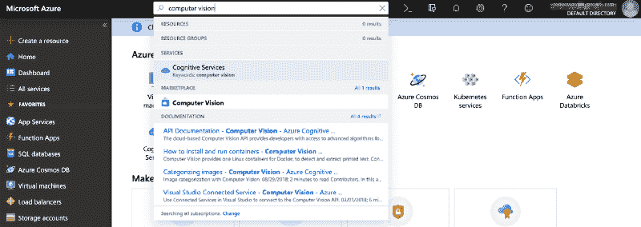
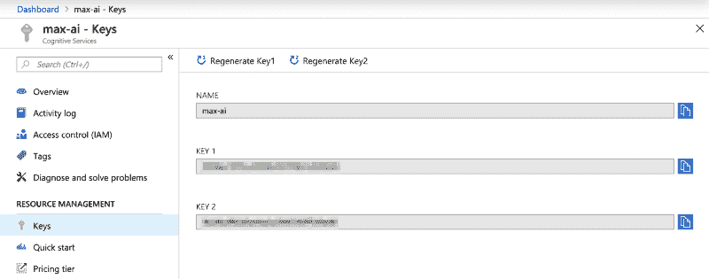
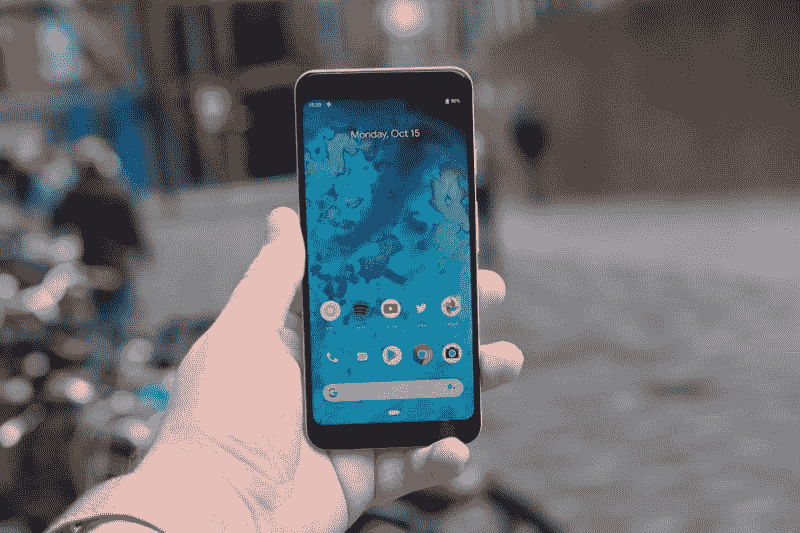

# 使用人工智能在图像上生成 Alt 文本

> 原文：<https://dev.to/oninross/using-artificial-intelligence-to-generate-alt-text-on-images-3n88>

Web 开发人员和内容编辑人员经常忘记或忽略使网站具有可访问性和 SEO 性能的最重要的部分之一:图片和文本。你知道，描述图像的看似很小的图像属性:

``[T3】](https://res.cloudinary.com/practicaldev/image/fetch/s--68pVbreQ--/c_limit%2Cf_auto%2Cfl_progressive%2Cq_auto%2Cw_880/https://thepracticaldev.s3.amazonaws.com/i/xk29s3mm7w3mplw2ibsb.jpeg)

📷鸣谢:[赫芬顿邮报](https://www.huffingtonpost.com/2014/04/17/baby-sloth-compilation_n_5160060.html)

如果你经常在网上发布内容，那么你应该知道，想出描述性的文字是很乏味的。当然，5-10 张图片是可行的。但是如果我们谈论的是成百上千的图像呢？你有这方面的资源吗？

让我们来看看使用 Google、IBM 和 Microsoft 等公司的计算机视觉和图像识别服务为图像自动生成 alt 文本的一些可能性。他们有资源！

## 提醒:alt 文字有什么用？

在 web 开发和内容输入过程中，alt 属性经常被忽略，它是一小段 HTML 代码，用来描述出现在页面上的图像。它如此不起眼，以至于对普通用户来说似乎没有任何影响，但它确实有非常重要的用途:

*   **屏幕阅读器的网页可访问性:**想象一个有很多图像的页面，没有一个包含`alt`文本。使用屏幕阅读器的用户只会听到脱口而出的单词“image ”,这不是很有帮助。太好了，有图像，但是是什么？包含`alt`使屏幕阅读器能够帮助视觉障碍者“看到”那里有什么，并对页面内容有更好的理解。他们说一张图片抵得上一千个单词——那就是用户可能缺少的一千个单词的上下文。
*   如果图像无法加载，则显示文本:万维网似乎不会出错，就像纽约城一样，它从不睡觉，但不稳定和有故障的连接是真实存在的，如果发生这种情况，图像往往无法正确加载并“中断”替代文本是一种安全措施，因为它显示在页面上“损坏”图像的位置，为用户提供内容作为后备。
*   **SEO 性能:**图片上的替代文本也有助于 SEO 性能。虽然它并不能帮助一个网站或页面在搜索结果中一飞冲天，但这是提高 SEO 性能的一个因素。

知道这些事情有多重要，希望你能够在开发和内容输入过程中包含适当的`alt`文本。但是你的档案保存完好吗？试图对大量积压的图像进行详细描述可能是一项艰巨的任务，尤其是如果您的工作期限很紧，或者必须在其他项目之间挤出时间。

如果有一种方法可以在上传图像时应用替代文本，会怎么样？还有！如果有一种方法可以检查页面是否缺少 alt 标签，并自动为我们填充它们，会怎么样？

## 有可用方案！

计算机视觉(或图像识别)实际上已经提供了相当一段时间了。像谷歌、IBM 和微软这样的公司都公开了自己的 API，这样开发者就可以利用这些能力来识别图像以及图像中的内容。

有些开发者已经利用这些服务并创建了自己的插件来生成 alt 文本。以 [Sarah Drasner 的生成器](https://codepen.io/sdras/details/jawPGa)为例，它演示了如何使用 Azure 的计算机视觉 API 通过上传或 URL 为任何图像创建 alt 文本。相当牛逼！

参见 [CodePen](https://codepen.io) 上 Sarah Drasner ( [@sdras](https://codepen.io/sdras) )用 Azure 的计算机视觉 API 动态生成 Alt 文本的笔[。](https://codepen.io/sdras/pen/jawPGa/)

还有 Jacob Peattie 的[自动替换文本](https://wordpress.org/plugins/automatic-alternative-text/)，这是一个使用相同计算机视觉 API 的 WordPress 插件。它基本上是工作流的一个补充，允许用户上传图像并自动生成`alt`文本。

像这样的工具通常有助于加快内容管理、编辑和维护的过程。甚至连思考一段描述性文字的努力都被最小化，传递给了机器！

## 用 AI 弄脏自己的手

我已经尝试了一些人工智能服务，并自信地说微软 Azure 的计算机视觉产生了最好的结果。谷歌和 IBM 提供的服务当然有其优势，仍然可以识别图像和正确的结果，但微软的服务如此之好，如此准确，以至于不值得满足于其他东西，至少在我看来是这样。

创建自己的图像识别插件非常简单。首先，往下看[微软 Azure 计算机视觉](https://azure.microsoft.com/en-au/services/cognitive-services/computer-vision/)。你需要登录或者创建一个帐号来获取插件的 API 密匙。

一旦你在仪表板上，搜索并选择计算机视觉，并填写必要的细节。

[](https://res.cloudinary.com/practicaldev/image/fetch/s--mkzQ5oGT--/c_limit%2Cf_auto%2Cfl_progressive%2Cq_auto%2Cw_880/https://thepracticaldev.s3.amazonaws.com/i/a1phpoxl374lx66k7o0y.png)

等待平台完成旋转你的计算机视觉的实例。一旦完成，开发的 API 密钥将可用。

[](https://res.cloudinary.com/practicaldev/image/fetch/s--lr0FtmD9--/c_limit%2Cf_auto%2Cfl_progressive%2Cq_auto%2Cw_880/https://thepracticaldev.s3.amazonaws.com/i/ldz3k49gdzcvtt7art3t.png)

让有趣和棘手的部分开始！为了演示起见，我将使用普通的 JavaScript。对于其他语言，您可以查看[文档](https://westus.dev.cognitive.microsoft.com/docs/services/56f91f2d778daf23d8ec6739/operations/56f91f2e778daf14a499e1fe)。下面是代码的直接复制和粘贴，您可以使用它来替换占位符。

```
var request = new XMLHttpRequest();  
 request.open('POST', 'https://[LOCATION]/vision/v1.0/describe?maxCandidates=1&language=en', true);  
 request.setRequestHeader('Content-Type', 'application/json');  
 request.setRequestHeader('Ocp-Apim-Subscription-Key', '[SUBSCRIPTION_KEY]');  
 request.send(JSON.stringify({ 'url': '[IMAGE_URL]' }));  
 request.onload = function () {  
     var resp = request.responseText;  
     if (request.status >= 200 && request.status < 400) {  
         // Success!  
         console.log('Success!');  
     } else {  
         // We reached our target server, but it returned an error  
         console.error('Error!');  
     }  
     console.log(JSON.parse(resp));  
 };  

 request.onerror = function (e) {  
     console.log(e);  
 }; 
```

好的，让我们浏览一下人工智能服务的一些关键术语。

*   **位置:**这是在获取订阅密钥之前选择的服务的订阅位置。如果你因为某种原因不记得位置，你可以去概览屏幕，在端点下找到它。
*   **订阅密钥:**这是解锁我们插件使用的服务的密钥，可以在 Keys 下获得。有两个，但用哪个并不重要。
*   **图像 URL:** 这是获取替代文本的图像的路径。请注意，发送到 API 的图像必须满足特定的要求:
    *   接受的格式:JPEG，PNG，GIF，BMP
    *   文件大小必须小于 4MB
    *   尺寸应大于 50px 乘以 50px

## 简单易行

由于大公司向开发者开放他们的服务和 API，现在任何人利用计算机视觉都相对容易。作为一个简单的演示，我将下面的图片上传到了微软 Azure 的计算机视觉 API。

[](https://res.cloudinary.com/practicaldev/image/fetch/s--41NQM30V--/c_limit%2Cf_auto%2Cfl_progressive%2Cq_auto%2Cw_880/https://thepracticaldev.s3.amazonaws.com/i/4y52s6obthr3j2jl3f6w.png)

该服务返回了以下详细信息:

```
{  
     'description': {  
         'tags': [  
             'person',  
             'holding',  
             'cellphone',  
             'phone',  
             'hand',  
             'screen',  
             'looking',  
             'camera',  
             'small',  
             'held',  
             'someone',  
             'man',  
             'using',  
             'orange',  
             'display',  
             'blue'  
         ],  
         'captions': [  
             {  
              'text': 'a hand holding a cellphone',  
              'confidence': 0.9583763512737793  
             }  
         ]  
     },  
     'requestId': '31084ce4-94fe-4776-bb31-448d9b83c730',  
     'metadata': {  
         'width': 920,  
         'height': 613,  
         'format': 'Jpeg'  
     }  
 } 
```

从那里，您可以挑选出可能用于图像的`alt`文本。如何建立这种能力是你的事:

*   您可以创建一个 CMS 插件，并将其添加到内容工作流中，当图像上传并保存在 CMS 中时，会生成`alt`文本。
*   你可以编写一个 JavaScript 插件，在一张图片加载了明显缺失的`alt`文本后，动态添加`alt`文本。
*   你可以编写一个浏览器扩展，当它发现图片丢失时，可以给任何网站上的图片添加文本。
*   您可以编写代码来搜索您现有的数据库或内容报告，查找任何缺失的`alt`文本，并更新它们，或者打开 pull 请求以获得建议的更改。

请注意，这些服务并非 100%准确。他们有时确实会返回一个低信任等级和一个与主题完全不一致的描述。但是，这些平台在不断学习和改进。毕竟，罗马不是一天建成的。