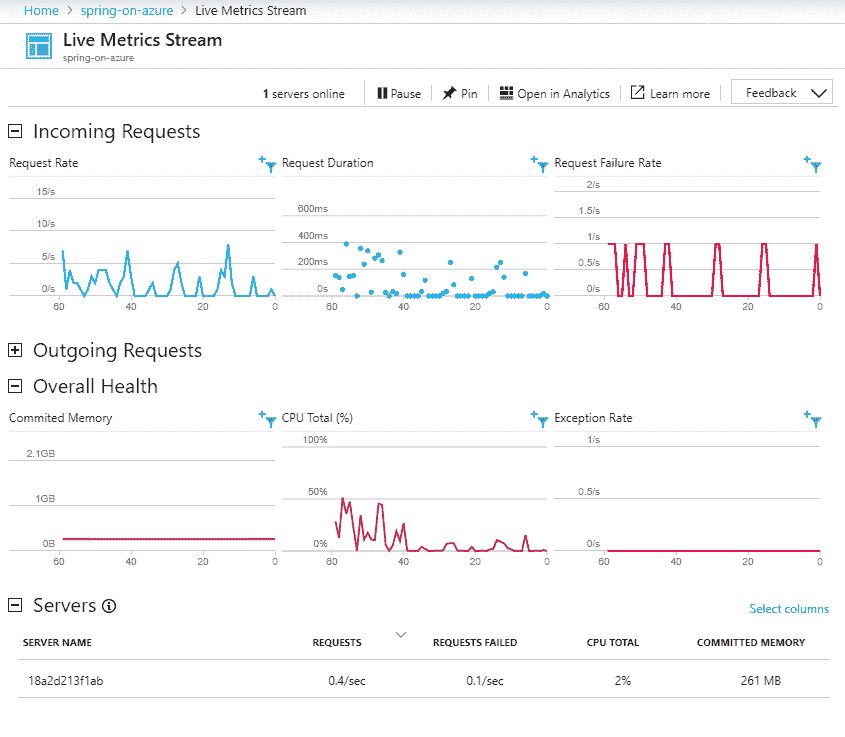
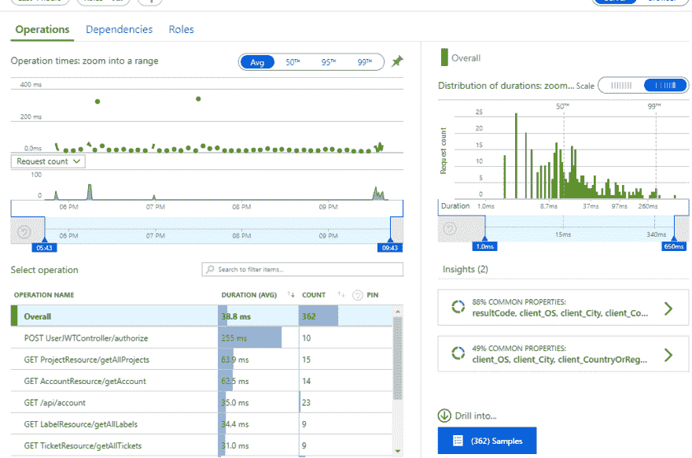

# 将 Azure Application Insights 用于 Spring Boot (4/7)

> 原文：<https://dev.to/azure/using-azure-application-insights-with-spring-boot-4-7-263i>

这篇博客文章是“在 Azure 上部署 Spring Boot 和 Angular 应用程序”系列文章的一部分，下面是完整的文章列表:

*   [为 Azure (1/7)创建 Spring Boot 和角度应用程序](https://dev.to/jdubois/creating-a-spring-boot-and-angular-application-for-azure-1-7-2mb8)
*   [创建和配置 Azure Web App 和 MySQL 来托管 Spring Boot 应用程序(2/7)](https://dev.to/jdubois/creating-and-configuring-azure-web-app-and-mysql-to-host-a-spring-boot-application-2-7-1n13)
*   [使用 Azure Pipelines 构建、测试和部署 Spring Boot 和 Angular 应用程序(3/7)](https://dev.to/azure/using-azure-pipelines-to-build-test-and-deploy-a-spring-boot-and-angular-application-3-7-593j)
*   将 Azure Application Insights 用于 Spring Boot (4/7)
*   [使用 Azure Application Insights 和 Angular (5/7)](https://dev.to/azure/using-azure-application-insights-with-angular-5-7-4kej)
*   [配置 Azure CDN 以提升角度性能(6/7)](https://dev.to/azure/configuring-azure-cdn-to-boost-angular-performance-6-7-5ebe)
*   [配置 Azure Redis 缓存以提升 Spring Boot 性能(7/7)](https://dev.to/azure/configuring-azure-redis-cache-to-boost-spring-boot-performance-7-7-52dl)

## 什么是 Azure Application Insights，以及您应该使用它的原因

在本系列的前几部分中，我们开发了一个 Spring Boot 和 Angular 应用程序，创建了一个 Azure 基础设施，并自动将我们的应用程序部署到 Azure。但是出了问题会怎么样呢？我们谈到了成本和预算，但是如果我们不知道用户访问我们的应用程序时它的行为，我们如何优化它们呢？

[Azure Application Insights](https://docs.microsoft.com/en-us/azure/azure-monitor/app/app-insights-overview/?WT.mc_id=devto-blog-judubois) 是 Azure 提供的应用性能管理(APM)服务。这是您应该为任何应用程序设置的第一件事:如果没有监控和洞察力，您将对应用程序可能出现的任何性能、基础设施或错误配置视而不见。

Azure Application Insights 是一款极具竞争力的解决方案:

*   这是非常完整的，因为我们将通过这一系列的博客帖子看到，我们将监控服务器端(Java)应用程序和前端(Angular)应用程序
*   它提供了高级和高度可定制的仪表板
*   它有一个免费层(适用于简单的应用程序)，除此之外非常便宜
*   如果你是 Azure 用户，显然这将是你的默认选择，因为它包含在内

## 设置 Azure 应用洞察

当我们在本系列的第 2 部分创建 Azure 基础设施时，我们要求 Azure Web App 自动设置监控。如果你没有勾选那个框，不用担心！只需在 [Azure 门户](https://portal.azure.com/?WT.mc_id=devto-blog-judubois)中搜索“应用洞察”并创建一个新实例。重要的是拥有“工具密钥”，它可以从 Azure Application Insights 实例的“概述”页面获得，并将用于从正在运行的应用程序发送监控数据。

## 与 Spring Boot 一起使用 Azure 应用洞察

我们现在将在 Spring Boot 应用程序中配置 Azure Application Insights。

目前，微软提供了一个用于自动配置 Azure Application Insights 的 Spring Boot 启动器:`applicationinsights-spring-boot-starter`，在 Maven Central 上有[，在](https://search.maven.org/search?q=g:com.microsoft.azure%20AND%20a:applicationinsights-spring-boot-starter&core=gav)上有[的完整文档。这是由 Azure Application Insights 团队完成的，这是我们将在这里使用的启动工具。](https://docs.microsoft.com/en-us/java/azure/spring-framework/configure-spring-boot-java-applicationinsights?view=azure-java-stable&WT.mc_id=devto-blog-judubois)

请注意，微软还提供了一个`azure-spring-boot-metrics-starter`，这是在 Maven Central 上可以找到的[，这是在](https://search.maven.org/search?q=g:com.microsoft.azure%20AND%20a:azure-spring-boot-metrics-starter)上完整记录的[，并在之前的启动器上添加了千分尺监控支持。在撰写本文时，它的当前版本使用不同的配置键作为`applicationinsights-spring-boot-starter`，所以我们认为最好等到两个启动器使用相同的配置。](https://docs.microsoft.com/en-us/azure/azure-monitor/app/micrometer-java/?WT.mc_id=devto-blog-judubois)

因为`applicationinsights-spring-boot-starter`是一个 Spring Boot 启动器，所以要做的就是将它的库添加到项目的`pom.xml`中，并配置它的`azure.application.insights.instrumentation.key` Spring Boot 属性。有几种方法可以做到这一点，我们将选择最简单的方法，并将其添加到我们的`application-prod.yml`配置文件中，这样我们就可以在生产中设置监控。

然后，还需要执行几个配置步骤:

*   移除项目的`pom.xml`中的`micrometer-registry-prometheus`依赖项，因为 Prometheus 现在被 Azure Application Insights 取代。
*   添加`applicationinsights-logging-logback`依赖项，这样所有生产日志都将被发送到 Azure Application Insights。正如我们在配置 Azure Web App 时配置了`LOGGING_LEVEL`键一样，我们应该拥有来自业务代码的所有调试信息。
*   重新配置`logback-spring.xml`文件，以便从 Spring Boot 获取 Azure Application Insights instrumentation 密钥，并将`com.microsoft.applicationinsights`设置为`INFO`级别(否则它会向我们提供大量信息)。

您可以查看我们刚刚所做的更改，以便在[这个提交](https://github.com/jdubois/spring-on-azure/commit/adf9029911d3e336218056eda5c14901649280e8)上设置 Azure Application Insights。

由于我们还将 Logback 配置为将所有日志发送到 Azure Application Insights，因此这些日志现在将在 Azure Application Insights 中聚合，并且可以轻松搜索:

现在一切都设置好了，而且我们已经配置了一个完整的持续集成/持续部署管道，我们需要做的就是将我们的代码推送到 GitHub，并观察我们的应用程序自动更新。

一旦部署了您的应用程序，就该测试应用程序洞察力如何工作了！转到您的 Application Insights 实例，并选择“实时指标流”。如果您的应用程序已连接，那么您就一切就绪了！

## 测试 Azure 应用洞察

JHipster 已经为我们的应用程序生成了量角器测试:打开`protractor.conf.js`文件并更改`baseUrl`属性以指向您的 Azure Web App 实例。然后你可以通过输入`npm run e2e`来运行量角器测试。这将启动一个浏览器，并在应用程序中执行一系列场景，包括失败场景。

如果一切设置正确，在“实时指标流”中，您应该看到这些场景正在运行:

然后，您可以使用常规的仪表板来检查 Spring 应用程序的性能:

这些仪表板非常完整，它们将允许您更好地了解应用程序中的潜在问题。在本系列的下一篇文章中，我们将做同样的配置，但是使用 Angular 前端应用程序:您将能够获得前端用户交互和服务器端性能指标的汇总视图！