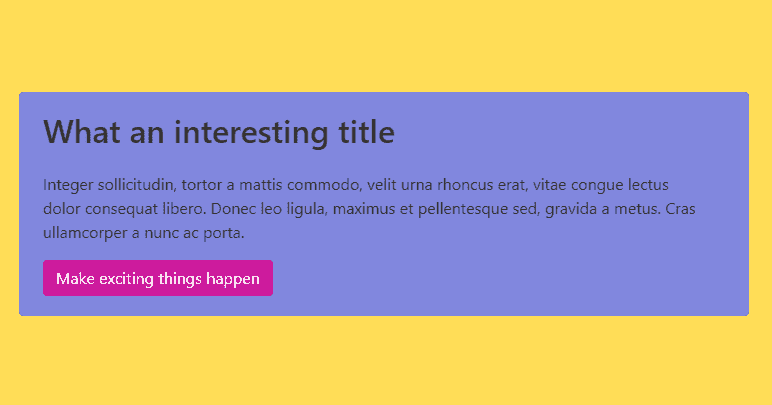

# 使用 CSS 自定义属性在 JavaScript 或 React 中应用主题

> 原文：<https://dev.to/kendalmintcode/using-css-custom-properties-to-apply-themes-in-javascript-or-react-1dgj>

[](https://res.cloudinary.com/practicaldev/image/fetch/s--y_CA-xGN--/c_limit%2Cf_auto%2Cfl_progressive%2Cq_auto%2Cw_880/https://robkendal.co.uk/static/2cd5c3a7405c0008956aaeba421112ae/4aca8/deanna-ritchie-227649-unsplash_o-1.jpg)

继我最近关于如何使用 JSON 文件构建节点 JS API 服务器的文章[之后，我想分享我最近的另一个经历:**使用 CSS 自定义属性将自定义主题**应用到 React 网站。](https://robkendal.co.uk/build-a-restful-node-api-server-using-json-files/)

我们开始吧！

**PS -** 一如既往，随意[跳到文章的肉和土豆](#building-theme-machine)。

## 免责声明:没有任何反应...

一开始，我将在整篇文章的开头承认:我已经用普通的 JS 构建了这个演示。我知道，我知道，它在标题中提到了 React，我用 React-intentions 开始编写代码，但当我进入细节时，我意识到，实际上，对于这种事情，你根本不需要 React。通过将角度切换到更广阔的目标，我们可以实现两件事:

1.  包括那些不喜欢使用 React，但仍然希望在主题工作中应用自定义 CSS 属性的人。
2.  认识到 React 是很棒的，但它不是什么都需要内置的神圣银弹...

## 了解自定义 CSS 属性

我最近受到了《粉碎杂志》第六本的启发，这本书有很大一部分是关于 CSS 自定义属性的，作者是[迈克·瑞思穆勒](https://www.madebymike.com.au/)——在我看来，他是在现实世界中使用自定义属性的先驱之一，你应该去看看他的作品。

自定义属性(也称为 CSS 变量，尽管它们在声明和使用方式上更像属性)提供了一个巨大的优势，因为它们在运行时被动态地限定范围和解析，在运行时它们将更新它们的使用。

例如，这意味着我们可以有一个自定义属性，比如说`--special-background-color: blue;`，并使用它作为选择器中另一个属性的值，比如`background-color: var(--background-color);`。然而，我们可以*在*加载并应用样式后将“特殊背景色”的值更新为“红色”*，我们的“背景色”也将被更新——太棒了！*

你可能会看到它们是这样使用的:

```
:root {
    --hero-bg-color: yellow;
    --heading-font-size: 1.5rem;
 }

 /* ...other styles */

 .hero {
     background-color: var(--hero-bg-color); 
     /* this is evaluated to: background-color: yellow */
 } 
```

Enter fullscreen mode Exit fullscreen mode

在这本非常棒的书中(和他的网站)，Mike 详细解释了 CSS 自定义属性的输入和输出，为什么、何时和如何使用它们，以及一些常见的陷阱和方法。

在这里，我不打算重新讨论文档化的信息；相反，我将向您展示一个可用的策略，使您能够使用 CSS 自定义属性的强大功能将自定义的动态样式应用到您的站点 *today* 。

## 动态加载主题

在 IAM Cloud，我们在企业认证领域有一套[产品](https://www.iamcloud.com/)。一个这样的产品允许对每个客户进行一定程度的定制，最终应用一组高级的风格变化，标题颜色，按钮颜色，背景图像等。

随着我们将产品重新开发成独立的 UI 平台，很明显我们需要以一种更动态的方式处理这样的定制主题，而不必下载额外的(可能很大的)样式表或者维护一个不断增长的客户特定的样式表列表——对它们的任何改变都需要*大量的*工作来编辑它们...

SASS 或预处理器在这里帮不了我们，因为它们是静态的——虽然它们是使用变量和函数动态处理和编译的，但这是在输出之前完成的，输出的是普通的 CSS——也就是说，如果不完全覆盖原始选择器，我们就无法影响或更改已经定义的值。

定制属性主题化机制如何工作的思路(和过程)是这样的:

1.  通过主题化 API 获取一组定制的、特定于客户端的 CSS 自定义属性。
2.  处理属性以确保它们有效。
3.  应用样式——通过注入样式元素，或者使用内置的 JavaScript 函数`element.style.setProperty('--my-epic-var', someValue);`

让我们完成这些步骤，为自己构建一个动态加载的主题。

## 打造定制主题机

对于你们当中那些渴望工作的人来说，[去已经完成的项目](https://codesandbox.io/embed/5z6yjrpr84)看看我们正在建造什么。我正在使用 [CodeSandbox.io](https://codesandbox.io/) 来托管文件，这些文件又使用令人印象深刻的[包](https://parceljs.org/getting_started.html)来进行捆绑(PS -我将在未来将我的项目从 Webpack 切换到 package，并将创建一个包启动工具包来匹配我的 Webpack 启动工具包)。

首先，我们的文件结构非常简单:

```
/src
    /data
        --theme.json
    /helpers
        --themeBuilder.js
    --index.js
    --theme.css
index.html 
```

Enter fullscreen mode Exit fullscreen mode

这里没有什么太复杂的，但是每个文件都扮演一个角色:

*   这是我们拒绝客户定制风格选择的地方。
*   `themeBuilder.js`–不出所料，themeBuilder 文件有助于使用`theme.json`中设置的自定义属性构建我们的样式。
*   `index.js`–我们项目的主要 JavaScript 起点。它处理样式的获取并调用 themeBuilder。
*   我们将在这里保留默认的 CSS 变量集，以备以后覆盖。
*   `index.html`–项目的主要起始点和包裹加载开始的文件。

### 查看默认样式

如果你打开`index.html`文件，你会注意到一些事情。首先，我们使用下面的代码行
将奇妙的[布尔玛 CSS 框架](https://bulma.io/documentation/)拉入头部

```
<!-- grab the Bulma library (for some good base styles) -->
<link
    rel="stylesheet"
    href="https://cdnjs.cloudflare.com/ajax/libs/bulma/0.7.4/css/bulma.min.css"
/> 
```

Enter fullscreen mode Exit fullscreen mode

接下来，我们有一个非常简单的内容结构，展示了一些我们可以定制的样式:

```
<main class="custom-theme">
    <section class="hero is-fullheight">
    <div class="hero-body">
        <div class="container">
        <div class="content notification">
            <h1 class="title">What an interesting title</h1>
            <p>
            Integer sollicitudin, tortor a mattis commodo, velit urna
            rhoncus erat, vitae congue lectus dolor consequat libero. Donec
            leo ligula, maximus et pellentesque sed, gravida a metus. Cras
            ullamcorper a nunc ac porta.
            </p>
            <button class="button">Make exciting things happen</button>
        </div>
        </div>
    </div>
    </section>
</main> 
```

Enter fullscreen mode Exit fullscreen mode

注意所有东西都被包装在里面的`custom-theme`类。这将允许我们将主题(以及相关的 CSS 自定义属性)的范围限制在内容的特定部分。

我们的基本风格如下:

```
.custom-theme {
  --hero-bg-color: #00d1b2;
  --notification-bg-color: #363636;
  --content-color: #fff;
  --button-bg-color: #3273dc;
}

.custom-theme .hero {
  background-color: var(--hero-bg-color);
}

/* ...rest of file */ 
```

Enter fullscreen mode Exit fullscreen mode

这为我们提供了一个可爱的背景，内容框如下:

[](https://res.cloudinary.com/practicaldev/image/fetch/s--5ptIUylD--/c_limit%2Cf_auto%2Cfl_progressive%2Cq_auto%2Cw_880/https://robkendal.co.uk/static/0c9728112356220f0ca582b691976c8f/5cc77/starting-point.png)

应用了基本样式的起始页

### 1-从 API 中获取我们的风格

既然我们已经有了一个坚实的定制基础，是时候制作一个`.json`文件来覆盖我们的基础样式了。查看`/data/theme.json`，您将看到以下内容:

```
{
  "hero-bg-color": "#ffdd57",
  "notification-bg-color": "#8187de",
  "content-color": "#333",
  "button-bg-color": "#cc1a9c"
} 
```

Enter fullscreen mode Exit fullscreen mode

(我选择将变量命名为它们在最终 CSS 中出现的名称，因为如果我们的列表在以后增长，这将使它们更容易自动化。您可以在本文的稍后部分看到这是如何工作的。)

在我们的`index.js`文件中，我们有几件相当简单的事情要做。首先，我们有一个函数来构建一个新的样式元素，并将其注入到我们的文档头:

```
// With help from David Walsh:
// https://davidwalsh.name/add-rules-stylesheets
const buildStyleElement = () => {
  const styleEl = document.createElement("style");

  styleEl.appendChild(document.createTextNode(""));
  document.head.appendChild(styleEl);

  return styleEl.sheet;
}; 
```

Enter fullscreen mode Exit fullscreen mode

[David Walsh 的帮助文章](https://davidwalsh.name/add-rules-stylesheets)在这里给了我们一些帮助来处理一个 Webkit 怪癖，但是这个功能相当简单:创建一个 style 元素；将其添加到 document.head 最后，返回实际的样式表，以便我们稍后可以添加样式。

接下来，我们有一个`init()`函数来启动一切:

```
const init = () => {
  // load up our custom theme via some sort of async method (in real life)
  // here, we'll simulate an ajax call
  setTimeout(() => {
    if (typeof CustomStyles !== "undefined") {
      // successful 'ajax' call
      const stylesheet = buildStyleElement();
      const customStyleRules = CustomThemeBuilder(CustomStyles);

      stylesheet.insertRule(customStyleRules);
    }
  }, 1500);
}; 
```

Enter fullscreen mode Exit fullscreen mode

因为这是一个完全自包含的项目，我们实际上没有从 API 调用任何东西。相反，我们使用 JS 内置的经典`setTimeout()`函数模拟实际 API 调用的调用、等待和响应流程。

我们检查我们的`CustomStyles` JSON(在这个文件的顶部导入)是否存在，然后我们构建样式表，获取返回的表值。最后，我们在将样式添加到 DOM 之前对它们进行处理。

### 2-处理我们的自定义属性；检查它们是否有效

现在是有趣的部分，建立主题。在`/helpers/themeBuilder.js`文件中，您会发现主主题/风格处理器:

```
// our customTheme object (from the JSON) should be an object like this:
// { "theme-property-name": "#abcdef" }
const ThemeBuilder = customTheme => {
  // return if there's no custom theme available
  if (typeof customTheme === 'undefined') {
    return;
  }

  // gather our custom properties to insert into the stylesheet overrides
  // we're using the ES6 backtick string notation here to keep things readable
  const stylesToInsert = `
 .custom-theme { ${insertPropertyIfValid("--hero-bg-color", customTheme["hero-bg-color"])}; ${insertPropertyIfValid(
      "--notification-bg-color",
      customTheme["notification-bg-color"]
    )}; ${insertPropertyIfValid("--content-color", customTheme["content-color"])}; ${insertPropertyIfValid(
      "--button-bg-color",
      customTheme["button-bg-color"]
    )};
  }
`;

  // finally, send our styles back to the caller
  return stylesToInsert;
}; 
```

Enter fullscreen mode Exit fullscreen mode

这里没有什么特别的，尽管你可能不熟悉 ES6 [模板字面语法](https://developer.mozilla.org/en-US/docs/Web/JavaScript/Reference/Template_literals)(也称为反勾号字符串符号或模板字符串)。虽然最终会产生一个字符串类型，但反勾号只是允许我们比传统的 JS 字符串语法更容易地编写多行字符串。此外，我们可以在这些字符串中包含比使用`${myVariableHere}`短语更简洁的变量。

在函数中，我们通过调用 helper 方法`insertPropertyIfValid(cssProperty, customPropertyValue)`从自定义属性构建一个字符串。这是文件顶部的一个小函数，它只是检查我们的自定义属性字符串是否不为 null、未定义或空。

如果一切正常，那么它将以样式表友好的格式返回 CSS 自定义属性:

```
return `${cssProperty}: ${customPropertyValue};`;
// if passed values of '--hero-bg-color' and '#FDBB3D' as arguments
// it will return the string '--hero-bg-color: #FDBB3D' 
```

Enter fullscreen mode Exit fullscreen mode

### 3-应用样式

最后一部分是将我们的样式应用到页面上。由于`themeBuilder.js`返回给我们一个很好的 CSS 规则/选择器，其中包含我们的覆盖，所以`index.js`中的这一行将它们添加到页面中:

`stylesheet.insertRule(customStyleRules);`

当然，我们可以使用 JS 机制来实现这一点，就像这样:

`element.style.setProperty('--my-epic-var', someValue);`

我觉得这归结于个人喜好。使用`setProperty()`方法意味着样式将被逐个应用；使用我们的风格注入方法意味着你可以一次完成所有的事情。从代码的角度来看，它看起来更具可读性。

所以，这是我们之前...

[](https://res.cloudinary.com/practicaldev/image/fetch/s--5ptIUylD--/c_limit%2Cf_auto%2Cfl_progressive%2Cq_auto%2Cw_880/https://robkendal.co.uk/static/0c9728112356220f0ca582b691976c8f/5cc77/starting-point.png)

没有自定义的基本元素

以下是应用我们的定制风格后(大约 1.5 秒后)您会得到的结果:

[](https://res.cloudinary.com/practicaldev/image/fetch/s--5ffQWmqz--/c_limit%2Cf_auto%2Cfl_progressive%2Cq_auto%2Cw_880/https://robkendal.co.uk/static/3f3f8aaf108915da5f436afe888206a4/57e09/styles-applied.png)

应用了我们的自定义客户端主题的相同内容

## 用自动化的样式生成器更进一步

我们得到的是一个实际的主题化工作。然而，考虑到我们在`themeBuilder.js`文件中有一个定制属性的硬编码集合，这不会有很好的伸缩性。对于我们在 IAM Cloud 的情况来说，这很好，因为文件中发生的事情很清楚，我们没有太多需要处理的属性。

然而，如果这个列表开始增长，我们就必须找到一种方法来处理 JSON 文件中的样式覆盖列表，它的大小我们可能不知道。

但是不用担心，我们可以很容易地更新我们的`themeBuilder.js`文件来处理一个可变大小的 JSON 列表，只需要一点代码就可以了，如下所示:

```
let stylesToInsert = ".custom-theme {";
  Object.keys(customTheme).forEach(key => {
    const cssProperty = `--${key}`;
    console.log(cssProperty);
    stylesToAdd += insertPropertyIfValid(cssProperty, customTheme[key]);
  });
  stylesToAdd += "}"; 
```

Enter fullscreen mode Exit fullscreen mode

**注意:**为了顺利完成这项工作，我们假设 JSON 文件中的 CSS 自定义属性的名称与它们在最终 CSS 文件中的名称相同(或者至少以一种在 JavaScript 中易于操作的方式)。

## 翻看已完成的项目

[https://codesandbox.io/embed/5z6yjrpr84](https://codesandbox.io/embed/5z6yjrpr84)

## 用 CSS 自定义属性替代主题化

在我们眼花缭乱之前，现在使用自定义属性来应用主题有一些缺点，特别是在浏览器支持方面。更具体地说，关于 Internet Explorer 支持:(

令人惊讶的是，现代弓箭手的支持相当好，但 IE 是一个非常有限的野兽。

那么我们有什么选择呢？幸运的是，如果你想或者需要支持旧的浏览器，有几条路可以走。

### 使用服务器动态编译

这是我们的选择中比较难的一个，如果你愿意，可以叫它锤子。您可以使用服务器端解决方案，该解决方案可以动态地从 SASS 构建 CSS 文件，并通过 API 服务器甚至服务人员(如果您想变得非常有趣)推送结果。

无论您如何摆动它，您实质上都是在编译一个 CSS 表并更新页面；这让我们想到了第二个选择...

### 使用 CSS 覆盖(又名美好的旧时光)

为了真正确保完全覆盖，你必须回到过去，简单地构建一组样式覆盖，利用级联来应用你的主题。当然，它不一定是专门的 CSS，您仍然可以使用您最喜欢的 CSS 预处理器来生成样式，但是您会失去整个文章方法的动态特性:动态加载样式主题并通过 CSS 自定义属性应用它们。

## 你知道哪些主题化的思路和方法？

像主题化和定制化这样的话题是争论的雷区；有很多方法可以接近他们并取得成果。你有什么想法，你是如何发现这篇关于自定义属性被用于主题化的文章的？