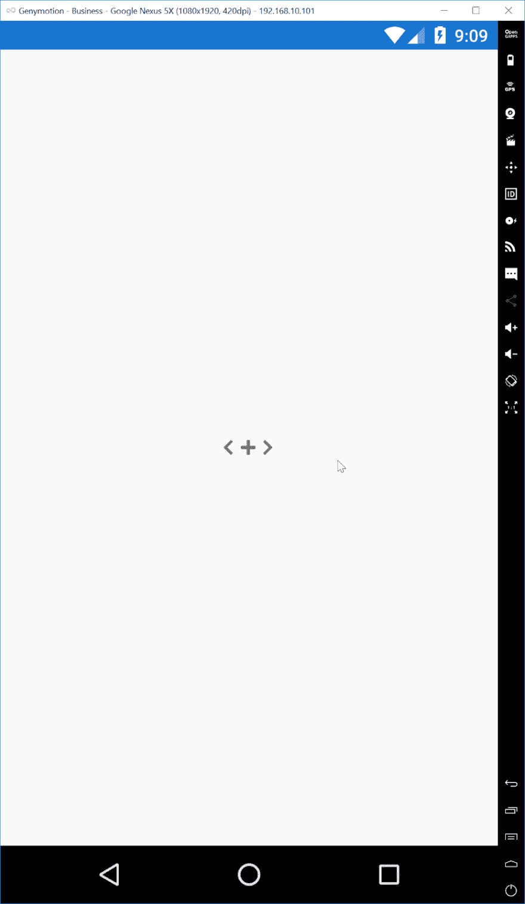
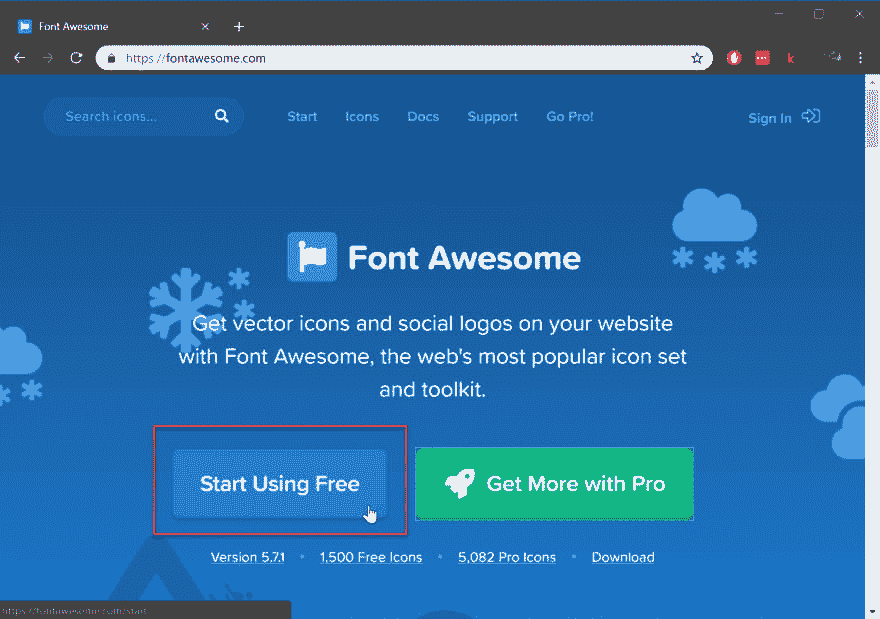
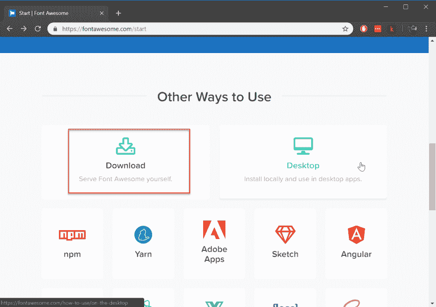
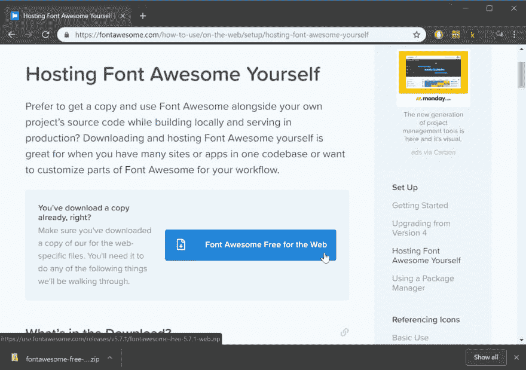
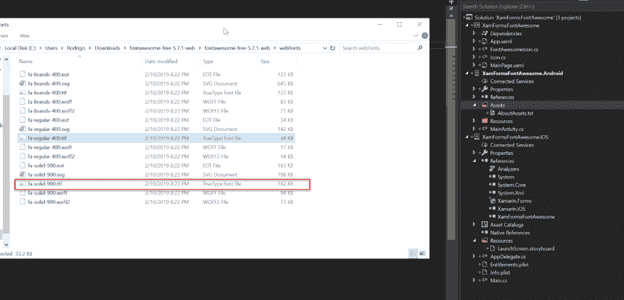
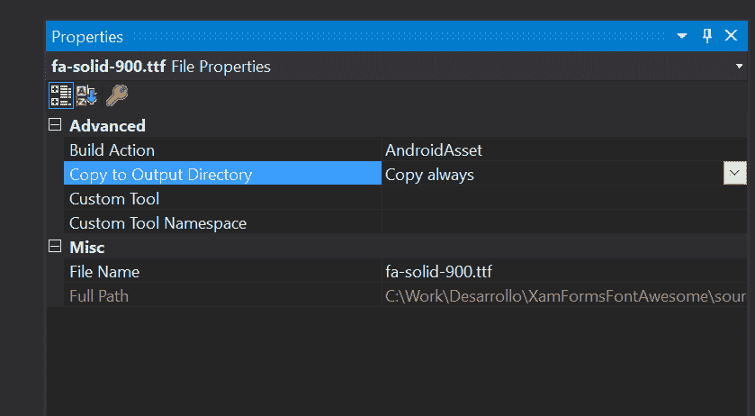
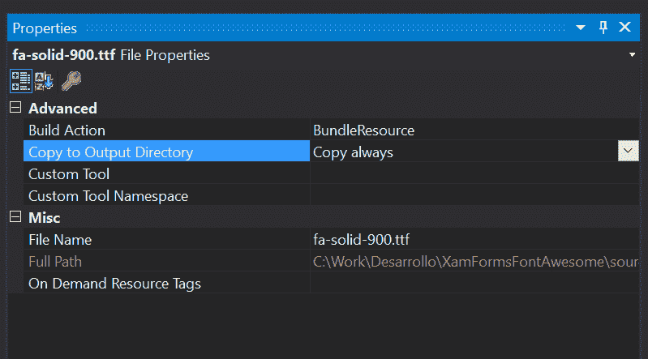
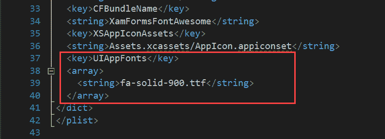
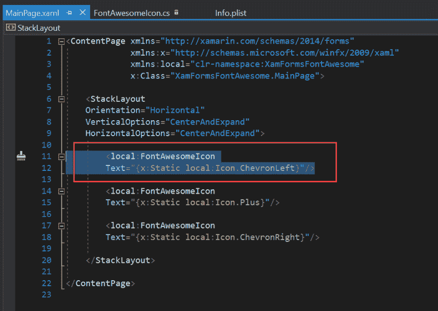
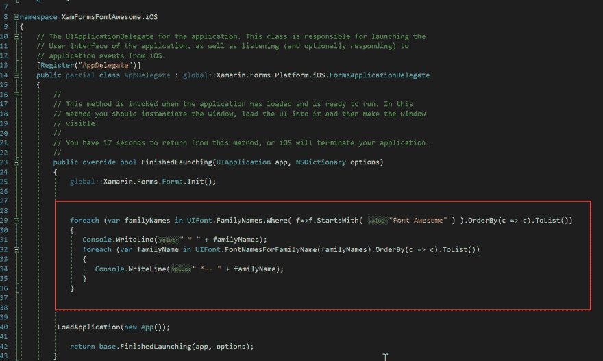

# 在 Xamarin 中使用字体 Awesome。形式

> 原文：<https://dev.to/codingcoach/using-font-awesome-in-xamarinforms--3mh>

# 这种做法从 Xamarin 开始就过时了。表格 4.5.530

你可以在这里获得关于新功能[的信息](https://devblogs.microsoft.com/xamarin/embedded-fonts-xamarin-forms/)

# 在 Xamarin 中使用字体 Awesome。形式

这篇文章的所有代码都可以在 [github](https://github.com/rodrigojuarez/XamFormsFontAwesome) 获得

如果您想在 Xamarin Forms 应用程序中拥有一致的用户界面，尝试使用矢量图标可能是个不错的方法。

为此，我将在这篇博文中向您展示如何在 Xamarin Forms 项目中包含字体 Awesome 来显示图标，如本示例所示。

## 安装

首先，你需要从字体网站下载图标(在这篇文章中，我们使用的是免费的网络版本 5.7.1)。

选择开始使用免费按钮。

然后点击下载按钮。

下载后，解压缩您的 zip 文件的内容。

并将高亮显示的文件复制到 Android 的 Assets 文件夹和 iOS 的 Resources 文件夹中。

更改两者的属性以匹配图像。

对于 iOS，您需要更改 info.plist 文件并包含新的字体文件。

## 创建支持类

安装完成后，我们将从 Label 创建一个派生类，使用字体 Awesome 显示我们的文本。

在我们的示例项目中，该类被称为 FontAwesomeIcon。

对于 Android，该类需要一个渲染器(FontAwesomeIconRenderer.cs)。

图标定义在 Icon.cs 文件中，您可以添加您需要的任何其他图标，在[此链接](https://fontawesome.com/cheatsheet?from=io)中查找图标并使用 unicode 表示。

## 使用我们自定义的标签来显示图标

要使用 xaml 在视图中显示图标，请创建一个类似于 MainPage.xaml 中的三个标记的标记，将文本设置为 icon 类中定义的图标之一。

这就是你需要开始使用字体真棒！！

## 亲提示

你可能已经注意到了，FontAwesomeIcon.cs 文件中使用的字体名称取决于平台，android 版本只是 ttf 文件的名称，但对于 iOS 我们需要字体的名称。在一些教程中，他们提到你可以在 Windows 资源管理器中检查文件的属性，并从那里取名字，但对于我们在这篇文章中使用的 FontAwesome 版本，这是不正确的。

当您运行 iOS 版本时，您可以在 Visual Studio 的控制台中看到字体的名称，因为我们已经有了这段代码(AppDelegate.cs)。

如果你想使用另一个版本的字体，但你不知道名字，这将是非常有用的。