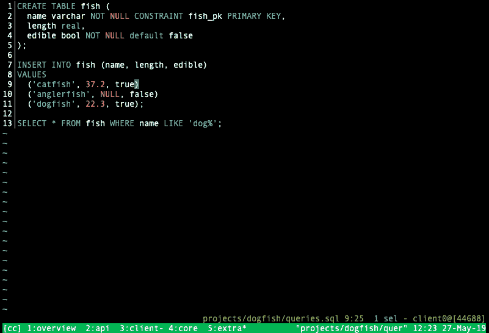
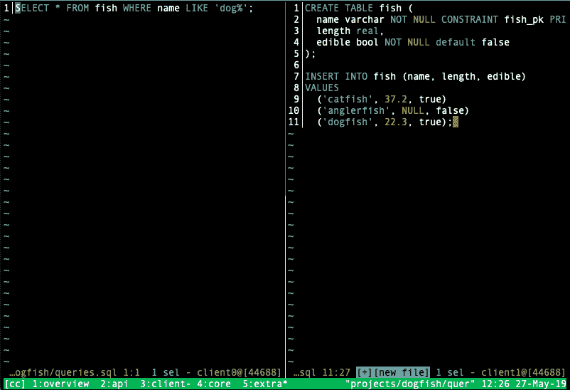
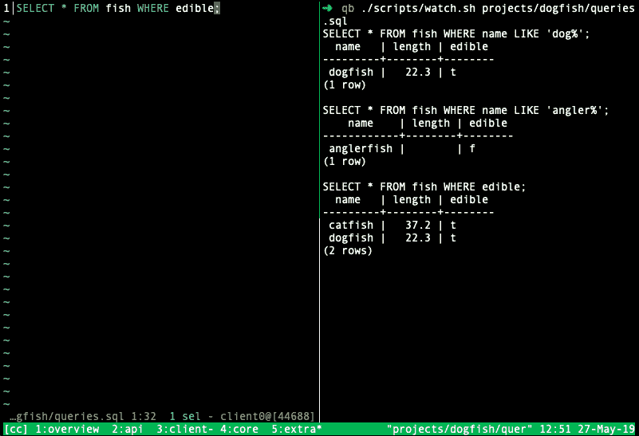
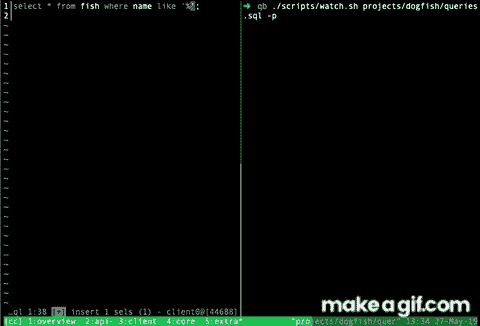

# 使用 Kakoune 作为查询浏览器

> 原文：<https://dev.to/staab/using-kakoune-as-a-query-browser-2j72>

对于我的日常工作，我使用 [TablePlus](https://tableplus.io/) 来开发/维护各种 postgres 和 mysql 数据库，我可以诚实地推荐这是一个非常棒的查询浏览器。

不过，像任何其他软件一样，它也有缺点，其中包括不合标准的查询格式和奇怪的文本编辑键绑定。我使用 Kakoune(一个围绕 vim“UNIX 方式”构建的文本编辑器)进行大部分文本编辑活动，这一事实对我没有帮助。我也使用 tmux 作为窗口管理器，因为 Kakoune 没有自带。

所以我问自己:与其希望 TablePlus 有类似 Kakoune 的编辑能力，不如我把 sql 放入 Kakoune？这比我想象的要容易，因为，嗯，unix。

# 编辑查询

首先，我创建了一个目录来存放我所有的脚本和 sql 相关的项目:

```
$ mkdir query-browser
$ cd query-browser
$ mkdir scripts projects 
```

Enter fullscreen mode Exit fullscreen mode

创建一个我可以编辑查询的地方就像创建一个`sql`文件一样简单，在 Kakoune 中打开它，并将我正在进行的查询复制到其中。

```
$ mkdir projects/my-project
$ kak projects/my-project/queries.sql 
```

Enter fullscreen mode Exit fullscreen mode

到目前为止，这段代码看起来和其他代码一样:

[](https://res.cloudinary.com/practicaldev/image/fetch/s--lb94By9f--/c_limit%2Cf_auto%2Cfl_progressive%2Cq_auto%2Cw_880/https://thepracticaldev.s3.amazonaws.com/i/e1fkly2m5z71msr6wldb.png)

稍微提前考虑一下，这看起来有问题。如果我正在开发最后一个查询，我不想每次都运行 CREATE TABLE 查询！轻松解决:

[](https://res.cloudinary.com/practicaldev/image/fetch/s--6zmdSUbb--/c_limit%2Cf_auto%2Cfl_progressive%2Cq_auto%2Cw_880/https://thepracticaldev.s3.amazonaws.com/i/a730k7m11ibfzrslyfyo.png)

现在，我可以在右边运行一次 setup 查询，关闭那个 tmux 窗格，并开始处理我正在开发的查询。

# 运行查询

现在我有了一些 sql 文件，我可以使用`psql`命令行工具运行它们:

```
$ psql -d postgres -f projects/dogfish/setup.sql
INSERT 0 3
$ psql -d postgres -f projects/dogfish/queries.sql
  name   | length | edible
--------------+--------+--------
 dogfish |   22.3 | t
(1 row) 
```

Enter fullscreen mode Exit fullscreen mode

让我们通过将它保存到一个名为`run.sh`的脚本来概括这一点。

```
psql -d postgres -e -f "$1" ${@:2} 
```

Enter fullscreen mode Exit fullscreen mode

在快速的`chmod +x ./scripts/run.sh`之后，我们可以用`./scripts/run.sh projects/dogfish/queries.sql`运行我们的查询文件。请注意，我将其余的参数直接传递给了`psql`,因此我们仍然可以访问它的所有命令行选项。

# 用反馈回路开发

我喜欢在工作时得到快速反馈。我几乎总是在另一个窗口中运行一些测试，或者打开我的应用程序的热重新加载。我们也可以在这里做同样的事情。

我们再做一个剧本叫`./scripts/watch.sh`。

```
find "$1" | entr -p -r ./scripts/run.sh $@ 
```

Enter fullscreen mode Exit fullscreen mode

这个使用`find`和 [`entr`](http://eradman.com/entrproject/) 来观察给定的查询文件，并在它发生变化时运行它。

> 请注意，如果您打算在生产中使用这种技术，我*不*推荐这种方法。创建一个明确运行查询的[定制命令](https://github.com/mawww/kakoune/blob/master/doc/pages/commands.asciidoc#declaring-new-commands)要好得多。对我来说，我希望在开发中有一个快速的反馈循环，所以文件查看符合要求。

我们可以用`./scripts/watch.sh projections/dogfish/queries.sql`启动我们的观察器(别忘了`chmod +x`)。现在，每次我们对文件进行更改时，它都会运行并向我们显示结果！

[](https://res.cloudinary.com/practicaldev/image/fetch/s--rIUu6Dlv--/c_limit%2Cf_auto%2Cfl_progressive%2Cq_auto%2Cw_880/https://thepracticaldev.s3.amazonaws.com/i/4rv16g58u1x0aj6k6f98.png)

# 自动格式化

这种技术的可能性是无限的，但是让我们在查询浏览器中添加自动格式化来结束它。如果你正在跟进，为你的操作系统安装[pg formatter](https://github.com/darold/pgFormatter)(`brew install pgformatter`适用于 OSX)。现在，保存一个新的脚本到`./scripts/format.sh` :

```
current="$(cat $1)"
formatted="$(pg_format $1 -s 2 ${@:2}"

# Only write to the file if it changed to avoid an infinite loop
if [[ "$current" != "$formatted" ]]; then
  echo "$formatted" > "$1"
fi 
```

Enter fullscreen mode Exit fullscreen mode

修改它并将其添加到我们的`watch`脚本:

```
find "$1" | entr -p -r bash -c "./scripts/format.sh $1; ./scripts/run.sh $@" 
```

Enter fullscreen mode Exit fullscreen mode

现在我们有了自动查询格式:

[](https://res.cloudinary.com/practicaldev/image/fetch/s--q-S9NaNI--/c_limit%2Cf_auto%2Cfl_progressive%2Cq_66%2Cw_880/https://i.makeagif.com/media/5-27-2019/nnn_0S.gif)

# 最后的话

显然这不是一个全功能的查询浏览器，但对我来说，我开发软件的时间越长，我希望我使用的软件中的功能越少。Kakoune 是构建日常使用的定制、最小化工具的伟大基础。当然，这种技术并不局限于 kako une——它只是一个构建能做好一件事的小工具，并将它们组合在一起的问题。

如果您还没有尝试过 Kakoune，我鼓励您尝试一下！它的学习曲线对初学者来说并不友好，但对专注的学生来说却是值得的。