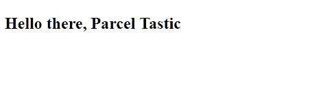

# 将宗地 JS 捆扎机与 React 一起使用

> 原文：<https://dev.to/kendalmintcode/using-parcel-js-bundler-with-react-27ja>

几天前我写了一篇关于我的[包裹 JS 初学者工具包](https://dev.to/kendalmintcode/using-parcel-bundler-as-a-webpack-alternative-503d-temp-slug-9845603)的文章，并使用[包裹 JS 捆绑器作为流行的 Webpack](https://dev.to/kendalmintcode/using-parcel-bundler-as-a-webpack-alternative-503d-temp-slug-9845603) 的替代(是的，我甚至有一个 [Webpack 初学者工具包](https://dev.to/kendalmintcode/quick-start-javascript-projects-with-this-webpack-project-starter-kit-475f-temp-slug-8559448)！).

然而，如果你非常热衷于使用 React，但不想走上[创建 React 应用](https://facebook.github.io/create-react-app/)的道路，请继续阅读！我将在 [Parcel JS 初学者工具包](https://dev.to/kendalmintcode/using-parcel-bundler-as-a-webpack-alternative-503d-temp-slug-9845603)的基础上添加一些必要的拼图，这样您就可以在您的 Parcel 项目中使用 [React JS](https://reactjs.org/) 。

## 创建 React App 怎么了？

说实话，不多。这是一个**奇妙的资源**,我在个人和职业上使用它都没有遇到任何问题。然而，Create React App 抽象了它的底层 Webpack 设置。这种抽象并不适合每个人和每个项目，有些人只是不想牺牲对配置的控制。

但当然，避免 Create React App 的配置秘密所带来的控制上的好处，被让它与 Webpack 或 Parcel 等系统很好地配合所需的额外工作所抵消。

嗯，直到现在！

## 如何对包裹 JS 使用 React？

因为我们现在要单独进行，所以我们必须给我们的项目添加一些东西，以便让 React 工作，并开始使用漂亮、闪亮的 ES6 语言语法和特性。即:

*   React(还有一些 React 位，比如 React Component)。
*   巴别。对于巴别塔，我们还将添加正确的预设和一些反应细节，以便巴别塔和反应可以很好地相互配合。
*   是的，这已经包含在项目中了，但是我们需要在这里做一些改动来使一切正常工作。

### 这是从一个工具包开始的

我们将构建上一篇文章中的 [CodeSandbox 示例，您可能还记得，它看起来像这样:](https://codesandbox.io/s/8z4vzk10p8?fontsize=14)

[](https://res.cloudinary.com/practicaldev/image/fetch/s--XFs_Z2wM--/c_limit%2Cf_auto%2Cfl_progressive%2Cq_auto%2Cw_880/https://robkendal.co.uk/static/53f4f99e52ea2282c6393fd2f1c7b030/1a1ab/screenshot_2019-04-27-codesandbox-1-.png)

这是使用普通的 ol' JavaScript 来加载下面的代码:

```
const myName = {
  firstName: "Parcel",
  lastName: "Tastic"
};
document.querySelector("#app").innerHTML = `Hello there, ${myName.firstName}  ${
  myName.lastName
}`; 
```

Enter fullscreen mode Exit fullscreen mode

### 向基础项目添加 React(和朋友)

让我们反应一下(我能主张这个新词吗？)这只小狗！我们需要添加 React(别开玩笑了！)，巴别塔，并在菜谱中加入一些设定。

首先:让我们用下面的命令添加 React:

```
yarn add react react-dom 
```

Enter fullscreen mode Exit fullscreen mode

这将添加基本的 React JS 库和 React DOM 模块，使我们能够将我们的内容实际输出到页面上。接下来，我们将添加一些 Babel transpilation 配置善良。

说到 Babel，Parcel 是一个很好的鸡蛋，它默认包含 Babel(你可以[阅读 Parcel 的 transforms 文档](https://parceljs.org/transforms.html)了解更多信息)，但是你**必须添加一个*。babelrc* 文件到你的路线来启用这个功能！**。

然而，我们必须添加巴贝尔的反应预设，所以让我们现在就做:

```
yarn add @babel/preset-react --dev 
```

Enter fullscreen mode Exit fullscreen mode

现在，只需要在我们的项目路径中创建一个`.babelrc`文件，并添加一些配置选项:

```
{  "presets":  [  "env",  "@babel/preset-react"  ],  } 
```

Enter fullscreen mode Exit fullscreen mode

在`.babelrc`文件中，我们实际上是告诉 Babel 使用它的 ES2015/ES6 transpilation 选项，但也要注意一些 React 细节，比如。jsx 语法。

### 更新我们的 index.js 以使用 React

如果你保存、构建和刷新一切，你会有点失望。React 实际上什么也做不了，我们必须用 React 代码替换掉我们的普通 JS！

打开`/index.js`文件，添加一些 React 来替换我们之前的元素选择器。

```
// firstly, we need to import React and ReactDOM
// this enables us to create React components and render them on the page
import React from "react";
import ReactDOM from "react-dom";

// our 'myName' object remains the same
const myName = {
  firstName: "Parcel",
  lastName: "Tastic"
};

// let's create a simple stateless React component that accepts a name object
// and outputs a heading level 2
const Title = props => {
  return (
    <h2>
      Hello there, {props.name.firstName} {props.name.lastName}
    </h2>
  );
};

// finally, we're taking the same #app id selector to find out main HTML element
// and passing that, plus our Title component to React to render
ReactDOM.render(
  ,   document.querySelector("#app")
); 
```

Enter fullscreen mode Exit fullscreen mode

哒哒！没有非常闪光的东西，只是白色背景上的黑色文本，但它确实有用，是一个很好的例子，说明你可以使用 Parcel 和 React 一起做很少的工作。

[](https://res.cloudinary.com/practicaldev/image/fetch/s--qbsLmJtl--/c_limit%2Cf_auto%2Cfl_progressive%2Cq_auto%2Cw_880/https://robkendal.co.uk/static/4b079158b318137b2e3631c3c6fa5164/37e1f/screenshot_2019-04-27-codesandbox.png)

## 完整的例子和下一步步骤

如果你想探索整个项目，你可以[在 CodeSandbox 网站](https://codesandbox.io/s/w0410q1228?fontsize=14)查看一下。或者，我在下面嵌入了完整的项目供您阅读。

[https://codesandbox.io/embed/w0410q1228](https://codesandbox.io/embed/w0410q1228)

从这里开始，世界就是你的了。目前，我们已经**将 React 添加到一个包 JS 项目**中，并让它做一些事情，嗯，React-y。但是你可以编辑它，添加更多组件，并使它成为一个成熟的 React SPA 或 web 应用程序——前途无量！

不管是哪种方式，希望您能感受到 Parcel JS 的强大，以及它在寻找更复杂的 beasts 的替代方案时所提供的灵活性，比如 Create React App 或 Webpack。