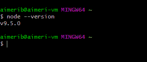
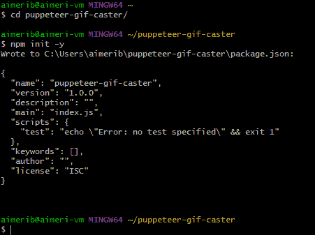
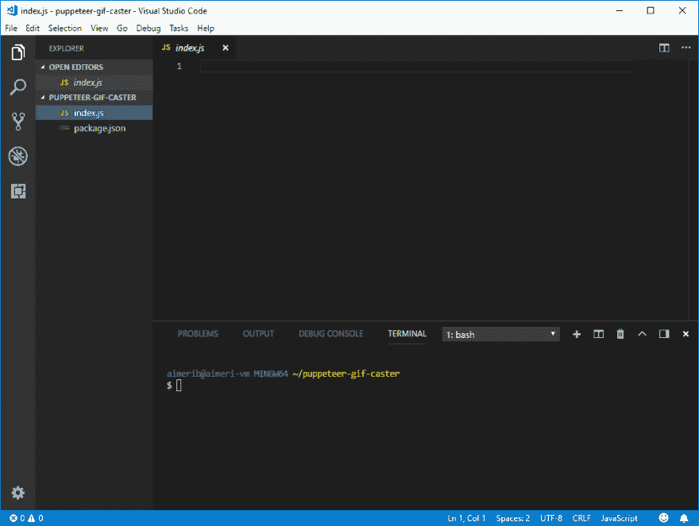
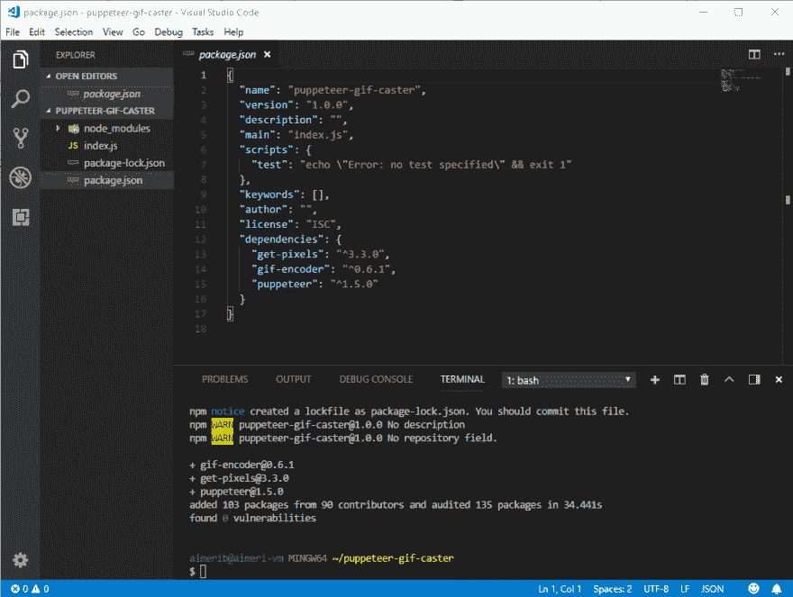
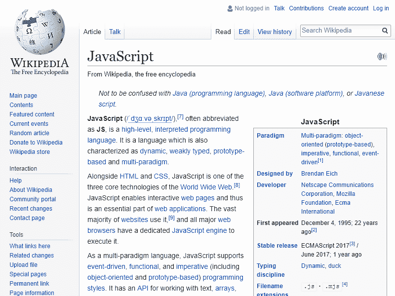

# 使用木偶师制作页面滚动的动画 gif

> 原文：<https://dev.to/aimerib/using-puppeteer-to-make-animated-gifs-of-page-scrolls-1lko>

在这篇操作指南中，我们将使用一个无头的 Google Chrome 实例 Puppeteer 来制作用户与网站交互的动画 gif。

<figure>[](https://res.cloudinary.com/practicaldev/image/fetch/s--p6eJhXVy--/c_limit%2Cf_auto%2Cfl_progressive%2Cq_66%2Cw_880/https://thepracticaldev.s3.amazonaws.com/i/2p5tzp3sxtr3ez7n0enj.gif)

<figcaption>Everylastdrop.co.uk 非常适合展示卷轴动画！</figcaption>

</figure>

出于本教程的目的，我们将只使用滚动，但与木偶戏的可能性只限于你的想象力。我们开始吧！第一步是确保你已经安装了 nodeJS。打开您选择的终端并输入:

```
node --version 
```

<figure>[](https://res.cloudinary.com/practicaldev/image/fetch/s--OfaX50E7--/c_limit%2Cf_auto%2Cfl_progressive%2Cq_auto%2Cw_880/https://thepracticaldev.s3.amazonaws.com/i/3x9bi0x9wwhu9eypbq0t.PNG) 

<figcaption>检查节点版本</figcaption>

</figure>

任何高于 8 的节点版本都适用于本教程。如果你还没有安装 node，去 https://nodejs.org/下载最新版本。
让我们继续创建我们的工作目录。我会叫我的木偶师 gif-caster，但是你可以叫你的任何名字。

```
mkdir puppeteer-gif-caster
cd puppeteer-gif-caster 
```

我们还需要启动我们的 NodeJS 项目。让我们快速地接受 node:
提供给我们的所有缺省值

```
npm init -y 
```

<figure>[](https://res.cloudinary.com/practicaldev/image/fetch/s--buQ2d3hN--/c_limit%2Cf_auto%2Cfl_progressive%2Cq_auto%2Cw_880/https://thepracticaldev.s3.amazonaws.com/i/ki8qc3b7ip3k6a2g3ntn.PNG) 

<figcaption>丁山</figcaption>

</figure>

node 默认使用 index.js 作为这个项目的入口点，所以让我们继续创建这个文件吧！

```
touch index.js 
```

现在，我们可以使用首选的代码编辑器打开这个文件。我将使用微软的 VS 代码，但也可以随意使用你选择的编辑器。

```
code . 
```

<figure>[](https://res.cloudinary.com/practicaldev/image/fetch/s--hicMXlaB--/c_limit%2Cf_auto%2Cfl_progressive%2Cq_auto%2Cw_880/https://thepracticaldev.s3.amazonaws.com/i/cmsflb6x0lasbkfckpqp.PNG) 

<figcaption>VS 代码用我们的工作文件夹打开</figcaption>

</figure>

接下来我们需要做的是为这个项目安装我们的依赖项。对于本教程，我们将使用以下 npm 包:

*   操纵木偶的人
*   gif-encoder(我们用来从木偶师拍摄的截图中创建 gif 的库)
*   get-pixels (gif-encoder 期望一个像素数组来缓冲每一帧。这个库返回 png、BMP 和 jpegs 的像素数组)

继续运行:
来安装它们

```
npm install puppeteer gif-encoder get-pixels 
```

这个过程需要一点时间来完成。完成后，打开 package.json，检查依赖项现在是否列在相应的部分中:

<figure>[](https://res.cloudinary.com/practicaldev/image/fetch/s--evI-vFA6--/c_limit%2Cf_auto%2Cfl_progressive%2Cq_auto%2Cw_880/https://thepracticaldev.s3.amazonaws.com/i/vkvvwjq7od5s92m64kxu.PNG)

<figcaption>Our package . JSON 带所有依赖项安装</figcaption>

</figure>

好了，我们终于准备好开始编码了！由于这个项目只是一个例子，我们将在一个 IIFE(立即调用函数表达式)中编写 gif caster，这意味着当我们使用 node 运行文件时，这个函数中的所有代码都将被调用。生命的标志是:

`(function())();`

这相当于编写这样的代码:

```
myFunction() {
    //code goes here
};

myFunction(); 
```

让我们从声明您的常量和变量以及实例化我们的依赖关系开始:

```
const puppeteer = require('puppeteer');
const GIFEncoder = require('gif-encoder');
const fs = require('fs'); /* we will need access to the file system. Fortunately
Node allows us to do that by using the file system library out of the box, hence
why we didn't need to install it with npm.*/
const getPixels = require('get-pixels');

const encoder = new GIFEncoder(width, height);
const workDir = './temp/'; /* we will create a temporary folder to work with
puppeteer's screenshots until we export the gif image. */
const file = require('fs').createWriteStream('mygif.gif'); /* we will need a 
stream to add the frames of the gift to, so let's go ahead and create a write
stream using the fs library. */ 
```

最好先检查并确保我们的工作目录存在，如果不存在，我们应该创建它:

```
if (!fs.existsSync(workDir)) {
  fs.mkdirSync(workDir);
}; 
```

我们还需要用创建 gif 时使用的参数来配置 gif 编码器。让我们现在就开始吧:

```
encoder.setFrameRate(60);
encoder.pipe(file); /* we will pipe the encoded pictures into the stream we
created earlier */
encoder.setQuality(40); /* the quality ranges from 10 to 90 with 10 being the
highest */
encoder.setDelay(500);
encoder.writeHeader();
encoder.setRepeat(0); /* how many times the gif will loop. 0 is infinite loop. */

/* Let's go ahead and start puppeteer and have it ready for our screenshot request */
const browser = await puppeteer.launch({ headless: true });
const page = await browser.newPage(); 
```

你可以通过查看 gif-encoder 的 github 文档了解更多关于每个参数的具体设置:[https://github.com/twolfson/gif-encoder](https://github.com/twolfson/gif-encoder)

此时，我们几乎已经准备好开始了！我们只需要几个助手函数来帮助我们将每个截图添加为 gif 中的一个帧，并在创建 gif 后清理截图文件。让我们现在做那件事。

我将从`addToGif()`函数开始，因为这是一个更复杂的函数。`addToGif()`有两个参数:一个图片数组和一个计数器(因为我们将循环使用这个函数，直到数组中的所有图片都被添加到 gif 中)。让我们声明这个函数:

```
function addToGif(images, counter = 0) {

}; 
```

接下来我们需要调用`getPixels()`从我们将要创建的每个截图中提取像素数组。`getPixels()`需要两个参数:一个图像和一个回调函数，该函数处理提取的像素和处理过程中收到的任何错误。让我们把数组里的图像传给`getPixels()` :

```
function addToGif(images, counter = 0) {
  getPixels(images[counter], function (err, pixels) {

  });
}; 
```

回调函数中需要做两件主要的事情:我们需要将像素添加到 gif 编码器中，我们需要检查我们是否已经添加了数组中的所有图片。多亏了`getPixels()`,将帧添加到我们的 gif 变得像将像素数据传递给我们的编码器一样简单:

```
function addToGif(images, counter = 0) {
  getPixels(images[counter], function (err, pixels) {
    encoder.addFrame(pixels.data);
    encoder.read();
  });
}; 
```

现在我们需要检查我们的计数器是否与我们的 images 数组中的项数大小相同(-1，因为数组从 0 开始)，如果是这样，我们需要告诉编码器我们完成了，否则我们需要增加计数器并再次调用`addToGif()`函数:

```
function addToGif(images, counter = 0) {
  getPixels(images[counter], function (err, pixels) {
    encoder.addFrame(pixels.data);
    encoder.read();
    if (counter === images.length - 1) {
      encoder.finish();
    }
    else {
      addToGif(images, ++counter);
    }
  });
}; 
```

这个功能差不多准备好了。但是等等！我们该如何处理剩下的截图呢？我们不能把它们丢在任何地方！让我们继续创建一个`cleanUp()`助手函数，并在我们的`addToGif()`中实现它。`cleanUp()`将接受一个文件数组和一个回调函数，并为数组中的每个文件删除文件。当数组中没有剩余文件时，回调将运行，我们将对它进行编程，以删除工作目录，在控制台中记录我们的进度，并退出节点进程:

```
function cleanUp(listOfPNGs, callback) {
  let i = listOfPNGs.length;
  listOfPNGs.forEach(function (filepath) {
    fs.unlink(filepath, function (err) {
      i--;
      if (err) {
        callback(err);
        return;
      } else if (i <= 0) {
        callback(null);
      }
    });
  });
}; 
```

让我们在我们的`addToGif()`函数中实现`cleanUp()`并处理`cleanUp()`回调:

```
function addToGif(images, counter = 0) {
  getPixels(images[counter], function (err, pixels) {

    encoder.addFrame(pixels.data);
    encoder.read();
    if (counter === images.length - 1) {
      encoder.finish();
      cleanUp(images, function (err) {
        if (err) {
          console.log(err);
        } else {
          fs.rmdirSync(workDir);
          console.log('Gif created!');
          process.exit(0);
        }
      });

    } else {
      addToGif(images, ++counter);
    }
  });
}; 
```

我们需要的最后一个助手函数将处理 puppeteer 中页面的滚动。这个想法很简单。我们只需要一个功能，告诉木偶师在我们拍摄下一个截图之前滚动页面一定的量。我们可以发送 javascript 代码，通过调用`page.evaluate()`并传递我们希望在浏览器上执行的函数，木偶师将在无头浏览器上为我们执行这些代码。类似这样的东西应该非常适合我们的需求:

```
async function scrollPage() {
  await page.evaluate(async () => {
    window.scrollBy(0, 100);
  });
} 
```

唷！这是很多的准备工作，但是我们现在已经准备好开始我们的 AmazingGIFMaker 了！让我们首先定义我们的视口的大小，并告诉木偶师浏览到我们试图捕捉的页面:

```
await page.setViewport({ width: 800, height: 600 });
await page.goto('https://en.wikipedia.org/wiki/JavaScript'); /* We are using
wikipedia's entry for JavaScript for this example, but feel free to try any other website. 
Everylastdrop.co.uk is a good one to play with the window.scrollBy method from above! */ 
```

我们可以根据需要截取尽可能多的截图，以确保 gif 给人滚动的错觉。我认为 60 是个好数字，但也可以随意摆弄这个数字。只要记住你的截图越多，你的 gif 文件就越大。让我们创建一个将循环 60 次的`for loop`，它将截图，滚动页面，并重复:

```
for (let i = 0; i < 60; i++) {
  await page.screenshot({ path: workDir + i + ".png" });
  await scrollPage();
} 
```

然后我们就可以关闭木偶师。我们现在已经有了所有需要的截图，现在可以使用我们的帮助函数了:

`await browser.close();`

我们有一个包含 60 张 PNG 图像的文件夹，所以现在我们需要将这些图像添加到一个数组中，并将该数组传递给我们的`addToGif()`函数。为了创建 png 列表，让我们读取我们的工作目录，删除扩展名，按照升序对文件名进行排序，并将完整路径和扩展名添加回数组的每一项:

```
let listOfPNGs = fs.readdirSync(workDir)
  .map(a => a.substr(0, a.length - 4) + '')
  .sort(function (a, b) { return a - b })
  .map(a => workDir + a.substr(0, a.length) + '.png'); 
```

我们终于可以调用我们的`addToGif()`函数传递截图数组，等待我们的 gif 生成！

下面是完整的代码。带着代码转一圈，享受创建您选择的任何页面的动画 gif 的乐趣！

```
(async () => {
  const puppeteer = require('puppeteer');
  const GIFEncoder = require('gif-encoder');
  const encoder = new GIFEncoder(800, 600);
  const fs = require('fs');
  const getPixels = require('get-pixels');
  const workDir = './temp/';
  let file = require('fs').createWriteStream('mygif.gif');
  const browser = await puppeteer.launch({ headless: true });
  const page = await browser.newPage();

  if (!fs.existsSync(workDir)) {
    fs.mkdirSync(workDir);
  };

  // Setup gif encoder parameters
  encoder.setFrameRate(60);
  encoder.pipe(file);
  encoder.setQuality(40);
  encoder.setDelay(500);
  encoder.writeHeader();
  encoder.setRepeat(0);

  // Helper functions declaration
  function addToGif(images, counter = 0) {
    getPixels(images[counter], function (err, pixels) {

      encoder.addFrame(pixels.data);
      encoder.read();
      if (counter === images.length - 1) {
        encoder.finish();
        cleanUp(images, function (err) {
          if (err) {
            console.log(err);
          } else {
            fs.rmdirSync(workDir);
            console.log('Gif created!');
            process.exit(0);
          }
        });

      } else {
        addToGif(images, ++counter);
      }
    });
  };

  function cleanUp(listOfPNGs, callback) {
    let i = listOfPNGs.length;
    listOfPNGs.forEach(function (filepath) {
      fs.unlink(filepath, function (err) {
        i--;
        if (err) {
          callback(err);
          return;
        } else if (i <= 0) {
          callback(null);
        }
      });
    });
  };

  async function scrollPage() {
    await page.evaluate(async () => {
      window.scrollBy(0, 100);
    });
  }

  await page.setViewport({ width: 800, height: 600 });
  await page.goto('https://en.wikipedia.org/wiki/JavaScript');

  for (let i = 0; i < 60; i++) {
    await page.screenshot({ path: workDir + i + ".png" });
    await scrollPage();
  }

  await browser.close();

  let listOfPNGs = fs.readdirSync(workDir)
    .map(a => a.substr(0, a.length - 4) + '')
    .sort(function (a, b) { return a - b })
    .map(a => workDir + a.substr(0, a.length) + '.png');

  addToGif(listOfPNGs);
})(); 
```

<figure>[](https://res.cloudinary.com/practicaldev/image/fetch/s--rxEghuer--/c_limit%2Cf_auto%2Cfl_progressive%2Cq_66%2Cw_880/https://thepracticaldev.s3.amazonaws.com/i/ugthded1grmlnc9bizct.gif) 

<figcaption>我们的动画截图在行动</figcaption>

</figure>