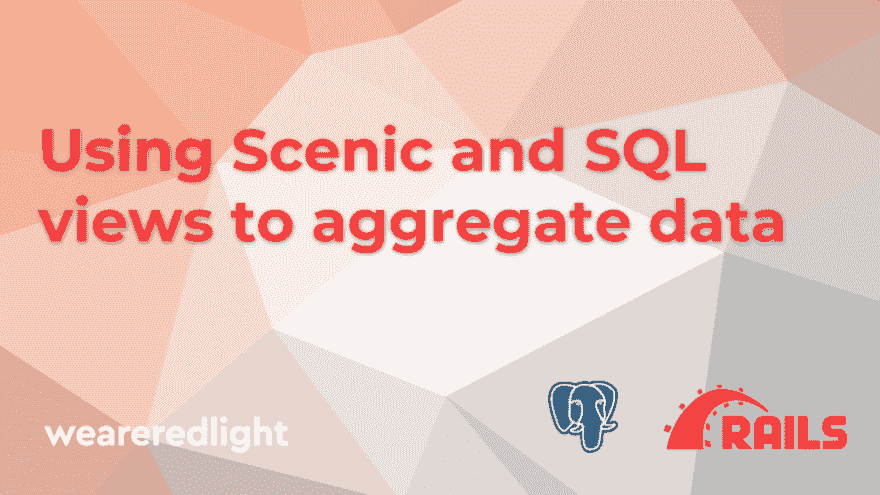
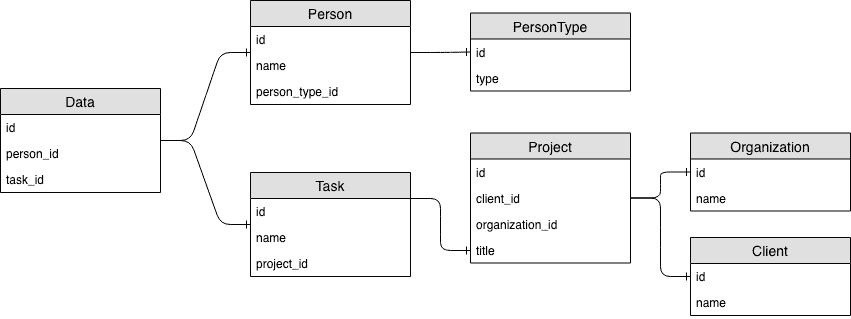

# 使用场景视图和 SQL 视图聚集数据

> 原文：<https://dev.to/weareredlight/using-scenic-and-sql-views-to-aggregate-data-226k>

[](https://res.cloudinary.com/practicaldev/image/fetch/s--Bfhe36HG--/c_limit%2Cf_auto%2Cfl_progressive%2Cq_auto%2Cw_880/https://cdn-images-1.medium.com/max/1600/1%2Ae5GfybqgP5aCH08hYcEVGg.png)

众所周知，Ruby on Rails (RoR)社区是一个大型的、成熟的社区，它从最大的软件包仓库之一 RubyGems 中获益匪浅，在撰写本文时，它提供了 147k 个软件包。

这个简短的介绍也意味着几乎有一个包可以满足你的任何需求，这就是我遇到的 [**景区**](https://github.com/thoughtbot/scenic) 的情况。

通过使用一个标准的 RDBMS(关系数据库),我们将不同种类的数据拆分到它自己的表中，并保持它的规范化。随着更多的表被创建，并且数据现在更加分散，获取一组特定的数据可能会变得有点棘手。

现在让我们实际一点。

假设我们有以下数据库结构:

[](https://res.cloudinary.com/practicaldev/image/fetch/s--oQcr09jI--/c_limit%2Cf_auto%2Cfl_progressive%2Cq_auto%2Cw_880/https://cdn-images-1.medium.com/max/1600/1%2A9rCeKOWtHnSW1xDC1qoMKg.png)

随着项目的增长，可以创建新类型的表，关系也会增长。

当使用 ActiveRecord 试图查询和过滤数据以及各自的关联时，复杂性增加了。作为第一步，我们可以这样做(假设在模型中指定了所有关系):

```
Data  
  .joins(:people, :tasks, task: :project, task: { project: :organization }, ...)  
  .where(tasks: { projects: { organization_id: [] } }) 
```

连接的数量可能会增长到无法控制的程度，并且选择也可能很难构建。每次您需要应用相同类型的过滤器时，您都需要再次连接所有内容，并使用 *where* 导航，重新构建查询。_

在展示一个更简单的解决方案之前，我们先来谈谈 SQL 视图:

1.  视图可以表示表中包含的数据的子集；
2.  视图可以将多个表连接并简化成一个**虚拟表**；
3.  视图**可以充当聚合表**，其中数据库引擎聚合数据(总和、平均值等)并将计算结果作为数据的一部分呈现。

简而言之，一个视图被查询变成了一个可以被查询的*虚拟* *表*。另一方面，物化视图实际上是作为一个表保存的视图，需要刷新它的值才能更新(适用于长查询、预计算数据)

[**Scenic**](https://github.com/thoughtbot/scenic) 为您提供了一种在 Rails 中定义 SQL 视图的方法，包括迁移和 SQL 代码。它的目的是帮助您以可维护的方式定义 SQL 视图。

继续上面的例子，如果我们想定义一个查询，在这里我们可以过滤人员类型、任务(和各自的名字)、项目、组织和客户，我们可以这样写:

```
SELECT  
  d.id as data_id,  
  d.person_id AS person_id,  
  t.name AS task_name,  
  t.project_id AS project_id,  
  pt.type AS person_type,  
  p.organization_id AS organization_id,  
  p.client_id AS client_id  
FROM data d  
LEFT JOIN people ON d.person_id = people.id  
LEFT JOIN person_types pt ON people.person_type_id = pt.id  
LEFT JOIN tasks t ON d.task_id = t.id  
LEFT JOIN projects p ON t.project_id = p.id 
```

检查上面的结构作为一个简单的表，我们得到:

[](https://res.cloudinary.com/practicaldev/image/fetch/s--25moR7-I--/c_limit%2Cf_auto%2Cfl_progressive%2Cq_auto%2Cw_880/https://cdn-images-1.medium.com/max/1600/1%2AdQTH-WIkSOACXmo752nWxQ.png)

该 SQL 代码在其自己的文件中定义，并由相应的迁移使用。可以通过对相同的视图名称再次运行 Scenic 任务来更新 SQL 视图，它会自动生成新的 SQL 文件和迁移来更新视图。

我现在可以**用这张桌子*看*背一个模型**，这就是风景的美。

```
class DataAggregate < ApplicationRecord  
  belongs_to :data

  self.primary_key = 'data_id'

  def readonly?  
    true  
  end  
end 
```

并将 *DataAggregate* 模型用作任何其他 ActiveRecord 模型。现在，我可以将过滤查询写成:

```
data = Data.joins(:data_aggregate)  
data = data.where('organization_id IN (?)', filters.org_ids) if filters.org_ids.present?  
data = data.where('client_id IN (?)', filters.client_ids) if filters.client_ids.present?  
data = data.where('project_id IN (?)', filters.project_ids) if filters.project_ids.present?  
data = data.where('person_id IN (?)', filters.user_ids) if filters.user_ids.present?  
data = data.where('task_id IN (?)', filters.task_ids) if filters.task_ids.present? 
```

通过用 DataAggregate 连接数据，我从 DataAggregate 获得了原始数据表列和所有其他列，因此能够进一步编写更简单的带有 ActiveRecord 的查询。

我们还可以定义一个范围来连接数据，只需使用`Data.with_aggregates`。

```
scope :with_aggregates do  
  joins(:data_aggregate)  
end 
```

风景的另一个强大用例是物化视图。我可以定义一个生成起来非常耗时的视图(包含许多聚合和连接的复杂 SQL 查询),并不时或按需刷新它。这可能有助于通过显示缓存/预先计算的计算来减少加载时间。

如果你想摆弄以前的数据库结构和数据，只需在[https://www.db-fiddle.com/f/ojLiDMLRajXXhhGqzi3P26/0](https://www.db-fiddle.com/f/ojLiDMLRajXXhhGqzi3P26/0)检查数据库/SQL 拨弄

阅读我们之前关于[监控 Rails 性能](https://blog.weareredlight.com/el-cheapo-rails-performance-metrics-part-1-d05bc4c03456)的博文。

你也可以在我们的媒体页面上看到同样的帖子:[https://blog . weareredlight . com/using-scenic-and-SQL-views-to-aggregate-data-72861 b 75 a 0 FD](https://blog.weareredlight.com/using-scenic-and-sql-views-to-aggregate-data-72861b75a0fd)