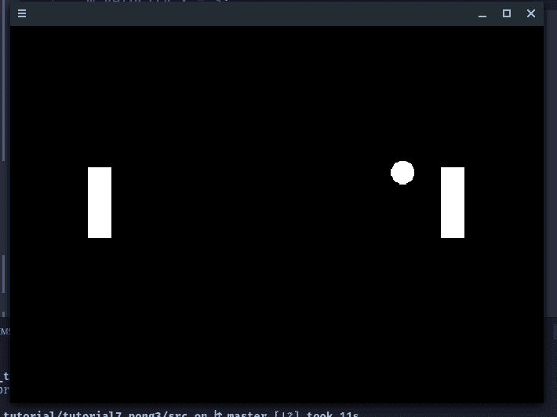

# 使用 SDL: Pong 4

> 原文：<https://dev.to/noah11012/using-sdl-pong-4-3ah1>

我们的游戏快结束了。我们把球放在屏幕上，它会移动。但是，球的运动只是一维的。它只能向左或向右移动，但不能走对角线轨迹。

在继续主要的改变之前，我想展示一些对`Ball`类的初步改变。

首先，`m_velocity`成员变量被重命名为`m_velocity_x`,以更好地反映它是 x 轴的速度。另外，对于 y 轴，我们有`m_velocity_y`。最后，`m_y`为 y 位置的位置。

```
private:
    int m_velocity_x;
    int m_velocity_y;
    double m_x;
    double m_y;
    ... 
```

Enter fullscreen mode Exit fullscreen mode

现在是重头戏。

我们真正需要做的是为`m_velocity_y`设置一个值。一种选择是具有任意值的硬编码值。另一个更好的方法是为速度创建一个随机值。

```
void Ball::init(SDL_Renderer *renderer, int x, int y)
{
    ...
    std::uniform_int_distribution<> dist_y(1, 3);
    m_velocity_y = dist_y(rand_gen);

    if(dist_x(rand_gen) == 0)
    {
        m_velocity_y = -m_velocity_y;
    }
} 
```

Enter fullscreen mode Exit fullscreen mode

我们创建一个新的`std:uniform_int_distribution`,并将范围设置在 1 和 3 之间。但是现在对角线只会有下降的趋势。为了解决这个问题，我们在 0 和 1 之间随机取一个值。如果它是 0，我们反转速度，让它以上升的趋势行进。我们将重用`dist_x()`,因为它已经有了从 0 到 1 的范围。

在我们编译和运行之前，我们必须改变`Ball::update()`方法来反映我们的改变:

```
void Ball::update(double delta_time)
{
    m_x = m_x + (m_velocity_x * delta_time);
    m_y = m_y + (m_velocity_y * delta_time);
    m_position.x = m_x;
    m_position.y = m_y;
} 
```

Enter fullscreen mode Exit fullscreen mode

编译并运行。

[](https://res.cloudinary.com/practicaldev/image/fetch/s--71_iKVSZ--/c_limit%2Cf_auto%2Cfl_progressive%2Cq_auto%2Cw_880/https://thepracticaldev.s3.amazonaws.com/i/qibk3zu2le0007u4oaj9.png)

## 接下来是什么

在下一篇文章中，我们将实现球拍和球的碰撞检测。

Github 库:[https://github.com/Noah11012/sdl2-tutorial-code](https://github.com/Noah11012/sdl2-tutorial-code)