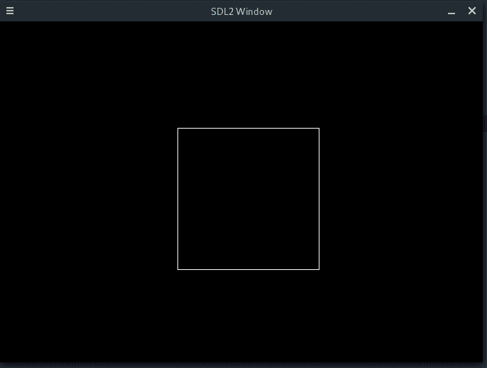
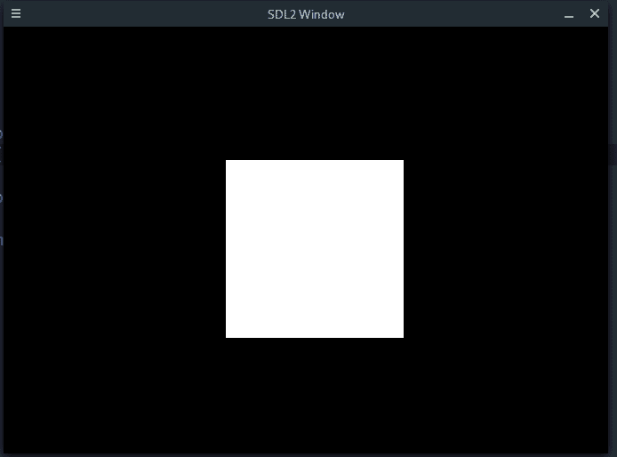

# 使用 SDL2:绘制矩形

> 原文：<https://dev.to/noah11012/using-sdl2-drawing-rectangles-3hc2>

借助 SDL2 中新的 2D 硬件加速 API，我们可以绘制像矩形这样的基本形状。两个函数，`SDL_RenderDrawRect()`和`SDL_RenderFillRect()`是可用于在屏幕上绘制矩形的函数。这两者的区别将在后面讨论。

这两个函数都使用一个指向`SDL_Rect`的指针来获取它的位置和尺寸。因为两者都是硬件渲染 API 的一部分，每个都有一个指向`SDL_Renderer`的指针。

`SDL_RenderDrawRect()`绘制矩形的轮廓，而`SDL_RenderFillRect`绘制填充的矩形。

在我们向屏幕绘制任何矩形之前，我们可以用`SDL_SetRenderDrawColor()`改变它将使用的颜色，它有四个参数:

*   一个`SDL_Renderer`
*   红色值从 0-255
*   绿色值从 0-255
*   蓝色值从 0-255
*   从 0 到 255 的 Alpha 值

重用 Pong 系列之前的`Application`类，我们有以下代码:

```
void Application::draw()
{
    SDL_RenderClear(m_window_renderer);

    SDL_Rect rect;
    rect.x = 250;
    rect.y = 150;
    rect.w = 200;
    rect.h = 200;

    SDL_SetRenderDrawColor(m_window_renderer, 255, 255, 255, 255);
    SDL_RenderDrawRect(m_window_renderer, &rect);

    SDL_SetRenderDrawColor(m_window_renderer, 0, 0, 0, 255);

    SDL_RenderPresent(m_window_renderer);
} 
```

Enter fullscreen mode Exit fullscreen mode

编译并运行。

[](https://res.cloudinary.com/practicaldev/image/fetch/s--YAJl9JOi--/c_limit%2Cf_auto%2Cfl_progressive%2Cq_auto%2Cw_880/https://thepracticaldev.s3.amazonaws.com/i/8vdbwjci9po4iqiy60og.png)

换填版也一样简单:

```
void Application::draw()
{
    ...
    SDL_RenderFillRect(m_window_renderer, &rect);

    ...

    SDL_RenderPresent(m_window_renderer);
} 
```

Enter fullscreen mode Exit fullscreen mode

编译并运行。

[](https://res.cloudinary.com/practicaldev/image/fetch/s--h4Tl5Hhz--/c_limit%2Cf_auto%2Cfl_progressive%2Cq_auto%2Cw_880/https://thepracticaldev.s3.amazonaws.com/i/rcpqracoec9u8m9lyrtp.png)

除了矩形，SDL2 还支持另外两种图元。即线和点。

我们将很快地看一看这两者。

`SDL_RenderDrawLine()`:

*   `SDL_Renderer`
*   起点的 x 值
*   起点的 y 值
*   终点的 x 值
*   终点的 y 值

`SDL_RenderDrawPoint()`:

*   `SDL_Renderer`
*   位置的 x 值
*   位置的 y 值

## 接下来是什么

在下一篇文章中，我们将学习如何操纵视口来渲染世界的某些部分。

Github 库:[https://github.com/Noah11012/sdl2-tutorial-code](https://github.com/Noah11012/sdl2-tutorial-code)