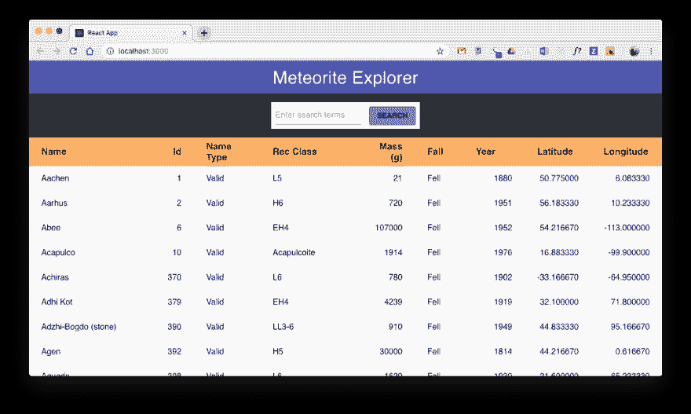
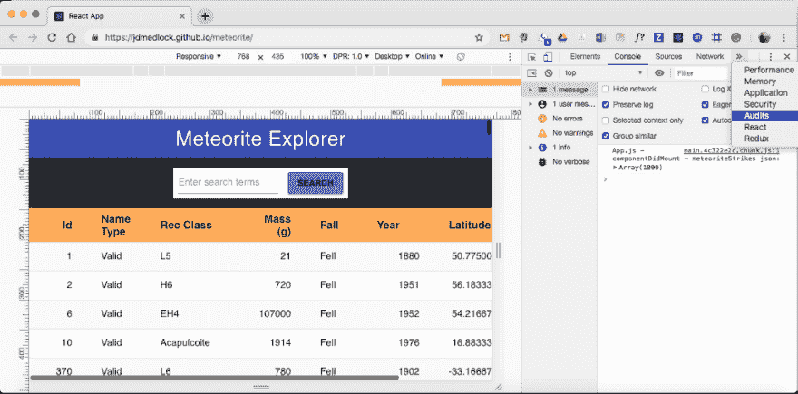
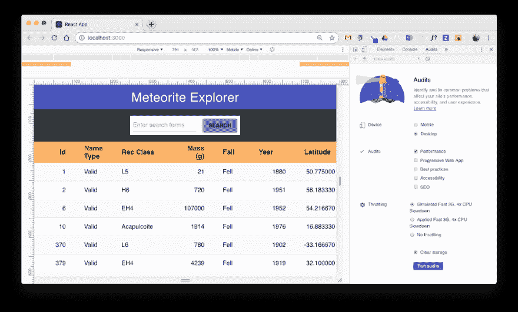
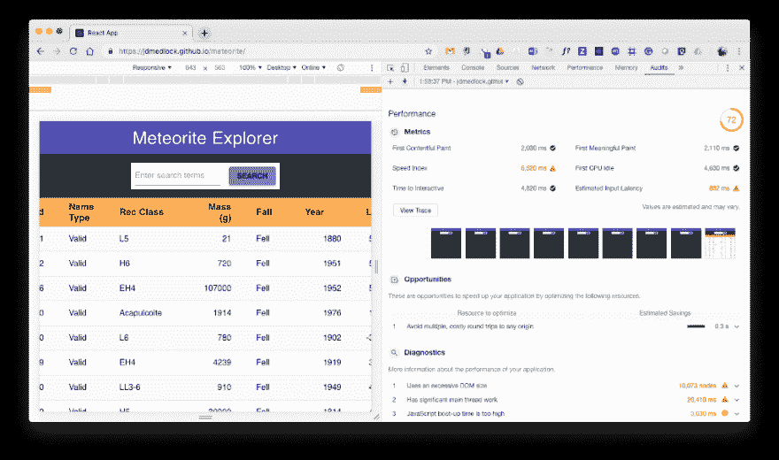
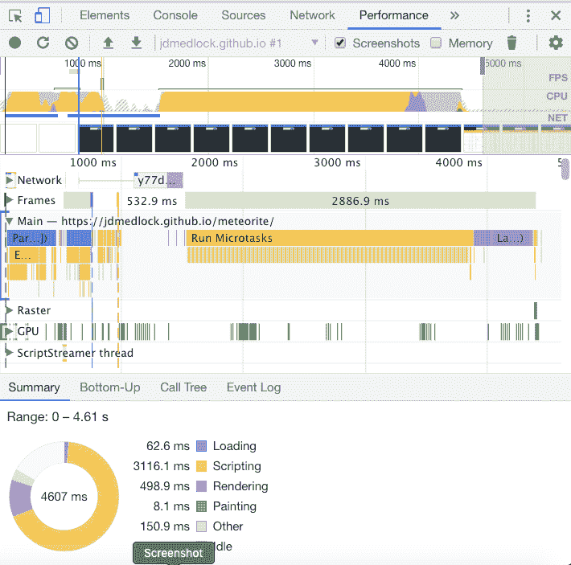
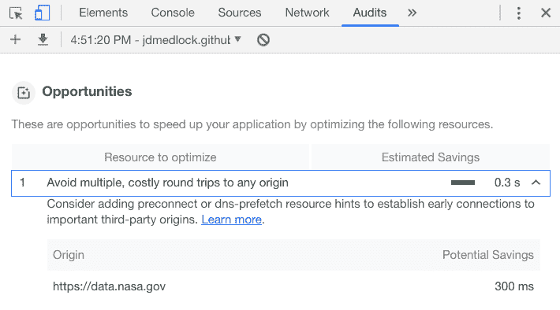
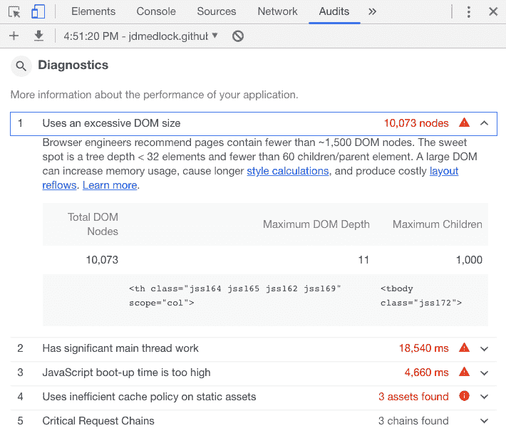
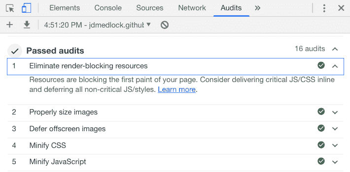

# 使用 Chrome DevTools 的审计特性来测量和优化性能(第 1 部分)

> 原文：<https://dev.to/chingu/using-the-chrome-devtools-audit-feature-to-measure-and-optimize-performance-part-1-2kop>

#### 创建您的性能调整流程

<figure> 

<figcaption>照片由[克里斯蒂安·凯恩德尔](https://unsplash.com/photos/xnUQO2DwXOo?utm_source=unsplash&utm_medium=referral&utm_content=creditCopyText)上传 [Unsplash](https://unsplash.com/search/photos/measuring?utm_source=unsplash&utm_medium=referral&utm_content=creditCopyText)</figcaption>

</figure>

在之前的一篇文章“React Application Performance Analysis”中，我们提到了 Chrome DevTools 在分析应用程序性能时的一些有用特性，并描述了性能测量和调优的工作流程。

现在让我们更深入地了解 Chrome DevTools，看看如何使用审计功能来查明和纠正性能问题，主要使用这四个工具，

*   Chrome 开发者工具的审计功能
*   Chrome 的 React 插件
*   [科学方法](https://en.wikipedia.org/wiki/Scientific_method)
*   你的知识和经验

正如工具对于减轻与任何任务相关的“繁重”工作至关重要一样，对结果产生最大影响的是将您的知识和经验与可重复的过程相结合。更多地依赖这些，而不是工具，将允许您根据需求和环境的变化在过程中交换不同的工具。这也是一种扩展你的知识和经验的好方法，因为它强化了你已经知道是真实的东西，挑战了你认为是真实的东西。

我们开始吧！

### 陨石探索者应用

我们将要分析的应用程序是[陨石探测器](https://jdmedlock.github.io/meteorite/)。该应用程序的唯一目的是展示来自 Nasa 开放数据门户上的[陨石降落](https://data.nasa.gov/Space-Science/Meteorite-Landings/gh4g-9sfh)数据集的陨石降落数据。追溯到公元 301 年的大约 46K 次报告的陨石撞击的信息以表格形式呈现，并具有搜索着陆位置名称的能力。

<figure> 

<figcaption>图 1 —陨石探索者</figcaption>

</figure>

与其指出当前应用程序中的缺陷，不如尝试一下，问问自己，

1.  是否有任何领域的性能会影响到[用户体验](https://en.wikipedia.org/wiki/User_experience)(如 UX)？
2.  所有[用例](https://en.wikipedia.org/wiki/Use_case)的性能是否一致，或者是否有特别有效的特定用例？
3.  性能通常可以接受吗，或者它的影响会限制应用程序的有效性吗？

陨石探索者 repo 托管在 [GitHub](https://github.com/jdmedlock/meteorite) 上，在任何调整之前，起点驻留在分支`feature/01-initial-app`中。

### 性能调优工作流程

<figure> 

<figcaption>从[www.pexels.com](http://www.pexels.com)</figcaption>

</figure>

我们的性能调优工作流在概念上很简单，但像大多数“简单”的事情一样，实现和遵循起来可能很复杂。组成我们的流程或“工作流”的高级步骤是:

1.  拍摄性能的基线快照。
2.  查看快照并确定问题区域。
3.  为如何改变应用程序以提高其性能出谋划策。
4.  孤立地测试每个想法，并根据基线衡量绩效。
5.  选择具有最积极影响的想法，实施它，并创建新的性能基线，作为生产部署过程的一部分。

此时，你可能会想“这个过程听起来像科学方法！”这是有充分理由的。因为它代表了科学方法的核心原则——观察、假设、实验和提炼。

#### 实用快捷键

需要指出的是，有一些捷径可以让这个过程变得更快。最明显的是原始基线的回顾(步骤 2)可能没有显示任何问题。如果是这种情况，那么就没有必要进行任何调整。

同样，您可能会发现有些地方值得关注，但没有严重到需要额外调整的程度。在这种情况下，把你的观察记录下来，这样你就有了你需要的信息，如果问题变得更有影响，你就能给予它应有的关注。但是，如果您选择推迟解决问题，请小心不要让它成为另一个[技术债务](https://en.wikipedia.org/wiki/Technical_debt)的例子。

当你在想如何纠正一个问题时(如[假设](https://en.wikipedia.org/wiki/Hypothesis)，不要过度分析它的重要性。建议在确定可能的解决方案时要有创造性，但要依靠你对情况和应用的了解，以及问题的严重性，来创建一个更有针对性的途径列表。

> "用你的直觉作为出发点是没问题的."

有一个简短的想法列表来测试更实际、更有效，并且随之而来的是更容易实现。使用你的[直觉](https://en.wikipedia.org/wiki/Intuition)是没问题的，因为一个自我修正的过程正在进行。如果你的直觉是不正确的，这个过程将揭示这个解决方案没有达到预期的效果，需要另一个解决方案。

#### 错了没关系

此外，请记住，犯错是完全可以接受的，因为我们从错误中学到的东西往往比我们从成功中学到的东西更重要。观察-假设-测试-提炼方法的优势之一是它既捕捉到错误的想法，又建立在错误的想法之上。

> “你建立在失败之上。你把它当作垫脚石。关上过去的大门。你不会试图忘记错误，但你不会纠结于此。你不让它占用你的任何精力、任何时间或任何空间。”…约翰尼·卡什

犯错并不可耻。任何污名都应该是一遍又一遍重复同样错误的结果。

### 基线申请

<figure> 

<figcaption>照片由[萨兰迪·韦斯特法尔](https://unsplash.com/photos/7l8z2pIbHYk?utm_source=unsplash&utm_medium=referral&utm_content=creditCopyText)上[下](https://unsplash.com/search/photos/snapshot?utm_source=unsplash&utm_medium=referral&utm_content=creditCopyText)</figcaption>

</figure>

就像照片捕捉特定时刻的图像一样，基线捕捉应用程序在其生命周期中特定时刻的性能概况。基线的目的是建立一个位置，从这个位置可以分析变更的影响，以确定它们是改善了还是降低了最初的问题。

> “如果你不能衡量它，你就不能管理它。”…彼得·德鲁克

在之前的[文章](https://goo.gl/WvczNT)中，我们研究了如何使用 Chrome 开发者工具和 React 组件分析器的基本功能来测量应用性能。然而，在过去的一年中，发生了两个变化，改变了我们现在使用的工具。

首先，React release 16 [弃用了](https://reactjs.org/docs/perf.html)React 组件剖析器，取而代之的是建议使用原生浏览器剖析工具。第二，“审计”功能[在 60 版 Chrome 的开发者工具中增加了](https://goo.gl/nu5cfd)谷歌[灯塔](https://developers.google.com/web/tools/lighthouse/)。

#### 捕捉基线

要创建基线快照，首先启动开发者工具( *Option+Command+I* 在 MacOS 上)，然后从“> >”菜单中选择“审计”项目。

<figure> 

<figcaption>图 2 —在 Chrome 开发工具</figcaption>

</figure>

中选择审计功能(又名灯塔)

审计功能在浏览器窗口的开发工具窗格中显示各种功能和选项。“Device”部分列出了用于审核的设备类型，“Audits”表示要执行的审核，“Throttling”部分定义了要模拟的网络条件。

对于此讨论，请选择“桌面”、“性能”和“模拟快速 3G、4 倍 CPU 减速”，然后单击窗格底部的“运行审核”按钮。

<figure> 

<figcaption>图 3 —审计特征选项</figcaption>

</figure>

#### 运行绩效审计

<figure> 

<figcaption>图 4 —审计绩效概述</figcaption>

</figure>

运行性能审计需要一些时间，所以请耐心等待。审核完成后，结果将显示在审核窗格中，并分为四个类别，

> 韵律学

结果部分的第一部分提供了关键绩效指标的健康状况，以及代表总体绩效的总得分。每个指标由一个标准的红-黄-绿健康指示器及其运行时间组成。将鼠标悬停在某个项目上，会显示一个概述和一个指向更多信息的链接。

本部分末尾的“查看跟踪”按钮显示应用程序执行的活动的跟踪。有利的是，包括了显示 UI 沿着活动时间线的状态的截屏。

<figure> 

<figcaption>图 5 —审计指标跟踪输出</figcaption>

</figure>

> 机会

指标部分的机会部分提供了一个“速赢”列表，即您可以通过优化资源消耗来改进应用程序的方法。每个机会都显示其预期的节约，单击它将显示概述、附加信息链接和补充信息。

<figure> 

<figcaption>图 6 —审计时机</figcaption>

</figure>

> 诊断学

诊断提供了影响应用程序性能的其他方面。每个诊断包括一个红色或黄色严重性指示器以及一个相关的测量值。像其他审计组件一样，单击诊断将显示概述、补充指标和到其他信息的链接。

<figure> 

<figcaption>图 7 —审计诊断</figcaption>

</figure>

> 通过审计

指标部分不仅提供了应用程序出错的概述，还提供了正确的内容。“通过的审计”列出了成功完成的测试，和以前一样，单击一个审计项可以提供更多的信息。

<figure> 

<figcaption>图 8 —通过审核</figcaption>

</figure>

#### 保存基线

请记住，在不同的计算机上运行时，甚至在同一台计算机上不同时间运行时，性能审核都会产生稍微不同的结果。这是为什么保存基线很重要的一个原因。

在这一点上，我们不会担心如何解释绩效审计的结果。我们将把它留到下一节。但是，应该保存审核结果以建立新的基线。

<figure> 

<figcaption>图 9 —审计下载按钮</figcaption>

</figure>

单击 Download 按钮，选择审计的 JSON 文件的文件名和位置。因为性能调优需要多个基线，所以必须使用描述性的文件名，包括创建日期和时间。此外，将它们存储在一个永久的位置是一个好主意，比如 Google Drive，因为至少需要保留当前产品发布的基线。

要查看已保存的审计报告，请打开一个浏览器选项卡，指向 URL[https://googlechrome.github.io/lighthouse/viewer/](https://googlechrome.github.io/lighthouse/viewer/)，然后将之前保存的 JSON 文件拖放到查看器窗口中。

### 包装完毕

<figure> 

<figcaption>图片由[新数据服务](https://unsplash.com/photos/bbXaYbKWnjw?utm_source=unsplash&utm_medium=referral&utm_content=creditCopyText)上[下](https://unsplash.com/search/photos/process?utm_source=unsplash&utm_medium=referral&utm_content=creditCopyText)</figcaption>

</figure>

成功不是运气的结果——它是理解手头问题的结果，拥有一套好的工具和如何正确使用它们的知识，并为实现预期目标制定计划。该过程的另一个重要组成部分是接受计划可能需要随着新信息的发现而调整。

在本文中，我们提出了一些问题来帮助构建应用程序性能问题，定义了一个性能调优，并展示了如何使用 Chrome 开发工具的性能审计功能来创建性能基线。

在第 2 部分——调优应用程序中，我们将演示如何使用这些工具来调优陨石资源管理器应用程序，以改善用户体验。

***披露*** :本文基于之前的一篇文章“[使用 Chrome DevTools 审计特性测量和优化性能](https://medium.com/chingu/get-blinded-by-science-and-boost-application-performance-b5afd64e34d4)”，该文章被重构为两个部分。

* * *