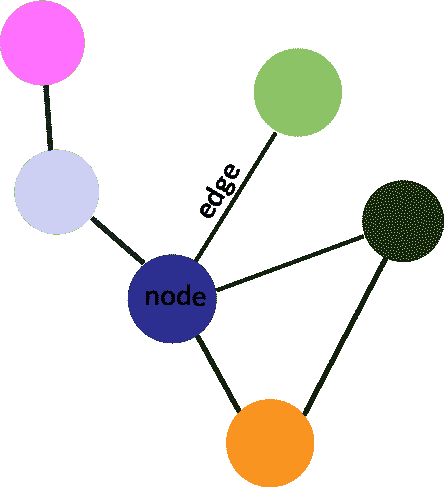
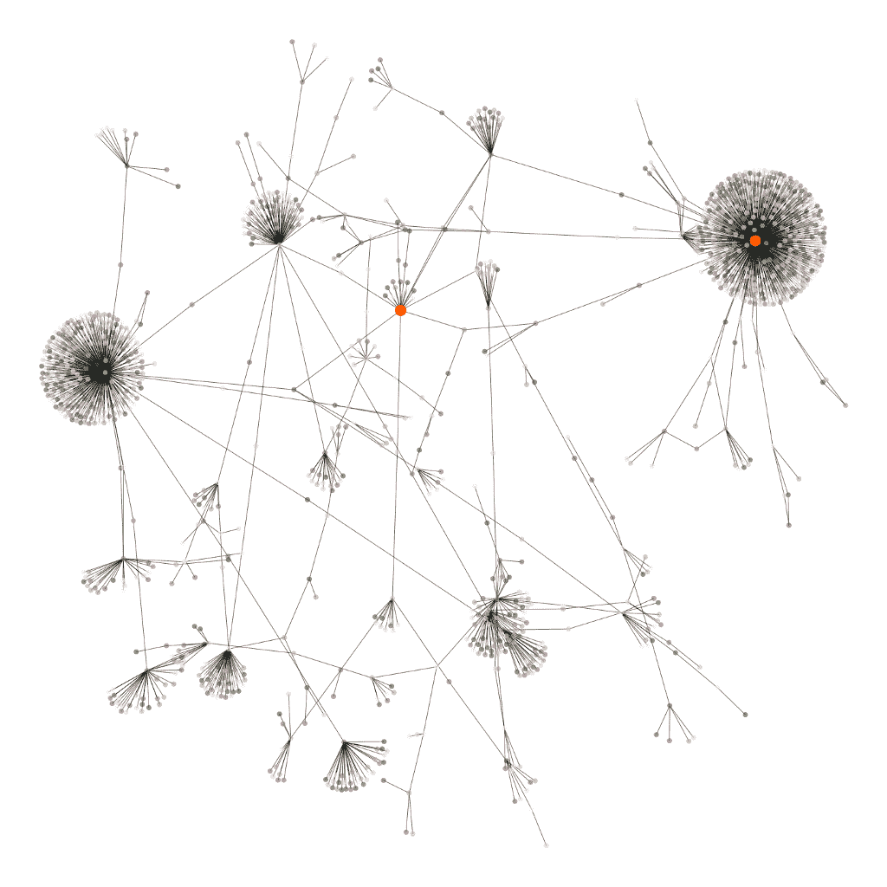

# 可视化 twitter 与网络的互动

> 原文：<https://dev.to/ugis22/visualizing-twitter-interactions-with-networkx-53n>

#### 人脉，人脉，人脉…

社交媒体每天都被用于许多目的:表达对不同主题的意见，如产品和电影，为某个事件、服务或会议做广告，等等。但是社交媒体最有趣的是，特别是这篇文章，关于 Twitter，它创造了联系；可以通过研究网络来了解人们是如何互动的，或者新闻和观点是如何传播的。

之前，我们已经使用 Twitter API[存储推文](https://dev.to/ugis22/how-to-build-a-postgresql-database-to-store-tweets-37oj-temp-slug-1890626)，以便随后执行[情绪分析](https://dev.to/ugis22/learning-how-to-perform-twitter-sentiment-analysis-402i-temp-slug-2003818)，并阐明公众对《复仇者联盟》的看法。让我们回顾一下流推文所需的步骤:首先，我们应该去 [Twitter 开发者网站](https://developer.twitter.com/en.html)，用 Twitter 账户登录，并作为开发者请求批准。获得批准后，我们继续创建一个新的应用程序，填写详细信息，最后，我们创建访问令牌，将它们保存在一个安全的地方。在 Jupyter 笔记本中，我们可以使用 [Tweepy](http://www.tweepy.org/) Python 库来连接我们的 Twitter 凭据，并流式传输与感兴趣的术语相关的实时推文，然后将它们保存到. txt 文件中。

现在，我们将把我们收集的所有数据读入熊猫数据帧。

我们将利用这些信息来描绘那些在推特上谈论复仇者联盟的人们是如何相互交流的。我们感兴趣的两个 Twitter 用户之间的交互有三种类型:转发、回复和提及。根据 [Twitter 文档](https://developer.twitter.com/en/docs/tweets/data-dictionary/overview/intro-to-tweet-json#tweetobject)，检索到的代表 Tweet 对象的 JSON 文件将包括一个描述 Tweet 作者的*用户*对象，一个[T5】实体对象](https://developer.twitter.com/en/docs/tweets/data-dictionary/overview/entities-object)，其中包括标签和用户提及的数组。

让我们看一下数据帧的列，以便检查信息是如何读取的:

从显示的列中，我们感兴趣的是:

*   Tweet 的作者:Name(screen_name)和 Id(id ) inside user。
*   Twitter 用户在 Tweet 的文本中提到:名称和 id 可以在实体内的 user_mentions 中作为 screen_name 和 Id 找到。
*   接受 retweet 操作的帐户:retweet_status 的用户对象中的 screen_name 和 id。
*   推文回复的用户:in_reply_to_screen_name 和 in_reply_to_id
*   推文回复的推文:in_reply_to_status_id

你可能想知道收集的细节将如何帮助我们建立一个代表 Twitter 用户之间互动的网络。为了回答这个问题，我们需要看一下图形数据结构。

让我们从基本概念开始。什么是图？图形是一种数据结构，用于表示和分析元素之间的联系。它的两个主要元素是节点或顶点，以及连接两个节点的边或线。

 

<figcaption>表示一个图的结构</figcaption>

尽管两个节点不能直接相互连接，但是从一个节点到另一个节点可以沿着一系列的边或路径。沿着路径找到一个节点的可能性使得图形在表示不同的结构或网络时如此强大。当有几个节点，以至于没有路径可以到达它们时，那么我们就存在一个不连通的图或孤立的节点。

当边具有特定方向(通常用箭头表示方向)时，图形也可以分为有向的，或者当边不遵循任何方向时，图形也可以分为无向的。

在我们的分析中，用户代表我们的图或网络的节点。如果我们发现它们之间有任何类型的交互(*转发、回复或提及*)，就会创建一条边来连接这两个节点。如果我们想知道哪个用户转发了另一个用户，我们可以使用 direct Graph。因为我们只想描述两个用户之间的交互，而不关心它的方向，所以我们将使用无向图。

下一个问题是在我们的分析中可以使用哪种工具。我们将利用 [NetworkX](https://networkx.github.io/) ，这是一个 Python 包，用于创建和研究复杂网络的结构，比如社交网络。

首先，我们将定义一个函数，它将允许我们获得用户之间的交互列表。我们将遍历 DataFrame，获取特定 tweet 的作者提到、回复或转发的用户的 user_id 和 screen_name。该函数将返回特定 tweet 的用户以及用户与之交互的用户列表。如果用户在前面提到的三个类别中没有任何交互，我们需要小心丢弃任何可能出现的 None 值。

现在，是初始化图形的时候了。我们可以通过调用函数来实现。NetworkX 的图()。

创建图表还有另外两个重要的功能。第一个是 add_node()，第二个是 add_edge，两者都有一个非常描述性的名称。我们来关注一下 [add_edge](https://networkx.github.io/documentation/stable/reference/classes/generated/networkx.Graph.add_edge.html) 的语法:

**graph . add _ edge(*****u _ of _ edge** ***，* ****v _ of _ edge**** * * * * *** * attr**** *)**

**其中 u、v 是节点，attr 是表征边缘数据的关键字自变量，例如重量、容量、长度等。**

如果我们添加一个已经存在的边，边数据将被更新。此外，如果我们是两个仍不在图中的节点之间的边，则这些节点将在此过程中创建。

我们将通过调用之前定义的函数 get_interactions 来填充图表。有了这些信息，我们将函数 add_edge 应用于每个元组，该元组由 tweet 的 user_id 和提到、回复或转发的用户的 user_id 组成，创建节点和连接它们的边。此外，tweet id 将作为边缘数据添加。

现在我们已经创建了图的节点和边，让我们看看节点和边的数量:

现在让我们研究一下图的其他一些特征。节点 u 的**度**，记为*度(u)，*是该节点的边数。简而言之，特定节点拥有的连接数。一个图的**最大度**和**最小度**分别是其节点的最大度和最小度。

在我们的例子中，我们可以获得图的度数:

以及最大和最小度数:

我们还可以获得图中节点的平均度和最频繁度:

无向图是连通的，如果每对节点之间都有一条路。要做到这一点，大多数节点的度数至少应该是 2，除了那些被命名为叶子的度数是 1。从图的特征可以怀疑图是不连通的。为了确认这些，我们可以使用 nx.is_connected:

图的组成部分是不同的最大连通子图。现在，我们确认我们的图是不连通的，我们可以检查它有多少连通的部分:

对于此分析，我们将使用最大的连接组件。幸运的是，NetworkX 通过使用 NX . connected _ component _ subgraphs 为我们提供了一种获取组件的简单方法，它可以生成图形，每个图形对应原始图形的一个连接组件，max 函数可以帮助我们检索最大的组件:

现在，我们可以获得这个新图的特征:

如果我们使用函数 nx.is_connected，我们将观察到子图是按照它应该的那样连接的。

聚类和传递性衡量节点聚集在一起或边形成三角形的趋势。在我们的上下文中，它们是与一个特定用户交互的用户倾向于彼此交互的程度的度量。不同的是，传递性对节点的权重较高。

聚类系数是图中三角形数量的度量，计算方法是连接到节点 i 的三角形数量*除以连接到节点 I(三个节点)的两条边的集合数量*。*而传递系数的计算方法为 *3* 乘以*网络中三角形的数量*除以网络中节点的连接三元组的数量*。这两个参数在分析社交网络时非常重要，因为它让我们深入了解用户如何倾向于创建以相对高密度联系为特征的紧密结群。**

 *让我们看看在使用函数 average_clustering 和 transitivity 的分析中发生了什么:

在我们的图表中，用户似乎不倾向于形成紧密的集群。

之后，我们将研究一些汇总统计数据，特别是与距离相关的统计数据，或者一个节点与另一个随机节点的距离。**直径**代表任意一对节点之间的最大距离，而**平均距离**告诉我们网络中任意两个节点之间的平均距离。NetworkX 使用直径和平均最短路径长度函数来获取这些参数:

现在，我们将关注**网络中心性**，其捕获网络中节点位置的重要性，考虑:*度*基于重要节点将具有许多连接的假设，紧密性 _ 基于重要节点靠近其他节点的假设，以及最后，中间性 _ 基于重要节点位置良好并且连接其他节点的假设。为此，我们将使用以下函数 degree_centrality、closenness _ centrality 和 betwenness_centrality，它们都返回每个节点及其中心性得分的列表。我们将特别捕捉每个节点中得分最高的节点。

正如我们可以看到的，并不总是相同的节点在所有的中心性测量中显示最大值。然而，id 为 *393852070* 的节点似乎是具有更多连接的节点，该节点能够很好地连接其他节点。另一方面，id 为 *2896294831* 的节点离其他节点最近。

现在，我们可以看看这个图表是什么样子的。为此，我们将使用 nx.drawing.layout 为图形绘制应用节点定位算法。具体来说，我们将使用 spring_layout，它使用 [*力定向图形绘制*](https://en.wikipedia.org/wiki/Force-directed_graph_drawing) ，其目的是在二维空间中定位节点，使得所有的边都是等长的，并且有尽可能少的交叉边。它通过根据边和节点的相对位置在它们之间分配力来实现这一点，然后使用它来模拟边和节点的运动。我们可以调整的参数之一是 *k* ，节点间的最佳距离；随着值的增加，节点将会离得更远。一旦我们得到了位置，我们还将创建一个特殊的列表，这样我们就可以用不同的颜色画出两个中心性较高的节点来突出显示它们。

在所有这些计算之后，我们将使用函数 draw_networkx_nodes()和 draw()。

最后，我们画出了原始图形中最大的连通分量:

*如果你想了解这个项目的全部代码，可以查看我的* [*GitHub 库*](https://github.com/ugis22/analysing_twitter) *。*

* * **