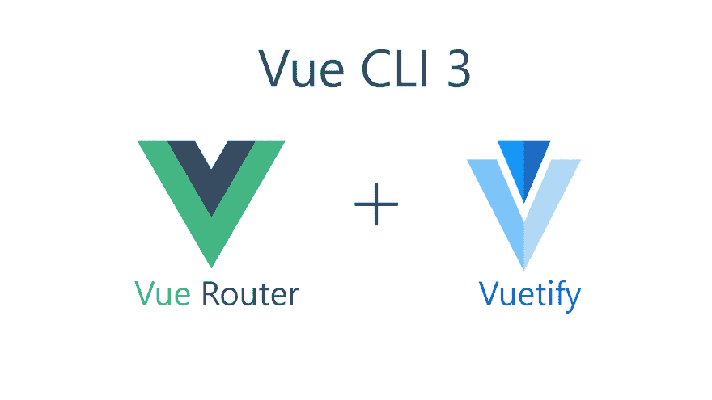
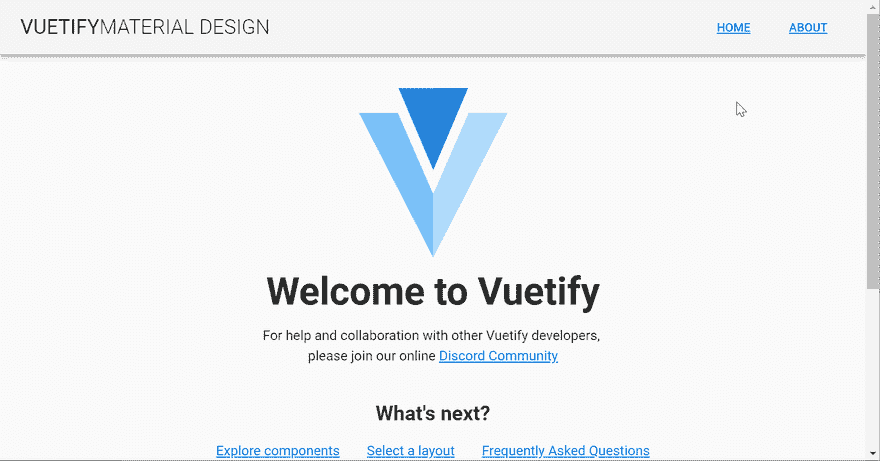

# Vue CLI 路由器 Vue 资格插件

> 原文：<https://dev.to/johnnymakestuff/vue-cli-router--vuetify-plugins-gga>

[](https://res.cloudinary.com/practicaldev/image/fetch/s--IsjEUXlu--/c_limit%2Cf_auto%2Cfl_progressive%2Cq_auto%2Cw_880/https://www.learningsomethingnew.com/vuetify-router-demo/banner.jpg)

## 这是什么？

关于如何正确地将 Vue CLI 的路由器插件和 vuetify 插件合并到一个布局中的简短教程。

### 有什么问题吗？

Vue CLI 插件通过更改应用程序文件为您搭建了一个推荐的布局，但它们也会覆盖彼此的更改，而不是合并它们。

## 走吧

在您的工作区根目录中，运行以下命令:

```
vue create vuetify-router-demo
cd vuetify-router-demo 
```

> 选择默认选项- babel，eslint，yarn。

这将创建基本的应用程序布局。
通过运行`yarn serve`进行测试。

## 添加路由器插件

我们来添加路由器插件:

```
vue add router 
```

路由器插件做一些事情:

*   创建带有两个示例视图的`views`文件夹:关于和主页
*   创建`router.js`文件以链接路线和视图
*   对`main.js`进行更改，将路由器添加到主 Vue 实例中
*   将`App.vue`文件更改为如下所示:

```
<template>
  <div id="app">
    <div id="nav">
      <router-link to="/">Home</router-link> |
      <router-link to="/about">About</router-link>
    </div>
    <router-view/>
  </div>
</template> 
```

## 添加 Vuetify 插件

现在让我们添加 vuetify 插件:

```
vue add vuetify 
```

运行之后，您的`App.vue`文件看起来像这样:

```
<template>
  <v-app>
    <v-toolbar app>
      <v-toolbar-title class="headline text-uppercase">
        <span>Vuetify</span>
        <span class="font-weight-light">MATERIAL DESIGN</span>
      </v-toolbar-title>
      <v-spacer></v-spacer>
      <v-btn
        flat
        href="https://github.com/vuetifyjs/vuetify/releases/latest"
        target="_blank"
      >
        <span class="mr-2">Latest Release</span>
      </v-btn>
    </v-toolbar> 
    <v-content>
      <HelloWorld/>
    </v-content>
  </v-app> </template> 
<script>
import HelloWorld from './components/HelloWorld'

export default {
  name: 'App',
  components: {
    HelloWorld
  },
  data () {
    return {
      //
    }
  }
}
</script> 
```

你瞧，路由器不见了。正如你所见，Vue CLI 插件的特点是它们可以覆盖彼此的更改。

> 请注意，在添加 vuetify 插件时，您可以选择`advanced`，并退出创建示例 vue 文件。但是在这个例子中，我们想要使用插件建议的默认布局。

## 结合两者

那么，当我们既需要 vuetify 又需要 router 时，App.vue 文件的预期布局是什么呢？
我们将把两者结合起来，将路由器视图和路由器链接插入到 vuetify 的布局中。
路由器视图将位于作为主要应用程序内容的`<v-content>`中，路由器链接将位于`<v-toolbar>`中。

```
<template>
  <v-app>
    <v-toolbar app>
      <v-toolbar-title class="headline text-uppercase">
        <span>Vuetify</span>
        <span class="font-weight-light">MATERIAL DESIGN</span>
      </v-toolbar-title>
      <v-spacer></v-spacer>
      <v-toolbar-items class="hidden-sm-and-down">
        <v-btn flat>
          <router-link to="/">Home</router-link>
        </v-btn>
        <v-btn flat>
          <router-link to="/about">About</router-link>
        </v-btn>
      </v-toolbar-items>
    </v-toolbar> 
    <v-content>
      <router-view/>
    </v-content>
  </v-app> </template> 
<script>
import HelloWorld from "./components/HelloWorld";

export default {
  name: "App",
  components: {
    HelloWorld
  },
  data() {
    return {
      //
    };
  }
};
</script> 
```

就这样，检查您的本地主机以查看路由器按钮的运行情况:

[](https://res.cloudinary.com/practicaldev/image/fetch/s--E1TnAbWp--/c_limit%2Cf_auto%2Cfl_progressive%2Cq_66%2Cw_880/https://www.learningsomethingnew.com/vuetify-router-demo/finished.gif)

来源可以在[这里](https://github.com/syonip/vuetify-router-demo)找到

> 这篇文章是从我的[博客](https://www.learningsomethingnew.com/vue-cli-router-vuetify-plugins)交叉发布的