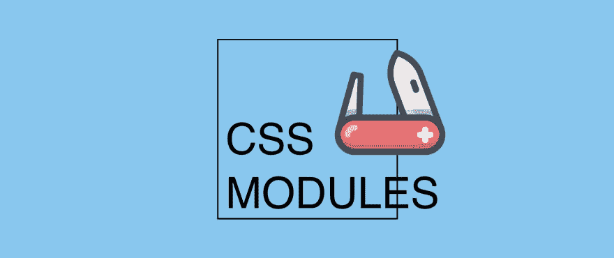

# Vue.js，CSS 模块，功能 CSS。如何？

> 原文：<https://dev.to/iamfrntdv/vuejs-css-modules-functional-css-how-to-40dp>

[](https://res.cloudinary.com/practicaldev/image/fetch/s--uvOC1h8O--/c_limit%2Cf_auto%2Cfl_progressive%2Cq_auto%2Cw_880/https://thepracticaldev.s3.amazonaws.com/i/p9m9o4wlm1a5suquk0gw.jpg)

不久前我写了一篇小文章- [PostCSS 功能 CSS 插件。轻松生成功能性 CSS。](https://dev.to/iamfrntdv/postcss-functional-css-plugin-generate-functional-css-with-ease-1k6m)。

这个插件旨在帮助轻松生成功能性 css。

我用了一段时间，效果非常好。直到我不得不使用 css 模块。主要的问题是一个类名。如果你熟悉 css 模块，我可能知道使用 camel case 类名更容易一些。不幸的是，PostCSS 函数式 CSS 插件直到现在还不能生成 camel case 类名。

最近我更新了插件，我还添加了一些新的 css 功能和“CSS 模块模式”。

## 分裂

又增加了一个新特性——能够单独生成特性。为此，只需将包含特性名称的注释添加到特定文件(`margin.pcss` ):

```
/* postcss-functional-css-margin */ 
```

Enter fullscreen mode Exit fullscreen mode

## CSS 模块模式

默认情况下，PostCSS 函数式 CSS 插件生成如下类名:

*   `margin-top-20`
*   `margin-left-20`
*   `md-margin-left-20`所以类名包含 css 属性名和值。如果类是在一些媒体查询中声明的，它将在配置中定义额外的前缀。当你把它和普通的 html 一起使用时，这是很好的。

当谈到 CSS 模块时，你可能会像这样使用它:

```
<div :class="[
    margin.top20, 
    margin.mdTop40, 
    margin.bottom20, 
    margin.mdBottom40
]">
    ...
</div> 
```

Enter fullscreen mode Exit fullscreen mode

所以在 CSS 模块模式下不会添加属性名。用 css 属性名
导入 css/pcss 文件很重要

```
<template>
    <div :class="[margin.bottom20, margin.mdBottom40, margin.lgBottom60]">
        ...
    </div>
</template>

<script>
...
</script>

<style src="./margin.pcss" lang="pcss" module="margin"></style>
<style src="./padding.pcss" lang="pcss" module="padding"></style> 
```

Enter fullscreen mode Exit fullscreen mode

这将有助于将代码保持在项目语义中，并避免类似于`margin.marginBottom20`的选择器。

## 链接

[PostCSS 功能 CSS 插件](https://github.com/iamfrntdv/postcss-functional-css)