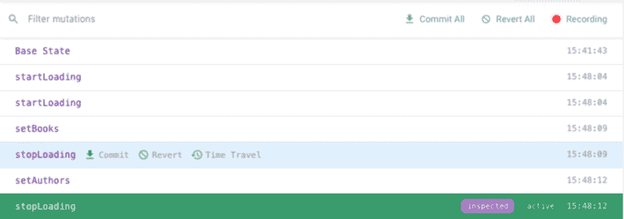

# Vuex 摊牌:突变与行动

> 原文：<https://dev.to/bnevilleoneill/vuex-showdown-mutations-vs-actions-41pf>

[](https://res.cloudinary.com/practicaldev/image/fetch/s--6S7gzlkh--/c_limit%2Cf_auto%2Cfl_progressive%2Cq_auto%2Cw_880/https://cdn-images-1.medium.com/max/1024/1%2AbqAAJ7UioE9e4x9iP3qQZw.jpeg)

在最近的 Vue.js Amsterdam 会议期间，尤雨溪发表了一次演讲，提到了 Vuex 的可能路线图:
[https://www.youtube.com/embed/zB3HOejXqwk](https://www.youtube.com/embed/zB3HOejXqwk)
在第 25 分钟的标记处，我们看到，“*通过合并突变&动作来简化概念。*“所以现在是讨论行动和突变的真正目的以及这种变化意味着什么的好时机。

学习 Vuex 时，可能需要一段时间才能清楚动作和突变之间的区别。通常，开发人员可能会看到这样的代码:

```
mutations: {
  setName(state, name) {
    state.name = name;
  },
},
actions: {
  setName({ commit }, name) {
    commit('setName', name);
  },
}, 
```

想想…为什么有这么多样板文件？

Vuex 文档说，“*动作类似于突变，区别在于:*

*   动作提交突变，而不是改变状态。
*   *动作可以包含任意的异步操作。*

所以在很多例子中，我们看到一个 API 调用在一个动作中，这导致了一个变异的提交:

```
actions: {
  loadBooks({ commit }) {
    commit('startLoading');
    get('/api/books').then((response) => {
      commit('setBooks', response.data.books);
      commit('stopLoading');
    });
  },
}, 
```

不看任何突变，仍然应该相当清楚发生了什么。在 API 调用开始之前，设置加载标志；然后，当调用返回时(异步使用承诺)，它将提交响应数据，然后提交停止加载，这很可能会取消加载标志。

一个值得注意的设计选择:上面的代码使用了两个突变，其中一个就足够了。开始加载/停止加载突变可以由具有布尔有效载荷的单个突变(setLoading)代替，然后停止加载可以被提交(“setLoading”，false)。

上面的例子需要两个突变，这意味着需要维护更多的代码。这种推理与建议 CSS 类不要以它们应用的样式命名，而是以样式的含义命名是一样的，即不要称它为 redAndBold，而是 activeMenuItem。

通过调用一个变异，set，意味着接口什么也不抽象；对实现的任何更改都可能意味着对接口的更改。我们将很快看到一个例子，在这个例子中，突变抽象得到了回报。

[](https://logrocket.com/signup/)

### 原子和事务意味着可追踪

现代状态管理工具的驱动需求之一是可追溯性。在前几代状态管理中，当系统进入不一致的状态时，很难弄清楚它是如何进入这种状态的。

使用 Vue devtools，可以看到应用于单个全局状态的突变的清晰年表。

让我们以上面的负载簿为例。一个周五的晚上，开发人员 Alex 开始开发一个功能，在书籍旁边加载和显示作者。作为起点，他们复制并粘贴已有的动作，只做了微小的修改。

```
actions: {
  loadBooks({ commit }) {
    commit('startLoading');
    get('/api/books').then((response) => {
      commit('setBooks', response.data.books);
      commit('stopLoading');
    });
  },
  loadAuthors({ commit }) {
    commit('startLoading');
    get('/api/authors').then((response) => {
      commit('setAuthors', response.data.authors);
      commit('stopLoading');
    });
  },
}, 
```

几个快速开发人员测试，Alex 很高兴它的工作和部署到阶段。第二天，出现了一个错误报告，在使用这些数据的页面上，首先会看到一个微调器，但随后它会消失，显示一个错位的空白屏幕。然后，几秒钟后，内容出现，一切正常。

亚历克斯试图重现这个问题，不幸的是，这是零星的。几次尝试后，问题再次出现，Vue devtools 显示如下:

[](https://res.cloudinary.com/practicaldev/image/fetch/s---Y-I32AD--/c_limit%2Cf_auto%2Cfl_progressive%2Cq_auto%2Cw_880/https://cdn-images-1.medium.com/max/1024/1%2APOCf8tMGwspoeKA5RNsX4g.png)

<figcaption>vuex tab in view devtools。</figcaption>

亚历克斯使用时间旅行调试器来循环过去的突变，并返回到导致视觉故障的状态。

Alex 意识到简单的布尔加载标志不适用于多个异步请求；历史清楚地表明，这两个行动有交错的突变。

不管你是否认为这是你在代码中发现的错误，Vuex 提供的时间旅行调试肯定是一个非常强大的跟踪工具。由于它的突变概念，它可以提供一个有意义的状态修改事件序列。

突变的另一个有助于其事务性质的方面是，它们旨在成为纯函数。很多开发人员在某个时候问…

> 为什么突变不能访问 getters？

突变旨在仅通过其有效载荷接收输入，而不会在其他地方产生副作用。虽然动作有完整的上下文来处理，但变异只有状态和有效载荷。

在 Vue devtools 中调试时，还会显示突变的有效负载，以防突变列表没有给出问题根源的线索。这是可能的，因为它们是纯函数。

### 一个抽象的固定点

Alex 现在必须对代码进行一些修改，以支持多个并发 API 请求。以下是相关突变现在的样子:

```
state: { loading: false },
mutations: {
  startLoading(state) {
    state.loading = true;
  },
  stopLoading(state) {
    state.loading = false;
  },
}, 
```

这里有一个不需要对动作做任何改变的解决方案:

```
state: { loading: 0 },
mutations: {
  startLoading(state) {
    state.loading += 1;
  },
  stopLoading(state) {
    state.loading -= 1;
  },
}, 
```

如前所述，如果这种变异的接口是 setLoading，这可能意味着修复必须改变动作中的提交代码，或者忍受混淆底层功能的接口。

这不是一个严重的反模式，但值得指出的是，如果一个开发人员将突变视为一个没有抽象的层，它会减少该层的责任，并且更有可能代表纯粹的样板文件，而不是任何有价值的东西。如果每个变异都是带有集合名称的单个赋值，那么本文顶部的集合名称示例将会是许多存储代码的样子，开发人员将会感到沮丧。

### 与样板文件作战

回到 setName 的例子，从 Vuex 开始时出现的一个问题是，*“突变应该包装在动作中吗？”*有什么好处？首先，store 提供了一个外部提交 API，使用它并不会抵消 devtools 中突变的好处。那为什么要包起来呢？

如前所述，突变是纯函数和同步的。仅仅因为现在需要的任务可以通过突变来处理，并不意味着下个月的特性不需要更多。将突变包装在动作中是一种实践，它为未来的开发留出了空间，而不需要更改所有的调用代码——这与 Alex 的修复中的突变抽象概念非常相似。

当然，知道它为什么在那里并不能消除样板代码给开发人员带来的挫败感。怎么能减少呢？嗯，一个非常好的解决方案是 Vuex Pathify 提供的:它试图使用尽可能少的代码创建一个商店，这是一个简洁的 API，采用了许多开发人员所推崇的约定胜于配置的方法。简介中最引人注目的一句话是:

```
make.mutations(state) 
```

这将直接从状态中自动生成集合样式变异，这当然会删除样板文件，但也会删除变异层可能具有的任何值。

### 行动的好处

动作是一个非常开放的逻辑层；没有什么事情是在商店之外做不到的，简单地说，行动都集中在商店里。

动作和您可能在商店外声明的任何类型的函数之间的一些差异:

1.  无论是在分派动作时还是在它们可用的上下文中，动作都可以限定在一个模块的范围内
2.  可以通过 subscribeAction 存储 API 拦截操作
3.  默认情况下，动作是承诺的，就像异步函数一样

这种功能的大部分属于方便和约定的范畴。

### async/await 在这里适合做什么？

正如在演讲中提到的，这些可以马上用于行动。下面是带有 async/await 的 loadBooks 示例:

```
actions: {
  async loadBooks({ commit }) {
    commit('startLoading');
    const response = await get('/api/books');
    commit('setBooks', response.data.books);
    commit('stopLoading');
  },
}, 
```

但是这在功能上是不等价的——有一个微妙的区别。这在功能上等同于以下内容:

```
actions: {
  loadBooks({ commit }) {
    commit('startLoading');
    return get('/api/books').then((response) => {
      commit('setBooks', response.data.books);
      commit('stopLoading');
    });
  },
} 
```

要注意的关键是回报。这意味着动作返回的承诺正在等待内部承诺完成。这在关于动作开始和结束的检测的谈话中有所暗示。

动作的非异步/等待版本不返回内部承诺，没有给调用代码提供检测其结束的方法。当行动已经空手而归时，内心的承诺仍然在异步地工作。

### 突变粒度

如果大多数(不是全部)变异都是单行函数，那么原子的、事务性的变异可能只是一个单一的变异语句(例如赋值)。因此，devtools 中的变异轨迹可能如下所示:

1.  `state.loading = true;`
2.  `state.loading = true;`
3.  `state.books = […];`
4.  `state.loading = false;`
5.  `state.authors = […];`
6.  `state.loading = false;`

然而，由于大量的操作并行运行，这可能会令人困惑，而且没有突变目前提供的有意义的名称，可能很难调试。

视频中暗示了 devtools 视图将包含动作，这是目前还没有做的事情。如果上面的突变可以按时间顺序显示(并且对于时间旅行调试是可穿越的)，但是分组在触发它们的动作下，会怎么样？

### 将突变与行动联系起来

下面是我们新的*变异*可能的样子:

```
mutactions: {
  async loadBooks({ state }) {
    state.loading += 1;
    const response = await get('/api/books');
    state.books = response.data.books;
    state.loading -= 1;
  },
} 
```

所以假设，在幕后，改变 state.loading 的值将在 devtools 中创建一些日志条目，我们如何确保它与动作相关联呢？

#### 某种反应性魔法？

利用反应做一些聪明的事情总是好的——在这里能做吗？动作通常不是反应性的。在 Vue 生态系统中，以下是反应式功能:

*   组件的渲染
*   一个观察者
*   计算出来的财产
*   商店吸货员

它们将在每次运行时被“记录”,如果它们的依赖项触发，它们将被“回放”。反应性就像一个捕鼠器，一放就弹起。

反应性的记录阶段可能是我们可以效仿的模式。但这里有一个巨大的挑战，可能不会马上显现出来。

> 反应性记录是同步的。

那是什么意思？好吧，这里有一个 [Codepen](https://codepen.io/mikeapr4/pen/WWEmEj?editors=0010#0) 来测试一下:
[https://codepen.io/mikeapr4/embed/WWEmEj?height=600&default-tab=result&embed-version=2](https://codepen.io/mikeapr4/embed/WWEmEj?height=600&default-tab=result&embed-version=2)
以上是两个观察者对一些数据的反应。两个观察器是相同的，除了一个有异步的获取器。正如您所观察到的，这个观察器没有触发，而同一个同步观察器触发了。为什么？

反应性目前基于依赖函数的全局堆栈工作。好奇的话可以翻翻 [/observer/dep.js](https://github.com/vuejs/vue/blob/dev/src/core/observer/dep.js) 看看。要做到这一点，反应必须是同步的。

#### 某种代理魔法？

Vue v3 将使用代理类来实现更完整的反应。这个功能是否给了我们任何可以用来完成异步记录的东西？

首先，当考虑到一个*开发者*将运行 devtools，而不是一个用户时，让我们暂时把性能问题放在一边。如果有更多的调试选项，资源的增加和性能的下降是允许的。

这里有一个模拟 Vuex 商店的例子。它涉及 Alex 的 loadBooks 和 lookAuthor 动作，在本例中编写为 mutactions。控制台日志中的
[https://codesandbox.io/embed/v6mz6q777](https://codesandbox.io/embed/v6mz6q777)
这里是低粒度突变可追溯性的基本起点，由调用它们的动作分组。此外，操作的开始和结束也按时间顺序记录。

当然，这里缺少一个漂亮的图表可视化，但这是可能的。那么代码中发生了什么呢？

如前所述，我们不可能全局跟踪异步堆栈，并且在发生突变时访问调用堆栈的选项也不多(抛出并捕获错误，或者使用不推荐使用/禁止使用的参数. caller)。

然而，当我们将状态对象传递给动作时，我们知道了变化动作，并且我们知道所有的变化都将通过那个对象。因此，我们将状态(一个全局单个实例)包装在一个特殊的定制代理中，并引用 mutaction。

如果子属性被读取，代理会自我传播，并最终为任何写入触发一个日志。这个示例代码显然是为简单、愉快的路径功能编写的，但它证明了这个概念。这里有一个内存开销，但是这些自定义代理将和 mutaction 执行一样长。

mutactions 使用 async/await，并且必须等待所有异步功能，确保返回的承诺只有在动作真正完成时才会解析/拒绝。对于 promise . all()rejects，这里可能有一个警告，它不会等待所有底层承诺完成。

### 时间旅行

这种粒度突变的缺点是，如果时间旅行调试步骤继续针对每个突变，每次保存整个状态的开销将非常大。

然而，反应性可以在这里提供一个例子，默认情况下，在触发观察器之前等待下一个滴答。如果 devtools 在存储状态快照之前做了同样的事情，这意味着这些步骤可能会围绕今天的突变概念。

该显示每个节拍只会重新渲染一次，因此提供更低粒度的时间旅行步骤没有多大意义。

### 结论

变更操作提供了简单性和可追溯性；样板文件少，但灵活性和组成。它们可以添加到 Vuex 中，同时仍然保持向后兼容性，以便逐渐采用。

* * *

### Plug: [LogRocket](https://logrocket.com/signup/) ，一款适用于网络应用的 DVR

[](https://logrocket.com/signup/)

<figcaption>[https://logrocket.com/signup/](https://logrocket.com/signup/)</figcaption>

LogRocket 是一个前端日志工具，可以让你回放问题，就像它们发生在你自己的浏览器中一样。LogRocket 不需要猜测错误发生的原因，也不需要向用户询问截图和日志转储，而是让您重放会话以快速了解哪里出错了。它可以与任何应用程序完美配合，不管是什么框架，并且有插件可以记录来自 Redux、Vuex 和@ngrx/store 的额外上下文。

除了记录 Redux 操作和状态，LogRocket 还记录控制台日志、JavaScript 错误、堆栈跟踪、带有头+正文的网络请求/响应、浏览器元数据和自定义日志。它还使用 DOM 来记录页面上的 HTML 和 CSS，甚至为最复杂的单页面应用程序重新创建像素级完美视频。

[免费试用](https://logrocket.com/signup/)。

* * *

帖子 [Vuex 摊牌:突变 vs .行动](https://blog.logrocket.com/vuex-showdown-mutations-vs-actions-f48f2f7df54b/)首先出现在[日志博客](https://blog.logrocket.com)上。