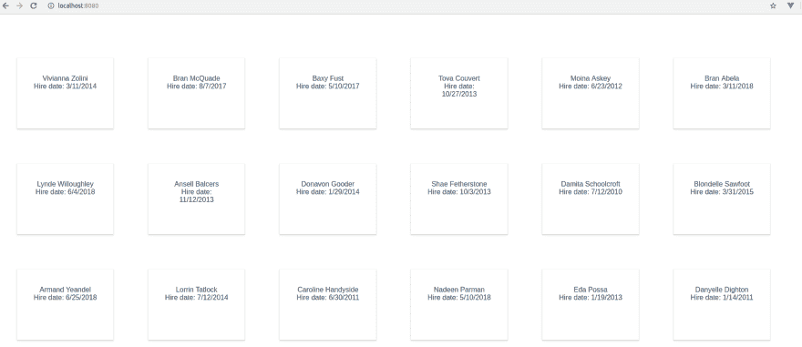

# 用卡夫卡流洗去污垢第 2 部分

> 原文：<https://dev.to/jbull328/wash-away-the-crud-with-kafka-streaming-part2-5ekb>

## Kafka 与你的网络应用流。

[](https://res.cloudinary.com/practicaldev/image/fetch/s--DVr2l8QR--/c_limit%2Cf_auto%2Cfl_progressive%2Cq_auto%2Cw_880/https://www.sierraclub.org/sites/www.sierraclub.org/files/styles/flexslider_full/public/sierra/articles/big/SIERRA%2520Pipeline%2520Sunset%2520WB.jpg%3Fitok%3D8WmuhW_d)

在第一篇文章中，我们设置了 Kafka，并创建了一个消息生成器，将一些员工数据输入到我们的 Kafka 集群中。 [Post1](https://dev.to/jbull328/wash-away-the-crud-with-kafka-streaming-3lik)

在下一篇文章中，我们将使用 Express 和 Vue.js 为我们的应用程序创建一个消费者和前端

为了让我们的 web 应用程序利用消息系统，我们需要创建一个消费者。我们希望当用户进入我们网站的某个页面时，我们的数据是可用的，所以我们希望创建一个小的 express 后端，当我们需要时，它会调用消费者采取行动。

```
//server.js

const express = require("express");
const bodyParser = require("body-parser");
const cors = require("cors");
const GetMessage = require("./consumer");

const app = express();
app.use(express.static("public"));
app.use(bodyParser.json());
app.use(bodyParser.urlencoded({ extended: true }));
app.use(cors());

app.get("/api/employees", GetMessage);

app.listen(process.env.PORT || 3000, function() {
  console.log("Kafka Frontend Dev site running");
}); 
```

Enter fullscreen mode Exit fullscreen mode

我们正在设置一个路由，告诉 express 对我们的 consumer.js 文件运行 GetMessage 函数。让我们看看那个文件。

```
//consumer.js
var kafka = require("kafka-node");

var express = require("express");
var router = express.Router();
var messageData = [];

const GetMessage = message => {
  var Consumer = kafka.Consumer;
  var data = [];
  const client = kafka.Client("localhost:2181");
  topics = [
    {
      topic: "employees"
    }
  ];
  const options = {
    autoCommit: true,
    fromBeginning: true
  }; 
```

Enter fullscreen mode Exit fullscreen mode

下面是我们连接到服务器和主题 employees 的设置和配置选项。

```
 var consumer = new kafka.Consumer(client, topics, options);
  this.message = message

   consumer.on("message", function(message, err) {

    if (err) {
      console.log(err);
    } else {
      console.log("Here is the kafka message... " + JSON.stringify(message));
      console.log(message.value);
      data.push(message.value);

    }
      if (message.event_data === "emp_chng_02") {
        console.log("A change happened for employee " + message.f_name + "  " + message.l_name + ".")
      }
      messageData.push(data);
  });
  console.log(messageData)
}

GetMessage();
router.get("/api/employees", (req, res) => {
  messageData.forEach(function(message, error) {
    if (message) {
      res.send({key: message});
    } else if (error) {
      res.status(400).send("Error, something went wrong.");
    }
  });
});

module.exports = router; 
```

Enter fullscreen mode Exit fullscreen mode

在这里，我们创建消费者并捕获错误，同时运行 getMessage 函数，并将获得的每条消息发送到快速路由。只要我们的 server.js 文件在 node 中运行，当我们导航到 localhost:3000/api/employees 时应该会看到一些东西。我们可以开始看到，我们可以像在普通的 CRUD Express 应用程序中一样，使用来自 Kafka 的消息来代替来自数据库的查询。

[](https://res.cloudinary.com/practicaldev/image/fetch/s--rpaMbgmN--/c_limit%2Cf_auto%2Cfl_progressive%2Cq_auto%2Cw_880/https://res.cloudinary.com/jbull238/image/upload/v1555008609/Screenshot_from_2019-04-11_11-13-07_ncblqx.png)

现在让我们找点乐子，设置一个小前端来显示我们的结果。我最终使用了 [create-vue-app](https://www.npmjs.com/package/create-vue-app) ,因为我想要快速简单的东西。

`yarn global add create-vue-app`

`yarn create vue-app kafkaFrontend`

我们应该看看这些文件。

```
├── README.md
├── index.ejs
├── package.json
├── poi.config.js
├── src
│   ├── components
│   │   ├── App.test.js
│   │   └── App.vue
│   ├── index.js
│   └── polyfills.js
├── static
│   └── favicon.ico
└── yarn.lock 
```

Enter fullscreen mode Exit fullscreen mode

我们需要一个组件来显示雇员。我们的模板为每个雇员和
显示一张卡片

```
//employees.vue
<template>
  <div class="main" id="app">

    <div class="card-container">
        <div class="employee-card" v-for="employee in employees">
        <div>{{employee.f_name }} {{employee.l_name}}</div>         <div>Hire date: {{employee.hire_date}}</div>  
      </div> 
    </div>
  </div> </template> 

<script>
import axios from 'axios';

export default {
  name: "Employees",
  data() {
    return {
      employees: [],
      errors: [],

    };
  },

  created() {
    axios.get('http://localhost:3000/api/employees').then((response) => {
      let responseString = response.data.key
      responseString.forEach(element => {
        element = JSON.parse(element)
        console.log(element)
        if (element.event_id==="emp_chng_02") {
          this.employeesWithChanges.push(element)
        } else {
          this.employees.push(element)
        }
      });
      console.log(this.employees);
    })
    .catch(e => {
      this.errors.push(e)
    })
  },
  components: {

  }

};
</script> 

 <!-- Scoped component css -->
 <!-- It only affect current component -->
 <style scoped>
.card-container {
  display: flex;
  flex-direction: row;
  flex-wrap: wrap;

}

.employee-card {
  display: flex;
  flex-direction: column;
  padding: 38px;
  width: 145px;
  height: 86px;
  max-width: 360px;
  margin: 40px;
  background: #fff;
  box-shadow: 0 1px 3px rgba(0, 0, 0, 0.12), 0 1px 2px rgba(0, 0, 0, 0.24);
  transition: all 0.3s cubic-bezier(0.25, 0.8, 0.25, 1);
}

.employee-card:hover {
  box-shadow: 0 18px 32px rgba(0, 0, 0, 0.25), 0 10px 10px rgba(0, 0, 0, 0.22);
}

.alert {
  color: #FF4136;
  background: #001f3f;
  border: #001f3f;
}

</style> 
```

Enter fullscreen mode Exit fullscreen mode

在我们的 App.vue 文件中，我们需要导入我们的组件。

```
<template>
  <div id="app">
    <employees />
  </div> </template> 
<script>
import Employees from "./components/employees.vue";

export default {
  name: 'app',
  components: {
    Employees
  }
}
</script> 
```

Enter fullscreen mode Exit fullscreen mode

我们还需要将它引入到 index.js 文件中。

```
import Vue from "vue";
import Employees from "./components/employees.vue";
import { library } from '@fortawesome/fontawesome-svg-core'
import { faExclamationTriangle } from '@fortawesome/free-solid-svg-icons'
import { FontAwesomeIcon } from '@fortawesome/vue-fontawesome'

library.add(faExclamationTriangle)

Vue.component('font-awesome-icon', FontAwesomeIcon)

Vue.config.productionTip = false;

new Vue({
  el: '#app',
  render: h => h(Employees),
  data () {
    return {
      info: null
    }
  }
}) 
```

Enter fullscreen mode Exit fullscreen mode

如果我们从控制台运行 vue 服务器，当我们转到 URL[http://localhost:8080](http://localhost:8080)时，应该会显示雇员。
T3T5】

最后，我们将通过添加一些事件 id 来处理我们的数据，看看会发生什么。

[第三部分](https://dev.to/jbull328/wash-away-the-crud-with-kafka-streaming-part3-36ac)