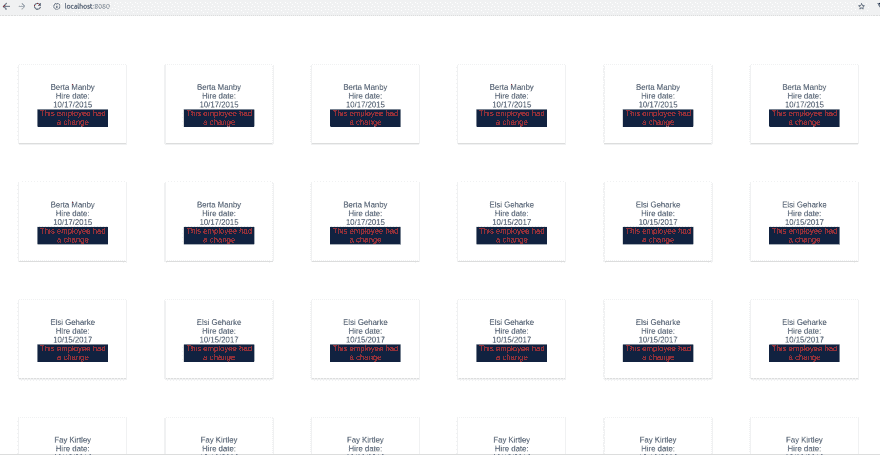

# 用卡夫卡流洗去污垢第 3 部分

> 原文：<https://dev.to/jbull328/wash-away-the-crud-with-kafka-streaming-part3-36ac>

## Kafka 与你的网络应用流。

[](https://res.cloudinary.com/practicaldev/image/fetch/s--DVr2l8QR--/c_limit%2Cf_auto%2Cfl_progressive%2Cq_auto%2Cw_880/https://www.sierraclub.org/sites/www.sierraclub.org/files/styles/flexslider_full/public/sierra/articles/big/SIERRA%2520Pipeline%2520Sunset%2520WB.jpg%3Fitok%3D8WmuhW_d)

在第二篇文章中，我们扩展了我们的 API，创建了一个 Kafka Producer 来显示来自我们的 Producer 的数据，以及一个带有 Vue.js 的前端来显示数据。[后 2](https://dev.to/jbull328/wash-away-the-crud-with-kafka-streaming-part2-5ekb)

你可以在这里找到第一篇介绍文章。 [Post1](https://dev.to/jbull328/wash-away-the-crud-with-kafka-streaming-3lik)

现在我们想对我们的数据做一些处理，酷。让我们坚持我们最初的数据馈送想法，使用 csv。假设我们人力资源部门的一名员工在某个方面发生变化(可能是离开公司或获得晋升)时输入了一些数据，我们需要做的就是为该员工创建一个事件 id，并将其传递到我们的消息系统中。这样做的一个好处是，只要 Kafka 中的主题运行，我们就有一个所有更改的日志。我们开始吧。

因此，我们将有另一个包含雇员的 csv 文件，我们将添加一个名为 event_id 的字段，如下所示。

```
f_name,l_name,hire_date,event_id
Berta,Manby,10/17/2015,emp_chng_02
Elsi,Geharke,10/15/2017,emp_chng_02
Fay,Kirtley,12/10/2016,emp_chng_02
Sig,Dzeniskevich,6/16/2015,emp_chng_02
Nikolas,Pounsett,12/24/2018,emp_chng_02
Sutherland,Dudney,2/5/2012,emp_chng_02
Vivianna,Zolini,3/11/2014,emp_chng_02
Bran,McQuade,8/7/2017,emp_chng_02 
```

Enter fullscreen mode Exit fullscreen mode

目前，我们只有一个事件 id 来表示员工状态的任何变化，但是您可以看到我们如何为我们需要考虑的不同状态创建唯一的 id。

接下来，我们将创建另一个生产者，在 Kafka 中为我们的员工主题读取这些事件。

```
//employeeChanges.js

const fs = require("fs");
const parse = require("csv-parse");

const kafka = require("kafka-node");
const Producer = kafka.Producer;
const client = new kafka.Client("localhost:2181");

const topic = "employees";

(KeyedMessage = kafka.KeyedMessage),
  (producer = new Producer(client)),
  (km = new KeyedMessage("key", "message")),
  (testProducerReady = false);

producer.on("error", function(err) {
  console.error("Problem with producing Kafka message " + err);
});

const inputFile = "./dataFiles/MOCK_Employee_Changes.csv";

var dataArray = [];

producer.on('ready', function() {
  var parser = parse({ delimiter: "," }, function(err, data) {
    dataArray = data;
    handleData(1);
  });

  fs.createReadStream(inputFile).pipe(parser);

  const handleData = currentData =>  {
    let messageArray = [];
    let line = dataArray[currentData];
    let dataNode = {
      f_name: line[0],
      l_name: line[1],
      hire_date: line[2],
      event_id: line[3]
    };
    // console.log(JSON.stringify(dataNode));

    //create individual message with csv parser and push them to an array.
    (KeyedMessage = kafka.KeyedMessage),
    (dataNodeKM = new KeyedMessage(dataNode.code, JSON.stringify(dataNode)));

    dataArray.forEach(element => {
      messageArray.push({ topic: topic, messages: dataNodeKM, partition: 0 }); 
    });
    let delay = 90;
    setTimeout(handleData.bind(null, currentData + 1), delay);
    produceDataMessage(messageArray);
  }

  const produceDataMessage = messageArray => {
    console.log(messageArray);
    payloads = messageArray;

    producer.send(payloads, function(err, data) {
      console.log(data);
      if (err) {
        console.log(
          "Sorry, TestProducer is not ready yet, failed to produce a message to kafka with error ==== " +
            err
        );
      }
    }); 
  }
}); 
```

Enter fullscreen mode Exit fullscreen mode

除了我们添加了 event_id 字段之外，这与我们的其他消费者没有太大的区别。当我们运行这个脚本时，我们应该在终端中看到一些显示事件 id 的消息。

`{ topic: 'employees',
messages:
KeyedMessage {
magic: 0,
attributes: 0,
key: undefined,
value:
'{"f_name":"Bran","l_name":"McQuade","hire_date":"8/7/2017","event_id":"emp_chng_02"}',
timestamp: 1555012556198 }`

现在，让我们添加一些代码到我们的前端，以便有变化的雇员将被显示。

在我们的 Employees 组件中，我们已经在我们的 API 调用中寻找事件 id，并将它们推到第 44 行的数组中。

```
 if (element.event_id==="emp_chng_02") {
          this.employeesWithChanges.push(element)
        } else {
          this.employees.push(element)
        } 
```

Enter fullscreen mode Exit fullscreen mode

所以现在我们需要做的就是将它添加到模板中。

```
 <div class="employee-card" v-for="employee in employeesWithChanges">
        <div>{{employee.f_name }} {{employee.l_name}}</div>         <div>Hire date: {{employee.hire_date}}</div>  
        <div class="alert">This employee had a change</div>
 </div> 
```

Enter fullscreen mode Exit fullscreen mode

现在我们应该看到我们的员工在前端出现了变化。它应该看起来像这样。

[](https://res.cloudinary.com/practicaldev/image/fetch/s--QM1wcOxj--/c_limit%2Cf_auto%2Cfl_progressive%2Cq_auto%2Cw_880/https://res.cloudinary.com/jbull238/image/upload/v1555013053/Screenshot_from_2019-04-11_13-02-15_xwlt2p.png)

基于这个例子，有希望更容易看到我们如何能够使用消息流来实现一个 web 应用程序，而不需要传统的基于数据库和查询的系统，在这个系统中，我们可以与 Kafka 生产者和消费者一起读写数据。Confluent 构建了一些有用的数据库连接器，可以将数据库中的更改读入事件系统。使用 Kafka 的各种工具，团队可以有效地将他们的遗留系统与更现代的系统结合起来，并轻松地将所有数据传输到云中。对我来说，这是一个相当长的旅程，我想诚实地说，直到我开始寻找在真实的世界场景中使用它的方法，我才理解了卡夫卡流或者理解了它可以如何被使用。希望 Kafka Streams 和 message systems 也能成为你工具箱中的众多工具之一。

请联系我，在 twitter 上关注我 [@jbull328](https://dev.to/jbull328) ，在链接的[上找到我](https://linkedin.com/in/jbull328)