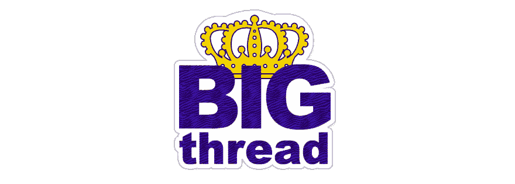

# 我们将为#help、# discuss 等标签增加更多设计和审核清晰度。我们还推出了新的徽章！

> 原文：<https://dev.to/devteam/we-ll-be-adding-more-design-and-moderation-clarity-to-tags-like-help-discuss-etc-we-re-also-introducing-a-new-badge-483a>

为了更好地服务社区，我们一直在对 DEV 做一些小的调整，我想分享一些关于我们在标签和讨论方面计划的想法。

## 有些标签有预期的格式

我们计划更加积极地传达和执行标签的“目的”，如[#帮助](https://dev.to/t/help)、[#讨论](https://dev.to/t/discuss)、[#解释五个](https://dev.to/t/explainlikeimfive)、 [#ama](https://dev.to/t/ama) 等。网站上的一些标签有一个预期的格式，到目前为止，我们还没有很好地调节这些功能。在发布之前，访问标签的登录页面(`dev.to/t/nameoftag`)来检查侧边栏中的描述&提交指南是一个好主意。

**#讨论**标签是最大的标签。我们希望它被保留用于“引发讨论”,以向社区提出问题并寻求反馈的形式。有些人把它附加到各种帖子上，不管格式如何。确保某些标签是为某些内容保留的，将消除混乱，并导致更好的讨论。

这也适用于我们的其他标签。 **#help** 是作者向社区寻求帮助的一种方式。 **#ama** 为作者提供了开放公共论坛的能力，人们可以就他们的技术体验提出问题。 **#explainlikeimfive** 应该是一个问题，要求对一个主题进行解释，或者是作者试图对一个主题提供一个简单的解释。

还有其他一些面向格式的标签，比如**#新闻**、**#挑战**等等。期待我们在不久的将来推出更好的指南和 mod 流程。

如果你误标记了什么，你会得到一个友好的通知，让你知道 mods 删除了标签。这不是一种惩罚，也没有什么不好的感觉——我们认为这是一个设计和适度的问题，而不是期望每个人都做对。如果你过分滥用平台，那就是另一回事了。

## 大线程

最近，我一直在问一些更广泛的问题，社区中的许多人都可以参与进来:

 [## 你在软件开发中“老到可以记住”的是什么？

### 本哈尔彭 5 月 23 日 191 分钟阅读

#discuss](/ben/what-are-you-old-enough-to-remember-in-software-development-2e28)

我注意到这些很受欢迎，它们是在你的开发过程中发掘“未知的未知”的有用方法。我认为这样的线程非常有用:

 [## 你用哪个编辑器打开文件？bash_profile 等？

### 本哈尔彭 5 月 25 日 191 分钟阅读

#discuss #editors #productivity](/ben/which-editor-do-you-use-when-opening-files-like-bashprofile-etc-1io7)

为了鼓励社区中更多的人来创建这类主题，我们推出了一个新的个人资料徽章:

从下周一开始，我们将在每周一上午发放*一枚*徽章。它将根据帖子中的总评论和总评论❤反应，授予发布*最大帖子*的用户。开发核心团队成员将没有资格获胜，所以你不会与我竞争。这将是一个小型的吹牛权利的社区竞赛。希望没人太认真。😄

我们仍然喜欢更小的、细致入微的讨论思路，我们不想只奖励大的东西。但是社区范围的讨论*确实是*一个我们想要推广的令人敬畏的主题类型。在未来，我们将寻找方法，以类似的方式明确奖励小质量的讨论线程，也许有一个更定性的选择过程。

和所有徽章一样，只能领取一次。

## 即将推出的功能

因为你的开发人员简介是一种公开简历，你可能不希望你的简介充满# discuss 线程，而不是展示你的专业知识的更有价值的内容。

为了缓解这一问题，并使个人资料更棒，我们将很快实现这一功能:

# [ 特色请求:特色简介帖子 #1225](https://github.com/thepracticaldev/dev.to/issues/1225) 

 **[aspittel](https://github.com/aspittel)** posted on [<time datetime="2018-11-30T00:08:07Z">Nov 30, 2018</time>](https://github.com/thepracticaldev/dev.to/issues/1225)

**您的功能请求是否与某个问题相关？请描述一下。**我希望能够在我的个人资料页面上展示不同的帖子。我有很多来自社区的基于讨论或重复出现的帖子，但我希望人们看到我最好的写作作品，而不是那些帖子。我认为这对于那些试图在 dev.to 生态系统之外分享他们的文章的人来说特别有帮助(例如，发推文查看我的博客或者类似的事情)。此外，这将有助于求职者把他们最好的内容放在第一位。

**描述你想要的解决方案**我认为有很多解决方案:

*   类似于 GitHub 概要文件上的“固定库”(也许这些也可以使用`cover_image`)——我认为这是最好的解决方案
*   可链接的个人资料“按反应排序”视图
*   一个类似于固定推文的“固定帖子”
*   用户能够决定如何在他们的个人资料页面帖子排序
*   关于帖子的布尔值，表示帖子是否应出现在个人资料中

[View on GitHub](https://github.com/thepracticaldev/dev.to/issues/1225)

一般来说，固定到个人资料会使他们更漂亮，并且会给某些作者提供更多的自由来发布社区帖子，而不用担心他们的个人资料会是什么样子。这不是每个人都会感到的焦虑，但对一些人来说却是一件大事。

钉住特性将是一个改进，但是你也可以期待一些牦牛毛，这可能导致一些更多的相关特性在轮廓区域。有时候事情就是这样。

在标签方面，我们将在编辑器中增加“标签用途”的可见性，以帮助明确哪些标签适合哪些帖子。

## 最后的想法

DEV 上的所有帖子都可以引发讨论，但有些帖子应该严格按照关于社区讨论的*来描述。*

给你一个问题:我们是否应该考虑与# discuss 区分开来，围绕#askDEV 展开某种讨论？这是其他论坛上常见的格式，我们在#showDEV 中使用了类似的格式。

请在评论中告诉我。

总之，编码快乐！