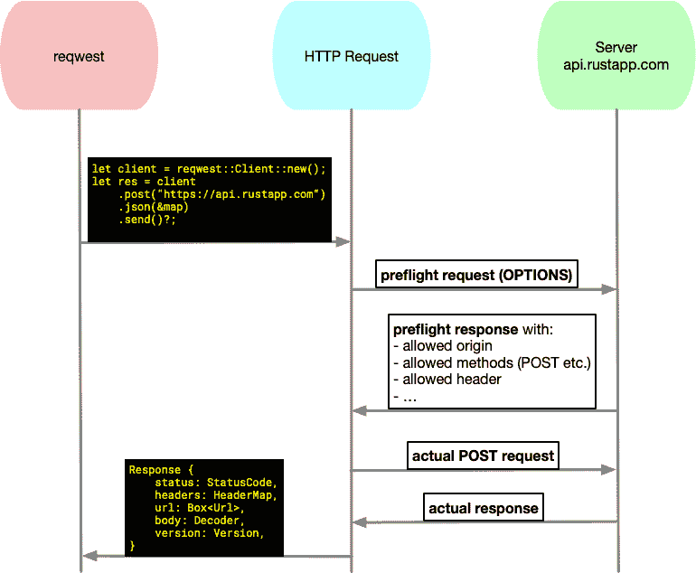
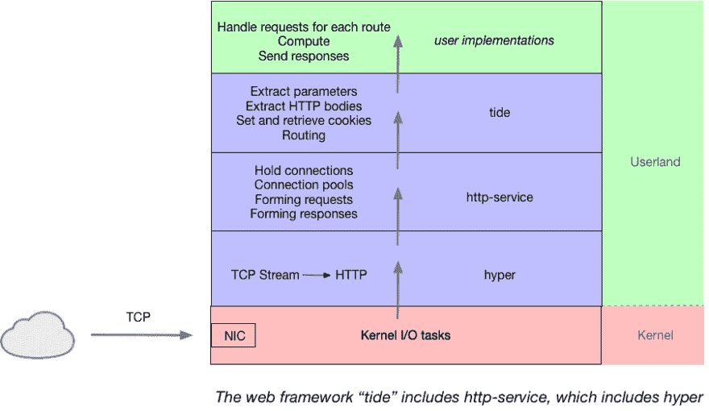

# 使用 Rust-03/x 进行 Web 开发:创建一个 REST API

> 原文：<https://dev.to/gruberb/web-development-with-rust-03-x-create-a-rest-api-3i82>

> 在 twitter 上关注我，总是能获得关于 Rust 网站开发的最新信息。也可以看看这个系列的 [GitHub 库](https://github.com/gruberb/web-programming-in-rust)。

* * *

## 内容

1.  [HTTP 请求](#http-requests)
2.  [POST/PUT/PATCH/DELETE 比较特殊](#postputpatchdelete-are-special)
3.  [一个框架的工作](#the-job-of-a-framework)
4.  [创建 API 规范](#creating-an-api-spec)
5.  [制作 API](#crafting-the-api)
6.  [输入验证](#input-validation)
7.  [总结](#summary)

* * *

API 是现代快节奏网络环境的基础。前端应用程序、其他 web 服务和物联网设备需要能够与您的服务对话。API 端点就像一扇门，你可以决定什么进来，以什么格式进来。

由于 Rust 是一种静态类型语言，具有强大的编译器，所以在生产环境中运行 web 服务时不会遇到很多常见的陷阱。尽管仍有运行时错误需要您来弥补。

## HTTP 请求

当我们谈论创建一个 API 时，我们基本上是指一个 web 应用程序，它监听某些路径并做出相应的响应。但首先要做的是。为了使两台设备能够相互通信，必须建立 TCP 连接。

TCP 是双方可以用来建立连接的协议。建立此连接后，您可以接收和发送消息给对方。HTTP 是另一种协议，建立在 TCP 之上，它定义了请求和响应的内容。

所以在 Rust 方面，TCP 是在 Rust 核心库中实现的，HTTP 不是。无论您在[上一篇文章](https://dev.to/gruberb/web-programming-in-rust-02x-deploy-your-first-app-1k05)中选择了什么框架，它们都实现了 HTTP，因此能够接收和发送 HTTP 格式的消息。

一个 GET 请求的例子是这样的:

```
GET / HTTP/1.1
Host: api.awesomerustwebapp.com
Accept-Language: en 
```

Enter fullscreen mode Exit fullscreen mode

它包括:

*   `GET`:HTTP 方法
*   `/`:路径
*   `HTTP/1.1`:HTTP 协议的版本
*   `HOST`:我们要向其请求数据的服务器的主机/域
*   我们喜欢并理解哪种语言

最常用的 HTTP 方法有:

*   得到
*   邮政
*   放
*   修补
*   删除

## 发布/放置/修补/删除比较特殊

每次浏览网页时，我们都在使用`GET`。然而，如果我们想要改变数据(比如使用`POST`将数据发送到另一个服务器)，我们需要更加小心和精确。

首先，不是每个人都被允许向另一台服务器发送大量数据。例如，我们的 API 可以说:“我只接受来自主机名为`allowed.awesomerustapp.com`的服务器的数据。

因此，当你发送一个`POST`到另一个服务器时，实际发生的是 [CORS 工作流](https://developer.mozilla.org/en-US/docs/Web/HTTP/CORS):

[](https://res.cloudinary.com/practicaldev/image/fetch/s--16KXjXp5--/c_limit%2Cf_auto%2Cfl_progressive%2Cq_auto%2Cw_880/https://raw.githubusercontent.com/gruberb/web-programming-in-rust/master/assets/preflight.png)

我们首先询问服务器什么是允许的，你从哪里接受请求，你接受的头是什么。如果我们满足了所有这些要求，那么我们就可以发送一个`POST`。

例如，web 框架 [actix](https://actix.rs/) 拥有自己的 [cors 中间件](https://actix.rs/actix-web/actix_web/middleware/cors/index.html)。

> 声明:并不是所有的框架(如 [rocket](https://github.com/SergioBenitez/Rocket/issues/25) 和 [tide](https://github.com/rustasync/tide/pull/104) )都在其核心实现了 CORS。然而，在专业环境中，你在 [DevOps 端](https://imti.co/kubernetes-ingress-nginx-cors/)处理 CORS，并把它放到你的 NGINX 配置中。

## 一个框架的工作

我们利用其他人的辛勤工作来创建 web 应用程序。任何事情都必须在某个时候实现，只是大多数时候不是由你来实现。一个框架涵盖以下问题:

*   启动 web 服务器并打开一个端口
*   在此端口上侦听请求
*   如果有请求进来，查看 HTTP 头中的路径
*   根据路径将请求路由到`handler`
*   帮助您从请求中提取信息
*   将生成的`data`和`HTTP StatusCode`(由你创建)打包，形成一个`response`
*   将`response`发送回发送者

Rust web 框架 [tide](https://github.com/rustasync/tide) 包括 [http-service](https://github.com/rustasync/http-service) ，它提供了处理 http 调用时所需的基本抽象。crate http-service 建立在 [hyper](https://github.com/hyperium/hyper) 之上，它将 TCP 流转换为有效的 http 请求和响应。

[](https://res.cloudinary.com/practicaldev/image/fetch/s--tXg0VSph--/c_limit%2Cf_auto%2Cfl_progressive%2Cq_auto%2Cw_880/https://raw.githubusercontent.com/gruberb/web-programming-in-rust/master/assets/web-dev-rust.png)

您的工作是创建类似于`/users/:id`的`routes`，并添加一个`route_handler`，它是一个处理这个特定路径上的请求的函数。该框架确保将传入的 HTTP 请求定向到这个特定的处理程序。

## 创建 API 规范

您必须首先定义您的资源，以了解您的应用程序需要处理什么，并揭示它们之间的关系。所以，如果你想建立一个创意投票网站，你需要:

*   用户
*   主意
*   投票

此场景的简单规范如下所示:

*   用户
    *   帖子`/users`
    *   获取`/users`
    *   放`/users/:user_id`
    *   补丁`/users/:user_id`
    *   删除`/users/:user_id`
    *   获取`/users/:user_id`

想法和投票会做出相应的反应。规范有两个好处:

*   它给你指引不要忘记一条路
*   它有助于向 API 用户传达期望的内容

您可以使用像 [swagger](https://swagger.io/) 这样的工具来编写一个完整的规范，该规范还描述了数据的结构以及每条路径和路由的消息/响应。

更专业的规范应该包括每个路由的返回值以及请求和响应主体。然而，一旦你知道你的 API 应该是什么样子和行为，规范就可以最终确定。要开始，简单的列表就足够了。

## 精心制作 API

根据您使用的框架，您的实现看起来会有所不同。你必须留意以下特征:

*   为每种方法创建路线(如`app.at("/users").post(post_users_handler)`)
*   从请求中提取信息(比如来自请求体的头、uri-params 和 JSON)
*   使用正确的 HTTP 代码(`200`、`201`、`400`、`404`等)创建响应。)

我用的是这个网络系列的最新版本。你可以将它添加到你的 **Cargo.toml** 文件中，并用于你的网络应用:

```
[dependencies]
tide = "0.1.0" 
```

Enter fullscreen mode Exit fullscreen mode

我们的第一个`User`实现将如下所示:

```
async fn handle_get_users(cx: Context<Database>) -> EndpointResult {
    Ok(response::json(cx.app_data().get_all()))
}

async fn handle_get_user(cx: Context<Database>) -> EndpointResult {
    let id = cx.param("id").client_err()?;
    if let Some(user) = cx.app_data().get(id) {
        Ok(response::json(user))
    } else {
        Err(StatusCode::NOT_FOUND)?
    }
}

async fn handle_update_user(mut cx: Context<Database>) -> EndpointResult<()> {
    let user = await!(cx.body_json()).client_err()?;
    let id = cx.param("id").client_err()?;

    if cx.app_data().set(id, user) {
        Ok(())
    } else {
        Err(StatusCode::NOT_FOUND)?
    }
}

async fn handle_create_user(mut cx: Context<Database>) -> EndpointResult<String> {
    let user = await!(cx.body_json()).client_err()?;
    Ok(cx.app_data().insert(user).to_string())
}

async fn handle_delete_user(cx: Context<Database>) -> EndpointResult<String> {
    let id = cx.param("id").client_err()?;
    Ok(cx.app_data().delete(id).to_string())
}

fn main() {
    // We create a new application with a basic, local database
    // You can use your own implementation, or none: App::new(())
    let mut app = App::new(Database::default());
    app.at("/users")
        .post(handle_create_user)
        .get(handle_get_users);
    app.at("/users/:id")
        .get(handle_get_user)
        .patch(handle_update_user)
        .delete(handle_delete_user);

    app.serve("127.0.0.1:8000").unwrap();
} 
```

Enter fullscreen mode Exit fullscreen mode

你可以在本系列的 [GitHub 库](https://github.com/gruberb/web-programming-in-rust/tree/master/03-x)中找到代码的完整实现。

我们看到，我们首先必须创建一个新的应用程序

```
let mut app = App::new(()) 
```

Enter fullscreen mode Exit fullscreen mode

添加路线

```
app.at("/users") 
```

Enter fullscreen mode Exit fullscreen mode

并且为每个路由添加我们想要处理的 HTTP 请求

```
app.at("/users").get(handle_get_users) 
```

Enter fullscreen mode Exit fullscreen mode

每个框架都有不同的提取参数和 JSON 主体的方法。Actix 使用的是[提取器](https://actix.rs/docs/extractors/)，rocket 使用的是[查询守卫](https://api.rocket.rs/v0.4/rocket/request/trait.FromQuery.html)。

使用 tide，您可以通过`Context`访问请求参数和主体以及数据库连接。因此，当我们想要用特定的`id`更新一个`User`时，我们向`/users/:id`发送一个`PATCH`。由此，我们称之为`handle_update_user`方法。

在这个方法中，我们可以像这样从 URI 访问`id`:

```
let id = cx.param("id").client_err()?; 
```

Enter fullscreen mode Exit fullscreen mode

每个框架还处理自己的方式，将响应发送回发送方。潮汐在用`EndpointResult`，火箭在用[响应](https://api.rocket.rs/v0.4/rocket/struct.Response.html)和 actix [HttpResponse](https://actix.rs/docs/response/) 。

其他的一切完全取决于你。该框架可以帮助您进行会话管理和身份验证，但是您也可以自己实现。

我的建议是:用你选择的框架构建你的应用程序的第一个框架，弄清楚如何从请求中提取信息，以及如何形成响应。一旦这样做了，你就可以用你的 Rust 技能构建你想要的或大或小的应用程序。

## 输入验证

你在 Rust 世界里最好的朋友将会是 serde。它将帮助您解析 JSON 和其他格式，但也允许您序列化数据。

当我们谈到输入验证时，我们希望确保我们得到的数据具有正确的格式。假设我们从请求中提取 JSON 主体:

```
let user: User = serde_json::from_str(&request_body); 
```

Enter fullscreen mode Exit fullscreen mode

我们在这里使用 [serde_json](https://docs.serde.rs/serde_json/) 将 json 字符串转换成我们选择的结构。所以如果我们创建了这个结构:

```
struct User {
    name: String,
    height: u32,
} 
```

Enter fullscreen mode Exit fullscreen mode

我们要确定发送者包括`name` **和** `height`。如果我们只是做了`serde_json::from_str`，而发送者忘记了传递身高，应用程序将会死机并关闭，因为我们预计响应是一个用户:`let user: User`。

我们可以这样改进错误处理:

```
let user: User = match serde_json::from_str(&request_body) {
    Ok(user) => user,
    Err(error) => handle_error_case(error),
}; 
```

Enter fullscreen mode Exit fullscreen mode

我们捕获错误并调用我们的`handle_error_case`方法来优雅地处理它。

## 总结

1.  选择一个你喜欢的框架
    *   火箭是夜间发射的
    *   actix 稳定
    *   潮汐靠近锈核生长，也在夜间对锈核起作用
2.  要知道目前还没有通用的 CORS 处理方法。建议在 DevOps 端处理这个问题(例如 NGINX)
3.  在选择了一个框架之后，详细说明你的资源(`/users` : GET，POST 等。)
4.  弄清楚您选择的框架如何处理从请求中提取参数和 JSON，以及如何形成响应
5.  通过`match`和 [serde_json](https://docs.serde.rs/serde_json/) 验证您的输入