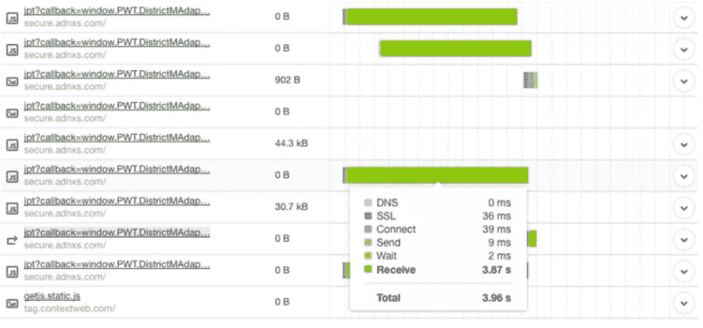
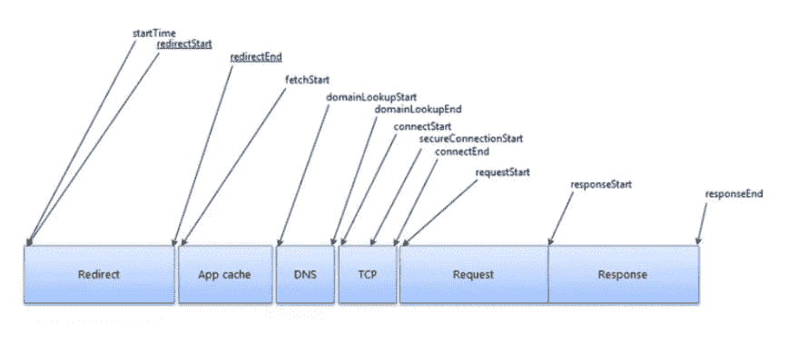
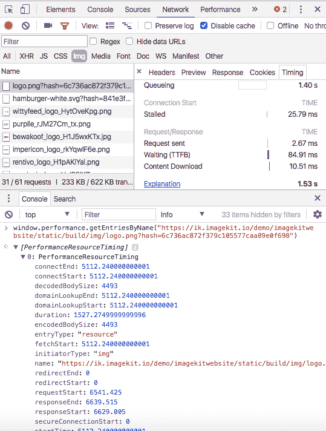

# 网站速度测试——你做得对吗？

> 原文：<https://dev.to/rnanwani/website-speed-testing--are-you-doing-it-right-3pa5>

如果你不能衡量它，你就不能改善它。这就是为什么网站速度测试是每个网站管理员都非常感兴趣的。虽然有许多工具可以用来衡量与网页性能相关的不同指标，但仅仅依赖某个特定指标往往会导致不准确的结论。

本指南的目的是强调网站速度测试的整体情况。包括衡量什么，如何准确衡量以及整个过程中的各种陷阱。让我们逐一介绍:

## 网站速度测试时要测什么？

当谈到网站速度测试时，我们立即开始考虑总的页面加载时间。毫无疑问，这一指标非常重要，但是如果你深入了解，你会发现过多关注这一特定指标，如一些工具所报告的那样，往往会误导你。页面加载时间本身并不能很好地反映访问者的用户体验。

让我告诉你为什么。例如，看看这张图片

[](https://res.cloudinary.com/practicaldev/image/fetch/s--DDDAtnXq--/c_limit%2Cf_auto%2Cfl_progressive%2Cq_auto%2Cw_880/https://thepracticaldev.s3.amazonaws.com/i/24tsj4dhts8qq34x6is8.png)

请注意以`ipt`开头的第三方调用是如何花费大量时间加载的，并且增加了报告的页面加载时间。即使这些调用在所有重要内容加载后在后台异步发生，它们仍然在总的页面加载时间中报告。如果你处于类似的情况，那么问问你自己这个问题

*   这些第三方跟踪 API 调用或广告脚本会影响用户与页面的交互方式吗？

如果上述问题的答案是否定的，那么你需要停止仅仅根据这个标准来做决定。

> 换句话说，您需要开始度量对您的应用程序重要并且特定于您的用例&业务的指标。

例如，在电子商务网站上，用户应该能够使用过滤器并看到产品。所以所有的 JS 文件、HTML 模板和产品图片都应该尽快加载。这正是你应该衡量的。我们将很快讨论如何单独测量不同资产的加载时间。

另一方面，对于一个新闻网站，你的访问者应该能够在失去兴趣和反弹之前看到文本和相关的图像。只有在你通过快速加载你的页面来快速向他们提供内容之后，获得更多参与、更多广告展示和更多点击的机会才会增加。

现在我们知道，一种尺寸并不适合所有情况，因为并非所有指标都具有相同的重要性。让我们来讨论一下如何分别准确地测量这些页面性能指标。

## 如何衡量一个网页的不同性能指标？

大致有两种测量技术:

*   没有实际用户的合成测试。这可以使用像 [CatchPoint](http://www.catchpoint.com/synthetic-monitoring/) 或 [Pingdom](https://www.pingdom.com/) 这样的工具来完成
*   通过注入 javascript 来收集计时指标，在实际用户的浏览器中进行实际用户监控

> 如果你关心你的用户实际上是如何体验你的应用的，那么真实用户监测(RUM)将提供最准确的见解。

朗姆酒有一些公司和开源项目，但是你也可以构建自己的脚本！

如果您已经熟悉资源计时 API 和相关属性，请跳过下一节。

### 关于资源定时 API

资源计时 API 通过窗口对象的性能属性公开。`window.performance.getEntries()`为页面上的每个资产提供 PerformanceResourceTiming 对象的数组。此数组中的每个 PerformanceResourceTiming 对象都包含以下重要计时信息:

*   `initiatorType`表示启动性能事件的资源类型。它可以是元素的 localname、css 或 xmlhttprequest 等。
*   当第一次 HTTP 重定向开始时，记录`redirectStart`。
*   当最后一次 HTTP 重定向完成时，记录`redirectEnd`。
*   当浏览器准备好使用 HTTP 请求获取文档时，会记录`fetchStart`。这是在检查任何应用程序缓存之前。
*   `domainLookupStart`是紧接在域名查找之前记录的。
*   `domainLookupEnd`在域名查找成功后立即被记录。
*   `connectStart`在启动与服务器的连接之前立即被记录。
*   `connectEnd`在与服务器或代理建立连接后立即被记录。
*   为了保护连接，握手开始时会记录`secureConnectionStart`。只有在使用 TLS 或 SSL 时才使用它。
*   `requestStart`在设备开始发送资源请求之前立即被记录。
*   `responseStart`在设备收到响应的第一个字节后立即被记录。
*   `responseEnd`在收到响应的最后一个字节后立即被记录。

浏览器中典型的请求生命周期从 DNS 查找开始，然后是 TCP 连接，最后是实际下载。

[](https://res.cloudinary.com/practicaldev/image/fetch/s--6ctbZ6a9--/c_limit%2Cf_auto%2Cfl_progressive%2Cq_auto%2Cw_880/https://thepracticaldev.s3.amazonaws.com/i/f8tps31qq3j9wysb7mde.png)

TTFB = `responseStart - requestStart`

下载时间= `responseEnd - responseStart`

总下载时间= `responseEnd - requestStart`

这里有几个脚本，你可以用来看看你的网站是如何运作的。

### 计算页面上特定 JS 文件下载时间的演示脚本

假设我们想测量一个名为 vendor.js
的编译后的 JS 文件的下载时间

```
function measureTimings() {
  var timingInfo = window.performance.getEntriesByName("https://imagekit.io/static/build/js/vendor.js");
  if(timingInfo.length) {
    var duration = timingInfo[0].duration;
    var beacon = new Image();
    beacon.src = "//example.com/rum/result/log-timings?script=vendor&amp;duration=" + duration;
  }

} 
```

vendor.js 加载后调用`measureTimings()`。

只需在后端实现一个端点，就像上面例子中的`log-timings`端点，来接收这个持续时间数据。然后，您可以计算数据，如平均，中间值和百分比加载时间，以了解多长时间后，你的网页是有用的访问者。

这些数据反映了你的真实用户在你的网站上的体验。您可能有不止一个 JS 文件或者其他一些对您的用例更重要的资产，去测量它们的计时。

你也可以利用 [Google Analytics 的用户计时](https://developers.google.com/analytics/devguides/collection/analyticsjs/user-timings)跟踪，而不是实现你自己的后端来记录这些计时。你可以像这样使用发送命令:

```
ga('send', {
  hitType: 'timing',
  timingCategory: 'JS Dependency',
  timingVar: 'load',
  timingValue: 1249

}); 
```

我会写一篇详细的文章，介绍我们如何收集更多的信息，比如访问者的 IP 和位置，以便能够更好地了解我们的页面性能。如果你需要提醒，请告诉我

### 计算页面上所有图片 90%下载时间的演示脚本

要计算网页上 90%的图片被加载需要多长时间，你可以使用类似这样的东西

```
function measureImageTimings() {
  var timings = window.performance.getEntries();
  var sum = 0;
  for(var i=0, l=entries.length; i &lt; l;i++) {
    // check on name property to check only for images or any other custom check you want
    if(entries[i].name.indexOf("images.example.com") != -1) {
      timings.push(entries[i].duration);
    }
  }
  timings.sort(function(a,b){ return a-b; });
  var len = timings.length, ninetieth, beacon;
  if(len) {
      ninetieth = timings[parseInt(len *.9)] || 0;
      beacon = new Image();
      beacon.src = "//example.com/rum/result/log-nineteenth-percentile?ninetieth="+ninetieth;
  }

} 
```

用户进入页面几秒钟后触发`measureImageTimings()`。理想情况下，您会希望等到大多数图像都已加载完毕。您还可以发送`timings.length`来记录在本次录制时已经加载了多少张图像。在触发`measureImageTimings()`增加计数之前，尝试不同的等待时间。如果你对此有更好的想法，请在评论区分享。

## 网站速度测试中的各种陷阱

1.  **计时标准不可用**

并非所有的计时标准都在每个原点上公开。`Timing-Allow-Origin`响应报头应包含您希望允许访问上述计时信息的白名单来源。如果这个检查失败了，`responseStart`和许多其他指标将简单地报告 0，您的整个分析可能出错。为了安全起见，你可以像这样将所有来源列入白名单

`Timing-Allow-Origin : *`

1.  当依赖于 RUM 时，你应该**总是收集大量数据**来弥补任何差异。

2.  应给予中位数和百分位数比平均值更高的重要性。

3.  **分析数据时，移除异常值**。

4.  不要被庞大的数据淹没，并且永远记住测量什么。请记住，上面的页面加载时间示例。不要局限于一个单一的指标。

5.  **了解持续时间字段和实际下载时间之间的差异**

在页面加载期间，有许多资源被并行下载，它们都竞争有限的带宽。除此之外，如果您的服务器使用 HTTP/1 而不是 HTTP/2，那么 browser 会进一步限制每个源在任何时间点只能有 6 个 TCP 连接。这可能导致您的请求排队时间比该资产的实际下载时间长得多。浏览器可以因为其他原因推迟您的请求，比如优先级低于关键资源(如脚本/样式)的请求。这种情况经常发生在图像上。比如说-

[](https://res.cloudinary.com/practicaldev/image/fetch/s--_lx7M7Bq--/c_limit%2Cf_auto%2Cfl_progressive%2Cq_auto%2Cw_880/https://ik.imagekit.io/demo/imagekitwebsite/wp-content/uploads/Screen-Shot-2017-07-31-at-6.07.18-PM.png)

现在请注意，总下载时间(TTFB +下载时间)只有大约 95 毫秒，但是由于请求排队了 1.4 秒，总下载持续时间被报告为 1.5 秒。

您需要确保使用 PerformanceResourceTiming 对象中的正确字段进行测量。

例如，如果你正在比较各种 cdn 的性能，那么你应该关心 TTFB 和总下载时间。另一方面，如果你想测量访问者看到你的图片需要多少时间，或者下载你的 JS 需要多少时间(即过滤器开始工作)，那么你应该考虑持续时间字段。它将考虑所有的排队、停顿、TCP 握手、SSL 握手和 DNS 查找时间。

我希望你们都准备好使用这些技术来衡量自己网站的性能。网站速度测试是一个持续的过程，除了 RUM 之外，你还应该使用其他可用的工具来监控网站的整体性能，如 Google PageSpeed Inshgits、WebPageTest 和 Pingdom。

要更深入地了解您的图像健康状况，请尝试 ImageKit [网站分析器](https://imagekit.io/website-analyzer)

如果您在 analyzer 报告中看到太多未优化的图像，[立即注册 ImageKit】并尝试一下。这是一个智能的全球](https://imagekit.io/registration?planType=free&utm_source=dev.to&utm_medium=blog&utm_campaign=Dev.to_Speedtest_Free&utm_content=Dev.to_Speedtest_Free)[形象 CDN](https://imagekit.io?utm_source=dev.to&utm_medium=blog&utm_campaign=Dev.to_Speedtest_Free) 免费开始，只需要[几分钟](https://imagekit.io/blog/image-optimization-10-minutes-imagekit?utm_campaign=blog&utm_source=website-speed-testing&utm_medium=web)就可以启动并运行。

不确定[图像优化为什么重要，看这个](https://imagekit.io/blog/image-optimization-goes-well-beyond-performance-improvement?utm_campaign=blog&utm_source=website-speed-testing&utm_medium=web)？

请与您的团队分享该指南，并在下面的评论部分留下您的反馈和意见。