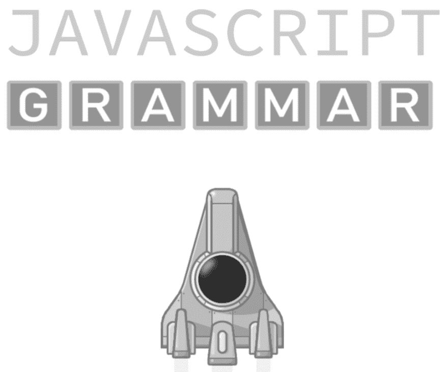
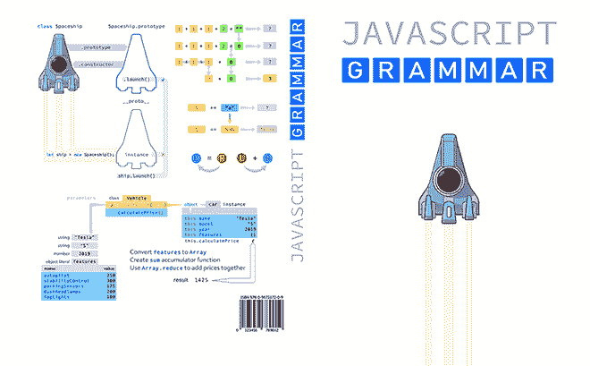

# 从@js_tut 的《Javascript 语法二》这本书里学到的

> 原文：<https://dev.to/veslav3/what-i-have-learned-from-this-book-43k3>

通过这篇文章，你将能够评估你是否应该自己拿起或阅读这本书。由于我已经有了一些 Javascript 的经验，你可以用我的博客来评估有 Javascript 经验的人能从这本书里获得多少新的信息。如果我说的一切对你来说都是新的，请自己读一读这本书。
如果你知道这些事情的一半，你可能已经知道得够多了。

[](https://res.cloudinary.com/practicaldev/image/fetch/s--LGi7R-8E--/c_limit%2Cf_auto%2Cfl_progressive%2Cq_auto%2Cw_880/https://thepracticaldev.s3.amazonaws.com/i/ikeg566ta5usoymqmi8a.png)

首先，我要感谢 Greg Sidelnikov ( [@js_tut](https://dev.to/js_tut) )把这本令人惊叹的书免费放在那里。你可以在这里找到他的推特:

> JavaScript 老师[@ js _ tut](https://dev.to/js_tut)PDF @[javascriptgrammar.com/get](https://t.co/3SBgbLBL07)平装@[amzn.to/2Yp71Og](https://t.co/MTd5mKGpyS)2019 年 3 月 27 日上午 10:49[](https://twitter.com/intent/tweet?in_reply_to=1110856477697294337)[](https://twitter.com/intent/retweet?tweet_id=1110856477697294337)109

## 那么我从他的书中学到了什么呢？

首先我了解到 Javascript 有了新的语言版本 ECMAScript 2019 (ES10)。这意味着他们给这种语言增加了一些新的特性。

除此之外，我还了解到 chrome devtools 中有一个复制功能。这可以将对象复制到你的剪贴板上，这对构建自动化测试非常有用。

我还了解到 JSON 格式需要双引号，而单引号的表现不好(尽管从我的经验来看，用单引号字符串化对象是可能的)。

在 Javascript 中，每个对象都有自己的名称来标识对象。这样，两个相同的物体可以分开。

要删除对象的属性，可以使用“delete”关键字。

ES6 中的析构也可以用于数组，例如:

```
[a, b] = [1, 10]
// a = 1, b = 10 
```

使用`var`声明变量会将变量附加到`window`对象。但是使用`let`不能做到这一点。

闭包是其他函数中的函数，将在顶级函数中被立即调用。这样你可以一次执行多个功能。

闭包也可以用作函数构造器。

您可以从函数对象
的`length`属性中获取函数中参数的数量

```
function x(param1, param2) {
}
console.log(x.length) // logs the value: 2 
```

在循环中，您可以使用`continue`关键字跳过一个步骤。

例如，在 Javascript 语句中，可以标记一个`for`循环，以便在使用`break`或`continue`关键字时引用它们。

`Array.some` & `Array.every`是评估数组内容的有用函数。

reducer(`reduce`函数)必须返回一个与输入类型相同的值。例如，如果输入了`numbers`，则必须返回`numbers`。不说`strings`或者`booleans`。

迭代器可以使用 spread 操作符转换成数组。

编写自己的代码来解决问题总是一个好主意，因为这样你就可以独立思考，而不是依赖别人对你的问题的部分解决方案。解决问题是你的工作。

> 抽象是你最好的朋友。

一般来说，抽象在编程时会给你很大帮助，但它也适用于 Javascript。

当你声明一个`function`时，它将有一个`parameters`属性。当你声明一个箭头函数(`() => {}`)时，它不会有`parameters`属性。

当使用`this`关键字时，箭头函数继承代码的词法范围。当你需要使用一个`object`引用而不是一个对`window`对象的引用时，这是很有用的。

Javascript 中的`functions`是所有`object`类型的构造函数。甚至对于`functions`自己来说。

`requestAnimationFrame()`有助于使动画看起来更流畅。

## 书的最后一点

最后，这本书谈到了很多面向对象的原则，因为我所受的教育，我已经知道了很多。这就是为什么我完全跳过了这本书的这一部分，因为我必须过滤掉几乎所有我已经知道的东西。所以我不能根据内容来判断这本书的那一部分，你必须自己去读。

这本书似乎也强调了了解 Javascript 内部工作原理的重要性，以及像`event loop`这样的话题是如何经常被作为面试问题提出的。这是因为对一门语言的深入理解将把初学者和专业人士区分开来，这种知识将允许建立更有效的程序和网站。

## 结论

虽然你可能从我列出的新东西中学到了一些新东西，但你可能没有学到书中所有的东西。也有可能在读完这篇文章后，你缺乏书中给出的关于我所谈到的每一句话的上下文。那么你自己去看看这本书是个好主意。

注意:这是我在这个平台上的第一篇帖子，我可能犯了一个小错误。我乐于接受反馈，并愿意纠正潜在的错误，以提高帖子的质量。

如果你喜欢我的内容，一定要在 Twitter 上关注我！