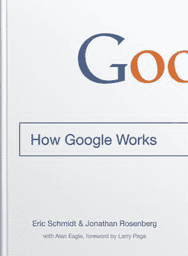

# 我从谷歌的工作方式中学到了什么

> 原文：<https://dev.to/anoff/what-i-learned-from-how-google-works-pf2>

🤞从[https://blog.anoff.io/2019-01-31-book-google-schmidt/](https://blog.anoff.io/2019-01-31-book-google-schmidt/)上传的十字

正如[承诺的](https://blog.anoff.io/2019-01-15-book-2018-in-books)我的系列丛书将从 [FAANG](https://en.wikipedia.org/wiki/Facebook,_Apple,_Amazon,_Netflix_and_Google) 联盟的两本书开始。《T4 谷歌如何工作》一书涵盖了公司文化的许多方面。这本书有很多管理见解，但在我阅读的时候，我并不感兴趣。因此，我想简要强调一下关于[创新](#innovation)的几点，我发现这些很吸引人，然后转移到人力因素，如[招聘](#recruiting)和[能力管理](#competence-management)，这些也在本书中广泛涉及。

## 创新

> 照片由 Sharon Pittaway 在 Unsplash 上拍摄

这本书明确阐述了创新对谷歌的真正意义，并可能帮助你区分胡说八道的宾果和真正的创新:

1.  给顾客他们想要的东西**不是创新**
    *   涉及到亨利·福特([或不](https://hbr.org/2011/08/henry-ford-never-said-the-fast))的引用`“If I had asked people what they wanted, they would have said faster horses.”`
    *   相反，给客户惊喜，提供一些他们以前没有的基本有用的东西
2.  多个小的非创新步骤结合起来可以产生创新产品
    *   这里给出的一个例子是谷歌邮件，它本身并不是一个创新，而是云存储、网络应用和人工智能的结合创造了一个产品，进入了一个现有的市场并颠覆了它
3.  创新者不需要被告知他们应该创新
    *   创新不是后天习得的，而是一种人格特质
    *   你可以培养创新，但你不能学习或命令创新
    *   为了实现真正的创新，给创新者自由操作(时间、资源、信任)
4.  大公司吸引规避风险的员工，而这些员工往往会阻碍创新
    *   寻求安全场所的员工很难拥抱变化，更不积极地将变化带入组织

## 管理

> Unsplash 上 rawpixel 的照片

如前所述，这本书涉及的许多管理方面没有写进我的个人笔记。我可能要在某个时候再读一遍。一个让我印象深刻的推论是关于创新环境中的流程:

1.  `"If everything seems under control, you're just not going fast enough."` ( [马里奥·安德烈蒂](https://en.wikipedia.org/wiki/Mario_Andretti)，赛车手)
    *   在这种情况下:如果你没有经历任何问题，你就没有尽你所能去创新
2.  **进程比现实慢**
    *   是的，是的，是的
3.  混乱是正常的，不是例外
    *   在创新的环境中，你认为现实的东西可能随时会改变
4.  订单和流程无法强制执行
    *   即使在创新的环境中，你也需要建立一些规则
    *   这些规则需要从最高管理层到初级员工的每个人来决定和执行
    *   为了进行公开讨论和决策，你需要有一种**开放、透明、任人唯贤和诚实的文化**

## 招聘

> 照片由 Ryoji Iwata 在 Unsplash 上拍摄

书中不断出现的一个术语是**聪明的创意者**,描述的是一个属于

> "[..各个年龄段的雄心勃勃的人渴望(并且能够)使用技术工具做更多的事情。他们的共同特点是努力工作，并且**愿意质疑现状**，以不同的方式攻击事物。这就是为什么它们能产生如此大的影响。
> 这也是为什么他们很难管理的原因，尤其是在老派模式下，因为无论你多么努力，你都无法告诉这样的人如何思考。如果你不能告诉某人如何思考，那么你必须学会管理他们思考的环境，并让它成为他们每天都想去的地方。”

这个定义让我产生了很大的共鸣，因为在读完之后，我意识到在我的个人网络中，我所仰视的所有人都不愿意接受现状，并一直在问*为什么我们需要这样做？*。我自己也打了很多仗，我经常接近放弃，但最终坚持你的意志去改变你最有可能成功的事情。很多时候，事情都是以不再有效或者可能不适合你的假设为基础的。请记住**在反对既定规则时保持建设性**——试着理解他们的推理，并解释为什么你认为它可能不适用于你的事业。装天真也有帮助😉

这本书关于雇佣如此聪明的创意人员的主要观点是:

1.  雇佣终身学习的人
    *   你不必为即将到来的新技术进行培训，而是那些出于好奇想要引进并学习它的人
    *   我从中得到的一点是，要更仔细地阅读简历中关于业余培训、宠物项目等方面的内容。
2.  多面手胜过专家
    *   原因是它变化如此之快，很可能你现在是专家的领域在未来可能不再与行业、你的产品或你的公司相关。擅长学习新概念比已经掌握它们更重要。
3.  雇佣(只)你想交的人做朋友是一个糟糕的团队
    *   这方面可能会有争议，但考虑到推理，我认为这是有道理的——而且经常被忽视
    *   你喜欢作为朋友的人分享你的兴趣和观点
    *   这导致了观点和推理路径的多样性
    *   如果没有多样性，当你需要做出决定时，你永远不会有所有可能的选择摆在桌面上
    *   这可能导致次优决策，因为没有考虑最佳解决方案
    *   你能和某人进行有趣的(客观的)讨论比喜欢他们(宽松的规则)更重要
4.  招聘是每个员工的责任
    *   要得到最好的，你需要广撒网
    *   每个员工都应该寻找新的人才
    *   让它成为你年度员工评估和奖金的一部分，不仅仅是人力资源部
5.  永远雇佣最好的
    *   训练你的员工雇佣他们尊敬的人
    *   一旦你开始雇佣你认为唯一好的人，而他们自己也开始雇佣，集体技能就会螺旋式下降
    *   **永远不要**安于现状

## 能力管理

> 照片由你好我是尼克在 Unsplash

招聘类别的一个要点对员工的能力管理也有很大的影响。**终身学习**是一种需要组织提供、支持和培养的东西。如果你雇佣了*聪明的创意人员*，他们一旦意识到没什么新东西可学，或者——更糟糕的是——学习新东西可能会被认为*浪费时间*，就会离开。

书中提到的另一点，我发现在我自己的环境中实施起来非常诱人，那就是**片段**的概念:

1.  每位员工都要写一份简短的每周工作总结
    *   项目经理可能会写下他们谈论的客户
    *   开发人员写下他们学到的工具或发现的错误
2.  每周 0.5 - 1 页，要点
3.  与你公司的每个人公开分享
    *   组织需要提供一个中央基础设施，人们可以在那里存储他们的片段
    *   不要把它寄给你的经理
    *   片段需要由全文和人搜索
4.  如果你对一个人的工作感兴趣，只要看看他们过去的片段，看看他们到底在做什么
5.  如果你正在寻找一个可以帮助你学习 XY 的人，只需要搜索一些片段就可以了

我认为，如果你习惯了，写这些片段对一个人的日常工作来说是很小的开销，但它可以成为促进网络机会和知识交流的强大工具。

* * *

让我知道你是否喜欢这篇文章，或者你觉得哪些部分特别吸引人，请在下面的 [Twitter](https://twitter.com/an0xff) 上发表评论，或者在 [LinkedIn](https://linkedin.com/in/offenhaeuser) 上给我发消息

敬请期待`Powerful`最精彩的部分

👋安德列亚斯