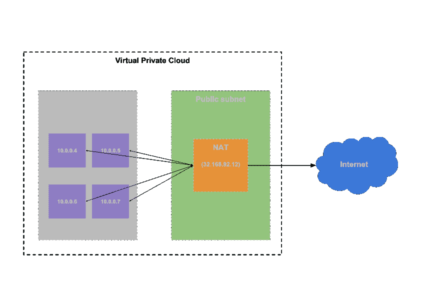

# 什么是 NAT 网关？

> 原文：<https://dev.to/juan__wolf/what-is-a-nat-gateway-5g2o>

在云中设计平台和新架构可能会非常令人生畏，尤其是当你第一次这样做的时候。今天我想谈谈 NAT 网关，它是什么？它是如何工作的？什么时候用等等…

## NAT 到底是什么意思？

首先，什么是 NAT？？如果我们听帕皮维基百科:

> 网络地址转换(NAT)是一种将一个 IP 地址空间重新映射到另一个 IP 地址空间的方法，方法是在数据包通过流量路由设备传输时修改数据包 IP 报头中的网络地址信息。[1]该技术最初用作一种快捷方式，以避免在网络移动时需要重新寻址每台主机。在面临 IPv4 地址耗尽的情况下，它已经成为保存全局地址空间的一个流行且重要的工具。NAT 网关的一个可路由因特网的 IP 地址可以用于整个专用网络。来源:[维基百科](https://en.wikipedia.org/wiki/Network_address_translation)

就是这样！正如爷爷所说，使用 NAT 网关的基础设施很常见，尤其是在云时代(因为 IPv4 耗尽)。在云中，有一条规则。保持一切私密(至少尽可能)。

通常当你开始玩☁️的时候，你会创建一个，两个，等等…但是要直接访问这些实例，你会用一个公共 IP 设置它们，这样更容易。然后你的基础设施变得更加成熟(你也一样)，你意识到如果你对防火墙规则(或安全组)过于宽容，使用公共 IP 可能会对你不利。所以你决定把所有东西都转移到私有子网(只能在你的虚拟私有云内访问)并使用这篇文章的主角。NAT 网关🎉。

我们很幸运，云提供商出售特定的实例或服务来为我们解决这个问题。*太得心应手*。但是最后，这实际上是如何工作的呢？假设您按照云提供商的指示进行了 NAT。

然后你就有了这样一个平台:

正如您在图中看到的，每个出站连接都经过 NAT 网关，然后回到特定的实例。我的问题是怎么做？该实例没有公共 IP，所以当因特网上的服务器收到数据包时，只能看到 NAT 实例的 IP。那么 NAT 网关是如何工作的呢？

## NAT 网关是如何工作的？

因此，正如爷爷所说，NAT 网关在每个数据包中注入自己的地址，这样外部服务器就知道将数据包发送回哪里(**剧透:**到 NAT 网关)。

但是 NAT 如何知道将数据包发送回哪里呢？

通常你会在这里看到一个惊人的 SVG 动画，但是 dev.to 看起来并不支持它...

所以事情是这样的:

你的请求发送到 NAT 网关，它将接收数据包并将发送者和目的地的位置存储在我们称之为 *NAT 表*中。然后，NAT 将更改您的请求的*【from】*报头，用 NAT 的 IP 地址替换源 IP 地址，将数据包发送到正确的目的地，然后您的 NAT 返回响应，为您的私有子网中的实例更改数据包/请求的目的地。任务完成。

您可以想象，如果红色和蓝色实例查询完全相同的端点，NAT 将不知道将响应重定向到哪里，这可能会产生冲突。

所以我想把源端口换成一个随机的，这样我们就知道这个请求重定向到哪个主机了！我在网上看了更多的资料，这就是正在发生的事情(我为自己感到非常自豪😄)

我们总结一下:

1.  你的请求/信息包进入 NAT
2.  NAT 注册源 IP、源端口、目的地 IP、目的地端口，并获得一个可用的随机端口，并将所有这些信息放入转换表中
3.  修改分配给此请求的 NAT 公共 IP 和随机端口的源 IP 和源端口
4.  将请求/数据包发送到目的地
5.  目的服务器处理请求，并将请求发送回 NAT 网关(因为它认为请求来自它，哈哈，你这个傻瓜)
6.  NAT 接收数据包/请求，检查其转换表，如果有条目，则在私有实例中发送它
7.  私有实例接收数据包。

## 局限性

使用 NAT 允许我们保持我们的实例"*私有*"并且仍然给我们外部流量。但是它肯定有一些限制。当然有。在转换的第二步(也就是数据包在 NAT 表中的注册)中，NAT 网关将为服务器的响应分配一个随机端口。问题是，假设您有 20 台服务器运行 20 项服务，每秒钟向外部服务发送 10 个请求。遗憾的是，这些外部服务无法访问，连接将等待 15 秒的超时。在不到 10 秒钟的时间内，NAT 网关将报告不健康或至少无法处理更多的请求。

这是为什么呢？

您使用了 NAT 上所有可用的临时端口。💥

让我们做一些数学。我们每秒创建 20 * 20 * 10 个请求，也就是每秒 4000 个请求。因此，每个请求都会在 NAT 中打开一个临时端口。开放了 4000 个端口。第二秒 4000 个其他人，第三秒你已经打开了 12000 个短暂的端口。它会因你的操作系统而异，但根据维基百科:

> 许多 Linux 内核使用的端口范围是 32768 到 61000。(可通过/proc/sys/net/IP v4/IP _ local _ port _ range 节点下的/proc 文件系统访问有效范围)

所以我想大概有 28232 个端口(只是猜测)。这是我们可以打开的最大临时端口。恭喜你，我们突破了极限，之后我们会有很多问题。很高兴，这只是一个角色扮演，而不是真正的停电😅。

## 结论

瞧啊。我们看到了 NAT 网关如何工作及其局限性。它们是☁️基础设施的核心组件之一，因此至少对它们的用途有一个基本的了解是非常重要的。当然，好极了！