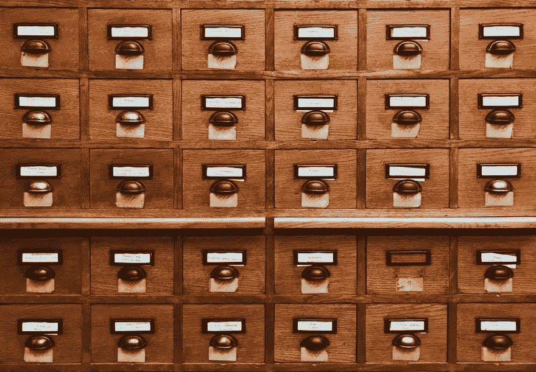

# 什么是对象？

> 原文：<https://dev.to/codetips/what-is-an-object-12lh>

> 对象是数据和方法的结构化集合。

[](https://res.cloudinary.com/practicaldev/image/fetch/s--4dVGG7fo--/c_limit%2Cf_auto%2Cfl_progressive%2Cq_auto%2Cw_880/https://www.codetips.co.uk/conteimg/2019/03/objects_wooden-drawers.jpg)

像这个阶段的大多数事情一样，我们不会把所有的信息都扔给你，所以这只是一个基本的介绍。我们有目的地省略了所有复杂的事情，直到后面的文章。

`Objects`类似于数组，但是它允许你给你存储的每个`value`分配一个`key`，用一个`,`隔开，而不是用递增的数字来索引元素。

所以声明一个对象的基本[语法](https://codetips.co.uk/beginner/what-is-syntax/)如下所示:

```
object = {
    key1: value1,
    key2: value2,
    ...
} 
```

每个**键值对**的行为就像一个[变量](https://codetips.co.uk/beginner/what-is-a-variable/)。当您考虑可以在`object`中存储什么时，这一点尤其重要。它可以是从基本的[数据类型](https://codetips.co.uk/beginner/what-is-a-data-type/)、[数组](https://codetips.co.uk/beginner/what-are-arrays/)、[函数](https://codetips.co.uk/beginner/what-is-a-function/)甚至其他`objects`的任何东西。

```
object = {
    number: 1,
    float: 3.17,
    boolean: true,
    string: "Hello World",
    array: ["John Doe", 37, 1.95],
    object: {
        key: value,
    },
} 
```

当你把一个物体想象成一个有标签抽屉的大橱柜时，你就能很容易理解它的整体概念。

每次你把东西放进抽屉里(比如一把袜子)，你就在抽屉上写一个标签，为抽屉指定一个用途(`socks`)。用一个`object`我们分配一个`key`而不是写一个标签:

```
object = {
    socks: ["red socks", "blue socks", "black socks"],
} 
```

这样，你就能轻松确定所有抽屉里都有什么。

```
object = {
    socks: ["red socks", "blue socks", "black socks"],
    tops: ["striped top", "plain top"],
    trousers: ["jeans", "tracksuit bottoms", "chinos", "suit bottoms"]
} 
```