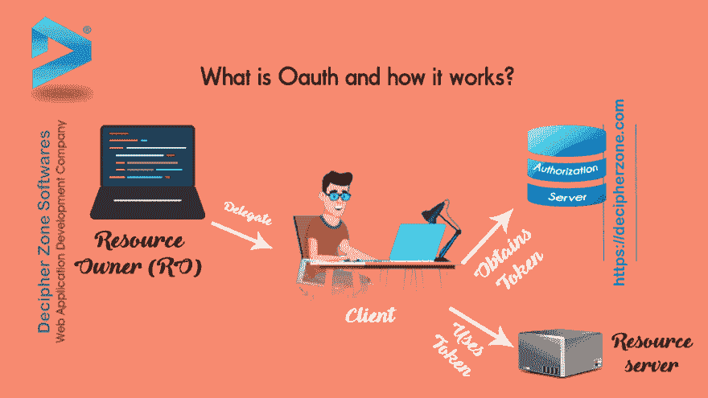

# OAuth 是什么？它是如何工作的？

> 原文：<https://dev.to/decipherzonesoft/what-is-oauth-how-does-it-work-1ok4>

当一个网站需要利用另一个网站的管理时，例如，在你的 Twitter 流上显示比特——而不是要求你共享你的密钥，他们应该利用一个叫做 OAuth 的约定。

**OAuth 是什么？**
了解一个程序、网站或应用程序如何验证你的客户端身份至关重要——这样他们才能获得正确的授权？你是否向他们提供了某种方法来确认你的身份——并为你获取信息？OAuth 简化了这个过程:然而，即使有了机器人化，可靠地了解个人或组织如何使用你的信息。

**OAuth 的定义**
什么是 OAuth？OAuth 是如何工作的？OAuth(开放式身份验证)是一种基于唯一访问令牌的互联网身份验证。OAuth 经常被科技巨头用来授权第三方应用程序提供对驻留在巨头生态系统中的受限资源的访问，而不会泄露用户的登录凭据。OAuth 有大量的作用域或动作可以被第三方应用程序通过 API 请求，因此它被用于软件应用程序中的简单登录。

**为什么要引入 OAuth？**
OAuth 的引入是因为需要一种简单的登录方式，可以作为许多应用程序的通用登录选项。创建用户帐户所需的所有信息通常都存在于用户的社交媒体帐户中，因此开发 OAuth 的目的是在获得用户许可后与应用程序共享这些信息。

【OAuth 是什么时候推出的？
在 2008 年 11 月明尼阿波利斯召开的第 73 届互联网工程任务组(IETF)会议上，OAuth 被引入讨论进一步的标准化工作。该活动得到了 IETF 和外部特许组织的广泛支持。在经历了漫长的开发周期后，OAuth 2.0 框架和承载令牌用法终于在 2012 年 10 月发布。虽然 OAuth 2.0 有一些限制，比如它不能向后兼容 OAuth 1.0，但它正被谷歌、脸书、Twitter、微软的 Azure active directory 和许多其他公司使用。OAuth 2.0 为 web 应用程序、桌面应用程序、移动电话和智能设备提供授权流。

OAuth 是如何工作的？
OAuth 使用密钥和访问令牌，这些密钥和令牌是唯一分配给使用 OAuth 的用户的，因为应用程序开发人员需要向社交媒体平台或他们想要访问其数据库的科技巨头注册软件应用程序。开发人员需要进入社交媒体平台的开发人员部分，并使用部署它的 URL 注册 web 应用程序，然后他/她将获得密钥和访问令牌。

**OAuth 工作流有以下 5 条路线用于验证用户:**

**用户**

想要轻松访问应用程序而无需创建新帐户的访问者。

**浏览器**

web 浏览器是用户用来访问软件应用程序(这里称为客户端)的简单工具。

**客户端**

客户端是一个软件应用程序，可以是 web 应用程序、桌面应用程序、手机应用程序或智能设备。

**授权服务器**

授权服务器从 OAuth API 提供者授权用户和客户端(软件应用程序)。

**资源服务器**

当用户和客户端(软件应用程序)通过身份验证后，用户就可以通过客户端(软件应用程序)向 OAuth API 提供者请求受限资源。

**OAuth 的工作流程**:在这里阅读全文:[https://www . decipherzone . com/blog-detail/What-is-OAuth-and-how-it-works-](https://www.decipherzone.com/blog-detail/What-is-OAuth-and-how-it-works-)