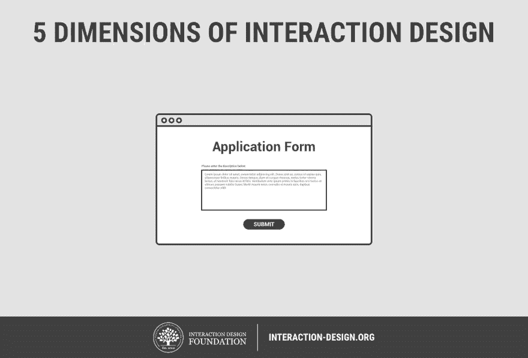

# 什么是好的交互设计？

> 原文：<https://dev.to/eduardoramos/what-makes-a-good-interaction-design-52pm>

良好的交互由许多重叠的区域组成，因为“交互是上下文完形的时刻，一个元素对其他元素有直接的影响”。

同样，为了创造一个良好的交互，设计师必须考虑五个维度:文字(1D)、视觉表现(2D)、物理对象/空间(3D)、时间(4D)和行为(5D)。

这五个维度最初是由伦敦皇家艺术学院的教授吉利恩·克兰普顿·史密斯和高级交互设计师凯文·西尔弗定义的。

维度代表了交互设计者在创建交互时考虑的特征。以下是关于它们的更多信息:

*   **(1D)单词:**
    包含文本——比如按钮标签——有助于向用户传达适量的信息。

*   **(2D)视觉表现:**
    帮助用户交互的图形元素，如图像、字体和图标。

*   **(3D)物理对象/空间:**
    涉及用户与产品或服务交互的媒介——例如，通过鼠标的笔记本电脑，或通过手指的手机。

*   **(4D)时间:**
    这与随时间变化的媒体有关，如动画、视频、声音等。

*   **(5D)行为:**
    关注前面四个维度如何定义产品提供的交互——例如，用户如何在网站上执行操作，或者用户如何操作汽车。行为也指产品如何对用户的输入做出反应并提供反馈。

如果你作为一个设计师考虑了上面提到的五个方面，你可以放心你会达到好的交互设计的所有特征。