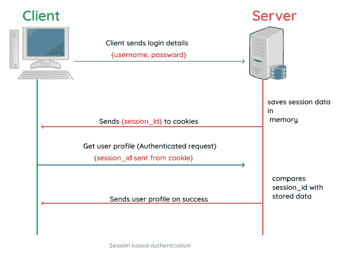
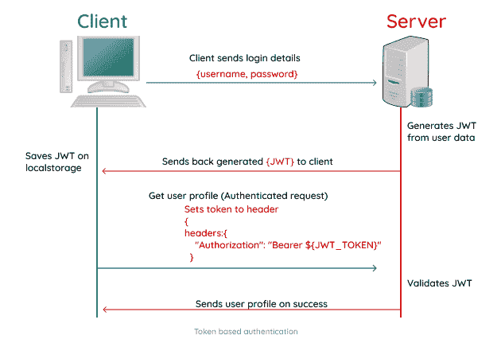

# 基于会话和令牌的身份验证之间的真正区别是什么

> 原文：<https://dev.to/thecodearcher/what-really-is-the-difference-between-session-and-token-based-authentication-2o39>

一个刚刚开始使用 Nodejs 进行后端开发的朋友让我解释一下使用 session 和 jwt 的区别。所以我想我应该写这篇文章给那些当你听到其他开发人员谈论会话和基于令牌的认证时，试图理解它的含义的人。

## 快速介绍

首先，让我们谈谈 HTTP(超文本传输协议)。通过快速的谷歌搜索，我们得到:

> HTTP 是万维网使用的底层协议，该协议定义了如何格式化和传输消息，以及 Web 服务器和浏览器应该采取什么动作来响应各种命令。

从上面的定义中，我们可以看出 HTTP 是实现客户端(前端)和服务器(后端)之间通信的基础。HTTP 是无状态的，所以发出的每个请求都完全不知道之前采取的任何操作。举例来说，我们刚刚登录到我们的 twitter 帐户，我们导航到我们的设置页面，使用默认的 HTTP 行为，我们将被要求再次登录，因为服务器不知道我们刚刚登录，但通过会话和令牌认证，我们可以告诉服务器我们已经登录，我们应该被授予访问该页面的权限。

## 什么是基于会话的认证？

基于会话的身份验证是一种将用户状态存储在服务器内存中的身份验证。当使用基于会话的认证系统时，当用户登录时，服务器创建会话数据并将其存储在服务器存储器中，然后将会话 Id 存储在用户浏览器上的 cookie 中。
会话 Id 随后在后续请求中被发送到服务器，服务器将其与存储的会话数据进行比较，并继续处理所请求的动作。

[](https://res.cloudinary.com/practicaldev/image/fetch/s--jzM6Wq6e--/c_limit%2Cf_auto%2Cfl_progressive%2Cq_auto%2Cw_880/https://cdn-images-1.medium.com/max/800/0%2AP5OxJMihg0S0jyqk.png)

## [T1】什么是基于令牌的认证？](#what-is-token-based-authentication)

基于令牌的身份验证是一种将用户状态存储在客户端的身份验证。这已经成为 RESTful APIs 的首选身份验证模式。在基于令牌的身份验证中，用户数据被加密到一个带有密码的 JWT (JSON Web Token)中，然后被发送回客户端。然后，JWT 被存储在客户端(通常是本地存储器),并作为每个后续请求的报头发送。服务器接收并验证 JWT，然后继续向客户端发送响应。

```
headers:{
"Authorization": "Bearer ${JWT_TOKEN}"
} 
```

*   令牌如何与报头一起发送到服务器的典型示例

## 什么时候用？

实际上，没有首选的身份验证方法，这两种方法可以互换使用，也可以一起创建一个混合系统。这一切都归结于开发人员和用例。
但是，值得注意的是，基于令牌的身份认证比会话的身份认证具有更好的可扩展性，因为令牌存储在客户端，而会话使用服务器内存，因此当大量用户同时使用系统时，这可能会成为一个问题。