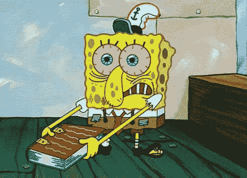

# 技术面试失败后你该怎么办？

> 原文：<https://dev.to/madisonkanna/what-should-you-do-after-you-fail-the-technical-interview-2pib>

当然是找朋友了...

但是真的。我现在没有参加面试，但是我之前已经失败了很多技术面试，现在想起我的第一次面试，我仍然不寒而栗。

我搞砸了。

之后，我不知道该怎么办。我想知道我是否应该放弃。

在技术面试中表现不佳意味着我不适合做开发人员。至少，我当时是这么认为的。

快进到今天，我知道这不是真的。但是我经常听到有抱负的开发人员谈论失败的技术面试如何在事后动摇他们的信心，并使他们质疑他们是否真的能成为开发人员。

所以这里有一个问题，我很想从其他开发人员那里听到答案——你如何在技术面试后恢复过来？你告诉自己什么？接下来你会做什么？

有一件事对我很有帮助:

<u>以后总会想出答案的。</u>在面试结束时，看起来我*永远也不会*明白我面前的技术问题的解决方案是什么。但是后来，当我边学边复习的时候，我发现我可以。这有助于重建我的信心，因为我发现了阻碍我理解问题的知识差距，并弥补了这一差距。

但我希望我能早点知道。这就是为什么我创建了这个线程。

**根据你的经验，你在技术面试失败后应该怎么做，以确保你作为一名开发人员*是因为经验的*而不是不顾经验而学习和成长？**