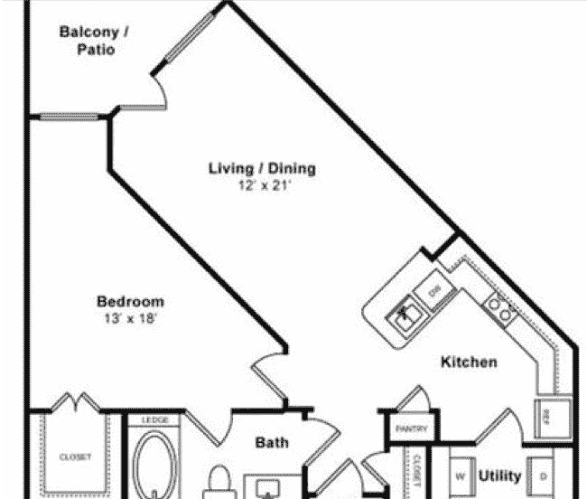

# 当 PHP 框架吮吸系列:如何不把你的应用塑造成框架的形状

> 原文：<https://dev.to/damnjan/when-php-framework-sucks-series-how-not-to-shape-your-app-in-the-shape-of-the-framework-4dm6>

#### [T1】简介](#intro)

下面是我在题为“当 PHP 开发框架很糟糕”的演讲中使用的一张图片，当时我试图解释当你过多地绑定框架时会发生什么。图像是一个公寓的足迹，在房间的角落没有共同的角度。所以你可能已经想到，当你搬到这样的公寓，你必须根据房间的角度定制家具。否则，你将无法用市场上能找到的标准家具来装备你的新家。
 
让我们把这个案子搞得更糟。假设你搬到了新城市，你没有太多的选择，你选择了这个公寓。它是空的，你开始用和平装备它。几年后，你决定搬到另一个公寓。但是你如何处理现有的家具呢？一旦你搬到下一个公寓，你必须扔掉它，买一个新的，因为新的有所有新的房间属性，这次只是标准的，所以你的“定制”家具不再适合了。

#### 不可能改变框架

Custom furniture 是一个很好的例子，说明了开发人员如何围绕框架设计他们的应用程序，然后他们就不能在其他环境(其他框架或库)中使用它了。框架促使你将应用程序组织在一个特定的文件夹结构中，这本身并不坏，但是一旦你考虑到框架的变化，它可能会成为一个障碍。你可能不会改变整个框架，因为这不是经常发生的事情，但有时只是相同的框架，但不同的主要版本完全使你的应用程序无用。我想每个人都记得从 Zend 1 到 Zend 2 的迁移。我从来没有听说过一个成功的故事，一个公司完成了这项任务。

#### 结论

这给我们留下的结论是，每次公司或开发人员不得不改变一个框架时，她/他或公司几乎被迫重写整个应用程序。对于已经盈利的大系统，大的重构或系统重写尤其成问题，当你在一个新的框架中平静地重写它时，你不能把它放在一边。这是我在职业生涯中多次看到的，公司因为框架绑定而无法升级。他们过去称之为“遗留问题”,因为那是“随着时间推移而发生”的事情，你对它没有任何控制。我很少看到公司强制执行任何 DDD(领域驱动设计),并迫使他们的业务与工具分离，因为框架本质上只是工具。

#### 我的发现

我个人相信，而且我已经证明了，从框架中分离会给公司带来长期的财务利益。无论新的框架版本带来了什么，或者我们想要将我们的组件与其他框架或库集成，我们都可以毫不费力地做到这一点，但前提是我们必须将业务逻辑从框架中分离出来。我最近做了一个关于我的项目的演示，这个项目有可能和 PHP 一样长寿(并且不会有很大的变化)。该项目完全配备了 100%的单元测试覆盖率+行为测试，以确保功能列表始终有效。此外，该项目是如此独立和抽象的框架，我们可以在一周内将其应用到另一个框架中。我的公司相信这个项目会持续五年以上，这已经让我们到了不会有任何“大的重构”或“大的重写”的地步。“所以如果这不能证明经济上的好处，我找不到任何更明显的例子。