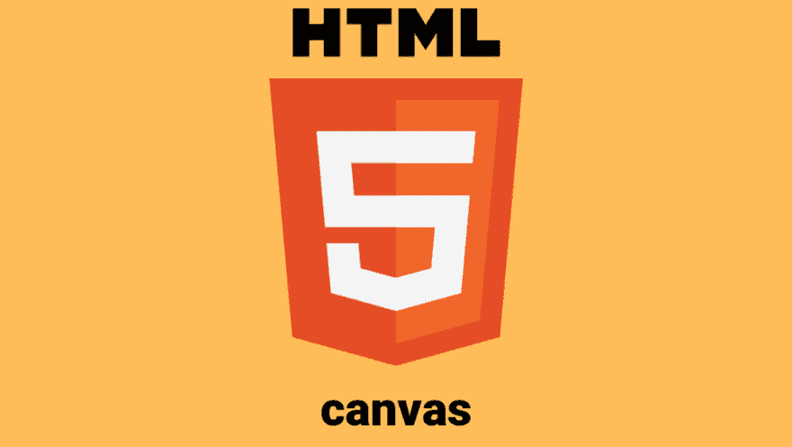
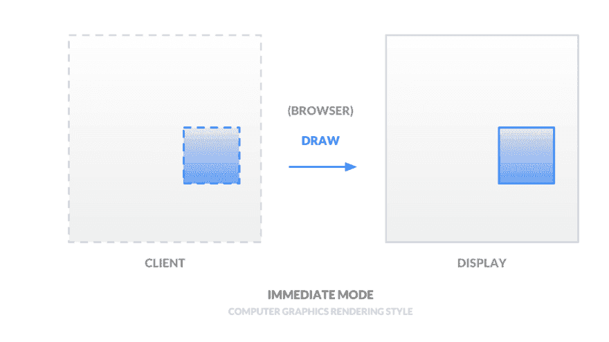
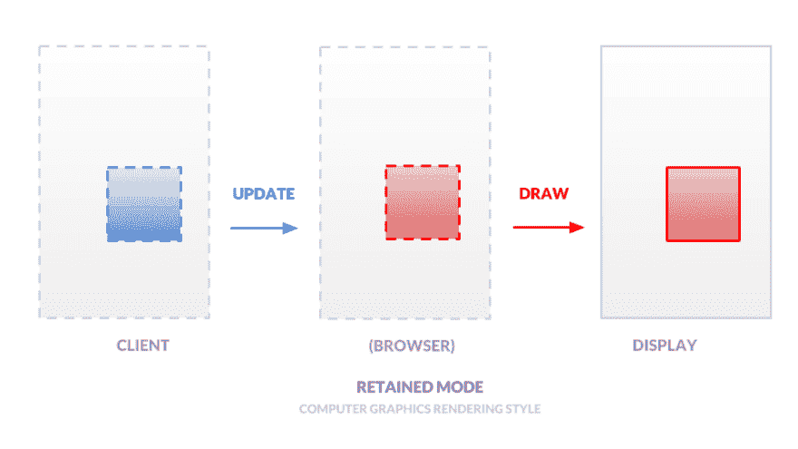
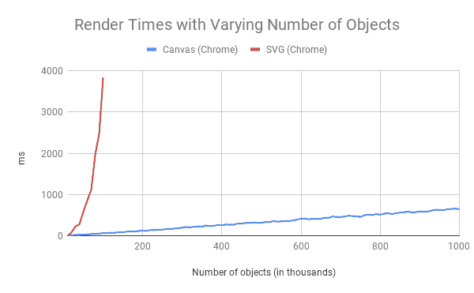

# 何时使用 HTML5 的画布

> 原文：<https://dev.to/bnevilleoneill/when-to-use-html5-s-canvas-1n7o>

HTML5 canvas 有潜力成为 web 的一个主要部分，除了广泛的网页支持之外，还享有无处不在的浏览器和平台支持，因为[近 90%的网站](https://w3techs.com/technologies/details/ml-html/all/all)已经移植到 HTML5。那么，为什么*的画布还没有成为网络的主要部分呢？*

### 关于画布你需要知道什么

StackOverflow 上的 [canvas 标签占所有问题的不到百分之二，谷歌趋势显示](https://stackoverflow.com/tags)[对“canvas”的搜索在过去五年里没有超过四倍](https://trends.google.com/trends/explore?cat=5&date=today%205-y&geo=US&q=canvas)。有许多可能的解释，但我们不讨论它的过去，而是讨论 HTML5 画布的优点和表面上的缺点——包括针对这些缺点的经过时间考验的解决方案。以下是对各种绘图技术及其主要优缺点的简要总结:

*   **文档对象模型(DOM)** :我们将要讨论的三种技术中最熟悉的一种。虽然灵活且易于使用，提供了像[点击事件处理程序](https://developer.mozilla.org/en-US/docs/Web/Guide/Events/Event_handlers)这样的便利设施，但是典型的 div 还是有开销的。它的主要卖点是*易用性*，它的致命弱点是在内存和渲染速度方面的*效率*。
*   **可缩放矢量图形(SVG)** :易用性和细粒度控制的中间标志。SVG 同样也是 DOM 的一部分，但顾名思义，它是为高保真、大型图形而设计的。与 DOM 不同，SVG 支持广泛的预置形状，如圆形或多边形。它最大的亲是*大显卡*，它的败笔是*多显卡*。
*   html 5 canvas:canvas 给了开发者对渲染更精细的控制，但代价是必须手动管理每个细节，比如悬停状态。canvas 最大的优势恰恰与 SVG 相反:它非常擅长管理*许多对象*。
*   WebGL :这些技术中的最新技术和成熟的 3D 引擎。这可以通过 Canvas 的 3D 上下文访问，但也支持 2D；此外，由于级别极低，它非常高效:WebGL 可以处理许多对象*和*大型对象。

总之，上面的列表提供了一系列抽象层，其中最少的抽象是最高效的(canvas 和 WebGL)，最多的抽象是最低效的(SVG 和 DOM)。然而，canvas 和 WebGL 选项都有一些额外的优势，无论是老的还是新的，这使得它作为一个中间地带更有吸引力:第三方库增加了易用性和对异步渲染的支持，使它更加高效:

第三方库:许多第三方库在 WebGL 和 canvas 之上提供了抽象，在 DOM 提供的抽象和 canvas 缺乏的抽象之间提供了一个中间地带。正如我们下面的备忘单将要讨论的，一些第三方库另外在渲染技术之间切换以最大化效率，消除了你选择的需要。以下是几个最流行的 canvas 和 webGL 渲染库:

*   [**pixi . js**](http://www.pixijs.com/)(22.4k stars，创建于 2013): 2D WebGL 渲染器，具有画布回退功能，强调速度，支持自己的插件
*   [**EaselJS**](https://createjs.com/easeljs)(7.2k stars，创建于 2011):画布上的交互式对象模型，支持鼠标交互和嵌套对象
*   [**fabric . js**](http://fabricjs.com/)(12.3k stars，创建于 2008):画布上的交互式对象模型，通过 SVG 到画布和画布到 SVG 的转换支持 SVG

**屏外画布:**为了进一步增强画布性能，利用[屏外画布](https://developer.mozilla.org/en-US/docs/Web/API/OffscreenCanvas)。当然，只有谷歌 Chrome 支持[，Opera 和 Firefox 也提供实验性支持。然而，屏幕外画布可以显著提高性能:屏幕外画布可以用来更有效地预渲染昂贵的视觉效果，如文本(](https://caniuse.com/#search=offscreen%20canvas) [jsperf](https://jsperf.com/render-vs-prerender/3) )，使用 web workers，画布渲染可以卸载到异步线程([讨论](https://developers.google.com/web/updates/2018/08/offscreen-canvas)、[演示](https://devnook.github.io/OffscreenCanvasDemo/keep-ui-responsive.html))。

简而言之，canvas 和 WebGL 比 DOM 更具性能，有了第三方库，其易用性不相上下；此外，越来越多的浏览器支持额外的 web 标准有可能进一步提高画布的性能。这两个好处结合起来，有可能进一步推动画布在网站上的应用，降低准入门槛，增加使用画布的好处。为了理解为什么画布比 DOM 快得多，我们需要理解*渲染风格*。

### 关于图形你需要知道什么

为了解释画布的功效，我们必须区分计算机图形学中的两种渲染风格:**即时模式**和**保留模式**，分别由画布和 DOM 表示。

在**即时模式**中，客户端发出调用，导致图形对象的即时显示。在我们的例子中，每个 canvas 函数调用都会导致一个图形对象被立即绘制出来。不管画布的哪个部分被更新，整个画布每次都必须被重画，除非客户端已经进行了优化。这意味着客户端必须在画布中维护一个对象模型。下面，蓝色代表像素和 API 调用你作为开发者直接控制。

相比之下，在**保留模式**中，客户端调用*不会*导致图形对象的立即显示。相反，客户端调用 update 一个内部模型。在我们的例子中，开发人员指定 HTML 和相关的 CSS，浏览器处理何时以及如何显示这些图形。这允许浏览器进一步优化何时呈现哪些对象。例如，对 requestAnimationFrame 的调用就受益于这种内置的优化。下面，蓝色(再次)代表 API 调用你作为开发者直接控制。然而，红色代表浏览器为您处理的抽象，包括维护内部模型和更新图形对象。

前者，即时模式，提供了灵活性，但需要干预细节。而后者，保留模式，限制了灵活性，但抽象掉了细节。这些范例分别解释了画布和 DOM 背后的哲学。下面，我们更详细地概述这两种操作模式的含义。

### 备忘单:利弊

这里有一个简短的备忘单，概述了上面列出的每种方法的优缺点。这些优点和缺点很大程度上源于前面提到的渲染风格；我们只概述了几个最紧迫的问题。对于我们下面的比较，将 SVG 和 DOM 结合起来作为竞争者是值得的，因为它们有相同的优点和缺点以及相似的接口。

**文档对象模型(DOM)** 和**支持向量图形(SVG)** :

**优点** : *易用性*

*   响应是内建的，并且很容易用适当的 CSS 来支持
*   重绘帧是通过浏览器渲染自动处理的
*   动画是预先设计好的，可配置的，可通过 CSS 扩展
*   (顾名思义)支持对象级交互，比如单击一个 div
*   [用于转换的硬件加速](https://dev.to/bnevilleoneill/the-noobs-guide-to-3d-transforms-with-css-7i1-temp-slug-809977)

**缺点** : *效率低下*

*   不适合复杂的图形:内存密集型，将导致渲染缓慢
*   对渲染、动画等的粗略控制。抽象限制了可定制性

**HTML5 画布**

**优点:** *表演*

*   快速灵活:对像素渲染的时间和方式进行精细控制
*   所有渲染、动画等的硬件加速。
*   对于复杂的图形和有许多对象要操作的情况，比 SVG 更好

**缺点:** *抽象少(但这可以用第三方库克服)*

*   没有内置的对象级交互，因为画布在像素级基础上工作
*   绘制大型对象或管理大型画布时速度较慢
*   不会自动调整显示像素比率，导致文本模糊
*   增加了动画、基本配置等的代码复杂性。

**WebGL**

**优点:** *高性能*

*   最快和最灵活的:与屏幕上像素的低层次交互
*   在这里的三个选项中，只有技术针对 3D 渲染进行了优化
*   所有渲染、转换、动画等的硬件加速。

**缺点:** *甚至更少的抽象(但是这可以通过第三方库来克服)*

*   需要了解 3D 渲染和数学
*   甚至进一步增加了动画、基本配置等的代码复杂性。

注意，在上面的每个选项中，正如我们在 canvas 介绍中提到的，代码复杂性可以通过一个适当的库很容易地得到改善；例如，3D webGL 的一个流行选择是 [three.js](http://threejs.org) ，2D webGL 的一个流行选择是 [pixi.js](http://www.pixijs.com/) 。这些库中的每一个都抽象出细节，并且消除了对先决知识的需要。有了正确的库，作为开发人员，您可以在上述三种方法之间进行插入，并在必要时切换后端。事实上，一些库已经自动为您切换后端。例如，数据可视化库 [d3.js](https://d3js.org/) 在从 2D 切换到 3D 时从 SVG 切换到 webGL，pixi.js 在需要的地方使用带有画布回退的 webGL。

有了上面的优点和缺点，您现在就有了何时使用哪种技术的粗略指导原则。这里有几个场景来进一步说明上面的列表，列举了几个常见的场景以及每种场景使用哪种技术。

具有静态用户界面的游戏，如分数显示和固定选项菜单

*   因为你界面的大部分是固定的，可以从*而不是*重绘中受益

游戏的核心显示，有数百甚至数千个动画、移动的角色

*   **画布**对于图形的复杂性，除了大量的实体
*   **WebGL** 用于三维游戏

带有基本动画的网站标志

*   **SVG** ，因为这个 logo 在所有分辨率下都应该是清晰的，SVG 不需要外部库也支持。CSS 可以提供基本的动画。值得一提的是 canvas 大材小用。

鉴于以上高层次的概述，我们现在将深入到更具体的数字:下面的基准将更精确地量化权衡，并为您提供数字，以此为基础进行更细粒度的决策。

### 基准

在这个实验部分，我们将回答两个关于 SVG 和 canvas 之间权衡的问题。

1.  每种技术最适用于多少对象？
2.  每种技术最适合什么尺寸的物体？

对于那些希望重现这些结果的人来说，值得一提的是实验设置:以下实验是在配备英特尔 Iris Plus 显卡的 2018 Macbook Pro 上的谷歌 Chrome v73 上运行的。每个实验下面都会有源代码。

**每种技术最适用于多少个对象？**

下面，我们以千为单位，对每个对象的速度进行基准测试。注意，SVG 在任何时候都不是 canvas 的对手。但是，请注意这个比例相当大，绘制多达 100 万个对象的渲染时间。对于更少的对象，差异很小，但相差一个数量级:要绘制 1000 个对象，SVG 需要大约 10 毫秒，而 canvas 需要 1 毫秒。这种差异只会随着对象越来越多而放大，但即使对于相当数量的对象，这种差异也是微不足道的。

每种技术最适合什么尺寸的物体？

*   单独改变对象的大小并不会明显改变渲染时间，正如这个 JSFiddle 所演示的:[https://jsfiddle.net/alvinwan/0mbnLfod/](https://jsfiddle.net/alvinwan/0mbnLfod/)我们将对象的大小从 10，000 x 10，000 调整到 1 百万 x 1 百万，所有这些都需要大约 1 毫秒。使用 SVG 进行的类似实验同样没有显示出渲染时间的明显差异
*   更改画布大小同样不会影响渲染时间。无论是在 10，000 x 10，000 的画布上还是在 100 x 100 的画布上，绘制 10，000 个对象都需要大约 8 毫秒，[https://jsfiddle.net/alvinwan/08m42e56/8/](https://jsfiddle.net/alvinwan/08m42e56/8/)

给定当前的实验设置，似乎对象的大小和画布的大小并不影响画布或 SVG 技术。

总之，当处理成百上千的对象时，DOM 渲染的开销更大；在这种情况下，canvas 是明显的赢家。然而，画布和 SVG 对于对象大小都是不变的。鉴于最终的统计结果，画布在性能方面明显胜出。

### 结论

这只是围绕浏览器的画布和其他图形技术的性能讨论的开始。即使在决定使用 SVG、canvas、webGL 或它们的某种组合之后，还有一些常用操作的效率问题，比如画布绘制和多边形填充、如何高效地重绘、多个画布是否值得开销等等。性能优化是无止境的，组合这三种技术的组合方式只会使问题更加复杂。然而，归根结底，简单性也是同样重要的因素，上面的备忘单应该足以让您确定是否需要进一步的性能调查；对于一个博文里的动画人物来说，可能不值得。对于以实时多人游戏为特色的整版互动游戏来说，每一盎司都很重要。

### Plug: [LogRocket](https://logrocket.com/signup/) ，一款适用于网络应用的 DVR

<figcaption>[https://logrocket.com/signup/](https://logrocket.com/signup/)</figcaption>

LogRocket 是一个前端日志工具，可以让你回放问题，就像它们发生在你自己的浏览器中一样。LogRocket 不需要猜测错误发生的原因，也不需要向用户询问截图和日志转储，而是让您重放会话以快速了解哪里出错了。它可以与任何应用程序完美配合，不管是什么框架，并且有插件可以记录来自 Redux、Vuex 和@ngrx/store 的额外上下文。

除了记录 Redux 操作和状态，LogRocket 还记录控制台日志、JavaScript 错误、堆栈跟踪、带有头+正文的网络请求/响应、浏览器元数据和自定义日志。它还使用 DOM 来记录页面上的 HTML 和 CSS，甚至为最复杂的单页面应用程序重新创建像素级完美视频。

[免费试用](https://logrocket.com/signup/)。

* * *