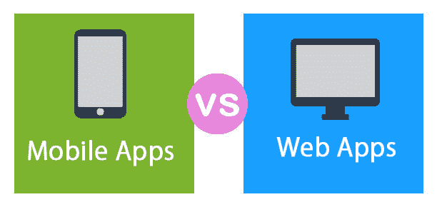
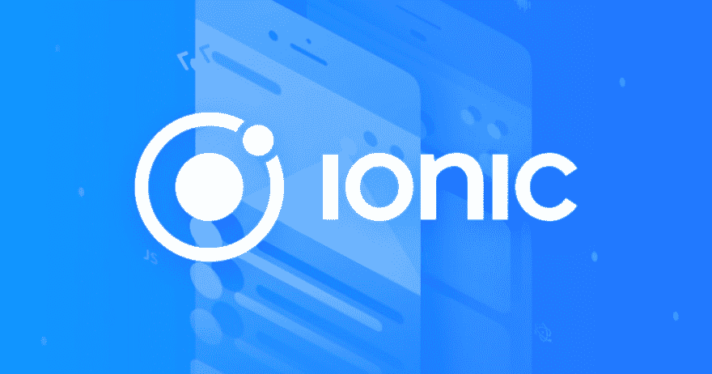

# 哪个是更好的框架——Ionic 还是 React Native？

> 原文：<https://dev.to/esparkbiz/which-is-the-better-framework--ionic-or-react-native-4ogg>

随着越来越多的人享受使用移动应用程序的相对便利，越来越多的企业开始转向使用他们的移动应用程序。公司已经理解了拥有移动应用的需要。它们易于使用，并提供更好的个人体验。它们简单多了。它们让我们的生活变得轻松多了。

对移动应用的需求正在上升。[手机 app 开发者](https://www.esparkinfo.com/hire-mobile-app-developer.html)的要求也是如此。一个应用的性能取决于它的构建方式。创建移动应用程序有许多框架。Ionic 和 React Native 是两个框架。虽然混合应用使用 Ionic，但 React Native 有助于构建原生应用。

***文章之流***

*   移动应用的重要性
*   移动应用如何超越网络应用
*   应用程序开发的挑战
*   本地和混合应用
*   跨平台应用开发
*   反应自然
*   离子的
*   React Native 和 Ionic 之间的主要区别
*   反应自然与离子-直接比较
*   结论

### **1。移动应用的重要性**

> 马克·威尔切克@马克·威尔切克到 2019 年，全球将有 52 亿[#移动](https://twitter.com/hashtag/mobile)用户，比 2014 年增长 10 亿:[【bit.ly/1nKDqYc](https://t.co/BYvqG9E6tz)[@思科](https://twitter.com/Cisco) [【首席信息官](https://twitter.com/hashtag/CIO)[#智能手机](https://twitter.com/hashtag/smartphone)[#物联网](https://twitter.com/hashtag/IoT)

拥有智能手机的人数约为 50 亿。所有的人无论去哪里都带着它。这使得它成为许多活动的首选设备。今天，人们更多地使用手机而不是笔记本电脑来购物或获得服务。

手机的广泛使用唤醒了商界。越来越多的[公司希望通过移动设备](https://www.esparkinfo.com/mobile-app-development-strategies.html)轻松访问。如今，企业已经意识到，在推出网站之前，它们必须先在手机上运行。
应用程序更加舒适，更加个性化。人们正在从网站转向应用程序。移动应用程序是最受欢迎的，因为它们可以在任何地方访问。它促使越来越多的公司推出自己的应用。

公司也开始通过手机与员工交流。手机应用程序帮助公司改善与员工和客户的沟通。突然需要更多的应用程序。

### **2。移动应用如何超越网络应用**

*   人们总是随身携带他们的手机。手机应用程序很容易访问。
*   人们总是在应用商店里搜索新的应用。在那里可以帮助你的公司。
*   移动应用程序帮助您发送推送通知，提醒客户您的产品。
*   最新的趋势是与朋友分享应用程序或其内容。用手机 app 就能快速搞定。
*   用户可以轻松地将应用内容分享到任何应用，如脸书、WhatsApp、Messenger 等。这比从网络应用程序分享更方便。
*   用户花很多时间在移动应用上。花的时间比手机网站多很多。
*   你可以从广告中获得额外的收入。在手机应用程序中无法屏蔽广告。

### **3。应用开发的挑战**

随着应用需求的增加，开发者也面临着压力。公司希望应用程序为他们的客户提供最佳性能。需要使它们更吸引人和更容易使用。

应用开发者面临的主要挑战之一是移动平台的数量。一些手机在 iOS 、Android 和 Windows 平台上运行[。由于这些都是不同的平台，有必要为所有这些平台开发应用程序。这就是本地或混合应用程序的问题所在。](https://www.esparkinfo.com/mobile-application-development-with-ios.html)

### **4。本地和混合应用**

原生应用是指那些只在特定平台上运行的应用。这些应用程序只能在 iOS、Android 或 Windows 平台上运行。[开发混合应用](https://www.esparkinfo.com/ionic-mobile-app-development.html)以在所有移动平台上运行。

#### 原生应用

*   你可以创建它不合适的编码语言 iOS 和 Java 的 Swift/Objective-C 或者 Android 的 Kotlin。
*   原生应用为用户提供快速、响应迅速且可靠的体验。
*   使用本机应用程序可以轻松使用相机或麦克风等设备功能
*   当需要用户注意时，本地应用可以发送推送通知。
*   用户习惯了设备的用户界面/UX。原生应用有助于匹配这些。
*   它们很难构建，因为你必须为每个平台使用不同的代码。
*   原生应用的构建时间更长，成本也更高。
*   你可能需要不同的团队来为不同的平台开发应用。

#### 混合应用程序

*   混合应用程序是像本地应用程序一样安装的 web 应用程序
*   它们像 web 应用程序一样使用 JavaScript、HTML 和 CSS 构建。
*   他们使用 WebView 在您的手机上运行。
*   这款混合应用程序就像一个应用程序，但可以在所有移动平台上运行
*   因为只有一个代码库需要管理，所以您需要的时间和人力资源更少
*   构建混合应用程序的成本也更低
*   他们可以使用 PhoneGap 这样的桥梁来访问本地功能
*   您将无法获得与原生应用相同的性能。
*   让 hybrid 给出同样的原生体验是很有挑战性的。
*   用户体验将与原生应用不同。

### **5。跨平台应用开发**

我们已经看到，必须为每个移动平台单独创建原生应用。混合应用程序无法提供与原生应用程序相同的体验。因此，如果你想开发能在所有移动平台上运行的应用，解决方案是[创建一个跨平台的应用](https://www.esparkinfo.com/is-flutter-framework-an-ideal-choice-for-cross-platform-app-development.html)。

一些工具允许你构建跨平台的应用程序，这些应用程序将使用本地特性并提供相似的性能。React Native 和 Ionic 是两个非常流行的跨平台框架。

越来越多的开发人员使用这两种设计模式来构建他们的应用程序。最终目标是通过给用户良好的体验来满足客户。每个开发者都为公司开发应用程序，这些公司的目标是增加与使用这些应用程序的客户的互动。

你可以[雇佣 React 本地开发者](https://www.esparkinfo.com/hire-react-native-developer.html)为你的企业开发一个跨平台的移动应用。

我们将看到这两个框架的特点，以及它们如何给开发者带来好处。

### **6。反应原生**

脸书发展了这个框架。它是一个跨平台的框架。它使用 JavaScript 技术。开发人员使用单一代码库来创建应用程序。这些应用具有类似原生的特征。他们使用 JavaScript 和 React 给用户一种近乎原生的体验。

您可以在后台应用 UI 更改。它提供了非常灵敏的用户界面，用户获得了更好的体验。由于它使用原生 UI 元素，这为用户提供了更好的体验。运行速度也更快，因为这不是一个基于浏览器的应用程序。

[React Native 是一个跨平台的开发](https://www.esparkinfo.com/react-native-app-development.html)框架。iOS 和 Android 应用程序可以使用相同的代码库。但是，您必须修改特定于平台的某些代码。它给人一种近乎本土的体验。

使用母语有好处也有坏处。

#### 优点

*   iOS、Android 和 Windows 平台可以使用相同的代码库。
*   特定的平台可以更快地处理硬件功能，从而提供更好的性能。
*   在大型项目中更容易维护，因为它遵循更严格的设计者模式。
*   框架变得稳定。它给人一种更好的本土感觉。
*   有一个强大的开发人员社区，他们可以帮助新开发人员很快学会使用这个框架。
*   您可以跨平台重用这些代码。它可以节省金钱和时间。
*   您可以实时观察您所做的更改。

#### CONS

*   将 HTML 转换为本机代码可能很困难。你必须精通 Object C 或者 Swift 来解决这个问题
*   React Native 是专门为 iOS 设计的。因此，某些 Android 元素可能需要更多的工作。
*   它遵循“学一次，写在任何地方”的座右铭。您必须为不同的平台维护单独的代码。
*   使用 React Native 构建应用程序的成本可能会更高。
*   你必须遵守脸书的许可规则。

### **7。离子**

[Ionic 用于开发混合应用](https://www.esparkinfo.com/ionic-mobile-app-development.html)。它是一个基于 HTML5 的跨平台框架。该框架只能在 Cordova 或 PhoneGap 的帮助下工作。熟悉 AngularJS 的开发者可以使用 Ionic 轻松创建应用。

这个框架使得开发人员可以轻松地创建应用程序的 UI。Ionic 使用 WebView 来访问相机和联系人等移动功能。为了在 Android 平台中进行编写，开发人员使用 HTML 代码。这可能会使应用程序变慢。

如果你想使用原生功能，你必须下载插件。TypeScript 元素会使任务变慢。它不会像直接使用原生 API 那样快。爱奥尼亚有它的优点和缺点。

#### 优点

*   使用 Ionic 可以更快地构建应用程序。更多的应用程序更容易获得收入。
*   学习离子并使用它很容易。
*   它遵循“写一次运行在任何地方”的座右铭，因此可以更快地开发不同的平台。
*   如果你懂 AngularJS，你可以很快地用 TypeScript 写代码。
*   您可以使用 TypeScript 为所有平台编写应用程序
*   爱奥尼亚有很好的社区支持。
*   插件允许您访问设备的本机功能。
*   Ionic 适用于小型项目。
*   Ionic 是一个开源的免费框架。

#### CONS

*   如果有许多对本机代码的回调，性能会很慢。
*   用户界面不会与原生用户界面相同。有些用户可能不喜欢这样。
*   用 Ionic 开发高级图形或交互式过渡很有挑战性。

### **8。自然反应和离子反应的关键区别**

#### 技术堆栈

*   Ionic 提供完整的 SDK 来构建混合应用
*   React Native 让开发人员只需学习一次，就可以随处使用代码
*   Ionic 使用网络技术，用最少的代码开发混合应用
*   React Native 使用本地技术提供本地体验。
*   React Native 使用原生元素提供了更好的 UI 体验。
*   如果你了解 Angular，你可以有效地使用 Ionic。App 开发又快又简单。

#### 表现

*   React Native 给用户最接近原生的体验。
*   React Native 是一个更稳定的框架。它更适合大型应用程序
*   React Native 的性能和响应要好得多。因此建造成本更高。
*   Ionic 走的是混合路线，因此非常适合以更快的速度创建应用程序。
*   它实现了一个应用程序的现代需求。
*   如果有许多对本机代码的回调，性能可能会受到影响。
*   你需要下载大量的插件来访问原生功能

#### 插件和社区

*   React Native 有很多可用的插件
*   React Native 有一个庞大的开发人员社区来解决各种问题。
*   React Native 中有一个插件允许你使用 PhoneGap / Cordova 插件。
*   Ionic 还拥有一个庞大的开发者社区，可以在困难的情况下帮助你。
*   有很多 PhoneGap 和 Cordova 插件可以让 Ionic 使用原生功能。

#### 平台

*   Ionic 和 React Native 都是跨平台框架。都支持 iOS 和 Android。
*   Ionic 还支持通用 Windows 平台。

### **9。自然反应与离子反应——直接比较**

下面的表格对比将说明 [React Native App 开发](https://www.esparkinfo.com/react-native-app-development.html) & [Ionic App 开发](https://www.esparkinfo.com/ionic-mobile-app-development.html)的差异和特点。

|  | 反应自然 | 离子的 |
| --- | --- | --- |
| 箴言 | 一次学习，随处写作 | 一次编写，随处运行 |
| 语言堆栈 | 反应，JavaScript | Web 技术——HTML、CSS、JavaScript、Angular JS、TypeScript |
| 应用程序的性质 | 跨平台 | 混合应用 |
| 开发商 | 脸书社区 | Drifty.co |
| 受欢迎是因为 | 跨不同平台的接近原生的优雅用户界面 | 使用单一代码为 iOS、Android、Windows、Web、桌面和 PWA 构建应用 |
| 代码可重用性 | 需要更改特定于平台的代码 | 最佳代码可重用性 |
| 表演 | 近乎自然的外观和更快的速度 | 因为 WebView 而变慢 |
| 代码测试 | 需要移动设备或模拟器来测试代码 | 可以使用任何浏览器测试代码 |
| 学习难度 | 难学 | 简单易学 |
| 社区和支持 | 强大而稳定 | 强大而稳定 |
| 支持的平台 | 安卓、iOS 和 UWP | 安卓、iOS、UWP 和 PWA |
| 主要客户 | 脸书，Instagram，UberEats，Airbnb | JustWatch，未开发，Cryptochange，Pacifica，Nationwide 等。 |

### **10。结论**

我们无法就此得出明确的结论。为了性能和接近原生的体验， [Web 开发公司](https://www.esparkinfo.com/web-app-development.html)应该使用 React Native。如果优先考虑的是以低预算快速开发应用程序，那么你应该使用 Ionic。
你还应该考虑其他因素。

你应该看看你熟悉哪些语言。应用程序的大小和所需的功能也将决定你想使用哪个框架。您可以使用这两种框架来开发跨平台的应用程序。