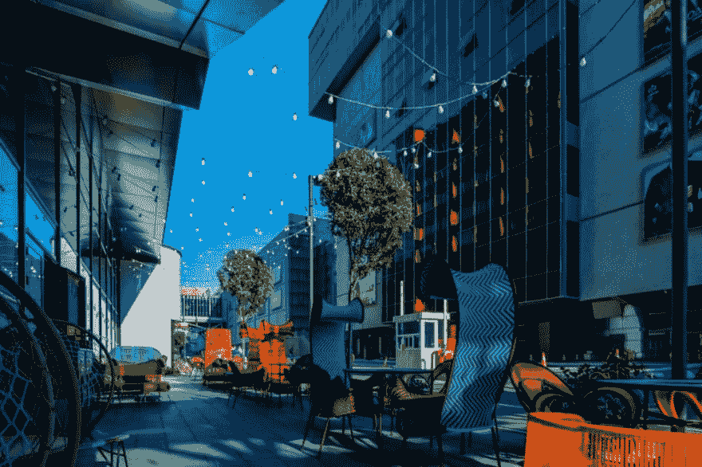

# 为什么 Angular inDepth 是独一无二的，以及我是如何加入这项事业的

> 原文：<https://dev.to/layzee/why-angular-in-depth-is-one-of-a-kind-and-how-i-joined-the-cause-i34>

2018 年 10 月，我在[the Angular depth 博客](https://indepth.dev/angular)上发表了我的第一篇文章。我目前正在准备我的 7ᵗʰ和 8ᵗʰ角深度文章。与此同时，我正在为 ngVikings 和 Angular inDepth conferences 进行我的第一次 Angular conference talk，这是基于我的几篇文章和 Angular depth 专家小组的许多灵感和帮助。

我给大家讲一个我的棱角之旅是怎么开始的，我的职业生涯是怎么开始的故事。我将解释[Angular depth](https://dev.to/angular)如何继续帮助我超越自我，实现我的目标。最后，我会告诉你为什么你应该和我一起参加今年在乌克兰基辅举行的[角度深度会议](https://angular-in-depth.org/)。

## 我是如何入门 JavaScript 和 Angular 的

我在 2012 年开始开发大量使用 JavaScript 的应用。我已经使用了 jQuery、Backbone、Knockout、杜兰达尔、vanilla JavaScript、AngularJS、Kendo UI、Angular、React 和 Ionic 来完成这些工作。

2017 年 8 月，我第一次在工作中使用了几天 Angular。然后在 2018 年 5 月，我开始使用 Angular 和 Angular Material 开发基于插件的架构的专有框架和 UI 组件库。经过半年的开发，发布了第一个版本。

## 练好我的棱角技能

 
*跟上 Angular 对任何软件专业人士来说都是一个挑战。图片由[以利亚冰雹](https://unsplash.com/photos/yLpbSjxMpCU)在 [Unsplash](https://unsplash.com) 拍摄。*

在我第一次接触 Angular 和我开始开发专有框架之间的半年时间里，我花了很多时间学习 Angular。在那个时间点上，Angular 版本 4 是当前版本，并且只是第二个主要版本(版本 2 是第一个版本，除了 Angular 路由器之外，版本 3 被跳过)。

我读了 Angular.io 文档，听了播客，读了博客，看了会议演讲和其他演示的视频。尽管我对 AngularJS 和一系列其他前端框架和库很有经验，但还有许多新的技术和概念需要学习。

社区刚刚开始了解 Angular，因为在 2016 年 9 月第一次发布 Angular 之前，有许多最后一刻的变化。仅仅六个月后，版本 4 发布了，包含了很多重要的变化。很难跟上。

## 我第一次遇到有棱角的深度

马克斯·科瑞茨基最近开始撰写和发表有棱角的文章，这似乎是命中注定的。但不是随便什么文章:专家级的，有深度的关于 Angular 的文章。

我不知道这个棱角分明的巫师是谁，但我很感激 Max 超越了当时其他人的所作所为，免费与社区分享他的知识。时至今日，Max 的第一篇角度文章是关于先进角度概念的*和*。

## 努力工作，尽情玩乐

 
*有时候你只需要卷起袖子大干一场。照片由[像素](https://www.pexels.com/photo/photo-of-person-typing-on-computer-keyboard-735911/)上的 [Soumil Kumar](https://www.pexels.com/@soumil-kumar-4325) 拍摄。*

马克斯和我的相似之处在于，我们都对自己的工作充满热情。我们要么 100%接受挑战，要么根本不接受挑战。众所周知，Max 每周要花 80 到 100 个小时在软件开发上，不管是工作还是个人项目。

> 不为某件事而活，就等于白死。我的座右铭，刻在我的腿上

我也是这样。2013 年，我获得了计算机专业的学士学位。我的初衷是拿到软件工程硕士学位。然而，就在我开始学习前不久，我的妻子怀上了双胞胎。今天，我们的女儿已经 8 岁了。

在经历了三年的学习、工作和在崩溃的经济中挣扎，有昂贵的住宿、两个蹒跚学步的孩子和低收入，我决定是时候结束学业，开始全职工作谋生了。我对我所受的教育非常满意，我很想再继续学习两年。自然，这是一个艰难的决定。

我向自己保证，我会继续自学。我很快发现了对网络开发的热情。虽然我的同学们当时对移动应用程序过于兴奋，但幸运的是，我仍然看到了网络技术的未来。

## 我的第一份(主要)开发工作

 
*在你的职业生涯中，你会在某个时候发现自己被扔进了深水中。不过不要担心，你会度过难关的。照片由[将吴](https://www.pexels.com/photo/gray-fish-889929/)放在[像素](https://www.pexels.com/)上。*

大学没有教我任何关于网络开发的知识。我加入了一家公司，负责开发他们核心软件产品的完整替代品，以及围绕它的服务和基础设施。

最后，我使用基于 PHP 的 MVC 框架 Laravel 来构建 RESTful web APIs 以及数据库的模式和迁移，从而在后端和前端之间划出了一条清晰的界限。杜兰达尔、Knockout、CoffeeScript、Bootstrap、LESS、RequireJS 和 Mimosa 是我们用来开发具有响应式布局的单页面应用程序的技术。这在 2013 年几乎是前沿。对丹麦的一家小公司来说绝对是前沿阵地。

像 Max 一样，我花了无数的时间工作和学习来学习我需要知道的一切来实现这个目标。

这是 5 年前的事了。从此，我信守承诺，继续自学基于 web 的软件开发。

## 参加有角度的会议并发言

 
*在一个聚会上演讲可能会让人害怕，但这可能是你做过的最好的事情。照片由[像素](https://www.pexels.com/photo/low-angle-photography-of-pile-of-stainless-steel-chairs-with-hanging-projector-canvas-691485/)上的 [Skitterphoto](https://www.pexels.com/@skitterphoto) 拍摄。*

2016 年 4 月，我与 Knockout 和 AngularJS 合作，并开始参加丹麦仅有的两个 Angular meetup 团体之一，即 ngAarhus，该团体后来演变为 [AarhusJS](https://www.meetup.com/meetup-group-ofatVDEO/) 。

在我找到一份新工作并开始使用 Angular 后，组织者之一莫滕·柯尔斯顿(Morten Kirsten)问我是否愿意在 meetup 的一次会议上发表演讲，他现在是我的好朋友。

这是在我——在角度深度的帮助下——提升我的角度技巧和钻研先进的角度概念的时候。很自然，我很乐意为 Angular 社区做贡献，尽管我不知道我想讨论哪个话题。

正如我在本文前面提到的，过了一段时间，我才开始在我的工作场所全职研究专有框架。所以我还没有实际的知识来分享这个项目中使用的任何概念。

 
*软件架构:开发者去死的地方。照片由[rawpixel.com](https://www.pexels.com/@rawpixel)在[像素](https://www.pexels.com/photo/person-holding-pen-point-on-blueprint-1537008/)上拍摄。*

罗伯特“鲍勃叔叔”马丁刚刚出版了他的书“[干净的架构:软件结构和设计的工匠指南](http://www.informit.com/store/clean-architecture-a-craftsmans-guide-to-software-structure-9780134494166)”。我已经将[清洁架构](http://blog.cleancoder.com/uncle-bob/2012/08/13/the-clean-architecture.html)应用到一个 C# web API 项目中。罗伯特·马丁的书根本没有涉及实现的细节，所以它在很大程度上是从实践中学习。

我开始思考如何将干净的架构应用到棱角分明的项目中。这个架构似乎主要是为请求-响应场景而概念化的。

干净的架构概念不容易转化为客户端项目(即使将它们应用到服务器端项目也不是一件简单的任务)。

除此之外，我很快意识到，在我开始讨论 Angular 项目的整体软件架构之前，我必须找到一种方法来适当地分离关注点，因为从我所看到的任何材料来看，这并不明显。

在业余时间，我花了大约 50 个小时研究、试验和准备“有角度的模型-视图-演示者”演讲的幻灯片。我将现有的 Angular 模式和技术与几十年前的想法和概念结合到 Angular 的模型-视图-展示者变体中。我在 2018 年 5 月的 ngAarhus meetup 上发表了[演讲《有角度的模型-视图-演示者》](https://youtu.be/D_ytOCPQrI0)。

我紧张得要命。令我欣慰的是，这个报告很受欢迎。感觉比实际情况糟糕多了。我在 2018 年 11 月的 ngCopenhagen meetup 上展示了一个稍微改进的版本。

## 加入角度深度

 
*找到一个伟大的导师是你职业生涯中最重要的决定。马克斯·科瑞茨基指导了我的科技创作。Nik MacMillan 在 [Unsplash](https://unsplash.com) 上拍摄的[照片。](https://unsplash.com/photos/YXemfQiPR_E)*

在第一次给我的模型-视图-演示者演讲后不久，我联系了 Max，问他是否有兴趣写一篇基于这次演讲的系列文章。

当马克斯对我的工作表示出兴趣时，我欣喜若狂。在接下来的 6 周里，我又花了 50 个小时的业余时间为该系列的前两篇文章准备草稿。

又过了几个月，我在最初的几篇文章上又花了 100 个小时。许多原始材料实际上被删除了，以防止文章变得太大(我留着以备不时之需)。

Max 是一名优秀的编辑，在我写第一篇科技文章时，他给了我很好的指导。我们在 2018 年 10 月发表了第一篇文章《[带角度的模型-视图-演示者](https://indepth.dev/model-view-presenter-with-angular)》。不到一个月，又有三起接踵而至。

## 申请会议会谈

2018 年 12 月，我受到了即将到来的 Angular Ivy 重写的会议讨论的启发。我开始写两篇关于这个主题的文章，同时为几个角度的会议提交论文。

此时，马克斯邀请我加入了棱角深度专家的秘密社团。从那以后，我很高兴我的材料被审查，并与我有棱角的深入的同事讨论技术概念和问题。

我设法写了两篇关于 Ivy 即将带来的机会的文章，最值得一提的文章是“[Angular Revisited:Tree-shake able Components and Optional ng modules](https://indepth.dev/angular-revisited-tree-shakable-components-and-optional-ngmodules)”。

[我的同名演讲被接受](https://ngvikings.org/schedule/2019-05-27?sessionId=538)参加了 ngVikings 2019 大会。除此之外，我有幸被[邀请作为演讲人](https://angular-in-depth.org/#speakers)参加 Angular inDepth 2019 大会。

## 角深会议

 
*[角深会【2019 年 6 月 15 日。不要错过！](https://angular-in-depth.org/)*

这就把我们带到了今天。马克斯——他就是这样的人——几乎完全靠自己开始准备一场棱角分明的会议。他汲取了 Angular inDepth 博客和社区的精髓，将所有积极的能量和动力融入到一个深入的 Angular 事件中。

会议在乌克兰基辅举行——马克斯的家乡。2019 年 6 月 15 日，我将成为这个由 [Angular 专家组成的天才团队的一员，在 Angular depth conference](https://angular-in-depth.org/#speakers)上发表演讲:

*   [艾力克斯·克鲁斯基](https://medium.com/@alex.okrushko)
*   [Lars Gyrup Brink Nielsen](https://dev.to/layzee)
*   [最大科伦斯基](https://indepth.dev/author/maxkoretskyi/)
*   [曼弗雷德·斯特耶](https://medium.com/@ManfredSteyer)
*   迈克尔·赫拉迪克
*   [尼基塔·波拉特斯基](https://medium.com/@nik.poltoratsky)
*   瓦西姆·切格姆

Angular depth conference 的独特之处在于，所有的会谈都是深入的，技术上先进的。

除了讲座之外，我们还将举办一个演讲角，在那里我们每个人都将参与先进概念的讨论，并接受与会者至少一个小时的提问。

> 没有什么比呆在一个房间里的人被自我提升的相同目标所驱使更好的了。
> ——[马克斯·科列茨基](https://blog.angularindepth.com/welcome-to-the-first-angular-in-depth-conference-in-kiev-ukraine-47f50cb4c077)

我希望你能在 2019 年 6 月 15 日加入我和我的 Angular inDepth 同事。我们这样做是为了社区。我们喜欢像您这样的读者的个人反馈。我很乐意讨论任何角度的概念，尤其是关于我在 Angular inDepth 博客上发表的文章的问题或评论。

如果你和 Max、我们的 Angular inDepth 同事以及我一样，对 Angular 及其社区有着绝对燃烧的热情，那么请来到基辅，加入充满志同道合的同行的深入 Angular day。

 
*角深度会议在现代化的四星级酒店[美居基辅会议](https://mercurekyiv.ua/en/main-hotel/hotel/gallery?821)举行。*

[角度深度会议网站](https://angular-in-depth.org/)