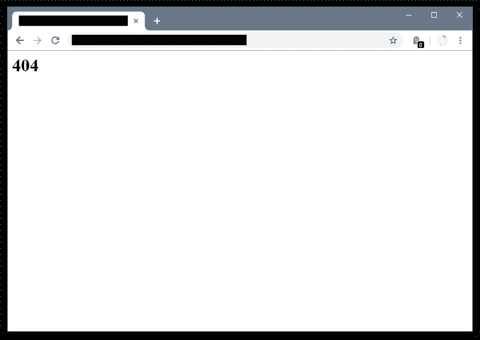

# 为什么我的页面在/services/ broken 下？

> 原文：<https://dev.to/jermdavis/why-are-my-pages-under-services-broken-348l>

这是其中一个问题，我觉得我应该更快地解决它。计算机是无情的逻辑。如果你告诉他们忽略一些东西，他们就会忽略它，即使这会让你的内容编辑感到困惑…

我最近收到了一个 bug 报告，一个用户抱怨说他们建立了一个内容树，但是在发布之后，他们得到的只是一个 404。这是那种在几个人之间流传，然后才进入我的收件箱的错误报告之一——看起来很奇怪。

用户描述的内容确实存在(“`/services/`”下的整个页面树)，并且确实已经发布。这些内容在我的开发实例中运行良好。但是当在网站的 QA 或 UAT 实例上查看时，它确实返回了 404。但如果你输入一个无意义的网址，你将得到的不是 404 风格的页面——一个除了“404”什么也没说的完全普通的页面:

[](https://jermdavis.files.wordpress.com/2018/09/4041.png)

显然有什么东西挡住了这条路。但是什么？这是开发实例中没有的东西，但是 QA 和 UAT 有。QA 实例是一个运行在本地网络上的单服务器站点，但是 UAT 实例运行在客户的基础设施上。基础设施的这种差异需要排除这种想法，即它可能是一个过度活跃的防火墙或代理，阻止了某些路径段。

所以我做了一个“在文件中查找”搜索“服务”一词，并通过搜索结果列表。最终，我发现我的 dev 实例包含了一个在“`ship.config.disabled`”中的点击，我有了[我的灵光一现](https://media.giphy.com/media/5z0cCCGooBQUtejM4v/giphy.gif)。

我们的开发实例包括 [Sitecore 的配置和代码。Ship](https://github.com/kevinobee/Sitecore.Ship) ，但是它被禁用了，因为我们从未通过我们的构建和部署自动化部署到开发机器上。该配置文件包括下面一行:

```
<?xml version="1.0"?>
<configuration xmlns:patch="http://www.sitecore.net/xmlconfig/" xmlns:set="http://www.sitecore.net/xmlconfig/set/">
  <sitecore>
    <settings>
      <setting name="IgnoreUrlPrefixes" set:value="/services/|/sitecore/default.aspx|/trace.axd|/webresource.axd|/sitecore/shell/Controls/Rich Text Editor/Telerik.Web.UI.DialogHandler.aspx|/sitecore/shell/applications/content manager/telerik.web.ui.dialoghandler.aspx|/sitecore/shell/Controls/Rich Text Editor/Telerik.Web.UI.SpellCheckHandler.axd|/Telerik.Web.UI.WebResource.axd|/sitecore/admin/upgrade/|/layouts/testing" />
    </settings>
  </sitecore>
</configuration> 
```

Enter fullscreen mode Exit fullscreen mode

Ship 在路径“`/services/`”下公开了一个 API，因此它告诉 Sitecore 忽略对该路径的任何请求，以便 Ship 的 HTTP 处理程序可以处理这些请求。

所以在像 QA 和 UAT 这样的机器上，我们进行自动化部署(因此启用了这个配置文件), Ship 确保 Sitecore 不处理这些请求——导致提供已经设置好的 404 HTML 页面。

## 所以……

如果您通过 [Sitecore 进行部署。Ship](https://github.com/kevinobee/Sitecore.Ship) ，停下来考虑一下默认服务 URL。你工作的网站的所有者是否向人们提供任何服务？他们可能想要将一个内容树命名为“服务”吗？

如果是这样，记得改变你的网站的配置，以避免混乱的负荷…