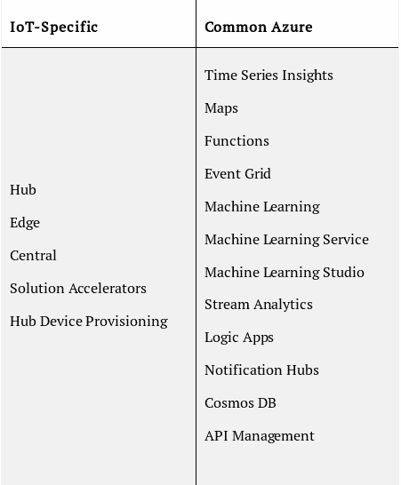
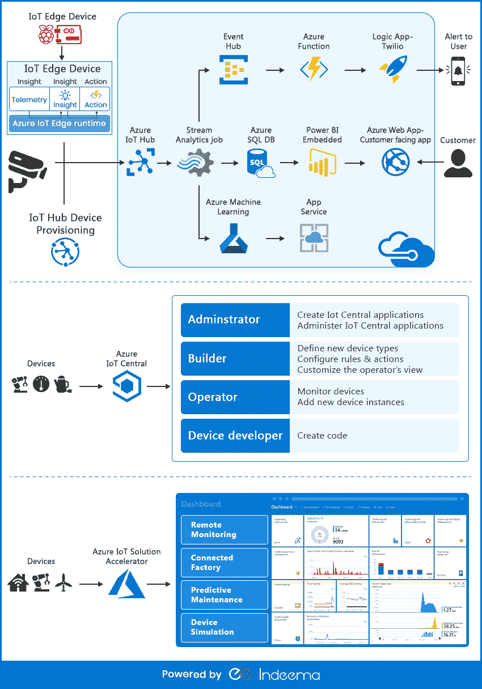
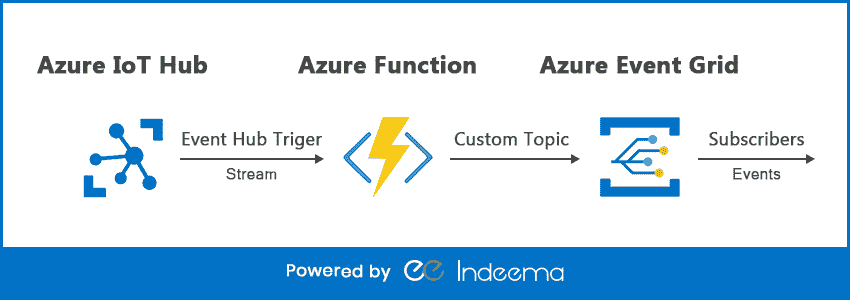
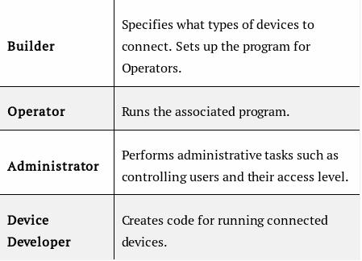
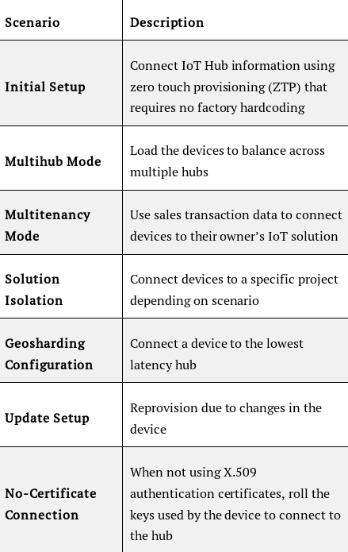
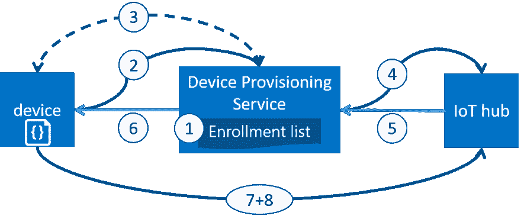

# 为什么需要使用微软 Azure 物联网套件？

> 原文：<https://dev.to/indeemasoftware/why-do-you-need-to-use-microsoft-azure-iot-suite-35al>

智能是物联网的一个家喻户晓的词，它意味着各种设备和用户之间的互联。这将我们引向任何物联网解决方案的基础设施，包括硬件、固件和软件部分。尽管硬件及其相关固件种类繁多，但仍有一些强大的物联网服务提供商，如微软、亚马逊和 IBM。

原文- [微软 Azure 物联网套件:优势和特性](https://indeema.com/blog/microsoft-azure-iot-suite--benefits-and-features)

事实上，也有相当多的中小型物联网定制解决方案，但大多数仍然使用上述平台之一作为他们的物联网开发基础。这是合乎逻辑的——如果这些物联网即服务解决方案是可靠的，并且有数字巨头的支持，为什么要重新发明轮子呢？

问题是如何在主要服务提供商之间进行选择，以最好地满足特定项目的需求。坦率地说，就是确定服务是否具有所需的特性和功能。这一次，让我们仔细看看微软 Azure 物联网套件。

## MS Azure 物联网一览

微软被认为是物联网服务市场的主要参与者之一。它的 Azure 物联网套件有助于开发各种定制物联网产品，并轻松评估其最终成本。任何架构的部署也是快速而简单的。

微软 Azure 物联网服务包括:

[](https://res.cloudinary.com/practicaldev/image/fetch/s--Pl1GpYGM--/c_limit%2Cf_auto%2Cfl_progressive%2Cq_auto%2Cw_880/https://cdn.hashnode.com/res/hashnode/image/upload/v1550047396432/dg7C4SfJR.png)

您可以将这些服务集成到大多数操作系统和设备中；收集和分析大量数据，然后将其用于实时预测分析。听起来令人印象深刻，不是吗？

为了验证这一点，让我们一个接一个地检查服务。

[](https://res.cloudinary.com/practicaldev/image/fetch/s--oTbdPtK0--/c_limit%2Cf_auto%2Cfl_progressive%2Cq_auto%2Cw_880/https://indeema.cimg/articles/microsoft-azure-iot-suite-fenefits-and-features/azure-iot-suite-infographic.png)

## 物联网中枢

任何物联网解决方案都有中心通信节点。借助微软 Azure 物联网平台，这就是物联网中心。它提供双向设备到设备的通信——所有可用设备和 Azure 平台之间的遥测。使用高级中枢功能，您可以大规模创建复杂的物联网解决方案。例如，用于管理工业机械、监控办公室场所和维护智能家居的复杂软件。

您可以监控连接的网络，跟踪各种事件，并在出现任何问题时接收警报。为了安全地传输数据，Azure IoT Hub 使用两种基于标准的基本类型的基于 SAS 令牌的身份验证:

1.  用于安全身份验证—个人 X.509 证书
2.  对于简单注册— X.509 CA 身份验证

此外，Azure IoT 的内置路由功能提供了灵活的消息传递调整。

##使用 Azure 物联网设备 SDK

SDK 支持:

1.  Linux、Windows 和实时操作系统
2.  C，C#，Java，Python，Node.js
3.  HTTPS，AMQP，AMQP 通过 WebSockets，MQTT，MQTT 通过 WebSockets 协议

对于不支持这些协议的设备，可以使用 Edge 和 Azure 物联网协议网关将 hub 配置为使用自定义协议。

## 将物联网中心与其他 MS Azure 服务相结合

您可以使用物联网中心作为各种项目架构的基础，并且:

1.  使用 Azure 事件网格获得对关键事件的快速响应
2.  使用 Azure Logic 应用程序自动化业务流程
3.  使用 Azure 机器学习添加 ML 和 AI 模型
4.  使用 Azure Stream Analytics 从连接的设备流式传输数据并实时计算逻辑分析

[](https://res.cloudinary.com/practicaldev/image/fetch/s--cVEtpVvf--/c_limit%2Cf_auto%2Cfl_progressive%2Cq_auto%2Cw_880/https://indeema.cimg/articles/microsoft-azure-iot-suite-fenefits-and-features/azure-iot-hub-explanation.png)

另请阅读- [亚马逊的非原始方法:AWS 物联网如何应对物联网挑战](https://indeema.com/blog/the-non-primitive-approach-of-amazon--how-aws-iot-meets-iot-challenges)

## 物联网边缘

使用 Azure 基于云的人工智能服务来全面管理您的跨平台项目。最主要的一点是，无论是否启用云，设备都是一直开着的。当设备连接到云时，Azure IoT 设备管理会自动与设备的最新状态同步，从而提供任何相关解决方案的无缝功能。

MS Azure IoT Edge 包括:

```
IoT Edge Modules — Containers that run Azure and 3rd-party services, custom code. Deploying those on the connected devices allows to run them locally.

IoT Edge Runtime — Controls the deployed modules at every device.

Cloud-based interface —UI for remote monitoring and management of devices. 
```

事实上，当监控和数据收集在本地运行时，在边缘部分处理分析真的很有用。该功能允许对传入的数据做出反应，并在禁用云的情况下更快地做出相关决策。此外，由于数据过滤发生在本地，数据传输成本可以显著降低。

##物联网中心

Azure 物联网中心软件即服务有助于构建和管理任何基于物联网的项目。任何 Azure 物联网解决方案的核心都包括:

```
A program that receives telemetry from and operates the devices.

A certain number of devices connected to the program on which a particular code runs. 
```

Azure IoT Central 有助于快速创建新的应用程序(程序)。您可以直接在浏览器中轻松定制您需要的应用程序。

## MS 物联网核心角色

该服务在以下用户角色之间共享操作授权:

[](https://res.cloudinary.com/practicaldev/image/fetch/s--U8sfLO1K--/c_limit%2Cf_auto%2Cfl_progressive%2Cq_auto%2Cw_880/https://cdn.hashnode.com/res/hashnode/image/upload/v1550047560777/_B-pYRlAS.png)

使用这种层次结构，许多平凡的任务可以简化。例如，作为构建者，您可以创建用于将设备连接到您的程序的模板，并重用它来添加新的类似设备。

## Azure 物联网解决方案加速器

这些加速器意味着一套可随时部署的解决方案，适用于远程监控、连接安排和设备维护等一般场景。解决方案加速器的部署包括云基础架构的所有必要服务以及任何相关的程序代码。

## 远程监控加速器

适用于从远程设备收集遥测数据和设置管理，如智能家居气候控制传感器和装配线上的工业传感器。

使用 dashboard，您可以跟踪已连接设备的测量结果，设置新的边缘点，以及更新设备固件。

## 连接工厂加速器

通过信息仪表板，利用 OPC 统一架构接口收集和管理工业资产的远程读数。资产可以包括工厂生产线上的装配站和测试区。

## 预测性维护加速器

使用机器学习算法预测和预防远程设备故障。您可以将此加速器应用于解决方案，以操作各种重要的移动机制，如飞机引擎。

预测性维护仪表板根据从预测系统收到的信息显示分析结果。

## 装置模拟加速器

模拟器。这个加速器非常擅长通过创建真实的遥测技术来模仿设备。通过检查和调整其他加速器的行为以及定制的物联网解决方案，这是一项很好的服务，可以减轻现实生活中的风险。

您可以使用 web 应用程序对各种系统进行建模。

最牛逼的是，所有解决方案加速器的源代码都是开放的，可以在 GitHub 上获得。您可以下载、设置它们并将其集成到您的项目需求中。

另请阅读- [创建物联网解决方案需要多少成本？](https://indeema.com/blog/how-much-does-it-cost-to-create-iot-solution)

## Azure 物联网中心设备供应

这种支持服务提供了对必要物联网中枢的远程访问，无需用户交互。使用这项补充服务，您可以安全地连接和设置物联网 Hub 中的设备。

与所有其他 Microsoft Azure 物联网平台服务一样，设备供应支持:

```
Various operating systems and platforms

HTTPS, AMQP, AMQP via WebSockets, MQTT, MQTT via WebSockets protocols for device connection

HTTPS connections for service operations 
```

有多种场景可供选择，例如:

[](https://res.cloudinary.com/practicaldev/image/fetch/s--r12Nhh_2--/c_limit%2Cf_auto%2Cfl_progressive%2Cq_auto%2Cw_880/https://cdn.hashnode.com/res/hashnode/image/upload/v1550047630193/6Tv3O-cSl.png)

下面你可以找到 Azure 物联网中心设备供应的工作原理:

[](https://res.cloudinary.com/practicaldev/image/fetch/s--tUc2rpGa--/c_limit%2Cf_auto%2Cfl_progressive%2Cq_auto%2Cw_880/https://indeema.cimg/articles/microsoft-azure-iot-suite-fenefits-and-features/How-Azure-IoT-Hub-Device-Provisioning-can-work.png)

探索 Azure 物联网中心设备供应的分步方案

1.  在 Azure 门户中，制造商将设备添加到的注册列表中
2.  工厂的供应集接收并向服务传递有关设备的必要标识信息。
3.  使用注册 ID 和密钥通过标准 X.509 验证或随机数质询(可信平台模块)对照注册列表来验证设备的身份。
4.  该服务将设备注册到集线器，并填写其所需的孪生状态。
5.  供应服务从集线器接收设备 ID，并向集线器发送连接信息。
6.  该设备不能向相关联的集线器发送数据。
7.  连接后，设备从其孪生兄弟处接收所需的状态。

如果你想通过 MS Azure IoT 连接 Raspberry PI，请阅读我们的分步指南- [通过 Azure IoT 连接 Raspberry PI:分步指南](https://indeema.com/blog/connecting-raspberry-pi-via-azure-iot--step-by-step-tutorial)