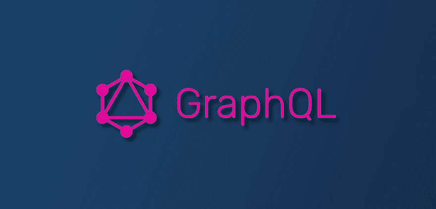

# 为什么无头 CMS 和 GraphQL 是天生的一对

> 原文：<https://dev.to/couellet/why-headless-cms--graphql-are-a-natural-fit-358f>

[![How to Leverage GraphQL with a Headless CMS [Takeshape Tutorial]](img/d6449004428cf5e4e6b91fabcc6f9e66.png)](https://res.cloudinary.com/practicaldev/image/fetch/s--xGuCKt4g--/c_limit%2Cf_auto%2Cfl_progressive%2Cq_auto%2Cw_880/https://snipcart.com/media/204053/headless-cms-graphql-demo.png)

我们第一次写 GraphQL 是在 2017 年，[我们把它](https://snipcart.com/blog/graphql-nodejs-express-tutorial)描述为脸书开发的一个闪亮的新工具。

我们在那篇文章中介绍的 GraphCMS 是第一批将它作为核心特性的软件之一。

这只是开发工具海洋中的一滴水。没什么大不了的，对吧？

不完全是。

我想我们都同意 GraphQL 现在是现代网络生态系统不可或缺的一部分。

证据#1 :在过去的几个月里，静态站点生成器和无头 CMS 的数量一直在飙升，这使得它成为一个主要的内置特性。

其中之一是 [TakeShape.io](https://www.takeshape.io/) ，我将在本文结尾的技术演示中进一步探讨。

首先，我想看一看:

*   2019 年 GraphQL 的状态
*   它给无头 CMS 带来的好处
*   以 GraphQL 为特色的工具
*   TakeShape.io 简介

让我们从 GraphQL 背后的概念开始。

## 1。获得 GraphQL 的最新信息

你可能甚至不知道 GraphQL 到底是什么。为了清楚起见，**它是一种用于 API 的查询语言，定义了如何从一个或多个数据库中获取数据**。

> 对于正确的技术图表介绍，我建议[我们的第一篇文章](https://snipcart.com/blog/graphql-nodejs-express-tutorial)就此事发表。

自 2012 年 FB 移动应用的第一个用例以来，发生了很多变化，主要是关于它的采用。GraphQL 于 2015 年开源，为大量开发人员提供了最初的生命力。4 年后，它在我们行业中的崛起是不可否认的。

证明 GraphQL 是 web 开发不可或缺的一部分的证据之二:它被科技巨头所采用。除了脸书，其他主要玩家如 GitHub、Shopify、Pinterest、Paypal & Twitter 都以这样或那样的方式使用 GraphQL。

→阅读完整帖子和技术教程[此处](https://snipcart.com/blog/headless-cms-graphql-takeshape-tutorial)