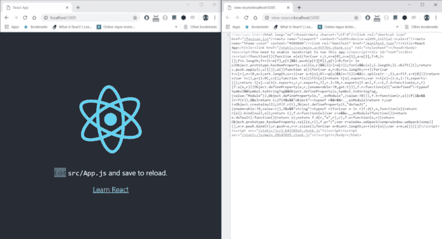
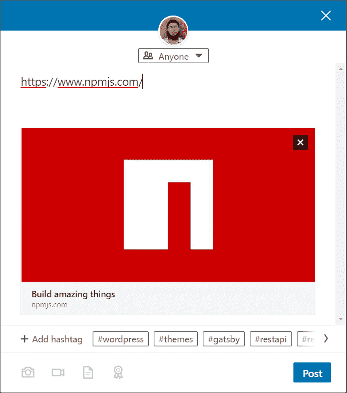

# 为什么应该在服务器端渲染 React

> 原文：<https://dev.to/bnevilleoneill/why-you-should-render-react-on-the-server-side-hb3>

你们中的许多人可能使用 React CLI，更好的说法是[创建 React App (CRA)](https://facebook.github.io/create-react-app/) 。使用 CRA 可以让您轻松启动和运行，并且还有许多其他优势。然而，使用 CRA 构建也有一些缺点，例如，当你查看用 CRA 初始化的 web 应用程序的网页源代码时，你会注意到它几乎是一个空页面，只有`<head>`部分，而`<body>`中几乎没有任何内容。

例如:

<figure> 

<figcaption>React app 初始化使用 Create React App</figcaption>

</figure>

这是因为 CRA 在**客户端**呈现你的应用程序，意思是构建好的。js 文件首先被下载到用户的浏览器，然后页面的其余部分开始加载。这增加了初始加载时间，一些网络爬虫无法索引站点。

有没有更好的方法来渲染你的 app？是啊！

这就是 React 的服务器端渲染的用武之地。

在本文中，我想向您介绍 SSR React、使用它的原因以及一些在服务器端呈现 React 的流行框架。我还想谈谈 SSR React 什么时候没有意义。本文面向已经在客户端使用 React 的开发人员。

### 什么是服务器端渲染(SSR)？

**服务器端呈现(SSR)** 是指网页上的内容在服务器上呈现，而不是使用 JavaScript 在浏览器上呈现。例如，当您有一个典型的 PHP 或 WordPress 站点时，页面是从通过 HTTP 加载的内容中加载的，这些内容是在服务器上呈现的，并且是完全呈现的 HTML。这与用 CRA 构建的 React 应用程序形成对比，React 应用程序只向客户端发送一个. js 文件，客户端的浏览器 JavaScript 引擎在。js 文件已加载。

传统 SSR 语言/框架的例子有 PHP、Java、ASP。NET 和 Node.js。

明确地说，在客户端库涌入之前，早期网站上的内容就是这样呈现的。然而，现在，服务器端渲染的 React 应用程序为服务器使用节点，这是与传统服务器渲染的应用程序的一个关键区别(我们将在本文后面看到如何)。

### 你应该转移到服务器端的原因

正如我之前所说，服务器端呈现最初意味着从服务器呈现和加载每个页面。然而，随着服务器端(通用)React 的引入，情况略有不同。

初始页面从服务器呈现，这意味着后续页面直接从客户端加载。因此，您拥有了两个世界的优势——初始服务器端内容的强大功能加上快速的后续加载，后者只请求未来请求所需的内容。

除了上述好处之外，您还可以从 SSR 中获得其他一些好处:

### 表现

[来自【Zeit 的工程师 Arunoda Susiripala](https://twitter.com/arunoda) 谈到性能是转向服务器端渲染的主要原因。SSR 意味着初始加载不需要加载器或旋转器。

更快的加载速度为最终用户带来了更好的体验。这是许多大公司在他们的网站上采用 SSR 方法的原因之一。

### SEO

到目前为止，你可能听说过 Google now 抓取用 JavaScript 构建的 web 应用程序，你最好准备好服务器端呈现的内容，以便 Google 和其他搜索引擎抓取你的站点。

> 注意，到目前为止，Google 和 Bing 可以索引同步 JavaScript 应用程序——同步是关键词。如果您的应用程序以加载微调器开始，然后通过 Ajax 获取内容，爬虫将只等待几秒钟加载完成。这意味着如果在 SEO 很重要的页面上异步获取内容，SSR 可能是必要的。
> 
> ([https://10up.github.io/Engineering-Best-Practices/react/](https://10up.github.io/Engineering-Best-Practices/react/)

SSR 的优势是你可以获得传统网站 SEO 的好处，因为整个页面现在都可以被机器人抓取。

### 社交分享

SSR 的另一个好处是，当你通过社交媒体分享你的网页内容时，你会得到一个精心制作的片段和特色图片。当你只有客户端渲染的应用时，这是不可能的。例如，当在 LinkedIn 上共享时，服务器端呈现的 React 应用程序看起来是这样的:

<figure> 

<figcaption>在社交媒体上分享服务器渲染的 app</figcaption>

</figure>

### 如何开始使用 SSR 应用

在没有框架的情况下开始是可能的，但我不推荐这种方法，因为 React SSR 应用程序中有许多考虑因素和移动部分。例如，您必须自己处理捆绑、缩小、热重新加载(等等)。

然而，如果你想走这条路，我推荐你阅读罗杰·金的关于 CSS 技巧的教程。

### React SSR 框架

如果你想在服务器端渲染 React，我建议你选择一个框架。这里有一些你可以考虑的框架:

### Next.js

Next.js 是一个伟大的框架，它周围有一个伟大的社区。有了 Next.js，你不必担心捆绑、缩小或热重装，你可以获得很多现成的特性。您可以将页面创建为文件中的 React 组件。如果您使用过 PHP，您可能会习惯于此。除了社区和支持，还有许多大公司在生产中使用 Next.js，包括 [npm、网飞和 Auth0](https://hyperion.alpha.spectrum.chat/next-js/general/companies-sites-using-next-js~e425a8b6-c9cb-4cd1-90bb-740fb3bd7541?m=MTU1NDg5NDgzMDYzNg%3D%3D&msgsafter=MTU0NTc1MzAxNTU2Mg%3D%3D) 。

### 狂欢

Razzle (贾里德·帕尔默的一个项目)最近获得了很多关注。

“Razzle 是一个工具，它将 SSR 所需的所有复杂配置抽象为一个单一的依赖项，为您提供令人惊叹的开发人员体验 [create-react-app](https://github.com/facebookincubator/create-react-app) ，但将应用程序的其余架构决策(关于框架、路由和数据获取)留给您自己。”(【https://github.com/jaredpalmer/razzle】T2

Razzle 很容易上手，它默认使用 React Router 4，不像 Next.js 没有开箱即用的路由器。

### 替代品

React 不是银弹。也许你的团队更熟悉 Vue 或另一个 JavaScript 框架。也许静态站点最适合你的用例。如果您不想使用 React，或者您想使用静态站点生成器，这里有一些替代方法。

### Nuxt.js

[Nuxt.js](https://nuxtjs.org/) 是 Vue.js 的服务器端渲染框架，在 Vue.js 社区很受欢迎。如果你正在 Vue.js 世界中寻找 Next.js 或 Razzle 的替代品，请尝试一下。

### 盖茨比

你会看到几乎所有流行的 JavaScript 开发人员都在谈论 [Gatsby](https://gatsbyjs.org) 。它是一个基于 React 的静态站点生成器，以其出色的 UX(用户体验)和 DX(开发者体验)赢得了许多人的心。准确地说，它在运行时不做 SSR。相反，Gatsby 在构建时使用 Node.js 进行服务器端呈现，在部署站点时创建静态 HTML、CSS 和 js。这导致极快的加载时间，并有进一步的优化，如基于路由的代码分割和预取。

### 一个示例 app

几个月前，我探索了服务器渲染的 React 应用程序，并用 Next.js 创建了一个应用程序，并将其托管在 Now 上——一个无服务器平台。Next 和 Now 都来自一家名为 [Zeit](https://zeit.co/) 的公司，他们在教育开发人员关于 React 和无服务器技术以及提供其他出色产品方面做得很好。

我的应用程序从 WooCommerce(一个 WordPress 电子商务插件)REST API 端点获取数据，并将其显示在 Next.js 应用程序中。你可以在 [GitHub](https://github.com/m-muhsin/woocommerce-next) 上查看我的应用，在这里看一下[的演示。](https://woocommerce-next.now.sh/)

### 一直需要 SSR 吗？

简单的回答是**不**。并不是所有的应用都需要服务器端渲染，尤其是带有仪表盘和认证的应用，它们不需要 SEO 或通过社交媒体分享。此外，构建服务器渲染的 React 应用程序的专业知识高于使用 create-react-app 初始化的应用程序。

最重要的是，SSR React 应用程序在资源方面花费更多，因为您需要保持节点服务器正常运行。当您希望为 React 应用程序选择服务器端呈现时，有时您可能更适合采用无服务器方式。

### 结论

客户端渲染的 React 应用程序很棒，但在服务器上渲染应用程序有明显的好处。

正如我们在本帖中提到的，好处包括:

1.  表演
2.  搜索引擎可见性
3.  社交分享

我强烈建议您探索 React 应用程序的服务器端渲染，并在您的下一个产品中使用它来查看这些好处。

* * *

### Plug: [LogRocket](https://logrocket.com/signup/) ，一款适用于网络应用的 DVR

<figure>

<figcaption></figcaption>

</figure>

LogRocket 是一个前端日志工具，可以让你回放问题，就像它们发生在你自己的浏览器中一样。LogRocket 不需要猜测错误发生的原因，也不需要向用户询问截图和日志转储，而是让您重放会话以快速了解哪里出错了。它可以与任何应用程序完美配合，不管是什么框架，并且有插件可以记录来自 Redux、Vuex 和@ngrx/store 的额外上下文。

除了记录 Redux 操作和状态，LogRocket 还记录控制台日志、JavaScript 错误、堆栈跟踪、带有头+正文的网络请求/响应、浏览器元数据和自定义日志。它还使用 DOM 来记录页面上的 HTML 和 CSS，甚至为最复杂的单页面应用程序重新创建像素级完美视频。

[免费试用](https://logrocket.com/signup/)。

* * *

帖子[为什么你应该在服务器端渲染 React](https://blog.logrocket.com/why-you-should-render-react-on-the-server-side-a50507163b79/)首先出现在[博客](https://blog.logrocket.com)上。