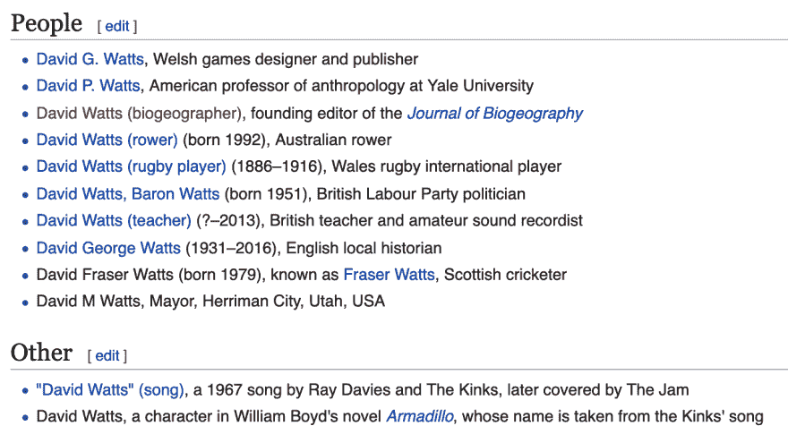
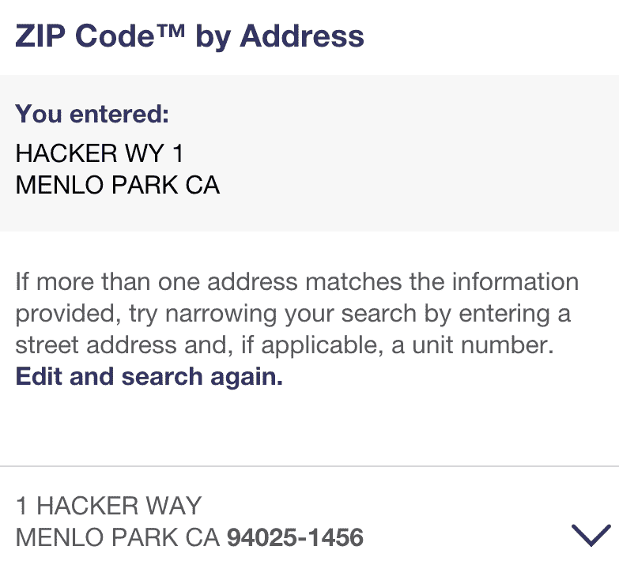

# 希望我能像大卫·瓦茨一样

> 原文：<https://dev.to/korenmiklos/wish-i-could-be-like-david-watts-2edp>

哪个大卫·沃茨？名字不是唯一的，我们希望[使用键来代替](https://medium.com/data-architect/choose-great-keys-d9ebe0485ec5)。但是大卫·沃茨是如何成为`P-12345678`的呢？更重要的是，我们怎么知道*这个*大卫·沃茨和*那个*大卫·沃茨是同一个？

这个问题被称为**实体解析** (ER)，也称为记录链接、重复数据删除或模糊匹配。(与*命名实体识别*不同，后者必须识别流文本中的实体。)它就像看起来一样复杂。姓名和其他字段拼写错误，因此如果过于严格，将无法链接两个相关的观察结果。如果你太模糊，你会错误地把不相关的观察联系起来。

Unsplash 上史蒂夫·哈维的照片

实体解决的第一个指导原则是接受不完美。没有完美的方法，你只是在平衡两种类型的错误。当你把两个实际上是指两个不同实体的观察联系起来时，就会出现假阳性。*假阴性*发生在你无法将两个事实上代表同一实体的观察联系起来的时候。通过选择或多或少严格的匹配方法，您总是可以减少一种类型的误差，而牺牲另一种类型的误差。

第二个指导原则是理解计算的复杂性。如果你不确定你的数据，你必须将每一个观察值与其他观察值进行比较，将数据集中的`N(N-1)/2`与`N`观察值进行比较。(参见“为什么进行*成对*比较就足够了”。)在大型数据集中，这将成为非常多的比较。例如，如果您想要从具有 100，000 个观察值的数据集(一个小数据集)中删除重复用户，您必须进行 100 亿次*比较。在整个过程中，你应该寻找减少必要比较次数的方法。*

> ## 方法暂且不说
> 
> 实体解析定义了属于同一实体的观察组:`e = {o1,o2,o3,...}`。也许令人惊讶的是，它足以定义何时一对*观察值*表示同一实体，何时`e(o1) = e(o2)`。因为等式是*传递的*，我们可以将成对关系传播到整个数据集:如果`e(o1) = e(o2)`和`e(o2) = e(o3)`，那么`e(o1) = e(o3)`和`e = {o1,o2,o3}`。
> 
> 使用模糊匹配，我们无法精确地判断两个观察值背后的实体是否*等于*。我们可以只计算两个观测值`d(o1,o2) ≥ 0`之间的*距离*。这样做的问题是距离是不可传递的:如果`o1`和`o2`非常接近，那么`o2`和`o3`也是如此，这并不会使`o1`和`o3`非常接近我们有*三角形不等式*，`d(o1,o2) + d(o2,o3) ≥ d(o1,o3)`，但是这个比传递性弱很多。
> 
> 模糊匹配的目标是将距离转换成等式关系。例如，`e(o1) = e(o2)`when`d(o1,o2) ≤ D`是一个简单的公式。但是要小心不要太模糊:当`D`太大时，你可能最终会把非常不同的观察联系起来。例如，如果你允许一对单词之间的 *Levenshtein 距离*为 2，你会发现
> `book``=``back``=``hack``=``hacker`。我打赌你没相信`book` `=` `hacker`。

高效 ER 的三个步骤是规范化、匹配和合并。

首先，你**通过消除错别字和替代拼写来规范**你的数据，使数据更有结构，更具可比性。例如，姓名“大卫·乔治·瓦茨博士三世”可以规范化为“瓦茨，大卫”规范化可以提高效率，因为下一步中的比较会容易得多。然而，如果过度规范化，这也是您可能丢失最多信息的地方。

规范化(也称为标准化)是一种将您的观察映射到更简单(通常是文本)表示的功能。在标准化过程中，您只使用一个观察值，不要将其与任何其他观察值进行比较。那是以后的事。不过，你可以和(短的)*白名单*相比。例如，如果您的观察值代表城市，那么将`city_name`字段与已知城市列表进行比较并纠正输入错误是非常有用的。您还可以将文本字段转换为小写，删除标点符号和*停用词*，四舍五入或 bin 数值。

如果有一种规范的方式来表示您的观察中的信息，就使用它。例如，美国邮政服务标准化了美国地址(见图),[提供了一个 API](https://www.usps.com/business/web-tools-apis/address-information-api.htm) 来完成这项工作。

然后你**匹配**对观察值，根据你的度量，这些观察值足够接近。该指标可以允许打字错误，例如 *Levenshtein 距离*。它可以依赖于多个字段，如姓名、地址、电话号码、出生日期。您可以为每个字段分配权重:匹配电话号码可能比匹配姓名具有更大的权重。你也可以选择一个*决策树*:例如，只检查出生日期和电话号码等非常常见的名字。

为了最大限度地减少比较次数，通常只评估*个潜在匹配*。这就是规范化可以发挥作用的地方，例如，您只需要将观察值与规范化的名称“watts，david”或同一城市的名称进行比较。

一旦你匹配了相关的观察，你必须**合并**他们提供的关于他们所代表的实体的信息。例如，如果您匹配“大卫·瓦茨博士”和“大卫·瓦茨”，您必须确定此人是否确实是“博士”，以及您是否保留了该信息。合并步骤包括使用您认为合适的任何聚合函数来聚合来自单个观察的信息。您可以填充缺失的字段(比如说，如果您在一次观察中找到了 David Watts 的电话号码，则从头到尾使用它)，使用最完整的文本表示(比如“Dr David George Watts III”)，或者简单地保留一个字段的所有变体(通过创建名称变体的*集合*，例如{“David Watts”、“Dr David Watts”、“Dr David George Watts III”})。

遵循所有三个步骤，以避免以后的错误。