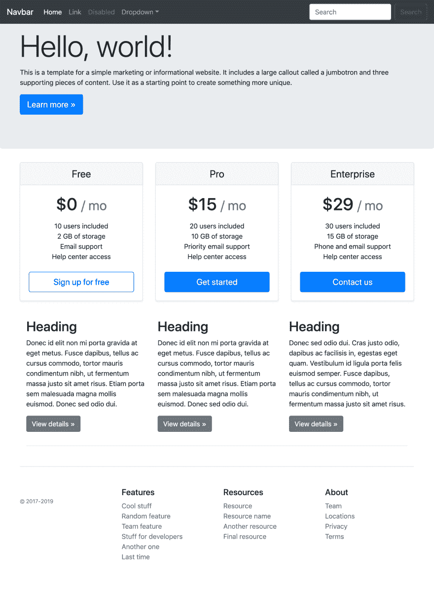

# 使用模板

> 原文：<https://dev.to/htmlandbacon/working-with-templates-2n32>

我在不同的系统中使用过很多模板引擎，这些系统有很大的不同。

你所采用的许多构建方法将取决于引擎的特性。

与其给出这门语言的概述，我想我应该谈谈如何应用它。

我将简单介绍一下[nunjucks](https://mozilla.github.io/nunjucks/)——它功能丰富，支持良好，并且有[丰富的文档](https://mozilla.github.io/nunjucks/templating.html)。

为此，我把一些[引导模板](https://getbootstrap.com/)混合在一起，做了一个看起来很普通的网站。

[](https://res.cloudinary.com/practicaldev/image/fetch/s--3nUiKCLB--/c_limit%2Cf_auto%2Cfl_progressive%2Cq_auto%2Cw_880/https://thepracticaldev.s3.amazonaws.com/i/oovv8t851zs9jw6iklwl.png)

你可以在 github 上看到[的代码。](https://github.com/htmlandbacon/nunjucks-example/blob/master/views/pages/full-version.nunjucks)

在决定如何开始分割页面之前，我们需要讨论一下 nunjucks 的三个特性。

**扩展**——这允许我们定义一个基础模板，然后在子模板中覆盖它的一部分。这就是所谓的[模板继承](https://mozilla.github.io/nunjucks/templating.html#template-inheritance)。

**包含**——这允许我们将另一个模板拉入当前模板

这些是函数，你可以定义一段可重用的代码。

## 基础模板

你通常会希望不止一页，然后你可以做出更好的判断，你应该把页面的元素变成什么，但鉴于上面的页面，我们将制定的第一部分是一个基础模板

我们将有一个基础模板，所有其他页面都将扩展出这个，在上述情况下，我们会有一个页眉和页脚在里面。

这个模板将有一系列的[块](https://mozilla.github.io/nunjucks/templating.html#block)，我们可以在一个子页面中覆盖它们——所以我们将有一个**主页**,**扩展**基础模板**。**

 **块是可以被子模板替换的命名空间。

如果我们假设不需要替换页眉和页脚，那么我们的基本模板看起来应该是这样的:

```
<!doctype html>
<html lang="en">
<head>
// stuff for header
</head>
<body>
// navigation html

// block: content

//footer html
</body>
</html> 
```

即使在这种情况下，我们也有一些选项，我们可以将导航和页脚提取到它们自己的宏或包含中。

当我看模板时，我在看我们如何组成不同的元素，一旦我们开始把它分成更小的块，我们就开始考虑如何使用它们。

我们的目标是使它更容易维护，尽管如果我们过度抽取，那么我们就有使它变得过于复杂的危险。

检查一下[完整的基础模板](https://github.com/htmlandbacon/nunjucks-example/blob/master/views/templates/base-includes.nunjucks)，你可以看到我已经将导航和页脚移动到 includes 中，这是为了隔离它们。

## 首页

我们现在可以通过制作一个类似下面的文件来创建一个页面

```
 






// home page content lives here
 
```

我们现在可以开始研究如何处理我们的主页内容，这可以分为三个部分。

1.  （电视机的）超大屏幕

2.  订阅信息

3.  三栏内容

我们将假设这三个都是 [includes，现在这些都可以包含在新页面中，所以如果我们想制作一个替代版本来更改我们包含的内容，或者如果我们想更新一个部分，我们现在正在更改一个更小的文件。](https://github.com/htmlandbacon/nunjucks-example/blob/master/views/pages/home-page-includes.nunjucks)

## 我们可以制作什么宏

作为一个宏，突出的是订阅信息。

我们有三个重复的块，如果我们看所有这三个，我们算出什么是共同的，所以我们有:

```
// classes

// header

// price

// features

// button 
```

我们可以从构建一个带有一个参数(标题)的宏开始，然后构建其余的参数。

这个宏被称为 priceBox，它带有一个参数标题，这个标题被打印出来代替原来的标题。

```

<div class="card mb-3 shadow-sm">
      <div class="card-header">
        <h4 class="my-0 font-weight-normal">{{ title }}</h4>
      </div>
      <div class="card-body">
      </div>
</div>
 
```

要使用它，我们首先将它导入到我们的另一个模板中，然后调用它，下面是我们正在使用的环绕包含。

```


<div class="container">
    <div class="card-deck mb-3 text-center">

    {{ priceBox('Free') }}

    {{ priceBox('Pro') }}

    {{ priceBox('Enterprise') }}

    </div>
</div> 
```

有两种方法可以导入宏，你可以在文档中阅读更多关于导入的内容。

我们现在可以扩展我们的宏来获取价格、功能和按钮。

下面是一个扩展版本的例子，我已经命名了我们传递的变量，这样会更清楚一些。

如果需要，我们可以在宏中给出这些默认值，因为它并不真的需要。

Features 接受一个在宏中循环的项目数组，button 接受一个对象，因此我们可以提供多个值。

```
 {{ 
        priceBox(
            title = 'Free',
            price = '0.00',
            features = [
                '10 users included',
                '2 GB of storage', 
                'Email support', 
                'Help center access'
                ],
            button = {
                text: 'Sign up for free',
                classes: 'btn-outline-primary'
                }
            )
    }} 
```

我们的宏现在看起来如下，如果没有提供期货，那么我们默认文本。

```

<div class="card mb-3 shadow-sm">
      <div class="card-header">
        <h4 class="my-0 font-weight-normal">{{ title }}</h4>
      </div>
      <div class="card-body">
        <h1 class="card-title pricing-card-title">${{ price }} <small class="text-muted">/ mo</small></h1>
        <ul class="list-unstyled mt-3 mb-4">
        
          <li>{{ feature }}</li>
        
          <li>No features</li>
        
        </ul>
        <button type="button" class="btn btn-lg btn-block {{ button.classes }}">{{ button.text }}</button>
      </div>
</div>
 
```

我们现在有了与开始时相同的页面，但是被分解成可重用的块，我们现在可以构建额外的页面。

Nunjucks 也有许多内置过滤器你也可以扩展到[添加你自己的](https://mozilla.github.io/nunjucks/templating.html#filter)。**